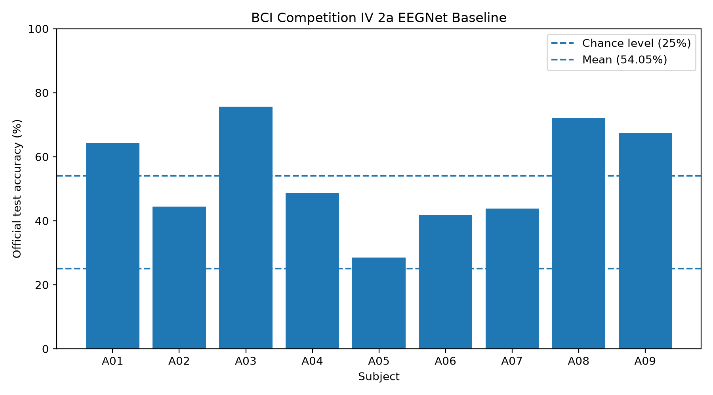

# BCI Competition IV 2a Multi-Subject EEGNet Baseline

## Experiment Setup

This experiment evaluates the EEGNet baseline on all nine subjects of
BCI Competition IV 2a.

- Subjects: A01-A09
- Classes: 4
- Channels: 22
- Sampling rate: 250 Hz
- Frequency range: 8-32 Hz
- Time window: 0-4 s
- Epochs: 50
- Batch size: 32
- Learning rate: 0.001
- Weight decay: 0.0001
- Random seed: 42

For each subject, the official training session is split into training
and validation subsets. The official test session remains untouched
during training and model selection.

Normalization statistics are computed only from the training subset.

The checkpoint with the best validation accuracy is restored before
the official test session is evaluated once.

## Results

| Subject | Best Epoch | Best Validation Accuracy | Official Test Accuracy |
| --- | ---: | ---: | ---: |
| A01 | 36 | 67.24% | 64.24% |
| A02 | 50 | 55.17% | 44.44% |
| A03 | 50 | 89.66% | 75.69% |
| A04 | 42 | 51.72% | 48.61% |
| A05 | 37 | 39.66% | 28.47% |
| A06 | 39 | 56.90% | 41.67% |
| A07 | 40 | 62.07% | 43.75% |
| A08 | 50 | 86.21% | 72.22% |
| A09 | 41 | 81.03% | 67.36% |

## Aggregate Statistics

- Mean official test accuracy: 54.05%
- Sample standard deviation: 16.26 percentage points
- Median official test accuracy: 48.61%
- Minimum official test accuracy: 28.47%
- Maximum official test accuracy: 75.69%
- Four-class chance level: 25.00%

## Observations

The baseline shows substantial subject-level variability.

A03, A08, A09, and A01 achieve relatively strong decoding performance,
while A05 remains close to the four-class chance level.

This variability indicates that a single subject-independent conclusion
cannot be drawn from the A01 result alone and motivates further analysis
of robustness, artifact sensitivity, and subject-specific differences.

The current results use a single random seed (42). Therefore, the
reported mean and standard deviation describe variation across subjects,
not variation across repeated random seeds.

Future experiments should include repeated seeds and controlled
comparisons before statistical claims are made about model improvements.

