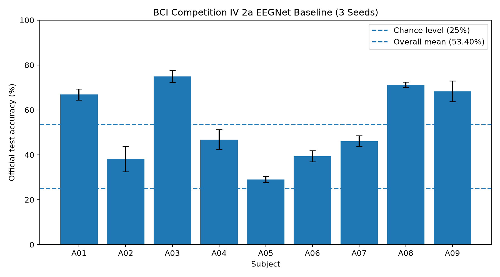

# BCI Competition IV 2a Multi-Seed EEGNet Baseline

## Experiment Setup

The EEGNet baseline was evaluated on all nine subjects of
BCI Competition IV 2a using three random seeds.

- Subjects: A01-A09
- Seeds: 42, 43, 44
- Total runs: 27
- Classes: 4
- Channels: 22
- Sampling rate: 250 Hz
- Frequency range: 8-32 Hz
- Time window: 0-4 s
- Epochs: 50

For every subject and seed, the official training session was split
into training and validation subsets.

The official test session was not used for model selection.

Normalization statistics were computed using only the training subset.

The checkpoint with the best validation performance was restored before
the official test session was evaluated.

## Seed-Level Results

| Seed | Mean Test Accuracy | Subject SD |
| --- | ---: | ---: |
| 42 | 54.05% | 16.26 pp |
| 43 | 53.09% | 17.77 pp |
| 44 | 53.05% | 17.57 pp |

The mean accuracy across the three seed-level subject averages is
53.40%.

The sample standard deviation across these three seed-level means is
approximately 0.57 percentage points.

This indicates that the overall nine-subject baseline is relatively
stable across the evaluated random seeds.

## Subject-Level Results

| Subject | Mean Test Accuracy | Seed SD |
| --- | ---: | ---: |
| A01 | 66.90% | 2.46 pp |
| A02 | 38.08% | 5.58 pp |
| A03 | 74.88% | 2.70 pp |
| A04 | 46.76% | 4.46 pp |
| A05 | 29.05% | 1.31 pp |
| A06 | 39.35% | 2.44 pp |
| A07 | 46.06% | 2.44 pp |
| A08 | 71.18% | 1.25 pp |
| A09 | 68.29% | 4.58 pp |

## Observations

The dominant source of baseline variation is subject identity rather
than the evaluated random seed.

A03 and A08 consistently achieve high decoding accuracy across seeds.

A05 consistently remains close to the four-class chance level of 25%,
suggesting that its low performance is unlikely to be explained only
by an unfavorable random seed.

A02 exhibits comparatively larger seed sensitivity than most other
subjects.

These results establish a reproducible multi-seed EEGNet reference
baseline for subsequent artifact robustness and NAP-based experiments.

The current three-seed evaluation provides an initial estimate of
training variability but should not be interpreted as a formal
statistical significance test.
