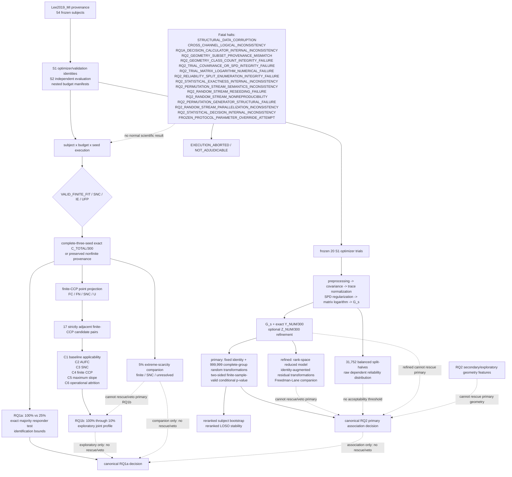

# External Boundary Replication of EEGNet Reliability Findings

**STATUS: `PRE_EXECUTION_FREEZE_CANDIDATE`**

**Scientific execution status:** No Phase A scientific results exist.

**Amendment status:** `PRE_EXECUTION_SCOPE_AMENDMENT`, defined
`BEFORE_ANY_LEE2019_MI_SCIENTIFIC_EXECUTION`.

## 0. Canonical active-rule index and status authority

This section and the governing sections named below constitute the sole active
protocol. Status blocks and alternative formulations elsewhere in the document
are revision-provenance records only and have no executable authority. Git
history retains the chronological amendment record; it is not a source of
runtime rules.

```text
GLOBAL_PROTOCOL_CANONICALIZATION:
PASSED_NO_ACTIVE_RULE_CONFLICT

POPULATION_DESCRIPTIVE_LAYER:
CLOSED

RQ1A_DECISION_LAYER:
CLOSED_PENDING_EXECUTION

RQ1B_EXPLORATORY_PROFILE_LAYER:
CLOSED_PENDING_EXECUTION

RQ2_SOURCE_LOCK_AND_MEASUREMENT_LAYER:
CLOSED

RQ2_STATISTICAL_DECISION_LAYER:
CLOSED_PENDING_EXECUTION

PART_7B_STATISTICAL_RULE_REVIEW:
CLOSED_PENDING_EXECUTION

PART_7B_2_STATISTICAL_FREEZE_READINESS:
READY_FOR_INDEPENDENT_FINAL_PROTOCOL_AUDIT

FINAL_PROTOCOL_STATUS_AUTHORITY_MODEL:
MODEL_A_EXTERNAL_AUDIT_AND_FREEZE_ATTESTATION

MODEL_B_AUDITED_FINAL_STATUS_TRANSITION:
REJECTED

POST_AUDIT_PROTOCOL_TEXT_EDIT:
PROHIBITED

INDEPENDENT_FINAL_PROTOCOL_AUDIT_AUTHORITY:
EXTERNAL_ATTESTATION_BOUND_TO_EXACT_CANDIDATE_BYTES

INDEPENDENT_FINAL_PROTOCOL_AUDIT_RESULT_LOCATION:
EXTERNAL_AUDIT_ATTESTATION_AND_FREEZE_RECORD

PROTOCOL_HASH_COMMIT_AND_TAG_AUTHORITY:
CONDITIONAL_ON_EXTERNAL_AUDIT_PASS_AND_EXACT_STAGED_BLOB_MATCH

FINAL_FREEZE_AUTHORITY:
EXTERNAL_AUDIT_PASS_PLUS_FREEZE_RECORD_PLUS_COMMIT_PLUS_ANNOTATED_TAG

LEE_SCIENTIFIC_PREPROCESSING_CONTRACT:
FROZEN_OUTCOME_BLIND_PENDING_IMPLEMENTATION

LEE_SCIENTIFIC_PREPROCESSING_IMPLEMENTATION:
PENDING

OVERALL_PROTOCOL_STATUS:
PRE_EXECUTION_FREEZE_CANDIDATE
```

The current block uses stable authority-mechanism states; it does not claim
that an external audit has passed, failed, remains pending, or that archival
freeze has occurred. The audit authority and result-location values identify
where the external event is recorded and remain valid before and after freeze.
Historical audit and correction results are non-executable provenance:

```text
PREVIOUS_AUDIT_PROVENANCE:
SECOND_INDEPENDENT_AUDIT_FAIL_BLOCKERS_REMAIN
THIRD_INDEPENDENT_AUDIT_FAIL_BLOCKERS_REMAIN
FREEZE_INTEGRITY_BLOCKER_CORRECTION_COMPLETED_PENDING_INDEPENDENT_REAUDIT
FINAL_NARROW_FREEZE_CONTRACT_CORRECTION_COMPLETED_PENDING_THIRD_INDEPENDENT_AUDIT
FINAL_FREEZE_AUTHORITY_CORRECTION_COMPLETED_PENDING_FOURTH_INDEPENDENT_AUDIT
FINAL_AUDIT_BINDING_AND_TAG_IDEMPOTENCY_PATCH_COMPLETED_PENDING_FOURTH_INDEPENDENT_AUDIT
FOURTH_INDEPENDENT_AUDIT_FAIL_BLOCKERS_REMAIN
FINAL_FREEZE_RECORD_SCHEMA_AND_SIX_FILE_CLOSURE_PATCH_COMPLETED_PENDING_FIFTH_INDEPENDENT_AUDIT
FINAL_FREEZE_RECORD_CROSS_LAYER_BYTE_POLICY_PATCH_COMPLETED_PENDING_FIFTH_INDEPENDENT_AUDIT
```

### 0.1 Canonical active-rule index

| Layer | Governing section | Active status | Primary estimand/domain | Decision authority | Prohibited rescue or veto |
|---|---|---|---|---|---|
| Population descriptive | 18.18 | `CLOSED` | fixed 54-subject descriptive accounting, C1--C6 | descriptive only | none of its summaries changes confirmatory states |
| RQ1a confirmatory | 18.17 | `CLOSED_PENDING_EXECUTION` | source-locked 100%-to-25% finite-degradation replication | confirmatory authority for RQ1a | RQ1b, RQ2, and 5% cannot rescue or veto |
| RQ1b exploratory | 18.18 | `CLOSED_PENDING_EXECUTION` | 100%-through-10% multidimensional failure profile | exploratory profiling only | cannot rescue or veto RQ1a |
| 5% companion | 18.14 and 18.18 | `CLOSED_PENDING_EXECUTION` | `EXTREME_SCARCITY_STRESS_TEST` | companion only | cannot alter primary RQ1a/RQ1b states |
| RQ2 measurement | 18.21--18.22 | `CLOSED` | frozen S1 25% subset, Log-Euclidean covariance separation and reliability | measurement validity only | reliability has no hidden acceptability veto or rescue threshold |
| RQ2 statistical decision | 22 | `CLOSED_PENDING_EXECUTION` | signed Spearman between `G_s` and `Y_s=P_s(100)-P_s(25)` | association-replication authority only | refined/secondary analyses cannot rescue or veto primary RQ2; RQ2 cannot rescue or veto RQ1a |
| Implementation pending | 23.4--23.9 | `PENDING` | immutable constants, manifests, conformance assertions, smoke tests, final-freeze gate | execution integrity only | operational options cannot change scientific parameters |

The framework name is
`SEQUENTIAL_CONFIRMATION_AND_MULTI_AXIS_FAILURE_CARTOGRAPHY`: RQ1a performs
source-locked confirmation, RQ1b performs multidimensional exploratory
profiling, and RQ2 performs preregistered associational characterization of
training-subset geometry. Each result retains its stated evidential status; no
layer packages, rebrands, conceals, rescues, or vetoes another layer's result.

### 0.2 Core invariants cheat sheet

This table is a navigation and implementation-review aid, not an independent
rule source. The cited canonical detailed section governs any discrepancy; a
discrepancy triggers
`GLOBAL_PROTOCOL_CANONICALIZATION: FAILED_ACTIVE_RULE_CONFLICT_REMAINS`.
Future amendments must update both locations.

| Invariant | Canonical value | Governing section |
|---|---|---|
| Cohort / statistical unit | 54 subjects / subject | 3, 22.1 |
| Model seeds | 42, 43, 44 | 7, 23.4 |
| Primary budget domain | 100% through 10% | 18.18 |
| 5% | independent extreme-scarcity companion | 18.14, 18.18 |
| `P_s(B)` | exact `C_TOTAL_s,B/300`, only after three `VALID_FINITE_FIT` seeds | 22.1, 23.1 |
| Point projection | all finite -> FC/FN; otherwise any SNC -> SNC; otherwise U | 23.1 |
| Finite CCP | exactly 17 adjacent candidate pairs | 23.2 |
| Structural zeros | exactly two | 23.3 |
| RQ1a primary | 100%-to-25% source-locked confirmatory finite degradation | 18.17 |
| RQ1b | exploratory AUFC/slope/CCP/SNC profile only | 18.18 |
| RQ2 primary | two-sided unadjusted signed `Spearman(G,Y)` | 22.2--22.3 |
| RQ2 refined | partial Spearman(G,Y given P100), non-overriding | 22.5--22.6 |
| Permutation stream | fixed identity `g_1` + 999,999 independent full-group with-replacement random transformations; identity/duplicates retained; inclusive two-sided `E=B+1`; denominator 1,000,000; finite-sample valid and non-exhaustive | 22.3, 22.6.1 |
| Exact `Y` / `Z` | `Y_NUM/300` / `Z_NUM/300` | 22.1 |
| Geometry | 20 frozen S1 optimizer trials | 18.22 |
| Reliability | 31,752 dependent split-half records | 18.22, 22.9 |
| Inferential tail | two-sided | 22.2 |
| Scientific CLI overrides | prohibited | 23.5 |
| Outcome inspection | prohibited before execution authorization | 19, 22.14 |

The cheat sheet cannot change a definition, threshold, state, or decision.

**Phase A dataset:** `Lee2019_MI` (`RAW_METADATA_VERIFIED`,
`ABSTRACTION_RENAMING_ONLY`, `HUMAN_SELECTED_FOR_PHASE_A_PROTOCOL_DEVELOPMENT:
YES`, `EXPECTED_TO_REPLICATE: NOT_ASSERTED`).

This document defines a possible new research project. It is not a mandatory
continuation of the completed NAP-EEG-Mini evidence chain, and it does not
authorize dataset download, adapter implementation, model training, inference,
or scientific analysis. Statistical-rule closure does not change the overall
`PRE_EXECUTION_FREEZE_CANDIDATE` status or authorize implementation/execution.

## 1. Research question and study framing

The central question is:

> Under which independent MI-EEG dataset and protocol conditions do the
> seed-dependent predictive variation and finite-sample measurement sensitivity
> observed in BCI IV 2a reproduce, and under which conditions do they not?

The study is an **external boundary replication**, not a confirmation that
EEGNet or MI-EEG decoding is generally unstable. Full replication, partial
replication, non-replication, protocol-conditional results, subject
heterogeneity, and largely unstructured results are all scientifically valid.

## 2. Frozen scope of the original local finding

The completed finding being externally tested has the following exact scope:

| Property | Frozen setting |
|---|---|
| Dataset | BCI Competition IV 2a / BNCI2014-001 |
| Subjects | 9 |
| Architecture | EEGNet |
| Training mode | Subject-specific |
| Training budgets | 100%, 50%, 25% |
| Training seeds | 42, 43, 44 |
| Split seed | 42 |
| Subset seed | 20260719 |
| Primary observation | Seed-dependent predictive/model variation together with finite-sample representation-measurement sensitivity |
| Final classification | `MIXED_MODEL_AND_MEASUREMENT_INSTABILITY` |
| Mechanistic conclusion | `NO_MECHANISTIC_EXPLANATION_ESTABLISHED` |
| Seed-sample conclusion | `UNRESOLVED_DUE_TO_SEED_SAMPLE_LIMITATION` / `SUFFICIENCY_C` |
| Multi-seed replication trigger | `NOT_SATISFIED` |
| Architecture Stop Rule | `ACTIVE` |

The original result is local to this tested dataset, architecture, split,
budget, and seed protocol. The new study does not assume that it generalizes.
It also does not convert the original result into a causal claim about
optimization, representations, classifiers, noise, signal-to-noise ratio, or
small-data overfitting.

## 3. Dataset eligibility and provenance states

A candidate external-replication dataset should preferably provide:

- a Motor Imagery task;
- multiple identifiable subjects;
- multiple sessions or clearly independent recording blocks per subject;
- stable subject, session, and run/block identities;
- recoverable stable trial identities and ordering;
- known label semantics and event timing;
- EEG channel names, types, order, and sampling-rate metadata;
- sufficient trials for preregistered subject-specific limited-data budgets;
- explicit or reconstructable train/evaluation session separation;
- enough raw or exported metadata to audit preprocessing and leakage boundaries.

Dataset size alone does not establish eligibility. Clinical EEG corpora or
other datasets with fundamentally different prediction tasks are not direct
MI-EEG replications.

Candidate status follows this hierarchy:

```text
DOCUMENTATION_ELIGIBLE
-> RAW_METADATA_VERIFICATION_PENDING
-> RAW_METADATA_VERIFIED
-> REPLICATION_FEASIBLE
```

If stable trial identity, stable session identity, or leakage-free session roles
cannot be established, the candidate is `REPLICATION_INFEASIBLE` for the Phase A
estimand. A paper, README, dataset website, or MOABB description cannot by itself
establish `REPLICATION_FEASIBLE`.

### 3.1 Dataset-screening record

At the initial documentation-screening stage, no candidate had yet been
selected. Unsupported values at that stage remained `TO_BE_VERIFIED`. Each
candidate received a separate record using the following schema; a
documentation reviewer could not fill an unknown field from memory or
inference. Section 21 records the later human selection decision.

```yaml
dataset_id: TO_BE_VERIFIED
dataset_version: TO_BE_VERIFIED
official_source: TO_BE_VERIFIED
task_type: TO_BE_VERIFIED
MI_task_description: TO_BE_VERIFIED

subject_count: TO_BE_VERIFIED
number_of_subjects: TO_BE_VERIFIED
session_count: TO_BE_VERIFIED
runs_or_blocks: TO_BE_VERIFIED

class_count: TO_BE_VERIFIED
class_semantics: TO_BE_VERIFIED
native_class_comparability: TO_BE_VERIFIED
trials_per_session: TO_BE_VERIFIED
trials_per_class: TO_BE_VERIFIED
total_eligible_training_trials: TO_BE_VERIFIED
training_trials_per_fitted_model: TO_BE_VERIFIED
eligible_training_trials_per_class: TO_BE_VERIFIED
minimum_class_coverage_under_proposed_fractions: TO_BE_VERIFIED

channel_count: TO_BE_VERIFIED
channel_names_available: TO_BE_VERIFIED
sampling_rate: TO_BE_VERIFIED
event_metadata_available: TO_BE_VERIFIED
trial_identity_documented: TO_BE_VERIFIED
session_identity_documented: TO_BE_VERIFIED
run_identity_documented: TO_BE_VERIFIED

inter_session_interval: TO_BE_VERIFIED
same_day_or_cross_day: TO_BE_VERIFIED
cap_repositioning_documented: TO_BE_VERIFIED
acquisition_restart_documented: TO_BE_VERIFIED
recording_environment_changes_documented: TO_BE_VERIFIED
continuous_or_independent_recording: TO_BE_VERIFIED
physical_session_definition_source: TO_BE_VERIFIED

raw_format: TO_BE_VERIFIED
MOABB_support: TO_BE_VERIFIED
subject_specific_training_feasible: TO_BE_VERIFIED
fraction_matched_budget_feasible: TO_BE_VERIFIED
absolute_count_budget_feasible: TO_BE_VERIFIED

original_experiment_definition: TO_BE_VERIFIED
native_raw_file_structure: TO_BE_VERIFIED
framework_abstraction: TO_BE_VERIFIED
multi_view_provenance_status: TO_BE_VERIFIED
candidate_comparability_tier: TO_BE_VERIFIED

known_protocol_differences: TO_BE_VERIFIED
potential_confounders: TO_BE_VERIFIED
documentation_sources: TO_BE_VERIFIED
documentation_status: TO_BE_VERIFIED
raw_metadata_status: RAW_METADATA_VERIFICATION_PENDING
replication_feasibility_status: TO_BE_VERIFIED
notes: TO_BE_VERIFIED
```

`native_class_comparability` must distinguish at least:

- native class structure reasonably comparable to BCI2a;
- partially overlapping class semantics;
- fundamentally different MI task.

This field does not authorize automatic reduction to a common class subset.
Any common-class estimand remains a later explicit human decision.

### 3.2 Documentation-only status discipline

Documentation screening may assign only:

- `DOCUMENTATION_ELIGIBLE`; or
- `DOCUMENTATION_INELIGIBLE`.

It may not assign `RAW_METADATA_VERIFIED` or `REPLICATION_FEASIBLE`. MOABB
support is an `ENGINEERING_PREFERENCE`, not a scientific eligibility criterion.
A non-MOABB dataset may remain eligible when its task, physical-session
structure, provenance, and subject-specific limited-data feasibility are
stronger.

### 3.3 Abstraction and physical-session safeguards

Framework abstractions are not physical ground truth. In particular:

```text
MOABB session != automatically a physical experimental session
MOABB run != automatically an original experimental run
MOABB event_id != automatically the original event semantics
train/test split != automatically a cross-session split
```

Every candidate advancing beyond documentation screening must compare three
views:

1. `ORIGINAL_EXPERIMENT_DEFINITION` from the paper and official documentation;
2. `NATIVE_RAW_FILE_STRUCTURE` and native annotations/events;
3. `FRAMEWORK_ABSTRACTION` exposed by MOABB, MNE, or another loader.

Discrepancies in subjects, sessions, runs, blocks, event codes, trial counts,
class labels, ordering, or excluded recordings must be recorded as one of:

- `PROVENANCE_CONSISTENT`;
- `ABSTRACTION_RENAMING_ONLY`;
- `ABSTRACTION_SEMANTIC_MISMATCH`;
- `PROVENANCE_INCOMPLETE`;
- `REPLICATION_BLOCKING_MISMATCH`.

Unexplained discrepancies remain unresolved and cannot be silently replaced by
framework semantics.

Physical-session definition sources must be recorded as `ORIGINAL_PAPER`,
`OFFICIAL_DATA_DOCUMENTATION`, `RAW_STRUCTURE`, `FRAMEWORK_ABSTRACTION`,
`INFERRED`, or `UNKNOWN`. Unknown intervals remain `UNKNOWN`; a precise interval
must not be inferred. Same-day/cross-day status, cap removal or repositioning,
acquisition restart, recording environment, and continuous versus independent
recording are descriptive protocol properties. They are
`KNOWN_PROTOCOL_DIFFERENCES` or `POTENTIAL_CONFOUNDERS`, not causal findings.

### 3.4 Provisional comparability tiers

Candidates may receive a provisional tier only after the evidence supporting
the tier is recorded:

- `TIER_1_NEAR_DIRECT_REPLICATION`: MI, subject-specific training, at least two
  physically meaningful independent sessions, stable trial identity, feasible
  cross-session evaluation, and feasible limited-data protocol;
- `TIER_2_BOUNDARY_REPLICATION`: retains the MI reliability estimand but has
  substantial documented protocol differences;
- `TIER_3_DIFFERENT_ESTIMAND`: materially changes the question, for example
  single-session run-to-run evaluation, motor execution rather than imagery, or
  pooled cross-subject training.

Tier 3 candidates cannot serve as direct Phase A replication datasets. Many
runs must not be treated as many physical sessions, and a large subject count
does not by itself improve candidate suitability.

### 3.5 Required raw-metadata reconnaissance

Before freezing dataset-specific protocol details, a read-only provenance
inspection must complete the following checklist:

- enumerate native subject identifiers;
- enumerate sessions and compare their physical meaning across documentation,
  raw structure, and framework abstraction;
- enumerate runs/blocks without promoting runs to sessions;
- enumerate annotations, events, event codes, and class labels;
- count actual trials per session and per native class;
- verify stable trial identity and ordering;
- verify stable session identity;
- verify run/block identity where applicable;
- verify no ambiguous or duplicated trial identifiers;
- verify event ordering against native file structure;
- verify sampling rate, channels, channel types, order, and units;
- verify raw file format and dataset version;
- record excluded, missing, or framework-dropped recordings;
- verify known preprocessing before scientific epoch construction;
- verify that train/evaluation roles can be assigned without overlap;
- verify actual usable trial counts after protocol eligibility rules;
- verify per-class coverage under every proposed fraction or absolute count;
- assign a multi-view provenance status and record every discrepancy.

Initial reconnaissance should inspect raw/native structure, annotations, events,
labels, channels, and sampling rate before constructing scientific epochs.
Epoch construction is deferred unless it is strictly necessary to verify
event-to-trial identity.

This reconnaissance is engineering/provenance work, not scientific analysis: it
must not load a model, run inference, or calculate performance. Any future
reconnaissance code must be isolated under `scripts/recon/`, must not modify the
training pipeline, and must not import BCI2a, EEGNet, Failure Cartography, or
Instability Review runners. This draft creates no reconnaissance code.

### 3.6 Documentation Screening Results

The following classifications record the first documentation-level candidate
screening. They are based on approved documentation-screening conclusions only.
They do not establish `RAW_METADATA_VERIFIED` or `REPLICATION_FEASIBLE`, and
they do not select the final Phase A dataset. Raw/native provenance inspection
is still required.

#### Lee2019_MI

| Field | Documentation-level record |
|---|---|
| Dataset | `Lee2019_MI` |
| Documentation status | `DOCUMENTATION_ELIGIBLE` |
| Provisional tier | `TIER_1_NEAR_DIRECT_REPLICATION` |
| Raw reconnaissance priority | `PRIMARY` |
| Raw metadata status | `RAW_METADATA_VERIFIED` |
| Replication feasibility | `PENDING_HUMAN_DECISION` |

Documentation-level strengths:

- relatively large subject population;
- documented multiple-session structure;
- Motor Imagery task;
- subject-specific external replication appears conceptually possible;
- sufficient documented trial volume for a limited-data protocol appears
  plausible.

Unresolved issues requiring raw/native provenance reconnaissance:

- exact physical-session semantics;
- exact inter-session timing;
- offline versus online phase semantics;
- which trials contain ground-truth labels;
- native trial identity;
- MOABB session/run mapping;
- whether independently labeled trials can support the intended cross-session
  protocol.

These were unresolved at documentation screening time; Section 20 records the
subsequent cohort-wide raw-metadata verification without rewriting that earlier
screening stage.

#### BNCI2015-001

| Field | Documentation-level record |
|---|---|
| Dataset | `BNCI2015-001` |
| Documentation status | `DOCUMENTATION_ELIGIBLE` |
| Provisional tier | `TIER_1_NEAR_DIRECT_REPLICATION` |
| Raw reconnaissance priority | `SECONDARY` |
| Raw metadata status | `RAW_METADATA_VERIFIED` |
| Replication feasibility | `PENDING_HUMAN_DECISION` |

Documentation-level strengths:

- subject-specific Motor Imagery dataset;
- multiple documented sessions;
- substantial trial volume per session appears compatible with limited-data
  analysis;
- useful candidate for comparing original experiment semantics against the
  MOABB abstraction.

Unresolved issues requiring raw/native provenance reconnaissance:

- heterogeneous two-session/three-session structure across subjects;
- exact subject-level session availability;
- physical inter-session timing;
- native run/session identity;
- exact MOABB session mapping;
- whether a common Session-1-to-Session-2 primary estimand is feasible for all
  eligible subjects.

The two-session/three-session discrepancy is not resolved by documentation
screening.

#### Zhou2016

| Field | Documentation-level record |
|---|---|
| Dataset | `Zhou2016` |
| Documentation status | `DOCUMENTATION_ELIGIBLE` |
| Provisional tier | `TIER_1_NEAR_DIRECT_REPLICATION` |
| Additional limitation | `LOW_SUBJECT_COUNT_LIMITATION` |
| Raw reconnaissance priority | `RESERVE` |
| Raw metadata status | `PENDING_RAW_METADATA_VERIFICATION` |
| Replication feasibility | `TO_BE_VERIFIED` |

Documentation-level strengths:

- genuine multi-session Motor Imagery structure;
- strong physical cross-session relevance;
- useful candidate for testing session-boundary robustness.

The principal documentation-level limitation is the very small subject
population. This does not by itself make the dataset scientifically ineligible,
but it prevents promotion to the primary population-level replication
candidate.

Unresolved issues requiring raw/native provenance reconnaissance:

- native trial/session/run provenance;
- exact usable trial counts;
- native versus derived/BIDS representation;
- framework-abstraction consistency.

#### Shin2017A

| Field | Documentation-level record |
|---|---|
| Dataset | `Shin2017A` |
| Documentation status | `DOCUMENTATION_ELIGIBLE` |
| Provisional tier | `TIER_2_BOUNDARY_REPLICATION` |
| Raw reconnaissance priority | `NOT_FIRST_ROUND` |
| Raw metadata status | `PENDING_RAW_METADATA_VERIFICATION` |
| Replication feasibility | `TO_BE_VERIFIED` |

Documentation-level strengths:

- multiple MI recording sessions;
- useful subject population.

Important documented or unresolved protocol differences are:

- low trial count per MI session;
- strong prior preprocessing in the released data;
- ICA/EOG-related preprocessing history;
- uncertain physical inter-session interval;
- limited-data fractions may create a substantially different optimization
  regime.

These differences do not make `Shin2017A` scientifically useless. They make it
better suited to a later boundary-replication question than to the first
near-direct Phase A candidate.

#### Provisional raw-reconnaissance shortlist

`RAW_METADATA_RECON_SHORTLIST` is:

1. **Primary:** `Lee2019_MI`;
2. **Secondary:** `BNCI2015-001`;
3. **Reserve:** `Zhou2016`;
4. **Boundary-only for current Phase A:** `Shin2017A`.

This shortlist is provisional. It does not mean that `Lee2019_MI` is the final
selected dataset or that `BNCI2015-001` is replication-feasible. It determines
only which candidates should receive the first raw metadata/provenance
reconnaissance.

For `Lee2019_MI` and `BNCI2015-001`, future reconnaissance must explicitly
compare:

1. `ORIGINAL_EXPERIMENT_DEFINITION`;
2. `NATIVE_RAW_FILE_STRUCTURE`;
3. `FRAMEWORK_ABSTRACTION`.

It may later assign one of `PROVENANCE_CONSISTENT`,
`ABSTRACTION_RENAMING_ONLY`, `ABSTRACTION_SEMANTIC_MISMATCH`,
`PROVENANCE_INCOMPLETE`, or `REPLICATION_BLOCKING_MISMATCH`. No such provenance
classification is assigned by documentation screening.

The following physical-session rules remain binding:

```text
Run != Session
Train/Test split != Cross-session split
Multiple recording blocks != automatically independent sessions
MOABB session label != automatically physical-session ground truth
```

Raw reconnaissance must establish physical-session semantics before any
session-role mapping is frozen.

External replication does not require exact equality with BCI2a in class count,
channel count, sampling rate, or trial count. The primary target remains the
within-dataset reliability response under limited-data and cross-session
conditions, not direct absolute accuracy comparison between datasets. At the
documentation-screening freeze, the native-task/common-class estimand,
fraction-matched/absolute-count design, and final session-role mapping remained
`PENDING_HUMAN_DECISION`; Sections 5, 6, and 21 supersede the decisions resolved
by the later human review.

## 4. Phase A questions and inferential roles

The primary estimand remains **subject-specific limited-data cross-session
reliability**. Each fitted model corresponds to one subject; subjects are not
pooled. Phase A separates two related but logically independent questions.

### 4.1 RQ1a: Confirmatory External Replication

`RQ1a` is `CONFIRMATORY_EXTERNAL_REPLICATION`:

> Do the subject-specific limited-data degradation and seed-dependent
> reliability patterns observed at the shared 100%, 50%, and 25% relative
> budget anchors in BCI2a reproduce under the Lee2019_MI protocol?

The shared 100%, 50%, and 25% anchors preserve the direct confirmatory bridge
to the BCI2a Discovery Phase. This statement records the earlier framing stage;
Section 18.17 later freezes 100%-versus-25% as the sole primary RQ1a contrast
and 100%-versus-50% as supportive only.

The same relative fraction is not the same absolute sample count, the same
optimization regime, or proof of the same small-sample mechanism.

### 4.2 RQ1b: Failure Response Profiling

`RQ1b` is a `PREREGISTERED_FAILURE_RESPONSE_PROFILING_EXTENSION` defined before
Lee scientific execution:

> Do subject-specific MI-EEG decoder performance trajectories exhibit
> reproducible heterogeneity as optimizer-visible training data are
> progressively reduced under a fixed validation protocol?

It characterizes smooth, early, nonlinear, cliff-like, seed-sensitive,
subject-heterogeneous, or floor-like trajectories over the dense budget grid.
It is not post-hoc, but neither is it previously externally confirmed.

RQ1a and RQ1b must receive separate future conclusions. A positive RQ1b result
cannot turn a negative RQ1a result into confirmatory replication, and a negative
RQ1b result cannot invalidate a positive RQ1a anchor result. Dense profiling
points do not acquire the historical status of the 100%/50%/25% anchors.

## 5. Session-role semantics

Dataset adapters and result records must use abstract roles:

- `TRAIN_SESSION_ROLE`;
- `VALIDATION_SOURCE`;
- `EVALUATION_SESSION_ROLE`.

BCI2a-specific names such as `0train` and `1test` are not assumed. For a dataset
with more than two sessions, the rule may use a predefined training/evaluation
pair, chronological earliest-to-later evaluation, a fixed session-pair design,
or a predefined leave-one-session-out design. The final rule must be selected
from verified metadata and frozen before scientific execution, never after
viewing performance.

The candidate record must document the number of sessions, run/block structure,
known temporal separation, same-day versus different-day acquisition, cap
removal or repositioning, and documented acquisition-environment changes.
Differences from BCI2a are `KNOWN_PROTOCOL_DIFFERENCE` and
`POTENTIAL_CONFOUNDER`, not demonstrated causal explanations.

For `Lee2019_MI`, human review has fixed the following Phase A roles:

- physical Session 1, Offline `1train`: `DEVELOPMENT_SESSION`;
- physical Session 2, Offline `1train`: `INDEPENDENT_EVALUATION_SESSION`;
- S1 Online `4test` and S2 Online `4test`: excluded from the primary analysis.

Online-label semantics remain unresolved and are not required by the primary
estimand. S2 is isolated from training, normalization fitting, validation,
checkpoint selection, hyperparameter selection, subset selection, and
threshold selection.

## 6. Validation, budget, and subset semantics

Lee S1 Offline contains 100 trials (50 Left Hand, 50 Right Hand). The approved
`KNOWN_PROTOCOL_ADAPTATION` is a `FIXED_STRATIFIED_80_20_SPLIT` with
`DATA_SPLIT_SEED: 42`, producing an optimizer-visible pool of 80 trials (40/40)
and a fixed validation set of 20 trials (10/10). Validation identities are fixed
across budgets and model seeds and remain outside the nominal training budget.
This differs from the original BCI2a non-stratified fixed split; stratification
is used to avoid accidental class-composition variability in the smaller Lee
session, not because it is proven scientifically superior.

Budgets are fractions of the `POST_VALIDATION_OPTIMIZER_POOL`, not fractions of
the physical session. The exact balanced mapping is:

| Budget | Total | Left/Right |
|---:|---:|---:|
| 100% | 80 | 40/40 |
| 95% | 76 | 38/38 |
| 90% | 72 | 36/36 |
| 85% | 68 | 34/34 |
| 80% | 64 | 32/32 |
| 75% | 60 | 30/30 |
| 70% | 56 | 28/28 |
| 65% | 52 | 26/26 |
| 60% | 48 | 24/24 |
| 55% | 44 | 22/22 |
| 50% | 40 | 20/20 |
| 45% | 36 | 18/18 |
| 40% | 32 | 16/16 |
| 35% | 28 | 14/14 |
| 30% | 24 | 12/12 |
| 25% | 20 | 10/10 |
| 20% | 16 | 8/8 |
| 15% | 12 | 6/6 |
| 10% | 8 | 4/4 |
| 5% | 4 | 2/2 |

Thus `NO_CLASS_BALANCE_ROUNDING_REQUIRED`. Earlier provisional interpretations
of 5% as five trials, 25% as 25 trials, or a 12/13 allocation are superseded.

The primary RQ1b profiling domain is 100% through 10%. The 5% point is displayed
and reported separately as `EXTREME_SCARCITY_STRESS_TEST`. Additional non-anchor
points are `DENSE_PROFILING_EXTENSION_POINTS`.

Subsets use `SUBSET_CHAIN_SEED: 20260719` and one deterministic class-wise
permutation per subject. This is the canonical name for the role previously
described as `DATA_SUBSET_SEED`; it does not introduce a new seed. Subsets are
nested from 5% through 100%, use the same frozen ordering within each class, and
retain identical trial identities for all model seeds. Multiple sampling chains
are outside the primary design.

## 7. Seed and primary training policy

Primary model seeds are fixed as 42, 43, and 44. No seed may be added after
outcomes are inspected. The primary design is `EPOCH_MATCHED` with batch size
32, `drop_last=False`, training shuffle enabled, validation/evaluation shuffle
disabled, and 50 epochs. Optimizer lineage is Adam, learning rate 0.001, weight
decay 1e-4, with no scheduler and no early stopping. Batch size does not vary by
budget.

For 54 subjects, 20 budget points, three model seeds, and one nested sampling
chain, the nominal primary planning count is 3,240 model fits. This is a compute
planning quantity, not a scientific result.

## 8. Predictive endpoints

Hard-prediction evidence remains logically independent of representation
distance. Core endpoints are:

- pairwise prediction disagreement and agreement;
- correctness stability;
- all-seed-correct fraction;
- all-seed-wrong fraction;
- mixed-correctness fraction;
- error-set Jaccard.

Where verified class semantics permit, supporting endpoints include:

- classwise recall variation;
- classwise precision variation.

Probability/logit diagnostics may include:

- absolute predicted-probability or confidence difference;
- logit-margin difference;
- Jensen-Shannon divergence.

Representation metrics cannot be the sole basis of the replication outcome.

### 8.1 Performance reporting across different class counts

Part 3A in Section 18.3 freezes raw, unadjusted Balanced Accuracy on the 0-to-1
scale as the primary finite performance metric. If descriptive cross-dataset
normalization is needed, chance-normalized Balanced Accuracy lift may also be
reported:

```text
normalized_lift = (balanced_accuracy - 1/K) / (1 - 1/K)
```

Here `K` is the native task's class count. This maps chance-level Balanced
Accuracy to zero and perfect Balanced Accuracy to one. It is not a causal
adjustment for task difficulty, class semantics, session structure, or data
quality and is not a co-primary endpoint. Raw ordinary Accuracy must not be
ranked directly across datasets as evidence of greater reliability.

If a reduced common class subset is proposed, it must be frozen before
execution and reported as a separate estimand from native-task replication.

## 9. Measurement-reliability endpoints

Potential endpoints are:

- deterministic repeatability;
- deterministic subsampling sensitivity;
- CORAL;
- RBF-MMD squared;
- normalized feature-mean shift;
- normalized feature-variance shift;
- covariance Frobenius difference;
- centered linear CKA with its documented limitations.

CKA analysis remains `GROUPED_WITHIN_LAYER`. Absolute CKA must not be compared
across layers or architectures. High-dimensional finite-sample baselines,
feature-dimension differences, compressed dynamic range, spectrum
concentration, and representation-summary differences must remain explicit.
No metric is assumed to reveal a uniquely true representation distance.

If an estimator detects little hidden-representation divergence while hard
predictions differ, the permitted conclusion is only that the estimator did
not detect substantial divergence under its defined geometry while predictive
divergence remained observable. Classifier localization requires independent
evidence.

## 10. Preregistered outcome categories

Outcome classification must preserve the RQ1a/RQ1b firewall. RQ1a receives an
independent confirmatory anchor classification, while RQ1b receives an
independent profiling conclusion. Predictive variation, measurement
sensitivity, subject heterogeneity, protocol-conditional results, and null or
unresolved evidence may all be reported, but no combined category may allow
RQ1b to overwrite RQ1a. Section 18.17 later closes the RQ1a decision layer and
Section 18.18 closes the non-confirmatory RQ1b exploratory profile layer; RQ2
remains pending separate review.

All outcomes are valid. Non-replication is not experimental failure, and
replication under one additional dataset does not establish universality.

## 11. Interpretation boundaries

The report must distinguish `OBSERVED`, `SUPPORTED`, `CONSISTENT_WITH`,
`PLAUSIBLE`, `UNRESOLVED`, `NOT_DETECTED`, and `NOT_REPLICATED` claims.

Without independent evidence, the following statements are prohibited:

- EEGNet is generally unstable;
- MI-EEG deep learning is inherently unstable;
- small data causes optimization instability;
- low signal-to-noise ratio causes the observed variation;
- representation instability causes prediction instability;
- classifier noise is the sole mechanism;
- measurement bias explains all observed variation;
- session interval, channels, preprocessing, population, or trial count caused
  a replication difference.

The ordinary competing explanation remains that limited task-relevant
information, nuisance/noise variability, finite training samples, and
stochastic optimization may yield high estimator variance and different fitted
decision functions. This is not described as proven overfitting or a special
EEG-specific mechanism.

Allowed non-replication language is:

> The reliability pattern observed in BCI IV 2a did not reproduce under the
> tested external dataset and protocol. The original finding should therefore
> not be interpreted as a universal property of MI-EEG decoding.

Allowed full-replication language is:

> The original BCI2a reliability pattern reproduced under one additional
> independent MI-EEG dataset and protocol.

## 12. Pipeline and leakage safeguards

Future Phase A implementation must guarantee:

- normalization fitted using training data only;
- evaluation-session data used post hoc only;
- no evaluation-based checkpoint selection or hyperparameter tuning;
- stable trial, subject, session, and run/block identities;
- deterministic subset provenance and explicit actual trial counts;
- matched trial identity and ordering across seed comparisons;
- no train/validation/evaluation overlap;
- dataset name and version provenance;
- raw/exported-file provenance where available;
- preprocessing and resampling provenance;
- label mapping and class-count provenance;
- checkpoint architecture/configuration provenance;
- explicit session-role and split identities.

## 13. Future DatasetAdapter contract

This contract is descriptive only and is not implemented by this protocol task.
It must expose at minimum:

```text
dataset_id
dataset_version
subject_id
session_id
run_or_block_id
trial_id
eeg_tensor
label
label_semantics
channel_names
channel_types
sampling_rate
epoch_window
preprocessing_spec
session_role
split_identity
actual_training_trial_count
```

Subject IDs are opaque identifiers. The contract does not assume integer
subjects, four classes, 22 channels, a single evaluation session, or BCI2a
session names.

## 14. Future ModelReliabilityAdapter contract

Phase A remains EEGNet-only. This descriptive abstraction prevents EEGNet
module names from leaking into the scientific protocol; it does not begin
cross-architecture analysis.

The adapter must expose:

```text
architecture_id
build(data_spec, model_config)
forward_logits(model, x)
load_checkpoint(model, checkpoint)
representation_stages()
capture(model, stage_specs, x)
state_diagnostics()
```

Each `StageSpec` must record:

```text
stage_id
semantic_role
module_path_or_callable
summary_function
feature_shape_metadata
comparison_scope = WITHIN_LAYER_ONLY
```

Checkpoint loading must validate architecture, data shape, class semantics,
preprocessing, split provenance, and model-state compatibility. State
diagnostics such as BatchNorm comparisons are optional capabilities, not
universal architecture endpoints.

## 15. Synthetic integrity requirements

Before real Phase A execution, future implementation must pass synthetic tests
for:

- stable trial identity and ordering;
- stable subject/session/run identity;
- matched seed-comparison ordering;
- deterministic class-aware subset selection;
- no train/validation/evaluation overlap;
- training-only normalization provenance;
- checkpoint and resolved-config provenance;
- DatasetAdapter output schema;
- ModelReliabilityAdapter output and stage schema;
- optional multiple-session handling;
- rejection of ambiguous session roles;
- rejection of non-reconstructable split identities;
- support for non-integer subject IDs and non-four-class tasks.

These requirements are frozen here; the tests are not implemented in this
protocol task.

## 16. Phase A stop rule

Phase A ends after the external boundary replication has been completed and
reviewed. It does not automatically authorize Phase B.

Permitted Phase A decisions are:

- **A:** Proceed to separately approved cross-architecture boundary analysis.
- **B:** First investigate dataset/protocol boundary conditions under a new
  protocol.
- **C:** Stop because the pattern did not reproduce meaningfully.
- **D:** Stop because provenance or scientific comparability is insufficient.

Phase B requires a new explicit human decision and a separate protocol. No
architecture intervention is authorized by any Phase A outcome.

## 17. Boundary of the completed NAP-EEG-Mini project

The original evidence chain remains closed. This new project must not
retroactively rewrite the original evidence freeze. Later evidence may
strengthen, weaken, narrow, or contextualize the external validity of the local
BCI2a finding, but original evidence, later evidence, and revised external-validity
interpretation must remain traceable as separate stages.

NAP implementation, EEGNet modification, architectural intervention, automatic
multi-seed escalation, and reopening of the original mechanistic investigation
remain unauthorized.

## 18. Unresolved decisions before protocol freeze

Dataset selection, Lee session roles, validation construction, dense budgets,
subset policy, model seeds, and primary training policy are resolved by the
pre-execution amendment in Section 21. The protocol nevertheless remains
`PRE_EXECUTION_FREEZE_CANDIDATE`; implementation and execution remain separately
unauthorized.

### 18.1 Outcome Rules and Aggregation Hierarchy Review — Part 1: Aggregation Hierarchy

This subsection preregisters the evidence-flow hierarchy before any exact
outcome metric, seed-aggregation operator, or scientific decision threshold is
chosen. It defines which observations are computational realizations, which are
subject-level quantities, and how those quantities may later support distinct
RQ-level conclusions.

#### Level 0 — Single Model Fit

The Level-0 unit is `(subject, budget, model_seed)`. It is one realization of
model training for one human subject, one optimizer-visible training-budget
condition, and one model seed. A Level-0 fit is a computational execution unit;
it is not an independent biological observation.

#### Level 1 — Within-Subject, Within-Budget Seed Replication

For a fixed `(subject, budget)`, model seeds 42, 43, and 44 are repeated
realizations of training stochasticity. They are technical/model-training
replicates, not independent human subjects, independent biological samples, or
independent dataset-level observations. The three seed-level fits must never be
treated as three independent human observations.

The seed fits share the same subject data and identical trial identities at a
given budget. They are therefore statistically dependent through their shared
data even though their stochastic training realizations differ.

At Part 1, the exact within-subject seed aggregation operator was
`UNRESOLVED_PENDING_DEDICATED_REVIEW`; Part 1 did not select a mean, median,
trimmed mean, best seed, worst seed, or any other operator. Part 2 below records
the later, narrowly scoped decision for complete sets of three valid finite
seed-level outcomes.

#### Level 2 — Subject-Level, Budget-Specific Outcome

After a future review freezes both the outcome metric and seed-aggregation
rule, each human subject will contribute one budget-specific subject-level
quantity for each budget:

```text
(subject, budget)
-> one subject-level budget-specific outcome
```

This subsection does not define the mathematical outcome quantity.

#### Level 3 — Subject-Level Scarcity / Failure Trajectory

The sequence of budget-specific subject-level quantities over the
preregistered budgets defines that subject's discrete scarcity-response or
failure-response trajectory, potentially only on a subset of the budget grid
when finite subject-budget outcomes are unavailable:

```text
subject
-> subject-level outcomes across budgets
-> subject-level trajectory
```

Repeated budgets from the same subject are statistically dependent
observations. This subsection does not define `F_s(B)` mathematically and does
not define AUFC, Failure Slope, Critical Collapse Point, or a performance or
failure floor.

#### Level 4 — Across-Subject Population Summary

Dataset-level and population-level summaries must be constructed from
subject-level quantities. They must not be obtained by pooling all 3,240 model
fits as though the fits were independent observations. The planned 3,240 fits
are computational execution units, not an inferential sample size of
`N = 3,240`.

The human subject is the primary biological/statistical unit for external
replication inference unless a later preregistered repeated-measures model
explicitly specifies otherwise. Any later inference must preserve dependence
from repeated budgets within a subject and repeated model seeds within a
subject and budget. No downstream analysis may inflate effective sample size by
treating seed-level fits as independent subjects.

#### Level 5 — RQ-Specific Conclusion Layer

RQ1a and RQ1b may share lower-level subject outcomes, but they retain separate
scientific conclusion layers:

- `RQ1a` uses the relevant subject-level outcomes at 100%, 50%, and 25% and
  retains its own `CONFIRMATORY_EXTERNAL_REPLICATION` conclusion rule. Its final
  conclusion cannot be inherited from RQ1b profiling.
- `RQ1b` uses subject-level trajectories across the preregistered dense grid
  and retains its own `PREREGISTERED_FAILURE_RESPONSE_PROFILING_EXTENSION`
  conclusion layer.
- update-matched analyses follow the same Levels 0–4 hierarchy. Additional
  training runs are not additional independent human subjects.
- `RQ2` operates on subject-level quantities or under an explicitly
  preregistered repeated-measures/statistical model. It cannot inflate sample
  size by treating seed fits as independent subjects, remains secondary and
  associational, and cannot be described as causal.

Part 1 did not freeze a performance/outcome metric, seed aggregation operator,
`F_s(B)`, trajectory summary, floor, RQ1a decision threshold or category, RQ2
statistical test, multiple-comparison rule, or missing-run/failure-run handling.
Part 2 below resolves only the finite-seed aggregation operator and mandatory
descriptive seed diagnostics within its explicitly stated boundary.

### 18.2 Outcome Rules and Aggregation Hierarchy Review — Part 2: Within-Subject Seed Aggregation Operator

**Part 2 decision status:**

```text
PRIMARY_FINITE_SEED_AGGREGATION_OPERATOR:
ARITHMETIC_MEAN_ACROSS_THREE_PREREGISTERED_SEEDS

OVERALL_PROTOCOL_STATUS:
DRAFT_PRE_EXECUTION_PROTOCOL
```

This local rule freeze applies only to complete sets of three valid finite
seed-level outcomes for the future primary model-performance metric. It does
not freeze that metric or the overall protocol.

#### 18.2.1 Notation and failure-provenance taxonomy

Let `Y_{s,b,r}` denote the future primary model-performance outcome for human
subject `s`, training budget `b`, and model seed `r` in `{42, 43, 44}`. Before a
seed-level value is eligible for finite aggregation, the executed fit enters
one of four conceptual provenance states under an outcome-blind integrity
review:

```text
executed model fit
-> outcome-blind integrity and provenance review
-> VALID_FINITE_FIT
   or SCIENTIFIC_NUMERICAL_COLLAPSE
   or INVALID_EXECUTION
   or UNRESOLVED_FAILURE_PROVENANCE

SCIENTIFIC_MODEL_FAILURE
!= ENGINEERING_OR_EXECUTION_FAILURE
```

1. `VALID_FINITE_FIT`: protocol-compliant execution completes and produces the
   required finite seed-level scientific outcome.
2. `SCIENTIFIC_NUMERICAL_COLLAPSE`: a non-finite event or numerical divergence
   is attributed, under a future predefined provenance-adjudication rule, to
   protocol-compliant model-training dynamics rather than an external execution
   anomaly. Possible examples include non-finite loss or gradients, or
   parameter or activation divergence arising from training dynamics. These are
   examples only; no occurrence or mechanism is asserted before execution.
3. `INVALID_EXECUTION`: the run cannot represent the preregistered scientific
   execution because of an external, infrastructure, software-execution,
   data-integrity, or protocol-execution anomaly. Examples include process or
   machine interruption, an unrelated driver/runtime crash, corrupted or
   unreadable required data, incorrect subset or trial identities, incomplete
   required execution schedules, execution-caused missing artifacts, or a code
   path failure that prevents the intended computation.
4. `UNRESOLVED_FAILURE_PROVENANCE`: available evidence cannot determine whether
   a non-finite or failed run is `SCIENTIFIC_NUMERICAL_COLLAPSE` or
   `INVALID_EXECUTION`. Uncertain cases must not be forced into either state.

The integrity review may assess all protocol-required execution steps,
evaluations, artifacts, and checkpoints applicable to that fit. Its complete
`FAILURE_PROVENANCE_ADJUDICATION_RULE` remains unresolved and must be
preregistered later. Adjudication must not depend on whether a result supports
or contradicts the research hypothesis.

NaN or Inf alone is insufficient to determine failure provenance. A non-finite
event is neither automatically `INVALID_EXECUTION` nor automatically
`SCIENTIFIC_NUMERICAL_COLLAPSE`.

Only `VALID_FINITE_FIT` supplies a finite `Y_{s,b,r}` eligible for the Part 2
arithmetic mean. The other states are retained without being collapsed into a
single generic invalid category.

#### 18.2.2 Performance-blind validity principle

```text
LOW_OR_EXTREME_SCIENTIFIC_PERFORMANCE
does not imply
INVALID_EXECUTION
```

A protocol-compliant run with very low but finite performance remains a valid
scientific observation. A catastrophically poor or catastrophically strong
integrity-valid finite result must not be discarded, privileged, or reclassified
because of its magnitude, disagreement with other seeds, apparent trajectory
shape, or favorability to replication.

At 5%, the optimizer-visible subset remains four trials total and is balanced
at two trials per class. The protocol does not describe it as class-imbalanced.
Extreme scarcity may create risks from an extremely small optimizer-visible
sample, high stochastic-gradient variance, unstable optimization dynamics,
degenerate or unstable normalization statistics where applicable, gradient
explosion, or parameter or activation divergence. None is asserted to have
occurred.

#### 18.2.3 Primary finite seed aggregation

Seeds 42, 43, and 44 were predefined before scientific execution, are treated
symmetrically, and receive equal weight. There is no result-dependent seed
selection. When and only when all three outcomes are available as
`VALID_FINITE_FIT`, define:

```text
Y_bar_{s,b} =
    (Y_{s,b,42} + Y_{s,b,43} + Y_{s,b,44}) / 3
```

The arithmetic mean summarizes average observed model behavior across these
three predefined stochastic training realizations. Predefinition prevents
post-hoc seed selection; it does not mathematically prove unbiasedness with
respect to the universe of all possible random seeds.

The same operator applies consistently across subjects and budgets and cannot
change with budget, subject, observed performance, or apparent trajectory
shape. It cannot be selected post hoc to produce a smoother curve or more
favorable replication result. Best-seed aggregation is prohibited because it
introduces optimistic selection; worst-seed aggregation is prohibited because
it changes the estimand to worst-case behavior. The median is not the primary
operator because, with three seeds, it can suppress the magnitude of a genuine
single-seed stochastic collapse. All three valid finite preregistered outcomes
contribute equally.

The same principle applies to update-matched runs using the same predefined
seed structure unless a later explicit preregistered rule states otherwise. It
does not automatically apply to quantities that are not seed-indexed. In
particular, no seed aggregation is assumed for
`BETWEEN_CLASS_SPATIAL_COVARIANCE_SEPARATION` unless its eventual definition
makes it a seed-indexed model-derived quantity.

#### 18.2.4 No survivor-only fallback

The primary finite aggregation rule does not authorize a two-seed mean when one
seed is `INVALID_EXECUTION`, `SCIENTIFIC_NUMERICAL_COLLAPSE`, or
`UNRESOLVED_FAILURE_PROVENANCE`; it also does not authorize a one-seed primary
outcome, an unregistered substitute seed, or selective removal of a poor but
valid finite seed. Unless all three preregistered outcomes are
`VALID_FINITE_FIT`, `Y_bar_{s,b}` remains:

```text
PENDING_OR_UNDEFINED_UNDER_CURRENT_FINITE_AGGREGATION_RULE
```

At the Part 2 boundary, no retry, replacement, censoring, floor assignment,
missing-cell, or failed-run rule had been defined. Section 18.8 later resolves
only same-seed retries after confirmed `INVALID_EXECUTION`. A confirmed
`SCIENTIFIC_NUMERICAL_COLLAPSE`
must be retained as a distinct scientific state even though it supplies no
finite value to this arithmetic mean. It is not assigned zero, chance level, or
another arbitrary performance value. Later sections preserve its effect on
finite-summary eligibility and keep it separate from the subject-level finite
CCP; its joint population interpretation and RQ1a/RQ1b role remain unresolved.

#### 18.2.5 Mandatory descriptive seed-sensitivity diagnostics

For a `(subject, budget)` cell with three `VALID_FINITE_FIT` outcomes, retain
the arithmetic mean and compute:

```text
Range_{s,b} =
    max_{r in {42,43,44}} Y_{s,b,r}
    - min_{r in {42,43,44}} Y_{s,b,r}

SD_{s,b} = sqrt(
    sum_{r in {42,43,44}} (Y_{s,b,r} - Y_bar_{s,b})^2
    / (3 - 1)
)
```

`SD_{s,b}` is `SAMPLE_STANDARD_DEVIATION_DDOF_1`. Range and sample SD are
`MANDATORY_DESCRIPTIVE_SEED_SENSITIVITY_DIAGNOSTICS`. They preserve information
that a mean alone could obscure: consistently poor finite outcomes may be
described as stable degradation, whereas dispersed outcomes may indicate
sensitivity to training stochasticity. These are descriptive possibilities,
not causal conclusions; no threshold for high sensitivity is defined.

Range and SD are derived diagnostics for the same human subject and budget.
They create no additional biological observations, do not increase inferential
sample size, and do not turn seed runs into human subjects. They are not primary
confirmatory endpoints, and no inferential test is defined for them. If fewer
than three `VALID_FINITE_FIT` outcomes are available, this rule does not permit
survivor-only Mean, Range, or SD.

All individual seed-level outcomes and provenance states must be retained for
auditability and later preregistered training-stochasticity diagnostics.

#### 18.2.6 Metric aggregation is not model ensembling

The arithmetic mean, Range, and sample SD summarize seed-level values of the
future primary performance metric. They do not average logits or probabilities,
perform majority voting, construct an ensemble, or evaluate ensemble
performance. Model ensembling would require a separate future protocol.

#### 18.2.7 Part 2 unresolved boundary

At the completion of Part 2, the primary performance metric and accuracy versus
Balanced Accuracy remained unresolved; Part 3A below resolves that metric
choice. Part 2 did not define `F_s(B)`; AUFC, its normalization, or domain;
Failure Slope; Critical Collapse Point; a performance or failure floor; a
numerical value for scientific numerical collapse; a failure threshold;
non-monotonic handling; RQ1a decision thresholds or categories; RQ2 tests or
covariates; bootstrap, permutation, or multiple-comparison rules; retry or
seed-replacement policy; missing-run or failed-run handling; or the final
`FAILURE_PROVENANCE_ADJUDICATION_RULE`.

### 18.3 Outcome Rules and Aggregation Hierarchy Review — Part 3A: Primary Performance Outcome Metric

**Part 3A decision status:**

```text
PRIMARY_FINITE_PERFORMANCE_METRIC:
BALANCED_ACCURACY

METRIC_SCALE:
ORDINARY_UNADJUSTED_0_TO_1

OVERALL_PROTOCOL_STATUS:
DRAFT_PRE_EXECUTION_PROTOCOL
```

Part 3A defines finite performance only. It does not define failure,
`F_s(B)`, or any trajectory or downstream decision rule.

#### 18.3.1 Evaluation level and class balance

The following two balance properties are distinct:

- `TRAINING_SUBSET_CLASS_BALANCE`: the fixed S1 Offline optimizer-visible pool
  contains 80 trials (40 Left Hand and 40 Right Hand), and every preregistered
  budget subset is strictly class-balanced.
- `EVALUATION_SET_CLASS_BALANCE`: the predefined
  `INDEPENDENT_EVALUATION_SESSION`, physical S2 Offline `1train`, contains 100
  labeled evaluation trials per subject: 50 Left Hand and 50 Right Hand.

The primary evaluation set comprises those 100 predefined S2 Offline trials;
trial dropping or exclusion is not silently authorized. Exact 50/50 balance,
and therefore Accuracy/Balanced Accuracy equivalence, is conditional on no
evaluation trials being lost or excluded. Handling unexpected evaluation-trial
missingness or exclusion remains unresolved and requires a future
preregistered rule.

#### 18.3.2 Primary finite performance metric

For every `VALID_FINITE_FIT` at subject `s`, budget `b`, and model seed `r`, the
generic Part 2 value is now:

```text
Y_{s,b,r} = BA_{s,b,r}
```

For the binary Left Hand versus Right Hand motor-imagery task, define the
ordinary unadjusted Balanced Accuracy as the class-symmetric macro-average of
the two recalls:

```text
BA_{s,b,r} =
    (Recall_Left_{s,b,r} + Recall_Right_{s,b,r}) / 2
```

Equivalently, for an arbitrary designation of the two classes, binary Balanced
Accuracy is `(TPR + TNR) / 2`; neither class is scientifically privileged as
the positive class.

Balanced Accuracy gives equal weight to the two target classes, directly
expresses the macro-average of class-specific decoding recall, and retains that
interpretation if realized class counts are unequal under a separately valid
and preregistered circumstance. It prevents a majority class, if imbalance
exists, from dominating the primary scalar score. This is appropriate for the
class-symmetric binary task but is not a claim that Balanced Accuracy is
universally superior to Accuracy.

#### 18.3.3 Conditional equivalence to ordinary Accuracy

When the realized evaluation set contains equal numbers of Left Hand and Right
Hand trials and no evaluation trials are lost or excluded:

```text
Accuracy_{s,b,r} = BA_{s,b,r}
```

Thus choosing Balanced Accuracy does not manufacture a numerical difference
from ordinary Accuracy under the predefined exact 50/50 evaluation design. The
metrics are not asserted to remain equal when realized class counts are
unequal.

Ordinary Accuracy is retained only as a
`DESCRIPTIVE_COMPATIBILITY_METRIC`, supporting continuity with earlier project
reporting. It is not co-primary, and no parallel RQ1a decision rule based on
Accuracy is authorized. Chance-normalized Balanced Accuracy lift likewise
remains optional descriptive reporting rather than a co-primary endpoint.

#### 18.3.4 Single-class prediction collapse and class diagnostics

On a strictly balanced binary evaluation set, a classifier that predicts only
one class has both Accuracy and Balanced Accuracy equal to 0.5. Balanced
Accuracy alone therefore cannot numerically distinguish single-class prediction
collapse from approximately chance-level performance distributed across both
classes.

For every `VALID_FINITE_FIT`, retain:

```text
Recall_Left_{s,b,r}
Recall_Right_{s,b,r}
the corresponding 2 x 2 confusion matrix
```

These are `MANDATORY_DESCRIPTIVE_CLASS_BEHAVIOR_DIAGNOSTICS`. They preserve
visibility into class-asymmetric or single-class behavior that a scalar metric
may hide. They are not co-primary performance endpoints, independent biological
observations, additions to inferential sample size, or separate confirmatory
tests. No collapse threshold or inferential test for these diagnostics is
defined here.

#### 18.3.5 Connection to the Part 2 finite-seed rule

For a subject-budget cell containing three `VALID_FINITE_FIT` Balanced Accuracy
outcomes, the subject-level finite performance outcome is:

```text
BA_bar_{s,b} =
    (BA_{s,b,42} + BA_{s,b,43} + BA_{s,b,44}) / 3
```

The Part 2 Range and `SAMPLE_STANDARD_DEVIATION_DDOF_1` diagnostics are computed
across these same three seed-level Balanced Accuracy values. Every Part 2
integrity condition, failure-provenance state, and survivor-only aggregation
prohibition remains unchanged.

No Balanced Accuracy value is assigned to
`SCIENTIFIC_NUMERICAL_COLLAPSE`. Zero, 0.5, chance level, and a performance
floor are prohibited automatic substitutes. Confirmed numerical collapse
remains a distinct non-finite scientific state. Later sections preserve it as a
companion channel, prohibit its use as a finite AUFC/slope/CCP value, and leave
its joint population and RQ1a/RQ1b interpretation unresolved.

#### 18.3.6 Part 3A unresolved boundary

Balanced Accuracy is a performance metric, not by itself a definition of
failure. At the completion of Part 3A, it was not yet decided whether `F_s(B)`
was raw performance, absolute or relative degradation from 100%, normalized
degradation above chance or another floor, a failure score, a failure
probability, or another transformation. Part 3B below resolves this distinction
without defining downstream summaries.

Part 3A also does not define AUFC or its domain or normalization; global or
local Failure Slope; Critical Collapse Point or persistence; a chance,
performance, or failure floor; a failure threshold; non-monotonic trajectory
handling; downstream numerical-collapse handling; RQ1a thresholds, categories,
or decision rules; RQ2 tests; multiple-comparison policy; evaluation-trial
missingness/exclusion handling; or the final
`FAILURE_PROVENANCE_ADJUDICATION_RULE`.

### 18.4 Outcome Rules and Aggregation Hierarchy Review — Part 3B: Subject-Level Performance and Failure-Susceptibility Trajectories

**Part 3B decision status:**

```text
PRIMARY_TRAJECTORY_COMPONENT_1:
SUBJECT_LEVEL_ABSOLUTE_PERFORMANCE_TRAJECTORY

P_s(B) = BA_bar_{s,B}

PRIMARY_TRAJECTORY_COMPONENT_2:
SUBJECT_LEVEL_ABSOLUTE_SCARCITY_SUSCEPTIBILITY_TRAJECTORY

F_s(B) = P_s(100) - P_s(B)

OVERALL_PROTOCOL_STATUS:
DRAFT_PRE_EXECUTION_PROTOCOL
```

These are preregistered discrete budget-indexed trajectories over the nominal
budget conditions, not continuous functions over every real-valued budget
between 5% and 100%. Part 3B introduces no interpolation between budget points.

#### 18.4.1 Absolute finite performance trajectory and domain

For subject `s` and each preregistered budget `B` whose subject-budget cell has
three `VALID_FINITE_FIT` seed outcomes, define:

```text
P_s(B) = BA_bar_{s,B}

BA_bar_{s,B} =
    (BA_{s,B,42} + BA_{s,B,43} + BA_{s,B,44}) / 3
```

`P_s(B)` is that subject's finite Balanced Accuracy performance at budget `B`
after the frozen three-seed arithmetic aggregation. It remains on the ordinary
unadjusted 0-to-1 scale.

Define the finite performance domain on the preregistered discrete grid as:

```text
D^P_s = {B : P_s(B) is finite and defined}
```

A point is outside `D^P_s` when the corresponding cell lacks the complete set
of three valid finite seed outcomes required by Part 2.

#### 18.4.2 Baseline-relative scarcity-susceptibility trajectory and domain

When both the subject's finite 100% reference and finite performance at budget
`B` are defined, define:

```text
F_s(B) = P_s(100) - P_s(B)

D^F_s = {
    B : P_s(100) and P_s(B) are both finite and defined
}
```

`F_s(B)` is absolute within-subject Balanced Accuracy degradation relative to
the same subject's 100% training-budget reference. It is a potentially
`PARTIALLY_DEFINED_DISCRETE_TRAJECTORY`; `D^F_s` is not assumed to contain every
preregistered budget.

When `P_s(100)` is finite:

```text
F_s(100) = 0

F_s(B) > 0  means P_s(B) is lower than P_s(100).
F_s(B) = 0  means P_s(B) equals P_s(100).
F_s(B) < 0  means P_s(B) is higher than P_s(100).
```

Negative values are retained. No clipping, monotonicity constraint, smoothing,
monotonization, isotonic regression, or post-hoc curve correction is applied.
Finite observations such as `P_s(50) > P_s(55)` or
`F_s(50) < F_s(55)` remain unchanged. Nested subset construction does not imply
monotonic observed performance.

#### 18.4.3 Absolute performance is not scarcity susceptibility

`P_s(B)` describes absolute performance, whereas `F_s(B)` describes change from
the same subject's finite 100% reference. `F_s(B)` is not a complete measure of
absolute model failure severity. A subject can have low `P_s(100)` and small
`F_s(B)`, or high `P_s(100)` and large `F_s(B)`. Both trajectories must be
retained and must not be collapsed into one concept.

Part 3B uses absolute degradation rather than chance-normalized,
floor-normalized, ratio-based, or percentage loss. Normalized forms would
prematurely introduce a performance/failure floor and can be unstable or
undefined when `P_s(100)` is near the denominator reference. Absolute
degradation is the primary preregistered susceptibility representation for this
protocol, without claiming universal superiority.

#### 18.4.4 Non-finite baseline and partially defined trajectories

If the 100% cell lacks a complete finite aggregate because a seed state is
`SCIENTIFIC_NUMERICAL_COLLAPSE`, `INVALID_EXECUTION`, or
`UNRESOLVED_FAILURE_PROVENANCE`, then finite `P_s(100)` is unavailable and:

```text
F_s(B) = UNDEFINED_UNDER_CURRENT_BASELINE_RELATIVE_RULE
for all B
```

Any independently defined finite lower-budget `P_s(B)` values remain preserved.
This is explicitly:

```text
ABSOLUTE_PERFORMANCE_TRAJECTORY_PARTIALLY_OR_FULLY_AVAILABLE
while
BASELINE_RELATIVE_SUSCEPTIBILITY_TRAJECTORY_UNDEFINED
```

If `P_s(100)` is finite but a particular lower-budget cell `B*` lacks a complete
finite aggregate, only `P_s(B*)` and `F_s(B*)` are undefined under the current
finite rule. Other finite budget points remain members of `D^P_s` and `D^F_s`.
The subject's remaining finite trajectory observations are not discarded.

For every non-finite or undefined point, retain the applicable Part 2 provenance
state: `SCIENTIFIC_NUMERICAL_COLLAPSE`, `INVALID_EXECUTION`, or
`UNRESOLVED_FAILURE_PROVENANCE`. These states remain scientifically distinct
even though each can prevent a finite numeric value. They must not be collapsed
into undifferentiated missingness, and scientific numerical collapse remains
visible as state evidence.

#### 18.4.5 No gap repair

The primary trajectories prohibit linear or spline interpolation, carry-forward
or carry-backward substitution, joining finite points across a gap as though the
intermediate point were observed, chance assignment, zero assignment, maximum
failure assignment, floor assignment, dataset-mean substitution, and
survivor-seed averaging. No undefined point becomes finite without a later
dedicated preregistered rule.

#### 18.4.6 Budget indexing, 5% boundary, and update-matched analyses

`B` indexes the exact preregistered nominal data-budget grid, and the associated
optimizer-visible trial count remains auditable. `B` is not redefined by
optimizer-update count; training-data budget and optimizer exposure remain
distinct, with update-matched analyses treated separately.

The standard RQ1b profiling domain remains 100% through 10%. At a complete
finite cell, `P_s(5)` and `F_s(5)` may be recorded using the same definitions,
but 5% remains `EXTREME_SCARCITY_STRESS_TEST`. A 5% scientific numerical
collapse retains that state without a finite `F_s(5)`. Part 3B does not decide
whether 5% belongs to an AUFC, Failure Slope, or Critical Collapse Point domain.

Part 2 Range and `SAMPLE_STANDARD_DEVIATION_DDOF_1` remain descriptive
seed-sensitivity diagnostics for complete finite cells. They are not `F_s(B)`,
do not normalize it, and do not become new inferential endpoints.

#### 18.4.7 RQ boundary and unresolved AUFC interface

RQ1a may use the 100%, 50%, and 25% subject-level quantities, while RQ1b may use
the dense discrete trajectories. Part 3B defines neither conclusion layer.
`F_s(25) > 0` alone is not a replication decision, and no replication threshold
or category is defined.

A partially defined `F_s(B)` created an unresolved downstream AUFC domain
problem at the completion of Part 3B. Part 3B did not authorize interpolation across gaps, trapezoidal
integration across an undefined interval, silent omission of undefined
intervals, complete-case subject exclusion, numerical floor assignment, or a
collapse penalty. The following were recorded as required unresolved items at
the Part 3B boundary:

```text
PARTIAL_TRAJECTORY_AUFC_HANDLING
SCIENTIFIC_NUMERICAL_COLLAPSE_AUFC_HANDLING
```

Part 3C below resolves the subject-level finite AUFC interface while keeping
`SCIENTIFIC_NUMERICAL_COLLAPSE`,
`INVALID_EXECUTION`, and `UNRESOLVED_FAILURE_PROVENANCE` distinct and explicitly
recording how an intended discrete integration grid with undefined points is
handled.

Part 3B does not define AUFC, its method or domain; Failure Slope; Critical
Collapse Point; a failure floor or collapse penalty; missing/non-finite
trajectory handling beyond the finite domains above; RQ1a decision rules; or
RQ1b final conclusions.

### 18.5 Outcome Rules and Aggregation Hierarchy Review — Part 3C: Subject-Level AUFC and Scientific-Collapse Companion State

**Part 3C decision status:**

```text
OUTCOME_STRUCTURE:
DUAL_CHANNEL_NON_COMPOSITE_OUTCOME

CHANNEL_A:
COMPLETE_FINITE_TRAJECTORY_AUFC

CHANNEL_B:
SCIENTIFIC_NUMERICAL_COLLAPSE_COMPANION_STATE

PRIMARY_SUBJECT_LEVEL_AUFC:
NORMALIZED_COMPLETE_FINITE_TRAJECTORY_AUFC_100_TO_10

PRIMARY_AUFC_BASELINE_ELIGIBILITY:
P_s(100) > 0.5

OVERALL_PROTOCOL_STATUS:
DRAFT_PRE_EXECUTION_PROTOCOL
```

Channel A summarizes complete finite baseline-relative scarcity degradation.
Channel B preserves confirmed scientific numerical-collapse evidence that has
no finite Balanced Accuracy trajectory value. The channels are not combined
into a scalar, lexicographic ordering, hierarchy, or rank.

#### 18.5.1 Primary domain and scarcity coordinate

The primary RQ1b AUFC domain is the 19-point discrete budget set:

```text
B_AUFC = {100, 95, 90, ..., 15, 10}
```

It contains 18 adjacent intervals. The 5% point is excluded and remains
`EXTREME_SCARCITY_STRESS_TEST`; there is no co-primary 100%-to-5% AUFC. AUFC is
not defined from only the 100%, 50%, and 25% RQ1a anchors, because RQ1a retains
its separate confirmatory conclusion layer.

Define scarcity in percentage points of training-budget reduction:

```text
x = 100 - B
G_s(x) = F_s(100 - x)

x_i in {0, 5, 10, ..., 85, 90}
```

Thus `B = 100` maps to `x = 0` and `B = 10` maps to `x = 90`. This coordinate
only makes the direction of increasing scarcity and numerical integration
explicit; it does not redefine the underlying budget variable.

#### 18.5.2 Complete-finite eligibility and AUFC formula

A subject is `COMPLETE_FINITE_AUFC_ELIGIBLE` exactly when both the full-budget
reference is operationally non-collapsed and every required primary-domain
point is finite and defined:

```text
P_s(100) > 0.5
AND
B_AUFC is a subset of D^F_s
```

For an eligible subject, define the normalized trapezoidal summary:

```text
AUFC_s = (1 / 90) * sum_{i=0}^{17} [
    (G_s(x_i) + G_s(x_{i+1})) / 2
] * (x_{i+1} - x_i)
```

The fixed 90-percentage-point normalization keeps `AUFC_s` on the same absolute
Balanced Accuracy degradation scale as `F_s(B)`. It represents average
baseline-relative absolute Balanced Accuracy degradation over the predefined
100%-to-10% scarcity profiling domain under trapezoidal weighting of adjacent
observed grid points.

The trapezoidal rule is a predefined numerical summary of adjacent discrete
observations. It does not assert continuous observation or model evaluation at
unmeasured intermediate budgets.

Finite negative `F_s(B)` values remain unchanged, so `AUFC_s` may be negative.
It is not clipped, absolutized, forced positive, or computed from a monotonized
trajectory. A negative value means average finite performance over this domain
exceeded the subject's 100% reference on the baseline-relative scale; it does
not automatically establish statistically meaningful improvement.

#### 18.5.3 Incomplete trajectories and non-eligibility provenance

If finite `P_s(100) <= 0.5`, the scarcity-susceptibility AUFC estimand is not
applicable:

```text
PRIMARY_AUFC_NOT_APPLICABLE_DUE_TO_FULL_BUDGET_FINITE_COLLAPSE
```

This subject is not excluded from the study or erased from RQ1b evidence.
`FULL_BUDGET_FINITE_COLLAPSE_PRESENT_s = TRUE` remains a scientifically
important state. All finite `P_s(B)` values and mathematically defined `F_s(B)`
values remain available descriptively without clipping, smoothing, deletion,
or relabeling; arithmetic validity of `F_s(B)` is not the same as scientific
applicability of the primary scarcity-susceptibility AUFC.

If `P_s(100) > 0.5` but any required point is not finite and defined:

```text
AUFC_s = UNDEFINED_UNDER_COMPLETE_FINITE_AUFC_RULE
```

The primary rule prohibits finite-segment integration, skipping undefined
intervals, connecting across gaps, dividing by finite coverage, available-span
renormalization, interpolation, carrying values forward or backward, or
assigning chance, zero, a floor, maximum failure, or a dataset-level substitute.
No partial AUFC is a physical lower bound: `F_s(B)` may be positive or negative,
and undefined states may contain informative provenance.

Preserve the applicable non-eligibility status rather than generic missingness:

```text
AUFC_UNDEFINED_DUE_TO_SCIENTIFIC_NUMERICAL_COLLAPSE
AUFC_UNDEFINED_DUE_TO_INVALID_EXECUTION
AUFC_UNDEFINED_DUE_TO_UNRESOLVED_FAILURE_PROVENANCE
AUFC_UNDEFINED_DUE_TO_MIXED_PROVENANCE
BASELINE_RELATIVE_AUFC_UNDEFINED_DUE_TO_NONFINITE_100_REFERENCE
```

No numerical AUFC value is assigned to these states. “Not applicable due to
full-budget finite collapse” is distinct from “undefined due to non-finite or
unresolved provenance”: neither is generic missingness, and neither may be
silently converted into the other. A future partial-trajectory sensitivity
analysis would require separate preregistration and could not replace this
primary complete-finite rule.

#### 18.5.4 Scientific numerical-collapse companion channel

Over the primary AUFC domain, define the conceptual subject-level companion
indicator:

```text
ANY_CONFIRMED_SCIENTIFIC_NUMERICAL_COLLAPSE_s = TRUE
iff at least one B in B_AUFC contains confirmed
SCIENTIFIC_NUMERICAL_COLLAPSE for subject s
```

`INVALID_EXECUTION` and `UNRESOLVED_FAILURE_PROVENANCE` do not count as
confirmed scientific numerical collapse. The indicator receives no numerical
AUFC value and is not mathematically combined with `AUFC_s`.

Collapse is not an absorbing state. A sequence such as finite at 35%, confirmed
scientific numerical collapse at 30%, and finite at 25% retains all three
observations; later finite values are neither censored nor discarded. Part 3C
defines no time-to-first-collapse endpoint. An optional
`FIRST_OBSERVED_SCIENTIFIC_NUMERICAL_COLLAPSE_BUDGET` descriptor remains
unresolved and is not a Critical Collapse Point, time-to-failure measure, or
censoring boundary.

No subject with collapse is automatically ranked worse than every subject with
a finite trajectory. Part 3C defines no win ratio, lexicographic or hierarchical
ranking, collapse-first rank endpoint, or composite score.

#### 18.5.5 Conditional interpretation and population boundary

The numerical distribution of `AUFC_s` is conditional on subjects having both
an operationally non-collapsed finite full-budget reference
`P_s(100) > 0.5` and complete finite trajectories over `B_AUFC`. If any subjects
are ineligible, finite AUFC values alone are not the unconditional
failure-severity distribution of all 54 subjects. Full-budget finite collapse,
complete finite baseline-eligible AUFC, scientific numerical collapse, invalid
execution, and unresolved failure provenance must remain visible as distinct
evidence states.

Part 3C defines no across-subject AUFC mean or median, confidence interval,
population denominator, collapse-occurrence denominator, complete-case
population AUFC, imputation, AUFC test, joint AUFC/collapse test, multivariate
test, hierarchical rank test, or composite population score. These remain for
`POPULATION_AGGREGATION_AND_JOINT_OUTCOME_REVIEW`.

When finite, `P_s(5)` and `F_s(5)` remain reportable; when scientifically
collapsed, the 5% provenance state remains reportable. The 5% point does not
enter `PRIMARY_SUBJECT_LEVEL_AUFC`, and its population aggregation is not
defined here.

At the Part 3C boundary, Failure Slope, Critical Collapse Point, RQ1a decision
rules, RQ1b final conclusions, and population-level joint inference remained
undefined. Part 3D below resolves only the local finite slope profile and its
complete-domain maximum summary.

### 18.6 Outcome Rules and Aggregation Hierarchy Review — Part 3D: Local Failure-Slope Profile and Maximum Local Degradation

**Part 3D decision status:**

```text
PRIMARY_LOCAL_FAILURE_SLOPE_PROFILE:
ADJACENT_5_PERCENTAGE_POINT_FINITE_DEGRADATION_SLOPES

PRIMARY_LOCAL_CLIFF_SEVERITY_SUMMARY:
MAX_LOCAL_DEGRADATION_SLOPE

OVERALL_PROTOCOL_STATUS:
DRAFT_PRE_EXECUTION_PROTOCOL
```

AUFC summarizes global finite trajectory burden. Part 3D separately summarizes
local degradation rate and cliff-like finite behavior. It does not force a
nonlinear trajectory into a single global linear slope.

#### 18.6.1 Strategy boundary

The primary Part 3D operator is not the endpoint-only slope
`(F_s(10) - F_s(100)) / 90`, because that value discards internal trajectory
shape and cannot distinguish gradual change, local cliffs, degradation followed
by recovery, or other non-monotonic patterns with similar endpoints.

Part 3D also defines no primary global OLS slope, R-squared, segmented or
joinpoint regression, phase-transition model, or automatic change-point
detection. Such models would require separate preregistration.

#### 18.6.2 Adjacent finite slope profile

For each adjacent primary-domain scarcity pair `x_i` and `x_{i+1}`, with
`x_i` in `{0, 5, ..., 85}` and `x_{i+1} = x_i + 5`, define the local slope when
both endpoints are finite:

```text
S_{s,i} =
    (G_s(x_{i+1}) - G_s(x_i))
    / (x_{i+1} - x_i)

          G_s(x_{i+1}) - G_s(x_i)
        = -------------------------
                      5
```

Equivalently, for `B_i = 100 - x_i` and `B_{i+1} = B_i - 5`:

```text
S_{s,i} = (P_s(B_i) - P_s(B_{i+1})) / 5
```

The units are Balanced Accuracy change per one percentage point of
training-budget reduction. The observed finite degradation over the full
five-percentage-point interval is `5 * S_{s,i}`.

```text
S_{s,i} > 0  means local finite performance degradation as scarcity increases.
S_{s,i} = 0  means no local finite performance change.
S_{s,i} < 0  means local finite performance improvement as scarcity increases.
```

Negative slopes are neither clipped nor absolutized, and no positivity or
monotonicity constraint is imposed.

#### 18.6.3 Maximum local degradation and its location

For a subject with a complete finite primary-domain trajectory, define:

```text
MAX_LOCAL_DEGRADATION_SLOPE_s = max_{i=0,...,17} S_{s,i}
```

This is the steepest observed finite adjacent degradation rate over the
100%-through-10% domain. It may be zero or negative when no adjacent interval
shows positive finite degradation; no positive value is manufactured.

Retain every interval attaining the maximum:

```text
ARGMAX_LOCAL_DEGRADATION_INTERVALS_s = {
    (B_i -> B_{i+1}) :
    S_{s,i} = MAX_LOCAL_DEGRADATION_SLOPE_s
}
```

Exact ties retain all tied intervals. Part 4B-A freezes exact canonical integer
slope-numerator comparison as the primary tie rule; display-rounded or directly
compared binary floating-point values do not define equality. No first-tie,
last-tie, highest-budget, or lowest-budget rule selects a unique location.

`MAX_LOCAL_DEGRADATION_SLOPE_s` is an observed finite local-rate summary. It is
not a Critical Collapse Point, change point, phase transition, or proof of
nonlinear collapse. Its argmax answers where the steepest observed finite
adjacent degradation occurred; a future finite-performance Critical Collapse
Point would require a separately frozen collapse region and persistence rule.

#### 18.6.4 Complete-finite eligibility and partial trajectories

The primary maximum summary is defined only when:

```text
B_AUFC is a subset of D^F_s
```

This is the same full 100%-through-10% complete-finiteness component used by
AUFC eligibility, without Part 3C's additional `P_s(100) > 0.5` scientific
applicability condition. If any required point is undefined:

```text
MAX_LOCAL_DEGRADATION_SLOPE_s =
MAX_LOCAL_DEGRADATION_SLOPE_UNDEFINED_UNDER_COMPLETE_FINITE_RULE
```

The applicable non-eligibility provenance remains preserved. A partially
defined trajectory may retain `S_{s,i}` for genuinely observed finite adjacent
pairs as descriptive raw trajectory information, but the primary full-domain
maximum is not computed from the incomplete set. The absent interval could
contain a non-finite event or an unobserved degradation more severe than all
available finite slopes, so a partial maximum is not the same estimand and is
not compared as though complete.

At the Part 3D boundary, the Part 3C requirement `P_s(100) > 0.5` had not been
added to the local slope profile or `MAX_LOCAL_DEGRADATION_SLOPE_s`. Part 4A-1
subsequently completes that separate review and adds the baseline-competence
gate only to the **primary** maximum as a scarcity-susceptibility estimand. Raw
finite local change rates remain mathematically valid and descriptively
available when full-budget performance is finite but already low.

Part 3D prohibits interpolation, bridging gaps, survivor-seed averaging, or
assigning a numerical slope to `SCIENTIFIC_NUMERICAL_COLLAPSE`. The Part 3C
scientific-collapse companion state remains a parallel evidence channel;
collapse is not converted to infinite slope, maximum slope, zero slope, or any
finite cliff value.

#### 18.6.5 Domain and interpretation safeguards

The primary slope profile uses the same 100%-through-10% domain as AUFC. The
10%-to-5% interval is excluded, and 5% remains
`EXTREME_SCARCITY_STRESS_TEST`; no co-primary 10%-to-5% slope is created.

No smoothing, isotonic regression, segmented regression, joinpoint regression,
automatic change-point detection, or monotonicity enforcement is applied to
`P_s(B)` or `F_s(B)`. The definitions operate directly on preregistered discrete
finite observations.

An argmax interval coinciding with the known optimizer-exposure boundaries near
85%-to-80% or 45%-to-40% does not by itself establish a pure critical data
threshold. The predeclared optimizer-exposure discontinuity remains an
alternative explanation.

At the Part 3D boundary, no chance-reference finite-performance collapse
threshold, failure floor, persistence rule, consecutive-point rule, Critical
Collapse Point, or first-observed numerical-collapse budget had been defined.
Part 3E-A below resolves only the pointwise finite-performance collapse region.
It does not convert scientific numerical collapse into a finite-performance
Critical Collapse Point. Population aggregation and statistical tests for the
slope profile, maximum, or argmax intervals, as well as RQ1a and RQ1b decision
rules, remain unresolved.

### 18.7 Outcome Rules and Aggregation Hierarchy Review — Part 3E-A: Finite Performance Collapse Region

**Part 3E-A decision status:**

```text
FINITE_PERFORMANCE_COLLAPSE_THRESHOLD:
NOMINAL_BINARY_CHANCE_REFERENCE_0_5

FINITE_PERFORMANCE_COLLAPSE_REGION:
P_s(B) <= 0.5

OVERALL_PROTOCOL_STATUS:
DRAFT_PRE_EXECUTION_PROTOCOL
```

Part 3E-A defines a pointwise operational state for finite subject-level
performance. It does not by itself define persistence, a Critical Collapse
Point, or an RQ-level conclusion; subject-level finite-performance persistence
and CCP are frozen separately in Part 3E-B below.

#### 18.7.1 Pointwise finite-performance state

For a budget `B` where `P_s(B)` is finite and defined after the complete
three-seed aggregation:

```text
FINITE_PERFORMANCE_COLLAPSE_REGION_s(B) = TRUE
iff P_s(B) <= 0.5

FINITE_PERFORMANCE_COLLAPSE_REGION_s(B) = FALSE
iff P_s(B) > 0.5
```

If finite `P_s(B)` is unavailable, this indicator is undefined rather than
TRUE or FALSE under the finite-performance rule.

The value 0.5 is the nominal chance reference for the current binary,
class-symmetric Balanced Accuracy task and is used as a preregistered
operational boundary. It is not a significance test, confidence-interval
criterion, proof that true generalization equals chance, proof that EEG contains
no decodable information, phase transition, persistence rule, or Critical
Collapse Point. The primary definition does not use “statistically
indistinguishable from chance.”

No above-chance margin such as 0.55, 0.60, or `0.5 + delta` is introduced.
Finite collapse is not defined by `F_s(B) >= tau`, percentage degradation, AUFC,
or another baseline-relative criterion; those quantities measure scarcity
susceptibility rather than absolute finite performance at the nominal chance
reference.

#### 18.7.2 Subject-level aggregation and provenance boundary

The indicator applies to `P_s(B) = BA_bar_{s,B}`, not to individual seeds. One
finite seed with `BA_{s,B,r} <= 0.5` does not classify the subject-budget cell as
finite collapse when the complete finite aggregate `P_s(B)` is above 0.5.
Individual seed values, Range, `SAMPLE_STANDARD_DEVIATION_DDOF_1`, class recalls,
and the 2 x 2 confusion matrix remain available as descriptive diagnostics.

```text
FINITE_PERFORMANCE_COLLAPSE
!= SCIENTIFIC_NUMERICAL_COLLAPSE
```

A `SCIENTIFIC_NUMERICAL_COLLAPSE` has no finite `P_s(B)` and is not assigned 0.5
or automatically classified TRUE under the finite-performance indicator.
`INVALID_EXECUTION` and `UNRESOLVED_FAILURE_PROVENANCE` likewise provide no
valid finite `P_s(B)`, are not finite-performance collapse, and retain their
provenance labels.

#### 18.7.3 Full-budget flag

When `P_s(100)` is finite, define:

```text
FULL_BUDGET_FINITE_COLLAPSE_PRESENT_s = TRUE
iff P_s(100) <= 0.5

FULL_BUDGET_FINITE_COLLAPSE_PRESENT_s = FALSE
iff P_s(100) > 0.5
```

If `P_s(100)` is not finite and defined, the flag is undefined under this
finite rule. The flag is retained because a subject already in the operational
region at 100% does not have an ordinary later scarcity-onset interpretation.
At the Part 3E-A boundary, whether a future Critical Collapse Point equalled
100%, whether such subjects were excluded from that analysis, and how they
entered RQ1 remained undecided. Part 3E-B resolves only the subject-level CCP
status; population handling remains unresolved.

#### 18.7.4 Below-chance results and fixed label semantics

Finite `P_s(B) < 0.5` is an operational decoding-failure state under the frozen
model/output-label convention, not proof that the underlying EEG lacks
decodable information. For example, systematic label inversion could preserve
structured information under a different mapping. The protocol nevertheless
keeps the predefined output semantics fixed: it prohibits post-hoc swapping of
predicted Left and Right labels, replacing `BA` with `1 - BA`, or otherwise
repairing below-chance performance after evaluation.

Below-chance finite results remain valid observations. `Recall_Left`,
`Recall_Right`, and the corresponding 2 x 2 confusion matrix remain mandatory
descriptive class-behavior diagnostics.

#### 18.7.5 Pointwise, non-absorbing membership

Part 3E-A classifies individual finite budget points only. A single finite point
with `P_s(B) <= 0.5` belongs to the region at that budget, but Part 3E-A itself
does not define two- or three-point persistence, run length, recovery, first
persistent collapse, or a Critical Collapse Point. Part 3E-B supplies the
separate primary two-point rule without changing pointwise membership.

A sequence above 0.5 at 35%, at or below 0.5 at 30%, and above 0.5 again at 25%
is retained without censoring, smoothing, or absorbing-state behavior. Recovery
after pointwise membership remains possible and is handled explicitly in Part
3E-B.

`MAX_LOCAL_DEGRADATION_SLOPE` and finite-collapse membership remain distinct. A
steep adjacent degradation may end above 0.5, while gradual degradation may
enter the finite-collapse region without an unusually large local slope. An
`ARGMAX_LOCAL_DEGRADATION_INTERVALS_s` interval is not automatically an entry
point into this region.

#### 18.7.6 Stress-test and statistical boundary

When `P_s(5)` is finite, the same pointwise criterion `P_s(5) <= 0.5` may be
reported descriptively, while 5% remains `EXTREME_SCARCITY_STRESS_TEST`. Part
3E-A itself does not define a Critical Collapse Point search domain or
persistence rule; Part 3E-B excludes 5% from the primary CCP rule.

No binomial or permutation test, confidence interval around chance,
multiple-comparison correction, or statistically-indistinguishable-from-chance
criterion is introduced. Population collapse occurrence, joint finite/numerical
collapse interpretation, the first observed scientific numerical-collapse
budget, population CCP treatment, and RQ1a/RQ1b rules remain unresolved.

### 18.8 Pre-Execution Execution-Integrity and Data-Identity Amendment

This execution-integrity rule applies before scientific execution and preserves
Parts 1 through 3E-A. At this protocol layer it
did not authorize persistence or Critical Collapse Point review; the subsequent
human authorization is recorded in Part 3E-B.

#### 18.8.1 Same-seed retry policy and state machine

```text
SAME_SEED_RETRY_POLICY:
ALLOWED_ONLY_AFTER_CONFIRMED_INVALID_EXECUTION

MAX_SAME_SEED_RETRIES:
2

MAX_TOTAL_EXECUTION_ATTEMPTS_PER_MODEL_FIT:
3
```

A preregistered model fit is identified by `(subject, budget, model_seed)`. One
initial attempt and at most two same-seed retries are permitted. Every retry
must preserve the subject, nominal budget, optimizer-visible trial identities,
validation identities, evaluation identities, model seed, data split, nested
subset chain, architecture, hyperparameters, optimizer and update schedule,
validation schedule, preprocessing, and applicable scientific code/config
revision.

No retry may change a scientific parameter to obtain a successful result. It
cannot substitute another seed, change batch size, learning rate, epochs or
updates, trial identities, subset membership, or preprocessing. A scientifically
poor but `VALID_FINITE_FIT` result cannot be selectively retried.

The attempt-level state machine is:

- `VALID_FINITE_FIT`: stop and retain the finite scientific result;
- `SCIENTIFIC_NUMERICAL_COLLAPSE`: stop and retain the collapse state; the
  engineering retry policy does not authorize an automatic retry;
- confirmed `INVALID_EXECUTION`: permit a same-seed retry while allowance
  remains;
- `UNRESOLVED_FAILURE_PROVENANCE`: do not retry automatically; first apply the
  future `FAILURE_PROVENANCE_ADJUDICATION_RULE`. If later adjudicated as
  `INVALID_EXECUTION`, remaining allowance may be used; if adjudicated as
  `SCIENTIFIC_NUMERICAL_COLLAPSE`, do not retry under this policy.

After three total attempts all classified `INVALID_EXECUTION`, record:

```text
EXHAUSTED_SAME_SEED_RETRY_BUDGET
```

The non-finite provenance remains `INVALID_EXECUTION`, and the subject-budget
aggregate remains undefined under the complete-three-seed rule. No substitute
seed is introduced.

Each attempt retains an audit record with subject, budget, model seed, attempt
number, execution status, failure provenance, scientific configuration identity,
data/trial-manifest identity, code/config revision identity, and applicable
error or termination record. Invalid attempts contribute no performance value.
The first later same-seed attempt reaching `VALID_FINITE_FIT` or confirmed
`SCIENTIFIC_NUMERICAL_COLLAPSE` supplies the terminal scientific state for the
fixed execution unit; earlier invalid attempts remain auditable. Retry attempts
are never averaged.

#### 18.8.2 Trial-dropping and source-integrity policy

```text
PRIMARY_PHASE_A_TRIAL_DROPPING_POLICY:
NO_DATA_DEPENDENT_TRIAL_DROPPING_ARTIFACT_REJECTION
```

The primary pipeline does not delete complete, structurally valid, readable,
finite, correctly labeled, protocol-eligible trials because of high amplitude,
peak-to-peak artifact thresholds, eye-blink contamination, muscle contamination,
or another artifact-severity criterion. This preserves fixed physical trial
identities and preregistered absolute budgets. It neither claims those signals
are clean nor claims artifact rejection is universally inappropriate.

Artifact-contaminated but structurally valid data are distinct from source-level
integrity failure. An unreadable or corrupt trial, wrong or missing event label,
wrong required length, non-finite values present before scientific execution,
or another structural source failure triggers:

```text
PRE_EXECUTION_DATA_INTEGRITY_BLOCKER
```

Such a trial is neither silently retained to satisfy a count nor silently
dropped followed by budget recalculation. The affected subject/session does not
proceed under the primary frozen-count protocol until a dedicated rule resolves
the discrepancy. Subject exclusion and population handling are not defined here.

#### 18.8.3 Frozen absolute budgets and preflight assertions

Nominal percentages are protocol labels tied to these absolute
optimizer-visible counts:

```text
100/95/90/85% -> 80/76/72/68
80/75/70/65%  -> 64/60/56/52
60/55/50/45%  -> 48/44/40/36
40/35/30/25%  -> 32/28/24/20
20/15/10/5%   -> 16/12/8/4
```

Every count is strictly class-balanced. The absolute count is the execution
requirement. Runtime logic must not recompute it as
`round(current_pool_size * budget_fraction)` or any equivalent dynamic
fraction/rounding rule.

Before any Lee scientific model execution, each subject must satisfy:

```text
DEVELOPMENT SOURCE — physical S1 Offline 1train:
100 protocol-eligible trials = 50 Left + 50 Right

OPTIMIZER POOL:
80 trials = 40 Left + 40 Right

FIXED VALIDATION SET:
20 trials = 10 Left + 10 Right

INDEPENDENT EVALUATION SOURCE — physical S2 Offline 1train:
100 trials = 50 Left + 50 Right
```

If the source, pool, validation, or evaluation identities/counts do not match,
the implementation must not round, redefine percentages, drop trials,
substitute trials, or train under the primary protocol. It records
`PRE_EXECUTION_DATA_INTEGRITY_BLOCKER` and preserves the discrepancy for review.

#### 18.8.4 Isolated randomness domains

Three logically independent randomness namespaces are frozen:

```text
DATA_SPLIT_SEED: 42
Purpose: generate once per subject the fixed stratified S1 Offline split
         of 100 source trials into the 80-trial optimizer pool and
         20-trial validation set.

SUBSET_CHAIN_SEED: 20260719
Purpose: generate once per subject the fixed class-wise nested budget chain
         from the already fixed optimizer pool.

MODEL_SEEDS: {42, 43, 44}
Purpose: model initialization and training stochasticity after every
         physical data identity is fixed.
```

The split seed does not control model stochasticity; the subset-chain seed does
not control the split or model stochasticity; model seeds do not alter optimizer
pool, validation, evaluation, or budget-subset membership. The repeated integer
42 in `DATA_SPLIT_SEED` and one `MODEL_SEED` does not imply shared randomness:
implementations must use isolated RNG streams or namespaces.

#### 18.8.5 Materialized identity manifests

The stratified split is generated once per subject. Physical trial identities
for the optimizer pool, validation set, and independent evaluation set are then
materialized in an auditable manifest. The class-wise nested chain is generated
once from that fixed optimizer pool, and exact physical identities for every
budget are materialized and preserved.

For fixed subject `s` and budget `B`:

```text
TrialIdentity(s, B, 42)
= TrialIdentity(s, B, 43)
= TrialIdentity(s, B, 44)
```

Lower-budget class-specific sets are true subsets of higher-budget sets under
the one frozen chain. Membership is not regenerated by seed or independently by
budget.

The 20 validation identities are fixed per subject and reused across every
budget and model seed. Setting a model seed cannot rerun or alter the 80/20
split. Evaluation identities are fixed by physical S2 Offline `1train` and do
not depend on split seed, subset-chain seed, model seed, or training budget; the
evaluation set is not resampled or subjected to data-dependent artifact trial
deletion. Structurally invalid evaluation data trigger the integrity blocker.

Model-seed variation therefore represents training stochasticity rather than
data-subset stochasticity. The protocol requires future manifests but does
not generate them in the present documentation task.

At the execution-integrity amendment boundary, the next mandatory review was
`OUTCOME_RULES_AND_AGGREGATION_HIERARCHY_REVIEW`. The following items required
separate review; Parts 3E-B and 4A subsequently resolve only their explicitly
stated subject-level and accounting-framework components:

1. numerical population aggregation and joint interpretation of finite AUFC
   eligibility, non-eligibility provenance, and scientific numerical collapse;
2. downstream resolution of `PRE_EXECUTION_DATA_INTEGRITY_BLOCKER`, including
   subject and population handling;
3. optional first-observed scientific numerical-collapse descriptor;
4. population AUFC summaries, collapse occurrence proportions, and inference;
5. population aggregation and statistical testing of local slope summaries;
6. numerical population distribution, occurrence proportion, uncertainty, and
   joint interpretation of the subject-level finite CCP frozen in Part 3E-B;
7. population interpretation of pointwise finite collapse and scientific
   numerical collapse;
8. RQ1a anchor reproduction, heterogeneous reproduction, non-reproduction,
   and unresolved rules;
9. RQ1b profiling definitions and 5% extreme-scarcity treatment;
10. RQ2 primary statistical test, covariates, bootstrap and permutation
    strategies, and multiple-testing boundary;
11. output artifact retention and dataset/version hashing policy.
12. final `FAILURE_PROVENANCE_ADJUDICATION_RULE`.

`FROZEN_PRE_EXECUTION_PROTOCOL` remains unauthorized until the independent
final-freeze audit, hash, commit, tag, and clean-worktree gate in Section 23.9.

### 18.9 Outcome Rules and Aggregation Hierarchy Review — Part 3E-B: Persistence Rule and Finite Performance Critical Collapse Point

**Part 3E-B decision status:**

```text
PRIMARY_FINITE_COLLAPSE_PERSISTENCE_RULE:
TWO_CONSECUTIVE_ADJACENT_PRIMARY_DOMAIN_COLLAPSE_POINTS

MINIMUM_PERSISTENCE_RUN_LENGTH:
2

PRIMARY_FINITE_PERFORMANCE_CCP:
FIRST_TWO_POINT_PERSISTENT_FINITE_COLLAPSE_ONSET_BUDGET

OVERALL_PROTOCOL_STATUS:
DRAFT_PRE_EXECUTION_PROTOCOL
```

Part 3E-B distinguishes pointwise finite-collapse-region membership from a
persistent finite-collapse episode and freezes an operational subject-level
finite-performance CCP. It preserves the Part 3E-A criterion exactly:
`FINITE_PERFORMANCE_COLLAPSE_REGION_s(B) = TRUE` iff `P_s(B)` is finite and
defined and `P_s(B) <= 0.5`, and FALSE iff finite `P_s(B) > 0.5`. A point without
valid finite `P_s(B)` is neither TRUE nor FALSE. No finite-collapse membership
is assigned to `SCIENTIFIC_NUMERICAL_COLLAPSE`, `INVALID_EXECUTION`,
`UNRESOLVED_FAILURE_PROVENANCE`, `PRE_EXECUTION_DATA_INTEGRITY_BLOCKER`, or any
other state lacking valid finite `P_s(B)`.

#### 18.9.1 Execution-finalization gate

CCP adjudication operates only on finalized subject-budget scientific states.
Under `SAME_SEED_RETRY_POLICY`, a pending same-seed retry is not final
missingness, and an execution unit still undergoing retry or provenance
adjudication cannot enter final CCP adjudication. The finalized execution-unit
state determines whether the complete-three-seed aggregation produces valid
finite `P_s(B)`. A primary CCP is not declared while any required earlier
subject-budget state remains pending execution finalization.

#### 18.9.2 Primary persistence rule and search domain

For candidate onset budget `B`, a persistent finite-collapse pair requires:

```text
P_s(B) <= 0.5
AND
P_s(B - 5) <= 0.5
```

Both values must be finite, defined, finalized, and produced under the frozen
complete-three-seed subject-budget aggregation rule. Equivalently, both
`FINITE_PERFORMANCE_COLLAPSE_REGION_s(B)` and
`FINITE_PERFORMANCE_COLLAPSE_REGION_s(B - 5)` must be TRUE.

The primary profiling domain remains 100% through 10%. Because a candidate
onset needs an immediately adjacent lower-budget confirmation within that
domain, candidate onset budgets are:

```text
{95, 90, 85, ..., 20, 15}
```

For example, 95% may be confirmed by 90%, and 15% may be confirmed by 10%.
Ten percent cannot be an onset candidate because no lower primary-domain point
exists. Five percent remains `EXTREME_SCARCITY_STRESS_TEST` and cannot confirm a
primary CCP at 10%; no co-primary 100%-through-5% CCP is created.

The two-point rule is an operational persistence convention, not statistical
independence, a p-value, or a guaranteed false-positive rate. No co-primary
three-point, absorbing-tail, majority-of-later-points, k-of-n, or
significance-tested chance-crossing rule is introduced.

#### 18.9.3 Adjacent finite-CCP pair taxonomy

Each legal primary candidate pair `(B, B - 5)`, after the Part 4C point-class
projection, receives exactly one status for the finite-performance CCP estimand:

```text
PERSISTENT_FINITE_COLLAPSE_PAIR
```

applies when both points have valid finite `P_s` and both values are at or below
0.5.

```text
CONCLUSIVELY_NONQUALIFYING_FINITE_CCP_CANDIDATE_PAIR
```

applies when finalized information conclusively proves the pair cannot satisfy
the two-finite-point rule. This occurs when at least one member has valid finite
`P_s(.) > 0.5`, or at least one member is confirmed
`SCIENTIFIC_NUMERICAL_COLLAPSE`. The latter remains mandatory evidence in its
separate scientific-collapse channel; calling the pair non-qualifying for the
finite CCP does not make numerical collapse benign or ignorable.

The historical label `CONFIRMED_NONPERSISTENT_FINITE_PAIR` is retained only as
a deprecated explanatory alias for this canonical category. It must not be
interpreted narrowly as requiring finite `P_s(.) > 0.5`; confirmed SNC is also
a conclusive disqualifier because the pair cannot contain two finite-collapse
points.

```text
UNRESOLVED_FINITE_CCP_PAIR
```

applies when the underlying finite scientific state at one or both required
points is insufficiently known to decide whether a two-finite-collapse pair
could have existed, including `INVALID_EXECUTION`,
`TERMINAL_INVALID_EXECUTION`, `UNRESOLVED_FAILURE_PROVENANCE`,
`PRE_EXECUTION_DATA_INTEGRITY_BLOCKER`, or
`PENDING_SAME_SEED_RETRY_OR_ADJUDICATION`,
unless another pair member already conclusively rules out the pair. Exact
provenance is retained rather than collapsed into generic missingness.

A confirmed `SCIENTIFIC_NUMERICAL_COLLAPSE` is not an unknown finite Balanced
Accuracy value. It cannot satisfy `P_s(B) <= 0.5`, cannot participate in a
`PERSISTENT_FINITE_COLLAPSE_PAIR`, and does not by itself create uncertainty
about whether that point was a finite-collapse point. Its separate scientific
failure evidence remains fully preserved.

#### 18.9.4 Primary finite-performance CCP and first-onset protection

For a subject with finite `P_s(100) > 0.5`, scan candidate pairs from higher
nominal budget to lower nominal budget as scarcity increases. Define:

```text
FINITE_PERFORMANCE_CCP_s = B*
```

iff:

1. `(B*, B* - 5)` is a `PERSISTENT_FINITE_COLLAPSE_PAIR`; and
2. every earlier candidate pair at a higher nominal budget is conclusively
   `CONCLUSIVELY_NONQUALIFYING_FINITE_CCP_CANDIDATE_PAIR`.

Thus the highest qualifying budget is the first two-point persistent finite
collapse onset encountered as scarcity increases. The shorthand Critical
Collapse Point or CCP refers only to this operational definition.

If an earlier higher-budget pair is `UNRESOLVED_FINITE_CCP_PAIR` and could hide
an earlier qualifying onset, a later confirmed persistent pair does not establish
the primary CCP. Record:

```text
FINITE_PERFORMANCE_CCP_UNRESOLVED_DUE_TO_PRECEDING_UNRESOLVED_FINITE_CCP_PAIR
```

The later pair remains descriptively available, including as
`LATER_CONFIRMED_PERSISTENT_FINITE_COLLAPSE_PAIR_PRESENT` where useful. For
example, an exhausted `INVALID_EXECUTION` at 90% followed by finite collapse at
85% and 80% confirms the later `(85, 80)` pair but can block the claim that 85%
was the first onset when an earlier finite pair cannot be ruled out.

By contrast, confirmed `SCIENTIFIC_NUMERICAL_COLLAPSE` at 90% is not a
hypothetical unknown finite point. If all earlier finite-CCP pairs are otherwise
conclusively non-qualifying, finite collapse at 85% and 80% may establish
`FINITE_PERFORMANCE_CCP_s = 85%`. The earlier numerical collapse and later
finite CCP coexist as separate evidence channels; Part 3E-B does not rank,
merge, or replace them.

#### 18.9.5 Baseline statuses and no-persistent status

For finite `P_s(100) <= 0.5`, preserve
`FULL_BUDGET_FINITE_COLLAPSE_PRESENT_s = TRUE` and assign:

```text
NOT_APPLICABLE_FOR_SCARCITY_INDUCED_FINITE_COLLAPSE_ONSET
```

Do not set `FINITE_PERFORMANCE_CCP_s = 100%`. The subject is already within the
finite operational collapse region at the full-budget reference. All
lower-budget observations remain RQ1b evidence; population handling is not
defined here.

If `P_s(100)` is non-finite or unavailable because of
`SCIENTIFIC_NUMERICAL_COLLAPSE`, `INVALID_EXECUTION`,
`UNRESOLVED_FAILURE_PROVENANCE`, or `PRE_EXECUTION_DATA_INTEGRITY_BLOCKER`, the
primary scarcity-induced finite CCP is undefined and the exact baseline
provenance is retained. Chance, another subject's baseline, dataset-average
performance, and surviving-seed averages are not substituted.

For finite `P_s(100) > 0.5`, if every relevant candidate pair is sufficiently
finalized and adjudicated and none is persistent, record:

```text
NO_PERSISTENT_FINITE_COLLAPSE_DETECTED_IN_PRIMARY_DOMAIN
```

This is distinct from unresolved CCP status and from the full-budget
not-applicable status. It is not encoded as CCP 0%, 10%, 5%, or an unexplained
missing value.

#### 18.9.6 Transient entry, recovery, and later numerical collapse

A single point at or below 0.5 surrounded by finite points above 0.5 is a
`POINTWISE_FINITE_COLLAPSE_REGION_ENTRY`, not a finite CCP. The transient entry
is retained descriptively rather than discarded as noise.

Persistence is not an absorbing-tail requirement. A qualifying pair does not
need collapse at every lower budget through 10%, later observations are never
censored, and later recovery above 0.5 does not erase an already unambiguous
CCP. For example, finite values above 0.5 at 35%, at or below 0.5 at 30% and
25%, and above 0.5 at 20% establish CCP 30% when all earlier pairs are
conclusively non-qualifying; the 20% recovery remains preserved. The CCP marks
the first qualifying episode onset, not permanent or irreversible collapse.

A later lower-budget `SCIENTIFIC_NUMERICAL_COLLAPSE` likewise does not erase a
finite CCP already established from earlier higher-budget finalized finite
states. Both manifestations remain separate; the numerical collapse is not a
new finite CCP, infinite slope, or finite BA value.

If finite `P_s(15) > 0.5` and finite `P_s(10) <= 0.5`, record descriptively:

```text
TERMINAL_SINGLE_POINT_FINITE_COLLAPSE_ENTRY_AT_10
```

Do not set CCP to 10%. This is a terminal pointwise observation without the
lower adjacent primary-domain confirmation required for persistence, and 5%
cannot supply that confirmation.

#### 18.9.7 Relation to local slope and interpretation boundary

`MAX_LOCAL_DEGRADATION_SLOPE` and `FINITE_PERFORMANCE_CCP` are distinct. The
maximum finite local slope may end above 0.5, occur before or after a CCP, and
need not define collapse onset. A CCP may arise through gradual degradation
without containing the maximum-slope interval. Therefore
`ARGMAX_LOCAL_DEGRADATION_INTERVALS` is not equated with the finite CCP.

The finite-performance CCP is a preregistered operational onset marker for the
first qualifying persistent finite-performance collapse episode. It is not a
formal statistical change point, a significance-tested threshold, proof of a
physical phase transition, proof of irreversible failure, or proof that EEG
information is absent.

Part 3E-B does not define population CCP distribution, occurrence proportion,
confidence intervals, a joint ranking of finite CCP and scientific numerical
collapse, `FIRST_OBSERVED_SCIENTIFIC_NUMERICAL_COLLAPSE_BUDGET`, alternative
three-point or terminal-tail sensitivity analyses, population joint inference,
or RQ1a, RQ1b, or RQ2 decision/statistical rules.

### 18.10 Outcome Rules and Aggregation Hierarchy Review — Part 4A: Population State Accounting, Applicability, Adjudicability, and Denominator Framework

**Part 4A decision status:**

```text
PRIMARY_PHASE_A_COHORT_SIZE:
54 SUBJECTS

COHORT_ACCOUNTING_DENOMINATOR:
N_COHORT = 54

POPULATION_ACCOUNTING_ARCHITECTURE:
PARALLEL_NON_MUTUALLY_EXCLUSIVE_ACCOUNTING_CHANNELS

OVERALL_PROTOCOL_STATUS:
DRAFT_PRE_EXECUTION_PROTOCOL
```

Part 4A freezes population-state bookkeeping only. It defines no observed
counts other than the fixed cohort size, no numerical population estimates or
proportions, no confidence intervals, identification bounds, hypothesis tests,
composite scores, or RQ decision rules. The human subject remains the primary
biological/statistical unit. Model fits, seeds, budgets, and retry attempts are
not independent population observations.

#### 18.10.1 Fixed-cohort visibility and denominator concepts

All 54 subjects remain visible in every population-accounting table. The fixed
cohort is not silently reduced to subjects with valid AUFC, complete finite
trajectories, defined CCP, successful execution, or resolved status.

For every future accounting channel `k`, distinguish conceptually:

```text
N_COHORT = 54

N_APPLICABLE,k =
number of subjects for whom estimand k scientifically applies

N_ADJUDICABLE,k =
number of applicable subjects whose event/non-event state is conclusive

N_EVENT,k =
number of subjects with the confirmed event/state of interest

N_UNRESOLVED,k =
number of applicable subjects whose status is not conclusively adjudicated
```

Part 4A assigns no numerical values to the channel-specific counts.
`N_APPLICABLE,k` and `N_ADJUDICABLE,k` never replace `N_COHORT` in fixed-cohort
accounting. Any future conditional summary must name its conditioning and
denominator explicitly.

The budget grid is a preregistered scarcity/stress grid, not person-time. A
simple subject-count fraction must not be called an incidence rate. Depending
on its conditioning, a future quantity may be called a cohort occurrence
proportion, conditional occurrence proportion, channel-specific event
proportion, or known-applicable occurrence proportion. No such proportion is
computed here.

Each channel separates:

1. **applicability:** whether the estimand scientifically applies;
2. **adjudicability:** whether finalized information determines the outcome;
3. **outcome/value:** the observed state or numerical value, if defined.

`NOT_APPLICABLE`, `UNRESOLVED`, `EVENT_ABSENT`, and `EVENT_PRESENT` are not
flattened into a generic status or missing-value field.

#### 18.10.2 Parallel channel architecture and count conservation

The accounting channels are parallel and non-mutually-exclusive across
channels; they are not described as mathematically orthogonal. Subject identity
is preserved across all channels, and overlap is required. For example, one
subject may have confirmed scientific numerical collapse, a later finite CCP,
and terminal invalid execution at another budget. No global master failure
label or severity ranking is created.

Within each channel, the canonical subject statuses are mutually exclusive and
collectively exhaustive. Consequently, future status counts must satisfy:

```text
sum(C1 states) = 54
sum(C2 states) = 54
sum(C3 states) = 54
sum(C4 states) = 54
sum(C5 states) = 54
sum(C6 states) = 54
```

Counts must not be summed across channels because the same subject can appear
as an event or non-event in multiple channels.

#### 18.10.3 Channel C1 — full-budget baseline status

The finalized 100% state receives exactly one of:

```text
FULL_BUDGET_FINITE_NONCOLLAPSED
    iff finite P_s(100) > 0.5

FULL_BUDGET_FINITE_COLLAPSE_PRESENT
    iff finite P_s(100) <= 0.5

FULL_BUDGET_SCIENTIFIC_NUMERICAL_COLLAPSE

FULL_BUDGET_TERMINAL_INVALID_EXECUTION

FULL_BUDGET_UNRESOLVED_FAILURE_PROVENANCE

FULL_BUDGET_PRE_EXECUTION_DATA_INTEGRITY_BLOCKER

FULL_BUDGET_MIXED_NONFINITE_PROVENANCE
```

If multiple non-finite provenance categories genuinely apply at the baseline,
a provenance-preserving mixed baseline status is retained rather than choosing
one arbitrarily. Engineering invalidity, unresolved provenance, and source-data
integrity blockers are never merged into one generic baseline-unresolved state.

#### 18.10.4 Channel C2 — primary AUFC status

The scientific applicability rule remains finite `P_s(100) > 0.5`. Each subject
is visible under exactly one population-accounting status:

```text
PRIMARY_AUFC_DEFINED

PRIMARY_AUFC_NOT_APPLICABLE_DUE_TO_FULL_BUDGET_FINITE_COLLAPSE

PRIMARY_AUFC_UNDEFINED_DUE_TO_SCIENTIFIC_NUMERICAL_COLLAPSE

PRIMARY_AUFC_UNDEFINED_DUE_TO_TERMINAL_INVALID_EXECUTION

PRIMARY_AUFC_UNDEFINED_DUE_TO_UNRESOLVED_FAILURE_PROVENANCE

PRIMARY_AUFC_UNDEFINED_DUE_TO_PRE_EXECUTION_DATA_INTEGRITY_BLOCKER

PRIMARY_AUFC_UNDEFINED_DUE_TO_MIXED_PROVENANCE
```

`PRIMARY_AUFC_UNDEFINED_DUE_TO_TERMINAL_INVALID_EXECUTION` is the
population-accounting specialization of the Part 3C invalid-execution
provenance after the frozen retry process is exhausted. No undefined or
not-applicable state receives a numerical AUFC, and no such subject is removed
from `N_COHORT`.

#### 18.10.5 Channel C3 — scientific numerical-collapse status

Over the primary 100%-through-10% domain, each subject receives exactly one of:

```text
CONFIRMED_SNC_PRESENT
CONFIRMED_SNC_ABSENT
SNC_STATUS_UNRESOLVED
```

The record also retains:

```text
SNC_BUDGET_SET_s =
set of primary-domain budgets with confirmed SCIENTIFIC_NUMERICAL_COLLAPSE
```

`CONFIRMED_SNC_PRESENT` takes precedence within C3 when at least one SNC is
confirmed, even if an unrelated budget remains unresolved. Absence is assigned
only when relevant execution states are sufficiently finalized to establish
absence. `INVALID_EXECUTION` and `UNRESOLVED_FAILURE_PROVENANCE` do not count as
SNC.

SNC is not an unknown finite `P_s(B)` and does not create an
`UNRESOLVED_FINITE_CCP_PAIR` merely because no finite BA exists. SNC and
invalid/unresolved execution therefore must not be merged into a status such as
`UNOBSERVABLE_DUE_TO_PRECEDING_SNC_OR_IE`; they have different finite-CCP
implications. Where joint description is needed, use `COMPETING_FAILURE_MANIFESTATIONS`
without importing classical competing-risk, censoring, or survival-analysis
assumptions.

#### 18.10.6 Channel C4 — finite-performance CCP status

Each subject receives exactly one finite-CCP accounting status:

```text
FINITE_PERFORMANCE_CCP_DEFINED
    with FINITE_PERFORMANCE_CCP_s onset budget retained

NO_PERSISTENT_FINITE_COLLAPSE_DETECTED_IN_PRIMARY_DOMAIN

NOT_APPLICABLE_FOR_SCARCITY_INDUCED_FINITE_COLLAPSE_ONSET
    for finite full-budget collapse

FINITE_PERFORMANCE_CCP_UNRESOLVED_DUE_TO_PRECEDING_UNRESOLVED_FINITE_CCP_PAIR

FINITE_PERFORMANCE_CCP_UNDEFINED_DUE_TO_NONFINITE_OR_UNAVAILABLE_100_REFERENCE
    with exact baseline provenance retained
```

The last status retains a structured baseline-provenance field distinguishing
scientific numerical collapse, terminal invalid execution, unresolved failure
provenance, pre-execution data-integrity blocker, and mixed provenance.

A subject is not classified as scientifically robust merely because no finite
CCP was identified. `NO_PERSISTENT_FINITE_COLLAPSE_DETECTED_IN_PRIMARY_DOMAIN`
must be interpreted jointly with C3. In particular:

```text
NO_PERSISTENT_FINITE_COLLAPSE_DETECTED_IN_PRIMARY_DOMAIN
+ CONFIRMED_SNC_PRESENT
```

means no qualifying finite CCP was observed while a distinct confirmed
scientific failure manifestation was present.

For future finite-CCP summaries, preserve these distinct concepts without
computing them in Part 4A:

```text
N_CCP_APPLICABLE
    subjects with finite P_s(100) > 0.5

N_CCP_ADJUDICABLE
    applicable subjects with conclusively determined finite-CCP event/non-event

N_CCP_DEFINED
    subjects with a defined finite CCP

N_CCP_NO_EVENT
    adjudicable subjects with no persistent finite collapse detected

N_CCP_UNRESOLVED
    applicable subjects whose first-onset status remains unresolved
```

No occurrence proportion is calculated, `N_CCP_ADJUDICABLE` is not assumed to
equal 54, and full-budget finite-collapse subjects are not treated as applicable
for scarcity-induced finite CCP.

#### 18.10.7 Channel C5 — maximum local degradation slope status

Part 4A-1 supplies the final applicability-first partition. Each subject
receives exactly one top-level status:

```text
PRIMARY_MAX_LOCAL_DEGRADATION_SLOPE_NOT_APPLICABLE_DUE_TO_FULL_BUDGET_FINITE_COLLAPSE

PRIMARY_MAX_LOCAL_DEGRADATION_SLOPE_APPLICABILITY_UNRESOLVED_DUE_TO_NONFINITE_OR_UNAVAILABLE_100_REFERENCE

PRIMARY_MAX_LOCAL_DEGRADATION_SLOPE_VALUE_DEFINED

PRIMARY_MAX_LOCAL_DEGRADATION_SLOPE_VALUE_UNDEFINED_BUT_STATUS_RESOLVED

PRIMARY_MAX_LOCAL_DEGRADATION_SLOPE_STATUS_UNRESOLVED
```

Provenance-specific sublabels distinguish scientific numerical collapse,
terminal invalid execution, unresolved failure provenance, pre-execution data
integrity blocker, and mixed provenance. These statuses preserve the Part 3D
complete-finite value rule while Part 4A-1 adds the separately reviewed
`P_s(100) > 0.5` scientific-applicability gate for the primary maximum. Raw
local slopes remain preserved. No population slope summary is defined or
calculated here.

#### 18.10.8 Channel C6 — operational attrition and data integrity

Operational failures are reported in a separate channel rather than hidden
inside scientific outcomes. Each subject receives exactly one of:

```text
CLEAN_EXECUTION_HISTORY
    no invalid attempt or other operational attrition in the relevant domain

TRANSIENT_INVALID_EXECUTION_RECOVERED
    invalid attempt(s), followed by an integrity-valid terminal scientific
    state under same-seed retry, with no other operational category present

TERMINAL_INVALID_EXECUTION_PRESENT
    at least one exhausted execution unit remained invalid, with no other
    operational category present

UNRESOLVED_FAILURE_PROVENANCE_PRESENT
    unresolved provenance present, with no other operational category present

PRE_EXECUTION_DATA_INTEGRITY_BLOCKER_PRESENT
    source-data blocker present, with no other operational category present

PENDING_SAME_SEED_RETRY_OR_ADJUDICATION_PRESENT
    an authorized retry or provenance adjudication remains pending, with no
    other operational category present

MIXED_OPERATIONAL_ATTRITION
    two or more recovered, terminal-invalid, unresolved-provenance,
    data-blocker, or pending categories coexist across the subject's locations
```

Subject identity and budget/location provenance are retained. This exclusive
subject-level label does not replace the underlying attempt- and budget-level
records.

Preserve separate sets or counts:

```text
INITIAL_INVALID_ATTEMPT_BUDGETS_s
RETRY_RECOVERED_BUDGETS_s
TERMINAL_INVALID_EXECUTION_BUDGETS_s
UNRESOLVED_PROVENANCE_BUDGETS_s
PRE_EXECUTION_DATA_BLOCKER_LOCATIONS_s
```

A transient invalid attempt that later recovered is not terminal scientific
missingness, but it remains visible in the execution audit. Retry attempts are
never averaged.

Future descriptive budget-level reporting must separately retain the number of
initial invalid attempts, retry-recovered execution units, terminal invalid
units, unresolved-provenance units, and pre-execution data blockers, together
with failure-cause categories where available. Part 4A computes no counts and
defines no test for budget clustering.

Concentration of invalid execution or retry exhaustion at low budgets is an
execution-pattern and provenance audit signal. Clustering alone never
reclassifies `INVALID_EXECUTION` as `SCIENTIFIC_NUMERICAL_COLLAPSE`; any change
must follow the separately frozen or future
`FAILURE_PROVENANCE_ADJUDICATION_RULE`. Part 4A makes no MCAR, MAR, or MNAR
classification and does not assert that engineering missingness is random.

#### 18.10.9 Cross-channel joint accounting and 5% boundary

Stable subject identity across channels must permit future joint tables that
distinguish at minimum:

```text
SNC absent  + finite CCP absent
SNC present + finite CCP absent
SNC absent  + finite CCP defined
SNC present + finite CCP defined
unresolved combinations
```

Part 4A does not construct, rank, or statistically test this table and does not
rank SNC above or below finite CCP.

Five percent remains `EXTREME_SCARCITY_STRESS_TEST`. It is excluded from primary
100%-through-10% AUFC, finite CCP, maximum-slope, and SNC accounting.
Operational attrition at 5% remains auditable but must be reported separately
from the primary-domain execution-attrition distribution. No 5% population
summary is defined here.

The preserved applicable, adjudicable, event, and unresolved counts may support
a later review of identification bounds such as a confirmed-event lower bound
and confirmed-event-plus-unresolved upper bound within an applicable set.
Part 4A defines no bounds, performs no imputation, and never silently excludes
unresolved subjects.

#### 18.10.10 Inferential and RQ boundary

Part 4A concerns RQ1b population-state accounting only. Dense-grid accounting
cannot redefine the independent RQ1a confirmatory conclusion at 100%, 50%, and
25%. No RQ1a decision rule is introduced.

At the Part 4A accounting-framework boundary, the following remained unresolved
and were neither defined nor computed there. Part 4B-A subsequently resolves
only the conditional continuous descriptive package and cliff-location
accounting explicitly stated in Section 18.12:

- mean or median AUFC and AUFC confidence intervals;
- finite-CCP or SNC occurrence proportions;
- population maximum-slope summaries;
- identification bounds;
- joint composite scores;
- hypothesis tests;
- population AUFC/collapse/CCP joint inference;
- RQ1a decision rules, RQ1b final conclusion rules, and RQ2 statistical rules.

### 18.11 Part 4A-1 — Applicability, Value Definition, and Three-Valued Event-Status Algebra

**Part 4A-1 decision status:**

```text
B_PRIMARY:
{100, 95, 90, ..., 15, 10}

PRIMARY_MAX_LOCAL_DEGRADATION_SLOPE_BASELINE_ELIGIBILITY:
P_s(100) > 0.5

PRIMARY_SNC_EVENT_LOGIC:
THREE_VALUED_EXISTENCE_STATEMENT_OVER_B_PRIMARY

OVERALL_PROTOCOL_STATUS:
DRAFT_PRE_EXECUTION_PROTOCOL
```

Part 4A-1 closes applicability and denominator algebra without computing a
population summary. It preserves `N_COHORT = 54`, keeps every subject visible,
and does not treat fits, seeds, budgets, or retry attempts as independent
biological/statistical observations. Here `B_PRIMARY` is the same fixed
100%-through-10% subject-level domain already used by the primary trajectory
summaries; it does not add 5%.

#### 18.11.1 General applicability, status, and value algebra

Scientific applicability, status adjudicability, and numerical value definition
are different layers. A resolved status need not supply a numerical value, and
no generic `MISSING` category replaces their provenance.

For a continuous channel `k`:

```text
N_APPLICABLE,k
= N_VALUE_DEFINED,k
+ N_VALUE_UNDEFINED_BUT_STATUS_RESOLVED,k
+ N_STATUS_UNRESOLVED,k
```

For an event channel `k`:

```text
N_APPLICABLE,k
= N_EVENT,k
+ N_NO_EVENT,k
+ N_STATUS_UNRESOLVED,k
```

The equalities are accounting identities, not observed numerical results in
this draft.

#### 18.11.2 Primary maximum local degradation slope applicability and value

The primary maximum local degradation slope summarizes scarcity-induced local
degradation relative to an operationally non-collapsed full-budget model state.
It is scientifically applicable iff finite `P_s(100) > 0.5`.

The applicability states are:

```text
PRIMARY_MAX_LOCAL_DEGRADATION_SLOPE_APPLICABLE
    iff finite P_s(100) > 0.5

PRIMARY_MAX_LOCAL_DEGRADATION_SLOPE_NOT_APPLICABLE_DUE_TO_FULL_BUDGET_FINITE_COLLAPSE
    iff finite P_s(100) <= 0.5

PRIMARY_MAX_LOCAL_DEGRADATION_SLOPE_APPLICABILITY_UNRESOLVED_DUE_TO_NONFINITE_OR_UNAVAILABLE_100_REFERENCE
    iff no finite full-budget reference establishes P_s(100) > 0.5
```

The applicability-unresolved state retains structured full-budget provenance:
`FULL_BUDGET_SCIENTIFIC_NUMERICAL_COLLAPSE`,
`FULL_BUDGET_TERMINAL_INVALID_EXECUTION`,
`FULL_BUDGET_UNRESOLVED_FAILURE_PROVENANCE`,
`FULL_BUDGET_PRE_EXECUTION_DATA_INTEGRITY_BLOCKER`, or
`FULL_BUDGET_MIXED_NONFINITE_PROVENANCE`. It is not merged with the finite
full-budget not-applicable state.

For an applicable subject, the primary numerical value is defined iff:

```text
PRIMARY_MAX_LOCAL_DEGRADATION_SLOPE_VALUE_DEFINED_s
iff
P_s(100) > 0.5
AND
B_PRIMARY is a subset of D^F_s
```

The mathematical operator remains unchanged:

```text
MAX_LOCAL_DEGRADATION_SLOPE_s = max_{i = 0,...,17} S_{s,i}
```

It uses exactly the 18 adjacent primary intervals from 100%-to-95% through
15%-to-10%. The 10%-to-5% interval is excluded. A punctured trajectory cannot
use a survivor-only maximum.

For applicable subjects with incomplete or non-finite primary trajectories,
retain provenance-specific states such as:

```text
PRIMARY_MAX_LOCAL_DEGRADATION_SLOPE_VALUE_UNDEFINED_DUE_TO_SCIENTIFIC_NUMERICAL_COLLAPSE
PRIMARY_MAX_LOCAL_DEGRADATION_SLOPE_VALUE_UNDEFINED_DUE_TO_TERMINAL_INVALID_EXECUTION
PRIMARY_MAX_LOCAL_DEGRADATION_SLOPE_VALUE_UNDEFINED_DUE_TO_PRE_EXECUTION_DATA_INTEGRITY_BLOCKER
PRIMARY_MAX_LOCAL_DEGRADATION_SLOPE_VALUE_UNDEFINED_DUE_TO_MIXED_FINALIZED_PROVENANCE
PRIMARY_MAX_LOCAL_DEGRADATION_SLOPE_STATUS_UNRESOLVED_DUE_TO_UNRESOLVED_FAILURE_PROVENANCE
```

Confirmed finalized provenance can yield
`VALUE_UNDEFINED_BUT_STATUS_RESOLVED`; unresolved provenance yields
`STATUS_UNRESOLVED`. A mixed state containing unresolved provenance remains
status-unresolved rather than being relabelled as finalized.

Finite adjacent `S_{s,i}` observations for a subject with finite
`P_s(100) <= 0.5` remain available as
`DESCRIPTIVE_RAW_LOCAL_SLOPE_PROFILE`. They are not deleted, clipped, smoothed,
or relabelled and are not mathematically invalid. They do not produce a primary
maximum for population scarcity-susceptibility summaries, and no co-primary
alternative maximum is created.

The maximum-slope accounting identities are:

```text
N_COHORT
= N_MAX_SLOPE_NOT_APPLICABLE
+ N_MAX_SLOPE_APPLICABILITY_UNRESOLVED
+ N_MAX_SLOPE_APPLICABLE

N_MAX_SLOPE_APPLICABLE
= N_MAX_SLOPE_VALUE_DEFINED
+ N_MAX_SLOPE_VALUE_UNDEFINED_BUT_STATUS_RESOLVED
+ N_MAX_SLOPE_STATUS_UNRESOLVED
```

Any future numerical primary maximum-slope summary uses
`N_MAX_SLOPE_VALUE_DEFINED` as its numerical denominator. No such summary is
defined or calculated here.

#### 18.11.3 AUFC applicability algebra and baseline-gate alignment

The existing AUFC applicability rule is reaffirmed:

```text
N_COHORT
= N_AUFC_NOT_APPLICABLE
+ N_AUFC_APPLICABILITY_UNRESOLVED
+ N_AUFC_APPLICABLE

N_AUFC_APPLICABLE
= N_AUFC_VALUE_DEFINED
+ N_AUFC_VALUE_UNDEFINED_BUT_STATUS_RESOLVED
+ N_AUFC_STATUS_UNRESOLVED
```

`N_AUFC_NOT_APPLICABLE` corresponds to finite `P_s(100) <= 0.5`;
`N_AUFC_APPLICABILITY_UNRESOLVED` applies when a finite non-collapsed
full-budget prerequisite cannot be established; and `N_AUFC_APPLICABLE`
corresponds to finite `P_s(100) > 0.5`.

Primary AUFC, primary finite-performance CCP, and primary maximum local
degradation slope now share the same operationally non-collapsed full-budget
scientific-applicability gate. This alignment does not change the arithmetic
validity or descriptive preservation of raw `F_s(B)` or `S_{s,i}` values.

#### 18.11.4 Budget-level SNC three-valued state and complete-three-seed rule

The primary SNC channel asks whether at least one confirmed
`SCIENTIFIC_NUMERICAL_COLLAPSE` occurred anywhere in `B_PRIMARY`. For each
subject and `B` in `B_PRIMARY`, distinguish:

```text
CONFIRMED_SNC_AT_BUDGET
CONFIRMED_NON_SNC_AT_BUDGET
SNC_STATE_UNOBSERVED_OR_UNRESOLVED_AT_BUDGET
```

`CONFIRMED_SNC_AT_BUDGET` applies when at least one preregistered seed at that
subject-budget cell has finalized `SCIENTIFIC_NUMERICAL_COLLAPSE`. Finite
outcomes from another seed cannot erase this evidence.

`CONFIRMED_NON_SNC_AT_BUDGET` applies only when the frozen complete-three-seed
rule produces finite and defined `P_s(B)`: all three preregistered model seeds
must have finalized `VALID_FINITE_FIT` states. One or two finite individual
seeds do not establish subject-level non-SNC.

Consequently, any finite and defined `P_s(B)` conclusively establishes
`CONFIRMED_NON_SNC_AT_BUDGET`, irrespective of its finite performance level.
Both `P_s(B) = 0.90` and `P_s(B) = 0.49` are confirmed non-SNC states at that
budget, although only 0.49 belongs to the finite-performance collapse region:

```text
FINITE_PERFORMANCE_COLLAPSE_AT_BUDGET
implies
CONFIRMED_NON_SNC_AT_BUDGET
```

This implication concerns SNC status at the same budget only and does not imply
scientific robustness.

If no SNC is confirmed and complete-three-seed finite `P_s(B)` is unavailable
because of `TERMINAL_INVALID_EXECUTION`, `UNRESOLVED_FAILURE_PROVENANCE`,
`PRE_EXECUTION_DATA_INTEGRITY_BLOCKER`,
`PENDING_SAME_SEED_RETRY_OR_ADJUDICATION`, or another applicable
non-observation state, assign
`SNC_STATE_UNOBSERVED_OR_UNRESOLVED_AT_BUDGET`. A finalized terminal engineering
state is not confirmed scientific non-SNC merely because its execution
provenance is resolved. Survivor-seed evidence never erases scientific
numerical collapse.

#### 18.11.5 Primary-domain SNC boundary and subject-level truth rule

The subject-level primary SNC existence statement is evaluated only over:

```text
B_PRIMARY = {100, 95, 90, ..., 15, 10}
```

Five percent remains `EXTREME_SCARCITY_STRESS_TEST` and cannot alter
`CONFIRMED_SNC_PRESENT`, `CONFIRMED_SNC_ABSENT`, or `SNC_STATUS_UNRESOLVED` in
the primary SNC channel. A confirmed SNC at 5% is retained in a separate
extreme-stress-test SNC record and is not merged into primary-domain SNC
occurrence accounting.

The subject-level primary truth rule is:

```text
CONFIRMED_SNC_PRESENT_s
iff there exists B in B_PRIMARY with CONFIRMED_SNC_AT_BUDGET

CONFIRMED_SNC_ABSENT_s
iff every B in B_PRIMARY is CONFIRMED_NON_SNC_AT_BUDGET

SNC_STATUS_UNRESOLVED_s
iff no CONFIRMED_SNC_AT_BUDGET exists
AND at least one B in B_PRIMARY is SNC_STATE_UNOBSERVED_OR_UNRESOLVED_AT_BUDGET
```

Presence has priority over unrelated uncertainty: one confirmed event remains
present even if another budget is terminal invalid, unresolved, blocked, or
pending. Absence requires conclusive domain-wide exclusion and cannot be
assigned while any primary-domain SNC/non-SNC state remains unobserved.

Preserve these budget sets:

```text
SNC_BUDGET_SET_s
SNC_CONFIRMED_NON_EVENT_BUDGET_SET_s
SNC_UNOBSERVED_OR_UNRESOLVED_BUDGET_SET_s
```

The status is mechanically derived:

```text
if SNC_BUDGET_SET_s is non-empty:
    CONFIRMED_SNC_PRESENT
else if SNC_UNOBSERVED_OR_UNRESOLVED_BUDGET_SET_s is non-empty:
    SNC_STATUS_UNRESOLVED
else:
    CONFIRMED_SNC_ABSENT
```

For the required edge case—100% valid finite, 95% terminal invalid execution,
90% valid finite, and no confirmed SNC elsewhere—the result is
`SNC_STATUS_UNRESOLVED`. The scientific SNC/non-SNC state at 95% was not
observed, so domain-wide absence is not identified. This makes no counterfactual
claim that 95% would have produced SNC.

#### 18.11.6 Execution resolution versus SNC event resolution

`EXECUTION_PROVENANCE_RESOLVED` does not imply
`SCIENTIFIC_SNC_EVENT_STATUS_RESOLVED`. For example,
`EXHAUSTED_SAME_SEED_RETRY_BUDGET` can be a finalized operational state in C6
while the underlying scientific SNC/non-SNC state remains unobserved in C3.
Thus one subject can simultaneously have:

```text
C6: TERMINAL_INVALID_EXECUTION_PRESENT
C3: SNC_STATUS_UNRESOLVED
```

This is not a contradiction.

The SNC existence estimand is applicable to all 54 enrolled subjects, with the
accounting identity:

```text
N_COHORT
= N_CONFIRMED_SNC_PRESENT
+ N_CONFIRMED_SNC_ABSENT
+ N_SNC_STATUS_UNRESOLVED
```

Unresolved subjects are not counted as confirmed absence. No SNC occurrence
proportion is defined or calculated.

#### 18.11.7 Finite-CCP applicability and event algebra

The finite-CCP applicability gate remains finite `P_s(100) > 0.5`. Preserve:

```text
N_COHORT
= N_CCP_NOT_APPLICABLE
+ N_CCP_APPLICABILITY_UNRESOLVED
+ N_CCP_DEFINED
+ N_CCP_NO_EVENT
+ N_CCP_STATUS_UNRESOLVED
```

`N_CCP_NOT_APPLICABLE` contains finite full-budget collapse;
`N_CCP_APPLICABILITY_UNRESOLVED` contains subjects whose finite non-collapsed
100% prerequisite cannot be established; and the remaining three states are
the event, conclusively adjudicated no-event, and unresolved states among
applicable subjects. No finite-CCP occurrence proportion is defined or
calculated.

#### 18.11.8 Inferential boundary

Part 4A-1 defines no mean, median, numerical spread summary, occurrence
proportion, confidence interval, identification bound, imputation, composite
score, hypothesis test, population joint inference, or RQ1a/RQ1b/RQ2 decision
rule. No SNC sets or population counts are computed from experimental data in
this documentation amendment.

### 18.12 Part 4B-A — Conditional Continuous-Metric Population Descriptive Summaries and Max-Slope Location Accounting

**Part 4B-A decision status:**

```text
CONTINUOUS_NUMERICAL_SUMMARY_DENOMINATORS:
N_AUFC_VALUE_DEFINED
N_MAX_SLOPE_VALUE_DEFINED

CONTINUOUS_QUANTILE_CONVENTION:
HYNDMAN_FAN_TYPE_7_LINEAR_INTERPOLATION

PRIMARY_CLIFF_LOCATION_ACCOUNTING:
FRACTIONALLY_WEIGHTED_ARGMAX_INTERVAL_HISTOGRAM

PRIMARY_ARGMAX_TIE_DETECTION:
EXACT_CANONICAL_INTEGER_NUMERATOR_COMPARISON

OVERALL_PROTOCOL_STATUS:
DRAFT_PRE_EXECUTION_PROTOCOL
```

Part 4B-A freezes descriptive population summaries only for primary
subject-level AUFC, primary maximum local degradation slope, and the discrete
population distribution of positive maximum-slope argmax intervals. It
preserves `N_COHORT = 54` but defines no event occurrence proportion,
confidence interval, bootstrap, hypothesis test, identification bound,
composite score, or RQ decision rule.

#### 18.12.1 Numerical denominators, subject identity, and equal weighting

AUFC numerical summaries use exactly `N_AUFC_VALUE_DEFINED`; primary
maximum-slope numerical summaries use exactly `N_MAX_SLOPE_VALUE_DEFINED`.
Not-applicable, applicability-unresolved, value-undefined-but-status-resolved,
and status-unresolved subjects receive no artificial value, are not imputed,
and do not enter the corresponding continuous numerical summary.

Because both primary continuous metrics now require finite `P_s(100) > 0.5`
and a complete finite 100%-through-10% trajectory, freeze exact identity:

```text
AUFC_VALUE_DEFINED_SUBJECT_SET
= MAX_SLOPE_VALUE_DEFINED_SUBJECT_SET

N_AUFC_VALUE_DEFINED
= N_MAX_SLOPE_VALUE_DEFINED
```

The first equality is subject-set identity, not merely equal cardinality. Any
implementation difference is
`IMPLEMENTATION_OR_STATUS_ACCOUNTING_INCONSISTENCY` and must be audited before
population summaries are accepted.

Every included subject contributes exactly one AUFC value and one primary
maximum-slope value with equal subject weight. Weighting by seeds, fits,
budgets, trials, retry attempts, validation evaluations, execution history, or
estimated variance is prohibited.

#### 18.12.2 Mandatory continuous descriptive package

For each metric `Y` in `{AUFC, MAX_LOCAL_DEGRADATION_SLOPE}`, report:

```text
LOCATION:
ARITHMETIC_MEAN
MEDIAN

DISPERSION:
SAMPLE_STANDARD_DEVIATION_DDOF_1 when mathematically defined
Q1
Q3
IQR = Q3 - Q1

RANGE:
MINIMUM
MAXIMUM

SAMPLE SIZE:
N_VALUE_DEFINED,Y
```

Mean and median are both mandatory. Sample SD and IQR are both mandatory when
mathematically defined. Neither mean nor median is selected post hoc as the sole
inferential estimand; Part 4B-A is descriptive only.

For value-defined subject values `Y_s`:

```text
MEAN_Y =
    (1 / N_VALUE_DEFINED,Y) * sum_s Y_s
```

When `N_VALUE_DEFINED,Y >= 2`:

```text
SD_Y = sqrt(
    sum_s (Y_s - MEAN_Y)^2
    / (N_VALUE_DEFINED,Y - 1)
)
```

Sample SD uses `ddof = 1`. Seeds and budget-level observations are not pooled
into the subject-level population sample.

#### 18.12.3 Frozen quantile convention

Use `HYNDMAN_FAN_TYPE_7_LINEAR_INTERPOLATION`. For sorted values
`Y_(1) <= ... <= Y_(n)` and `p` in `{0.25, 0.50, 0.75}`:

```text
h = 1 + (n - 1)p
j = floor(h)
gamma = h - j

Q_p = (1 - gamma)Y_(j) + gamma Y_(j+1)
```

The interpolation formula applies when `1 <= j < n`, with the corresponding
observed endpoint used when `h` reaches an endpoint. Freeze:

```text
Q1 = Q_0.25
MEDIAN = Q_0.50
Q3 = Q_0.75
IQR = Q3 - Q1
```

Implementation-dependent default quantile conventions are prohibited.

#### 18.12.4 Small-N mathematical states and interpretation

When `N_VALUE_DEFINED = 0`, record `NO_VALUE_DEFINED_SUBJECTS`. Mean, median,
sample SD, Q1, Q3, IQR, minimum, and maximum are undefined; zero is not
substituted.

When `N_VALUE_DEFINED = 1`, mean, median, minimum, maximum, Q1, and Q3 equal the
single observation, and IQR equals zero under Type 7. Also record:

```text
SINGLETON_NUMERICAL_DISTRIBUTION
NO_MEANINGFUL_POPULATION_DISPERSION_INTERPRETATION
SAMPLE_SD_UNDEFINED_FOR_SINGLE_VALUE
```

IQR zero does not establish zero underlying population heterogeneity.

When `N_VALUE_DEFINED = 2`, the full package is mathematically defined,
including sample SD with one degree of freedom and Type-7 quartiles. Report it
with:

```text
EXTREME_SMALL_N_DESCRIPTIVE_ONLY
DISPERSION_ESTIMATES_HAVE_ONE_DEGREE_OF_FREEDOM
```

Do not claim stable population dispersion or generalizability.

When `N_VALUE_DEFINED >= 3`, report the mandatory package normally, without
claiming that three observations alone guarantee stable, unbiased, or
representative population dispersion. Mathematical definedness and population
interpretability remain separate at every sample size.

#### 18.12.5 Signed values, transformations, and conditional interpretation

Subject-level AUFC and maximum-slope values remain signed, as do their
population summaries. `MEAN_AUFC`, `MEDIAN_AUFC`, `MEAN_MAX_SLOPE`, and
`MEDIAN_MAX_SLOPE` may be negative and may be described as
`NEGATIVE_SIGNED_DEGRADATION_SUMMARY`. This means the conditional subset has a
negative mean or median signed degradation measure. It does not establish
statistically significant improvement, a beneficial causal effect of scarcity,
or unbiased estimation for all 54 subjects. The phrase "negative failure
burden" must not be used without the signed baseline-relative qualification.

Population-level non-negativity clamping, negative-to-zero replacement,
absolute-value transformation, positive-only averaging, deletion of negative
subjects, winsorization, trimming, log transformation, rank transformation,
standardization, outlier removal, or favorable-subject selection is prohibited.
Any sensitivity analysis requires separate preregistration.

These continuous summaries are conditional on finite `P_s(100) > 0.5` and a
complete finite primary 100%-through-10% trajectory. They are not the
unconditional failure distribution of all 54 subjects. Every presentation must
show the numerical summary alongside:

```text
N_COHORT
N_NOT_APPLICABLE
N_APPLICABILITY_UNRESOLVED
N_VALUE_DEFINED
N_VALUE_UNDEFINED_BUT_STATUS_RESOLVED
N_STATUS_UNRESOLVED
```

AUFC remains the normalized average signed baseline-relative Balanced Accuracy
degradation across the fixed domain using trapezoidal weighting. It is not an
unnormalized area, probability, event occurrence, or failure count. Primary
maximum slope remains the maximum signed adjacent finite degradation rate over
18 primary intervals. It is not a finite CCP, formal change point, physical
phase transition, or irreversible collapse.

#### 18.12.6 Exact rational primary local-slope representation

Under the frozen evaluation design, every subject-budget-seed evaluation has
100 trials, with 50 trials per class. Define the integer correct-recall
numerator:

```text
C_{s,B,r} = TP_Left_{s,B,r} + TP_Right_{s,B,r}
```

Because class counts are 50/50:

```text
BA_{s,B,r} = C_{s,B,r} / 100

P_s(B) =
    (C_{s,B,42} + C_{s,B,43} + C_{s,B,44}) / 300
```

For adjacent primary budgets `B_i` and `B_{i+1} = B_i - 5`, define:

```text
LOCAL_SLOPE_NUMERATOR_{s,i} =
    (C_{s,B_i,42} + C_{s,B_i,43} + C_{s,B_i,44})
    -
    (C_{s,B_{i+1},42} + C_{s,B_{i+1},43} + C_{s,B_{i+1},44})

S_{s,i} = LOCAL_SLOPE_NUMERATOR_{s,i} / 1500
```

Thus freeze:

```text
CANONICAL_PRIMARY_LOCAL_SLOPE_DENOMINATOR:
1500

PRIMARY_SLOPE_LATTICE_RESOLUTION:
1 / 1500
```

The smallest nonzero difference between representable primary local slopes is
`1 / 1500`, not `1 / 3000`.

Future implementation must retain for every local slope its canonical integer
numerator, canonical denominator 1500, and optionally a derived floating-point
display value. Numerator/denominator form is the source of truth for slope value
identity, sign, ordering, maximum selection, and argmax ties. Canonical identity
must not be reconstructed from rounded report tables.

#### 18.12.7 Exact sign classification and cliff-location eligibility

For each value-defined subject, define:

```text
MAX_LOCAL_SLOPE_NUMERATOR_s =
    max_i LOCAL_SLOPE_NUMERATOR_{s,i}
```

Classify sign exactly:

```text
MAX_LOCAL_SLOPE_NUMERATOR_s > 0  -> MAX SLOPE POSITIVE
MAX_LOCAL_SLOPE_NUMERATOR_s = 0  -> MAX SLOPE ZERO
MAX_LOCAL_SLOPE_NUMERATOR_s < 0  -> MAX SLOPE NEGATIVE
```

No epsilon around zero is used in the canonical primary pipeline. Preserve:

```text
N_MAX_SLOPE_VALUE_DEFINED
= N_MAX_SLOPE_POSITIVE
+ N_MAX_SLOPE_ZERO
+ N_MAX_SLOPE_NEGATIVE
```

No sign counts are computed in this task.

The cliff-location estimand applies only when
`MAX_LOCAL_SLOPE_NUMERATOR_s > 0`:

```text
CLIFF_LOCATION_ELIGIBLE_SUBJECT_SET = {
    s : MAX_LOCAL_DEGRADATION_SLOPE_s is value-defined
        AND MAX_LOCAL_SLOPE_NUMERATOR_s > 0
}

N_CLIFF_LOCATION_ELIGIBLE = N_MAX_SLOPE_POSITIVE
```

Zero maximum slope means no positive degradation cliff. A negative maximum
slope means every local slope is negative and its argmax is the least-negative
improvement interval, not a degradation cliff. Zero- and negative-maximum
subjects retain their scalar values but do not enter the cliff-location
histogram.

#### 18.12.8 Canonical argmax ties and fractional allocation

For every cliff-location-eligible subject, preserve the full set:

```text
A_s = ARGMAX_LOCAL_DEGRADATION_INTERVALS_s = {
    i : LOCAL_SLOPE_NUMERATOR_{s,i} = MAX_LOCAL_SLOPE_NUMERATOR_s
}

ARGMAX_TIE_COUNT_s = K_s = |A_s|
```

Ties are determined iff canonical integer slope numerators are equal. Do not
use display-rounded values, direct equality of independently computed binary
floating-point values, arbitrary numerical tolerances, or platform-default
`isclose`. Display floats may be used only for tables and plots and cannot
determine ordering, maximum selection, tie membership, or sign.

Do not average interval labels or midpoints, randomly choose an interval, or
apply first-tie, last-tie, highest-budget, or lowest-budget selection. Freeze:

```text
FRACTIONALLY_WEIGHTED_ARGMAX_INTERVAL_HISTOGRAM

w_{s,j} = 1 / K_s  when j is in A_s
w_{s,j} = 0        otherwise

sum_j w_{s,j} = 1

H_j = sum_{eligible s} w_{s,j}

sum_{all 18 primary intervals j} H_j
= N_CLIFF_LOCATION_ELIGIBLE
```

`H_j` is a `FRACTIONAL_SUBJECT_EQUIVALENT_COUNT`, not necessarily an integer
subject count. When the denominator is nonzero, a future normalized interval
share may be `H_j / N_CLIFF_LOCATION_ELIGIBLE`; none is computed here.

Future reporting must separately retain the number of eligible subjects with a
unique argmax and with multiple tied argmax intervals. Fractional allocation
must not conceal the frequency of ties, and no inference for tie frequency is
defined.

#### 18.12.9 Float fallback boundary

Canonical integer comparison is the primary rule. Only historical or external
imported results lacking integer confusion-count provenance may be considered
under a separately authorized `FLOAT_RECONSTRUCTION_FALLBACK`. Any future
fallback must use `rtol = 0`, use a separately frozen absolute tolerance,
verify that tolerance is substantially below half the `1 / 1500` lattice
spacing, and never replace canonical integer comparison in the primary
pipeline. Part 4B-A freezes no floating tolerance value.

#### 18.12.10 Interval domain and small-N location handling

The primary histogram has exactly 18 bins:

```text
100 -> 95
95 -> 90
...
20 -> 15
15 -> 10
```

There is no 10%-to-5% bin. Five percent remains
`EXTREME_SCARCITY_STRESS_TEST` and cannot enter primary location accounting.

If `N_CLIFF_LOCATION_ELIGIBLE = 0`, report
`NO_POSITIVE_MAX_SLOPE_SUBJECTS` and do not construct normalized interval
shares. If it equals one, a fractional histogram may be shown only as
`SINGLE_SUBJECT_CLIFF_LOCATION_PROFILE`, without stable population-location
interpretation. If it equals two, label it
`EXTREME_SMALL_N_DESCRIPTIVE_ONLY`. Exact fractional counts remain visible but
do not establish stable population concentration.

#### 18.12.11 Descriptive-only boundary

AUFC, maximum local degradation slope, and argmax interval weights are not
combined into a composite score or ranking. Part 4B-A defines no correlations,
regressions, clustering, joint scores, confidence intervals, bootstrap,
standard errors, p-values, identification bounds, SNC or finite-CCP occurrence
proportions, or RQ decision rules.

### 18.13 Part 4B-B — SNC and Finite-CCP Occurrence Proportions and Identification Bounds

**Part 4B-B decision status:**

```text
EVENT_ACCOUNTING_SOURCE_OF_TRUTH:
EXACT_INTEGER_SUBJECT_COUNTS_AND_FRACTIONS

UNRESOLVED_EVENT_TREATMENT:
DETERMINISTIC_IDENTIFICATION_BOUNDS_WITHOUT_IMPUTATION

OVERALL_PROTOCOL_STATUS:
DRAFT_PRE_EXECUTION_PROTOCOL
```

Part 4B-B freezes descriptive occurrence proportions and partial-identification
bounds for primary-domain confirmed scientific numerical collapse and primary
scarcity-induced finite-performance CCP. It prevents denominator drift,
resolved-only concealment, unresolved-to-no-event conversion, and inclusion of
known not-applicable subjects in a scientific applicability set. No count,
proportion, or bound is calculated in this documentation task.

#### 18.13.1 Terminology, exact fractions, and identification meaning

The budget grid is not person-time. `INCIDENCE RATE` is prohibited. Depending
on the exact denominator, use `CONFIRMED-EVENT COHORT PROPORTION`,
`CONDITIONAL OCCURRENCE PROPORTION`, `KNOWN-APPLICABLE OCCURRENCE PROPORTION`,
`IDENTIFICATION LOWER BOUND`, or `IDENTIFICATION UPPER BOUND`. Prevalence,
incidence, risk, hazard, survival, and censoring are not formal statistical
estimands in Part 4B-B. `COMPETING_FAILURE_MANIFESTATIONS` may remain a purely
descriptive cross-channel phrase.

All canonical occurrence quantities and bounds are exact integer subject-count
fractions `n / N`. Fits, seeds, budgets, and retry attempts are not population
numerators or denominators. Floating-point percentages are display values only;
exact counts must not be reconstructed from rounded percentages. Every displayed
percentage must show its exact `n / N`, and display rounding cannot change
bounds, ordering, equality, or denominator membership. No percentage-decimal
precision is frozen here.

Identification bounds describe the logical range of an event proportion under
unresolved subject states. They do not quantify random-sampling uncertainty,
estimation variance, repeated-sample coverage, or model uncertainty. They are
not confidence intervals, credible intervals, or error bars, and Part 4B-B adds
no sampling assumption.

```text
IDENTIFICATION BOUNDS
!= CONFIDENCE INTERVALS
!= CREDIBLE INTERVALS
```

#### 18.13.2 Primary SNC proportions and bounds

Primary SNC remains restricted to:

```text
B_PRIMARY = {100, 95, 90, ..., 15, 10}

N_COHORT = 54
= N_CONFIRMED_SNC_PRESENT
+ N_CONFIRMED_SNC_ABSENT
+ N_SNC_STATUS_UNRESOLVED
```

Define the fixed-cohort confirmed-event proportion:

```text
SNC_CONFIRMED_EVENT_COHORT_PROPORTION
= N_CONFIRMED_SNC_PRESENT / N_COHORT
```

This is the confirmed minimum observed SNC burden in the fixed cohort. When
`N_SNC_STATUS_UNRESOLVED > 0`, it is not a complete estimate of a latent
all-subject SNC occurrence proportion, and unresolved subjects remain in
`N_COHORT`.

Without imputation, freeze:

```text
SNC_OCCURRENCE_LOWER_BOUND
= N_CONFIRMED_SNC_PRESENT / N_COHORT

SNC_OCCURRENCE_UPPER_BOUND
= (N_CONFIRMED_SNC_PRESENT + N_SNC_STATUS_UNRESOLVED) / N_COHORT

0
<= SNC_OCCURRENCE_LOWER_BOUND
<= SNC_OCCURRENCE_UPPER_BOUND
<= 1
```

The lower extreme treats every unresolved subject as ultimately SNC-absent; the
upper extreme treats every unresolved subject as ultimately SNC-present.
Neither extreme is asserted to be probable, and no MCAR, MAR, or MNAR assumption
is made. When `N_SNC_STATUS_UNRESOLVED = 0`, the bounds coincide.

The mandatory secondary resolved-status quantity is:

```text
SNC_RESOLVED_STATUS_OCCURRENCE_PROPORTION
= N_CONFIRMED_SNC_PRESENT
  / (N_CONFIRMED_SNC_PRESENT + N_CONFIRMED_SNC_ABSENT)
```

It is defined only when its denominator is positive and is explicitly
conditional on SNC status being resolved. It must never be reported alone or as
the unconditional cohort occurrence proportion. It must be accompanied by
`N_COHORT`, all three SNC status counts, and both SNC bounds. If its denominator
is zero, report:

```text
SNC_RESOLVED_STATUS_PROPORTION_UNDEFINED_NO_RESOLVED_SUBJECTS
```

Do not substitute zero.

#### 18.13.3 Finite-CCP cohort identity and known-applicable set

Preserve:

```text
N_COHORT
= N_CCP_NOT_APPLICABLE
+ N_CCP_APPLICABILITY_UNRESOLVED
+ N_CCP_DEFINED
+ N_CCP_NO_EVENT
+ N_CCP_STATUS_UNRESOLVED
```

`N_CCP_NOT_APPLICABLE` contains finite `P_s(100) <= 0.5` subjects.
`N_CCP_APPLICABILITY_UNRESOLVED` contains subjects for whom finite
`P_s(100) > 0.5` cannot be established. `N_CCP_DEFINED` contains
known-applicable event-positive subjects. `N_CCP_NO_EVENT` contains
known-applicable, fully adjudicated subjects with
`NO_PERSISTENT_FINITE_COLLAPSE_DETECTED_IN_PRIMARY_DOMAIN`.
`N_CCP_STATUS_UNRESOLVED` contains known-applicable subjects whose first-onset
status remains unresolved.

Freeze the known-applicable set size:

```text
N_CCP_APPLICABLE
= N_CCP_DEFINED
+ N_CCP_NO_EVENT
+ N_CCP_STATUS_UNRESOLVED
```

Only finite `P_s(100) > 0.5` subjects belong to this set.
`N_CCP_NOT_APPLICABLE` and `N_CCP_APPLICABILITY_UNRESOLVED` are not included,
and `N_CCP_APPLICABLE` is not assumed to equal 54.

#### 18.13.4 Finite-CCP confirmed burden and known-applicable quantities

The fixed-cohort confirmed burden is:

```text
FINITE_CCP_CONFIRMED_EVENT_COHORT_PROPORTION
= N_CCP_DEFINED / N_COHORT
```

It is the fraction of all 54 enrolled subjects with a confirmed
scarcity-induced finite CCP. It is not the conditional occurrence proportion
among scientifically applicable subjects and is not corrected for unresolved
applicability or unresolved first-onset status.

When `N_CCP_APPLICABLE > 0`, freeze known-applicable bounds:

```text
FINITE_CCP_KNOWN_APPLICABLE_LOWER_BOUND
= N_CCP_DEFINED / N_CCP_APPLICABLE

FINITE_CCP_KNOWN_APPLICABLE_UPPER_BOUND
= (N_CCP_DEFINED + N_CCP_STATUS_UNRESOLVED) / N_CCP_APPLICABLE

0
<= FINITE_CCP_KNOWN_APPLICABLE_LOWER_BOUND
<= FINITE_CCP_KNOWN_APPLICABLE_UPPER_BOUND
<= 1
```

These bounds exclude applicability-unresolved subjects. If
`N_CCP_STATUS_UNRESOLVED = 0`, they coincide. If `N_CCP_APPLICABLE = 0`, report:

```text
FINITE_CCP_KNOWN_APPLICABLE_BOUNDS_UNDEFINED_NO_KNOWN_APPLICABLE_SUBJECTS
```

Do not substitute zero.

The mandatory secondary resolved known-applicable quantity is:

```text
FINITE_CCP_RESOLVED_KNOWN_APPLICABLE_OCCURRENCE_PROPORTION
= N_CCP_DEFINED / (N_CCP_DEFINED + N_CCP_NO_EVENT)
```

It is defined only when its denominator is positive and is conditional on both
established scientific applicability and resolved finite-CCP status. It must
never be presented alone. It must accompany `N_COHORT` and all five CCP
accounting counts plus the relevant bounds. If its denominator is zero, report:

```text
FINITE_CCP_RESOLVED_PROPORTION_UNDEFINED_NO_RESOLVED_KNOWN_APPLICABLE_SUBJECTS
```

#### 18.13.5 Fixed-cohort finite-CCP partial-identification bounds

Also freeze the broad fixed-cohort interval for the proportion of enrolled
subjects who could be both scientifically applicable and finite-CCP positive:

```text
FINITE_CCP_FIXED_COHORT_LOWER_BOUND
= N_CCP_DEFINED / N_COHORT

FINITE_CCP_FIXED_COHORT_UPPER_BOUND
= (N_CCP_DEFINED
   + N_CCP_STATUS_UNRESOLVED
   + N_CCP_APPLICABILITY_UNRESOLVED)
  / N_COHORT

0
<= FINITE_CCP_FIXED_COHORT_LOWER_BOUND
<= FINITE_CCP_FIXED_COHORT_UPPER_BOUND
<= 1
```

The upper bound treats each known-applicable status-unresolved subject as event
positive and each applicability-unresolved subject as both applicable and event
positive. Known `N_CCP_NOT_APPLICABLE` subjects cannot enter the possible-event
numerator. These bounds are not an incidence interval.

The following are distinct and non-interchangeable:

1. fixed-cohort confirmed burden: `N_CCP_DEFINED / 54`;
2. known-applicable identification bounds over `N_CCP_APPLICABLE`;
3. resolved known-applicable occurrence proportion over
   `N_CCP_DEFINED + N_CCP_NO_EVENT`;
4. fixed-cohort partial-identification bounds from `N_CCP_DEFINED / 54` through
   `(N_CCP_DEFINED + N_CCP_STATUS_UNRESOLVED +
   N_CCP_APPLICABILITY_UNRESOLVED) / 54`.

`NO_PERSISTENT_FINITE_COLLAPSE_DETECTED_IN_PRIMARY_DOMAIN` is a channel-specific
no-event status, not global scientific robustness. It may coexist with
`CONFIRMED_SNC_PRESENT`.

#### 18.13.6 Zero denominators, 5% boundary, and missing-state safeguards

For any conditional proportion with denominator zero, retain every underlying
count, keep the table row, and report the specified provenance-specific
undefined status. Do not report 0% or 100%. Fixed-`N_COHORT = 54` bounds remain
mathematically defined when their count inputs are available.

Five percent remains `EXTREME_SCARCITY_STRESS_TEST` and is excluded from primary
SNC occurrence proportions and bounds and primary finite-CCP occurrence
proportions and bounds. It cannot confirm a primary CCP at 10%. Any 5% event
proportion requires separate future stress-test accounting.

Unresolved event states are not imputed or assigned fractional events. Part
4B-B does not assume unresolved subjects behave like resolved subjects, fit a
missingness model, infer MCAR/MAR/MNAR, or automatically reclassify terminal
invalid execution as SNC. The frozen lower and upper bounds are the only
unresolved-state treatment in Part 4B-B.

### 18.14 Part 4B-C — Finite-CCP Onset-Budget Distribution and SNC x Finite-CCP Joint Descriptive Accounting

**Part 4B-C decision status:**

```text
FINITE_CCP_ONSET_REPRESENTATION:
EXACT_DISCRETE_17_BIN_FREQUENCY_AND_CONDITIONAL_SHARE_TABLE

JOINT_ACCOUNTING:
FULL_54_SUBJECT_SNC_X_FINITE_CCP_COUNT_TABLE

OVERALL_PROTOCOL_STATUS:
DRAFT_PRE_EXECUTION_PROTOCOL
```

Part 4B-C freezes the discrete onset-budget distribution among subjects with
defined finite CCP and a fixed-cohort cross-channel SNC x finite-CCP table. It
defines no severity ranking, composite score, association statistic, or joint
inference.

#### 18.14.1 Finite-CCP onset domain and count identity

The only primary onset budgets are the 17 bins:

```text
B_CCP_ONSET = {95, 90, 85, ..., 20, 15}
```

One hundred percent is excluded because full-budget finite collapse makes the
scarcity-induced onset estimand not applicable. Ten percent is excluded because
it lacks a lower primary-domain confirmation point. Five percent is excluded as
`EXTREME_SCARCITY_STRESS_TEST`.

For every `B` in `B_CCP_ONSET`, define the integer count:

```text
N_CCP_ONSET_AT_B =
number of subjects with FINITE_PERFORMANCE_CCP_s = B

sum_{B in B_CCP_ONSET} N_CCP_ONSET_AT_B
= N_CCP_DEFINED
```

Each finite-CCP-defined subject contributes to exactly one onset bin under the
frozen first-onset rule. No fractional allocation is used, and unresolved or
not-applicable subjects are not reassigned to bins.

#### 18.14.2 Conditional onset shares and interpretation

When `N_CCP_DEFINED > 0`, define exact fractions:

```text
CCP_ONSET_SHARE_AT_B
= N_CCP_ONSET_AT_B / N_CCP_DEFINED

sum_{B in B_CCP_ONSET} CCP_ONSET_SHARE_AT_B = 1
```

The equality is exact before display rounding. If `N_CCP_DEFINED = 0`, report:

```text
NO_DEFINED_FINITE_CCP_ONSET_DISTRIBUTION
```

and do not construct normalized shares.

The shares describe only the onset-budget distribution conditional on
`FINITE_PERFORMANCE_CCP_DEFINED`. They do not estimate the probability that a
random enrolled subject collapses at `B`, fixed-cohort finite-CCP burden, a
known-applicable occurrence proportion, or the latent onset distribution among
unresolved subjects. Display them alongside `N_COHORT` and all five CCP
applicability/outcome counts.

The onset distribution remains discrete on the tested five-percentage-point
grid. Do not interpolate between budgets, fit a continuous change-point
distribution, kernel-smooth the histogram, create an onset at 10%, extend it
with 5%, or convert unresolved subjects into estimated bins.

If `N_CCP_DEFINED = 1`, an onset table may be displayed only as
`SINGLE_SUBJECT_FINITE_CCP_ONSET_PROFILE`. If it equals two, label it
`EXTREME_SMALL_N_DESCRIPTIVE_ONLY`. Exact counts remain visible, but neither
case supports a stable population onset distribution.

Mean, median, or quartile CCP onset budget is not a primary Part 4B-C summary.
The mandatory representation is the exact 17-bin count and conditional-share
table; any scalar ordinal summary requires separate review.

#### 18.14.3 Full-cohort SNC x finite-CCP table

The mandatory joint table preserves all 54 subjects. Rows are:

```text
CONFIRMED_SNC_PRESENT
CONFIRMED_SNC_ABSENT
SNC_STATUS_UNRESOLVED
```

Columns are:

```text
FINITE_PERFORMANCE_CCP_DEFINED
NO_PERSISTENT_FINITE_COLLAPSE_DETECTED_IN_PRIMARY_DOMAIN
NOT_APPLICABLE_FOR_SCARCITY_INDUCED_FINITE_COLLAPSE_ONSET
FINITE_PERFORMANCE_CCP_APPLICABILITY_UNRESOLVED
FINITE_PERFORMANCE_CCP_STATUS_UNRESOLVED
```

For this table, `FINITE_PERFORMANCE_CCP_APPLICABILITY_UNRESOLVED` is the
accounting alias for a non-finite or unavailable 100% reference with exact
provenance retained. `FINITE_PERFORMANCE_CCP_STATUS_UNRESOLVED` is the alias for
an applicable subject whose first onset remains unresolved, including the Part
3E-B preceding-unresolved-pair status. Not applicable, applicability unresolved,
status unresolved, and no event remain separate.

Each subject contributes to exactly one row and one column. Therefore:

```text
sum_{all joint cells} N_cell = 54

row totals = {
    N_CONFIRMED_SNC_PRESENT,
    N_CONFIRMED_SNC_ABSENT,
    N_SNC_STATUS_UNRESOLVED
}

column totals = {
    N_CCP_DEFINED,
    N_CCP_NO_EVENT,
    N_CCP_NOT_APPLICABLE,
    N_CCP_APPLICABILITY_UNRESOLVED,
    N_CCP_STATUS_UNRESOLVED
}
```

Any mismatch is `CROSS_CHANNEL_ACCOUNTING_INCONSISTENCY` and blocks acceptance
of the joint summary until resolved.

#### 18.14.4 Overlap, uncertainty, and optional resolved subtable

The full table must preserve `CONFIRMED_SNC_PRESENT +
FINITE_PERFORMANCE_CCP_DEFINED`: both failure manifestations were confirmed in
the same subject, potentially at different budgets. It must also preserve
`CONFIRMED_SNC_PRESENT +
NO_PERSISTENT_FINITE_COLLAPSE_DETECTED_IN_PRIMARY_DOMAIN`: SNC occurred while no
qualifying persistent finite-collapse episode was identified. The latter is not
reinterpreted as no scientific failure.

Confirmed events survive unrelated uncertainty according to their own channel
rules. A confirmed SNC is not erased by unresolved states at other budgets, and
a finite CCP unambiguously established under Part 3E-B is not erased by later
unrelated unresolved lower-budget states.

A future resolved-only 2 x 2 descriptive subtable may compare SNC present versus
absent with finite CCP defined versus no finite CCP detected. It is secondary
and cannot replace the complete 54-subject table. It must visibly report every
not-applicable, applicability-unresolved, SNC-unresolved, and finite-CCP-status-
unresolved subject excluded from the subtable. No joint proportion or
association statistic is defined here.

#### 18.14.5 Fixed-cohort companion reporting and inferential firewall

Future Part 4B-B/C output must show at minimum `N_COHORT = 54`, all SNC status
counts, all CCP applicability/outcome counts, SNC bounds, known-applicable CCP
bounds, fixed-cohort CCP bounds, resolved-status conditional proportions,
defined onset-bin counts, and the complete joint count table. No percentage may
appear without its exact numerator and denominator.

The table is descriptive accounting only. Do not define robust/mild/severe
global categories, rank SNC-only, finite-CCP-only, both-present, or no-finite-CCP
states, or create a composite burden score. Do not define chi-square or Fisher
tests, odds or risk ratios, correlations, regressions, latent classes,
clustering, multistate survival, competing-risk models, or any other joint
statistical test.

Parts 4B-B/C describe deterministic quantities in the realized 54-subject
cohort. They add no confidence or Bayesian posterior interval, bootstrap,
standard error, p-value, superpopulation inference, hypothesis test, or
multiplicity correction. The relationship to a broader target population
remains unresolved.

These stages belong to RQ1b dense-grid description and cannot redefine the
independent RQ1a anchor decision at 100%, 50%, and 25%. They define no RQ1a,
RQ1b final, or RQ2 statistical decision rule. Five-percent population event
summaries and probabilistic missingness models remain unresolved.

### 18.15 Part 4C — Population Outcome Rules Consistency Audit, Structural-Zero Validation, and Descriptive-Layer Closure

```text
NON_NORMATIVE_SUPPORTING_CASES_FOR_CANONICAL_ALGEBRA
```

Section 23.1--23.3 is the sole executable definition of point projection, pair
classification, structural zeros, and SESOI status. This subsection preserves
provenance reasoning, logical witnesses, and future test cases only; it cannot
override or duplicate the canonical algebra.

**Part 4C decision status:**

```text
FINITE_CCP_CELL_STATE_PROJECTION:
EXHAUSTIVE_MUTUALLY_EXCLUSIVE_FOUR_CLASS_PROJECTION

FINITE_CCP_PAIR_STATE_MACHINE:
EXHAUSTIVE_MUTUALLY_EXCLUSIVE_THREE_CLASS_TAXONOMY

FINITE_CCP_CANDIDATE_PAIR_DOMAIN:
EXACTLY_17_STRICTLY_ADJACENT_PRIMARY_GRID_PAIRS

PART_4C_STRUCTURAL_ZERO_VERDICT:
PASS_AFTER_CRITICAL_STRUCTURAL_ZERO_AMENDMENT

NUMBER_OF_PROTOCOL_IMPLIED_STRUCTURAL_ZERO_CELLS:
2

NUMBER_OF_LOGICALLY_REACHABLE_JOINT_CELLS:
13

POPULATION_DESCRIPTIVE_LAYER:
CLOSED_PENDING_RQ_DECISION_RULE_REVIEW

OVERALL_PROTOCOL_STATUS:
DRAFT_PRE_EXECUTION_PROTOCOL
```

Part 4C audits internal consistency and closes the descriptive-rule layer. It
clarifies implementation of the already-frozen finite-CCP estimand; it creates
no partial-seed estimand, alternative persistence rule, population metric, or RQ
decision rule.

#### 18.15.1 Raw seed-level provenance and estimand-specific projection

For every `(subject, budget, model_seed)`, preserve the finalized or pending
canonical seed state, including `VALID_FINITE_FIT`,
`SCIENTIFIC_NUMERICAL_COLLAPSE`, `INVALID_EXECUTION` or
`TERMINAL_INVALID_EXECUTION`, `UNRESOLVED_FAILURE_PROVENANCE`,
`PRE_EXECUTION_DATA_INTEGRITY_BLOCKER`,
`PENDING_SAME_SEED_RETRY_OR_ADJUDICATION`, and any canonical equivalent. A
cell-level projection never overwrites this three-seed state vector.

For example:

```text
Seed 42 = VALID_FINITE_FIT
Seed 43 = SCIENTIFIC_NUMERICAL_COLLAPSE
Seed 44 = TERMINAL_INVALID_EXECUTION
```

retains all three states and may carry
`MIXED_SNC_AND_OPERATIONAL_FAILURE_PROVENANCE`. No single global label replaces
the raw provenance record.

`RAW_SUBJECT_BUDGET_PROVENANCE` and `FINITE_CCP_POINT_CLASS_PROJECTION` are
distinct. The latter answers only whether the cell supplies a valid finite
collapse point, valid finite non-collapse point, confirmed non-finite SNC
disqualifier, or unresolved potential finite state. Terminal invalidity,
unresolved provenance, blockers, and pending retries remain visible in their
original operational and provenance channels.

#### 18.15.2 Exhaustive four-class point state space and priority

Every primary-domain subject-budget cell receives exactly one:

```text
FINITE_COLLAPSE_POINT
FINITE_NONCOLLAPSE_POINT
CONFIRMED_SCIENTIFIC_NUMERICAL_COLLAPSE_POINT
UNOBSERVED_OR_UNRESOLVED_FINITE_STATE
```

Derive `FINITE_CCP_POINT_CLASS_s(B)` in this deterministic order.

**Step 1 — complete-three-seed finite aggregation.** If all three preregistered
seeds have finalized `VALID_FINITE_FIT`, compute the frozen arithmetic mean
`P_s(B)`. Assign `FINITE_COLLAPSE_POINT` iff `P_s(B) <= 0.5`, otherwise assign
`FINITE_NONCOLLAPSE_POINT` iff `P_s(B) > 0.5`. FC or FN is prohibited without
complete-three-seed finalized finite aggregation.

**Step 2 — confirmed-SNC disqualifying dominance.** If Step 1 is not satisfied
and at least one preregistered seed has confirmed
`SCIENTIFIC_NUMERICAL_COLLAPSE`, assign
`CONFIRMED_SCIENTIFIC_NUMERICAL_COLLAPSE_POINT` for finite-CCP adjudication.
This projection applies even when another seed is finite, terminal invalid,
unresolved, blocked, pending, or otherwise unavailable. One confirmed SNC
permanently prevents the cell from satisfying the complete-three-seed finite
rule and therefore from becoming FC or FN.

This dominance is estimand-specific. It does not erase other seed-level or
cross-channel evidence. Only finalized confirmed SNC triggers Step 2;
`POSSIBLE_SNC`, `SUSPECTED_SNC`, `UNRESOLVED_FAILURE_PROVENANCE`, pending
adjudication, or any other unconfirmed state does not.

**Step 3 — unobserved or unresolved finite state.** If Step 1 is not satisfied
and no seed has confirmed SNC, assign
`UNOBSERVED_OR_UNRESOLVED_FINITE_STATE` and preserve exact provenance.

Every cell receives exactly one point class, no cell receives multiple classes,
and none remains null or unclassified. A violation is:

```text
FINITE_CCP_CELL_STATE_PROJECTION_INCONSISTENCY
```

Downstream pair and CCP results cannot be accepted until it is resolved.

#### 18.15.3 Required mixed-seed cell cases

In the compact cases below, `FC` means `FINITE_COLLAPSE_POINT`, `FN` means
`FINITE_NONCOLLAPSE_POINT`, `SNC` means
`CONFIRMED_SCIENTIFIC_NUMERICAL_COLLAPSE_POINT`, and `U` means
`UNOBSERVED_OR_UNRESOLVED_FINITE_STATE`.

The required mixed case:

```text
Seed 42: VALID_FINITE_FIT, BA = 0.48
Seed 43: SCIENTIFIC_NUMERICAL_COLLAPSE
Seed 44: TERMINAL_INVALID_EXECUTION
```

has undefined `P_s(B)` and projects to
`CONFIRMED_SCIENTIFIC_NUMERICAL_COLLAPSE_POINT`. It is not FC because a
complete-three-seed mean is unavailable, and it is not U because confirmed SNC
already conclusively prevents a complete-three-seed finite point. Terminal
invalid execution remains separately recorded in operational accounting.

Other mandatory projections are:

```text
three VALID_FINITE_FIT
    -> compute P_s(B), then FC or FN at the exact 0.5 threshold

finite + finite + terminal IE, no SNC
    -> U

finite + SNC + finite
    -> CONFIRMED_SCIENTIFIC_NUMERICAL_COLLAPSE_POINT

SNC + SNC + terminal IE
    -> CONFIRMED_SCIENTIFIC_NUMERICAL_COLLAPSE_POINT

terminal IE + unresolved provenance + finite, no SNC
    -> U

pending retry + finite + finite, no confirmed SNC
    -> U until finalization
```

No survivor-seed mean or partial-seed finite bounding is introduced. One or two
finite seeds cannot define FC or FN even if they appear to constrain a possible
mean. `PARTIAL_SEED_LOWER_BOUND`, `PARTIAL_SEED_UPPER_BOUND`,
`PARTIAL_SEED_PROVEN_FN`, `PARTIAL_SEED_PROVEN_FC`, and equivalent primary rules
are prohibited absent separate future preregistration.

#### 18.15.4 Exhaustive canonical pair taxonomy and priority

After point projection, every legal adjacent candidate pair receives exactly
one canonical state:

```text
PERSISTENT_FINITE_COLLAPSE_PAIR

CONCLUSIVELY_NONQUALIFYING_FINITE_CCP_CANDIDATE_PAIR

UNRESOLVED_FINITE_CCP_PAIR
```

Use this deterministic order:

1. If both points are `FINITE_COLLAPSE_POINT`, assign
   `PERSISTENT_FINITE_COLLAPSE_PAIR`.
2. Otherwise, if either point is `FINITE_NONCOLLAPSE_POINT` or
   `CONFIRMED_SCIENTIFIC_NUMERICAL_COLLAPSE_POINT`, assign
   `CONCLUSIVELY_NONQUALIFYING_FINITE_CCP_CANDIDATE_PAIR`.
3. Otherwise assign `UNRESOLVED_FINITE_CCP_PAIR`.

Under the frozen four-class point space, the third branch necessarily contains
at least one U, and unresolved pairs are exactly `FC + U`, `U + FC`, and
`U + U`. Exception-based fall-through is not a scientific state.

The categories are mutually exclusive and exhaustive: no pair may receive
multiple states or no state. Any violation is:

```text
FINITE_CCP_PAIR_STATE_MACHINE_INCONSISTENCY
```

The CCP result is rejected until the inconsistency is resolved.

The current canonical label is
`CONCLUSIVELY_NONQUALIFYING_FINITE_CCP_CANDIDATE_PAIR`. The older
`CONFIRMED_NONPERSISTENT_FINITE_PAIR` survives only as a deprecated historical
alias and includes confirmed-SNC disqualification under its current canonical
meaning; it is not restricted to finite non-collapse.

#### 18.15.5 Pair edge cases

The canonical outcomes include:

```text
SNC + SNC
    -> CONCLUSIVELY_NONQUALIFYING_FINITE_CCP_CANDIDATE_PAIR

SNC + FC
    -> CONCLUSIVELY_NONQUALIFYING_FINITE_CCP_CANDIDATE_PAIR

SNC + U, or U + SNC
    -> CONCLUSIVELY_NONQUALIFYING_FINITE_CCP_CANDIDATE_PAIR

FN + U, or U + FN
    -> CONCLUSIVELY_NONQUALIFYING_FINITE_CCP_CANDIDATE_PAIR

FC + U, or U + FC
    -> UNRESOLVED_FINITE_CCP_PAIR

U + U
    -> UNRESOLVED_FINITE_CCP_PAIR
```

For SNC + U, confirmed SNC alone proves the pair cannot contain two finite
collapse points; the pair is not unresolved merely because the other point is
unknown. The unresolved member's provenance remains separately preserved.

Confirmed SNC in mixed provenance cannot become a complete-three-seed finite
`P_s(B)`. Other finite seeds, invalid states, or unresolved attempts cannot
erase it, and confirmed SNC does not receive an engineering same-seed retry.

#### 18.15.6 Strict adjacency and legal 17-pair domain

Freeze:

```text
FINITE_CCP_CANDIDATE_PAIRS_MUST_BE_STRICTLY_ADJACENT_ON_THE_PRIMARY_BUDGET_GRID
```

Every legal candidate pair has `(B, B - 5)` for:

```text
B in {95, 90, 85, ..., 20, 15}
```

The exact 17-pair set is:

```text
95 -> 90
90 -> 85
...
20 -> 15
15 -> 10
```

No other pair is legal. In particular, `100 -> 95` is not a primary onset pair,
`10 -> 5` is excluded, and 5% remains `EXTREME_SCARCITY_STRESS_TEST`.

The protocol explicitly prohibits `LEAPFROG_PAIRING`, `GAP_BRIDGING`,
`NONADJACENT_PERSISTENCE_CONSTRUCTION`, and `SURVIVOR_ONLY_PAIRING`. If 95% is
FC, 90% is U, and 85% is FC, only `(95,90)` and `(90,85)` are legal; both are
unresolved. The illegal `(95,85)` pair is never constructed, and the two
observed FC points do not establish consecutive persistence.

#### 18.15.7 First-onset blocking

Only legal strictly adjacent `UNRESOLVED_FINITE_CCP_PAIR` states that could
conceal an earlier persistent onset block a later pair from being declared the
primary first finite CCP. A
`CONCLUSIVELY_NONQUALIFYING_FINITE_CCP_CANDIDATE_PAIR` does not block, and an
unresolved budget cannot be bypassed with a non-adjacent pair.

For example:

```text
95 = SNC
90 = SNC
85 = FC
80 = FC
```

gives conclusive nonqualification for `(95,90)` and `(90,85)`, persistence for
`(85,80)`, and—if no other higher pair blocks—`FINITE_PERFORMANCE_CCP_s = 85%`.

By contrast:

```text
95 = SNC
90 = U
85 = FC
80 = FC
```

gives conclusive nonqualification for `(95,90)`, unresolved `(90,85)`, and
persistent `(85,80)`. The later persistent pair remains descriptive, while the
primary result is
`FINITE_PERFORMANCE_CCP_UNRESOLVED_DUE_TO_PRECEDING_UNRESOLVED_FINITE_CCP_PAIR`.

Likewise, `95=FC, 90=U, 85=FC, 80=FC` leaves the primary first onset unresolved
despite the later persistent `(85,80)` pair. The illegal `(95,85)` pair cannot
produce CCP 95%.

#### 18.15.8 Cross-channel preservation and exhaustive structural-zero audit

A mixed cell projected to SNC for finite-CCP adjudication may simultaneously
contribute to C3 `CONFIRMED_SNC_PRESENT` and C6
`TERMINAL_INVALID_EXECUTION_PRESENT` or `MIXED_OPERATIONAL_ATTRITION`. For AUFC
and primary maximum slope it remains non-finite and may produce
`VALUE_UNDEFINED_BUT_STATUS_RESOLVED` or mixed-provenance accounting. The
finite-CCP projection never erases cross-channel evidence.

Cross-channel overlap does not imply that every Cartesian-product cell is
logically reachable. A joint cell is frozen as a structural zero only when its
impossibility follows necessarily from the already-frozen protocol logic.
Empirically unobserved but logically possible cells remain observed zero counts,
not structural zeros.

Use the three canonical SNC rows:

```text
CONFIRMED_SNC_PRESENT
CONFIRMED_SNC_ABSENT
SNC_STATUS_UNRESOLVED
```

and five finite-CCP columns:

```text
FINITE_PERFORMANCE_CCP_DEFINED
NO_PERSISTENT_FINITE_COLLAPSE_DETECTED_IN_PRIMARY_DOMAIN
NOT_APPLICABLE_FOR_SCARCITY_INDUCED_FINITE_COLLAPSE_ONSET
FINITE_PERFORMANCE_CCP_APPLICABILITY_UNRESOLVED
FINITE_PERFORMANCE_CCP_STATUS_UNRESOLVED
```

For the compact matrix below, abbreviate the columns as `DEFINED`, `NO_EVENT`,
`NOT_APPLICABLE`, `APPLICABILITY_UNRESOLVED`, and `STATUS_UNRESOLVED`.

| SNC row | DEFINED | NO_EVENT | NOT_APPLICABLE | APPLICABILITY_UNRESOLVED | STATUS_UNRESOLVED |
|---|---|---|---|---|---|
| `CONFIRMED_SNC_PRESENT` | `LOGICALLY_REACHABLE_CELL` | `LOGICALLY_REACHABLE_CELL` | `LOGICALLY_REACHABLE_CELL` | `LOGICALLY_REACHABLE_CELL` | `LOGICALLY_REACHABLE_CELL` |
| `CONFIRMED_SNC_ABSENT` | `LOGICALLY_REACHABLE_CELL` | `LOGICALLY_REACHABLE_CELL` | `LOGICALLY_REACHABLE_CELL` | `STRUCTURAL_ZERO` | `STRUCTURAL_ZERO` |
| `SNC_STATUS_UNRESOLVED` | `LOGICALLY_REACHABLE_CELL` | `LOGICALLY_REACHABLE_CELL` | `LOGICALLY_REACHABLE_CELL` | `LOGICALLY_REACHABLE_CELL` | `LOGICALLY_REACHABLE_CELL` |

Thus freeze:

```text
NUMBER_OF_PROTOCOL_IMPLIED_STRUCTURAL_ZERO_CELLS = 2
NUMBER_OF_LOGICALLY_REACHABLE_JOINT_CELLS = 13
```

The first structural zero is:

```text
CONFIRMED_SNC_ABSENT
x FINITE_PERFORMANCE_CCP_APPLICABILITY_UNRESOLVED
= STRUCTURAL_ZERO
```

`CONFIRMED_SNC_ABSENT` requires complete-three-seed finite aggregation at every
primary-domain budget, including 100%. Therefore `P_s(100)` is finite and CCP
applicability must resolve as applicable when `P_s(100) > 0.5` or not applicable
when `P_s(100) <= 0.5`; applicability cannot remain unresolved.

The second structural zero is:

```text
CONFIRMED_SNC_ABSENT
x FINITE_PERFORMANCE_CCP_STATUS_UNRESOLVED
= STRUCTURAL_ZERO
```

Confirmed SNC absence requires the complete 100%-through-10% trajectory to be
finite and defined. Every legal adjacent pair is therefore fully adjudicable as
`PERSISTENT_FINITE_COLLAPSE_PAIR` or
`CONCLUSIVELY_NONQUALIFYING_FINITE_CCP_CANDIDATE_PAIR`; no point is SNC or U.
The final finite-CCP outcome must resolve as defined, no event, or full-budget
not applicable, and cannot remain status unresolved.

Every other cell remains `LOGICALLY_REACHABLE_CELL`. The following concise
protocol-logic witnesses cover all thirteen reachable cells; they are not
simulated data, expected frequencies, empirical predictions, or probability
assignments.

| SNC state | Finite-CCP state | Concise logical witness |
|---|---|---|
| `CONFIRMED_SNC_PRESENT` | `DEFINED` | `100=FN, 95=SNC, 90=FN, 85=FC, 80=FC`; higher pairs are conclusively nonqualifying and `(85,80)` is persistent. |
| `CONFIRMED_SNC_PRESENT` | `NO_EVENT` | `100=FN, 95=SNC`, every remaining primary point `FN`; no `FC+FC` pair. |
| `CONFIRMED_SNC_PRESENT` | `NOT_APPLICABLE` | `100=FC` and at least one later point `SNC`. |
| `CONFIRMED_SNC_PRESENT` | `APPLICABILITY_UNRESOLVED` | `100=SNC`; the full-budget reference is non-finite. |
| `CONFIRMED_SNC_PRESENT` | `STATUS_UNRESOLVED` | `100=FN, 95=SNC, 90=U, 85=FC, 80=FC`; `(90,85)` can hide an earlier onset. |
| `CONFIRMED_SNC_ABSENT` | `DEFINED` | Every point finite, `100=FN`, and a first adjacent `FC+FC` pair exists. |
| `CONFIRMED_SNC_ABSENT` | `NO_EVENT` | Every point finite, `100=FN`, and no adjacent `FC+FC` pair exists. |
| `CONFIRMED_SNC_ABSENT` | `NOT_APPLICABLE` | Every point finite and `100=FC`. |
| `SNC_STATUS_UNRESOLVED` | `DEFINED` | `100=FN, 95=FN, 90=FC, 85=FC, 80=U, 75=FN`; the earlier `(90,85)` CCP remains defined despite later U. |
| `SNC_STATUS_UNRESOLVED` | `NO_EVENT` | `100=FN, 95=FN, 90=U, 85=FN`, remaining points `FN`; pairs around U are conclusively nonqualifying. |
| `SNC_STATUS_UNRESOLVED` | `NOT_APPLICABLE` | `100=FC`, at least one later point U, and no confirmed SNC. |
| `SNC_STATUS_UNRESOLVED` | `APPLICABILITY_UNRESOLVED` | `100=U` with no confirmed SNC; the all-primary-budgets-U terminal-IE case is an extreme witness. |
| `SNC_STATUS_UNRESOLVED` | `STATUS_UNRESOLVED` | `100=FN, 95=FC, 90=U`, no confirmed SNC; `(95,90)` is unresolved. |

In the all-terminal-IE edge case, all primary points project to U, SNC remains
unresolved because no event is confirmed and scientific non-event status is
unobserved, and finite-CCP applicability is unresolved because 100% is U. This
explicitly confirms that the double-unresolved applicability cell is reachable.
Likewise `100=SNC` witnesses SNC-present with applicability unresolved, and
`100=FN, 95=FC, 90=U` witnesses SNC-unresolved with CCP-status unresolved.

Freeze the terminology:

```text
STRUCTURAL_ZERO:
a joint combination forbidden by frozen protocol logic and required to have
count zero in every valid realization

OBSERVED_ZERO_COUNT:
a logically reachable joint combination containing zero realized subjects
```

`DESCRIPTIVE_ZERO` is not the preferred canonical label. An
`OBSERVED_ZERO_COUNT` does not imply logical impossibility, mutual exclusivity,
statistical independence, causal separation, or mechanistic incompatibility.

Future implementation must construct an explicit 3 x 5 logical-reachability
mask before accepting the joint count table. Assert exactly two
`STRUCTURAL_ZERO` entries and thirteen `LOGICALLY_REACHABLE_CELL` entries, with:

```text
REACHABILITY_MASK[
    CONFIRMED_SNC_ABSENT,
    FINITE_PERFORMANCE_CCP_APPLICABILITY_UNRESOLVED
] = STRUCTURAL_ZERO

REACHABILITY_MASK[
    CONFIRMED_SNC_ABSENT,
    FINITE_PERFORMANCE_CCP_STATUS_UNRESOLVED
] = STRUCTURAL_ZERO
```

Every other mask entry must equal `LOGICALLY_REACHABLE_CELL`.

The corresponding data-table assertions are:

```text
COUNT[
    CONFIRMED_SNC_ABSENT,
    FINITE_PERFORMANCE_CCP_APPLICABILITY_UNRESOLVED
] = 0

COUNT[
    CONFIRMED_SNC_ABSENT,
    FINITE_PERFORMANCE_CCP_STATUS_UNRESOLVED
] = 0
```

If either count is nonzero, flag `CROSS_CHANNEL_LOGICAL_INCONSISTENCY`, retain
the offending subject identities, halt joint-table acceptance, and audit SNC
absence classification, complete-three-seed aggregation, full-budget CCP
applicability, candidate-pair classification, and first-onset adjudication. Do
not silently relabel, move, discard, or impute subjects.

#### 18.15.9 Implementation assertions and closure gate

Future implementation must assert that:

- every raw seed state is preserved;
- every cell receives exactly one point-class projection;
- FC/FN requires complete-three-seed finalized finite aggregation;
- any confirmed SNC prevents FC/FN classification;
- confirmed-SNC dominance is finite-CCP-estimand-specific;
- unconfirmed or suspected SNC does not trigger dominance;
- raw mixed provenance remains preserved;
- exactly 17 candidate pairs are generated, each separated by exactly five
  percentage points;
- no non-adjacent, `100 -> 95`, or `10 -> 5` pair is generated;
- every legal pair receives exactly one canonical pair state;
- SNC + SNC and SNC + U are conclusively nonqualifying;
- FN + U is conclusively nonqualifying;
- FC + U is unresolved;
- only legal adjacent unresolved pairs block first-onset adjudication.
- the joint reachability mask has exactly two structural-zero and thirteen
  logically reachable entries;
- both structural-zero joint-table counts equal zero;
- every non-structural joint cell remains logically reachable even when its
  realized count is zero.

The canonical status is defined only in Section 0. Seed provenance is
preserved; point projection and pair taxonomy are exhaustive and mutually
exclusive; confirmed-SNC dominance is estimand-specific; pairs are strictly
adjacent; leapfrog pairing is prohibited; and the joint mask contains exactly
two structural zeros and thirteen reachable cells. Future assertion failure
halts downstream acceptance.

This documentation rule computes no cell class, pair state, CCP, population
summary, or statistical result. Section 23.1--23.3 is the singular canonical
algebra; this subsection retains supporting definitions and test cases.

### 18.16 Parts 5A and 5B: source-locked RQ1a claim and dual-channel confirmatory framework

This section was defined before inspection of any Lee2019_MI scientific outcome.
It freezes an RQ1a framework that keeps finite performance, confirmed scientific
numerical collapse, and operational availability visible without assigning them
an invented common numerical scale.

```text
PART_5A_5B_STATUS:
SOURCE_LOCKED_FRAMEWORK_DEFINED_BEFORE_LEE_OUTCOME_INSPECTION

RQ1A_CHANNEL_ARCHITECTURE:
DUAL_CHANNEL_NON_COMPENSATORY

CHANNEL_F:
FINITE_PERFORMANCE_DEGRADATION

CHANNEL_S:
ANCHOR_LEVEL_SNC_ESCALATION
```

#### 18.16.1 Chance level, fixed-cohort accounting, and finite-value views

Balanced Accuracy has mathematical range `0 <= BA <= 1`. For binary
classification, `BA = 0.5` is the chance-level expectation, not a strict
mathematical lower bound; `BA < 0.5` is possible. The baseline-capability gates
below address practical interpretability and effect compression near chance.
They do not assert that Balanced Accuracy cannot fall below 0.5 and are not
formal tests proving above-chance decoding.

The following three inferential views and one descriptive companion must remain
distinct.

**Fixed-cohort failure accounting.** All `N_COHORT = 54` subjects remain visible
for full-budget finite collapse, anchor SNC, terminal invalid execution,
unresolved provenance, pre-execution blockers, and paired finite-value
availability. No applicability gate removes a subject from this accounting.

For `B in {50, 25}`, Parts 5A/5B initially named the following
baseline-capable finite-performance set:

```text
RQ1A_PRIMARY_FINITE_SET_100_B = {
    s : P_s(100) is finite and defined
        AND P_s(100) > 0.5
        AND P_s(B) is finite and defined
}
```

`P_s(100) > 0.5` is an operational scientific-applicability gate, not a
significance test. A subject with finite `P_s(100) <= 0.5` remains in
fixed-cohort baseline-failure accounting as `FULL_BUDGET_FINITE_COLLAPSE` but
does not enter this baseline-capable refinement. Part 5C in Section 18.17
supersedes the word "primary" here: the source-faithful primary view does not
apply this threshold, while this set is retained under the canonical
`BASELINE_CAPABLE_APPLICABLE_SET_100_B` refinement.

The strict baseline-capability sensitivity set is:

```text
RQ1A_STRICT_CAPABILITY_SET_100_B = {
    s : P_s(100) >= 0.55
        AND P_s(100) and P_s(B) are finite and defined
}
```

This is a preregistered near-chance floor-compression sensitivity analysis, not
the primary gate. It cannot be promoted after Lee outcomes are observed. If its
conclusion differs from that of the primary finite set, report
`FINITE_CHANNEL_SENSITIVE_TO_NEAR_CHANCE_BASELINE_INCLUSION` without privileging
the more favorable result.

The mandatory ungated finite-pair companion is:

```text
RQ1A_UNGATED_ALL_FINITE_PAIR_SET_100_B = {
    s : P_s(100) is finite and defined
        AND P_s(B) is finite and defined
}
```

It describes numerical change among all finite anchor pairs. It is neither an
unconditional whole-cohort estimate nor a replacement for fixed-cohort failure
accounting or the primary baseline-capable analysis.

#### 18.16.2 Source lock of the original BCI2a claim and SESOI audit

The pre-Lee source audit is locked to the following repository evidence:

- `docs/small_sample_robustness_protocol.md`, "Primary Comparison" and
  "Preregistered Decision Rule" (source lines 88--114): the primary comparison
  was subject-level 25%-versus-100% **accuracy**; 50% supported a descriptive
  100%-to-50%-to-25% dose response and was not a separate primary hypothesis.
  `STRONG_FAILURE` required median degradation of at least 5 percentage points,
  at least 7/9 subjects with at least 3 percentage points degradation,
  seed-direction consistency, reasonable dose response, and integrity.
- the same protocol's "Frozen Analysis Layer" (source lines 116--145): seeds
  were averaged within subject; the group summaries used nine subject-level
  values; the seed medians and dose-response ordering were diagnostics.
- `results/bci2a_small_sample_audit/analysis/small_sample_analysis.md`,
  "Primary 25%-versus-100% Result" and "Final Classification" (source lines
  30--54): the frozen analysis reported the prespecified finite accuracy
  quantities and `STRONG_FAILURE`.
- `results/bci2a_small_sample_audit/analysis/small_sample_analysis.json`, keys
  `primary_metric`, `degradation_unit`, `median_degradation25_pp`,
  `subjects_degraded_ge_3pp`, `seed_direction_consistent`, and
  `dose_response_pass`, provides the committed machine-readable record.

Accordingly, the original confirmatory manifestation was finite **accuracy**
degradation. It did not source-lock scientific numerical collapse or SNC
escalation as a confirmatory outcome. Channel F therefore carries the primary
source-locked RQ1a role; Channel S is mandatory non-compensatory companion
evidence. The historical finite claim combined median degradation, responder
prevalence, seed-direction, dose-response, and integrity criteria. It was not a
single mean-only, median-only, or majority-at-zero population-functional test.
Therefore record:

```text
ORIGINAL_RQ1A_CONFIRMATORY_MANIFESTATION:
FINITE_ACCURACY_DEGRADATION_ONLY

ORIGINAL_FINITE_DEGRADATION_ESTIMAND:
GENERAL_DEGRADATION_CLAIM_WITH_EXPLICIT_COMPOSITE_CLASSIFICATION_CRITERIA

ORIGINAL_FINITE_DEGRADATION_ESTIMAND_INSUFFICIENTLY_SPECIFIED:
TRUE_FOR_SINGLE_POPULATION_FUNCTIONAL_AND_INFERENTIAL_TEST

CHANNEL_F_PRIMARY_PROCEDURE_STATUS:
PRE_LEE_OUTCOME_BLIND_ESTIMAND_AMENDMENT_NOT_EXACT_HISTORICAL_TEST_REPLICATION
```

The primary physical effect scale for Lee is absolute Balanced Accuracy
degradation:

```text
D_s,B = P_s(100) - P_s(B)
```

Positive values denote reduced-budget degradation, zero denotes no finite
change, and negative values denote improvement. Negative values must not be
clamped. Proportional degradation, percentage loss relative to `P_s(100)`,
chance-normalized relative loss, Cohen's `d_z`, and rank-biserial correlation
are not primary SESOI scales. Absolute BA difference has a common physical
scale across Lee contrasts; relative measures are unstable near chance and
standardized measures change with cohort dispersion.

The pre-Lee protocol did freeze historical absolute **accuracy** thresholds for
the 100%-versus-25% classification: inclusive median degradation `>= 0.05`, and
at least 7/9 individual subjects with inclusive degradation `>= 0.03`. The
3-point threshold is an individual responder threshold; the 5-point threshold
is a median/location threshold. Neither applied to 100%-versus-50% as a separate
primary hypothesis. Because the new primary metric is Balanced Accuracy, these
historical accuracy thresholds are not silently relabeled as a source-locked
absolute-BA SESOI. Therefore:

```text
RQ1A_ABSOLUTE_BA_SESOI:
NOT_PREVIOUSLY_FROZEN
```

No default `delta = 0.05` is assigned and no threshold may be derived from Lee
outcomes. Directional replication can be adjudicated under the framework below;
meaningful-magnitude replication on the BA scale remains not adjudicable until
an outcome-blind human amendment explicitly resolves the metric-transfer issue.

If a future source-locked BA threshold `delta_B` is introduced, its estimand
must be explicit. `D_s,B > delta_B` defines an **individual responder SESOI**
and can support a majority-responder test. `Mean(D_B) > delta_B` or
`Median(D_B) > delta_B` defines a different **population location SESOI** and
cannot be established merely by counting threshold responders. A majority
result cannot establish a mean or median claim, and a location result cannot
establish that a majority exceeds the individual threshold.

#### 18.16.3 Non-compensatory architecture and rejected rank imputation

Channel F and Channel S must not be combined into a numerical composite,
imputed BA scale, omnibus rank, or severity-weighted sum. Evidence in one
channel cannot numerically compensate for evidence in the other. The following
are prohibited as primary confirmatory methods:

```text
RANK_IMPUTED_OMNIBUS_ANALYSIS
PENALIZED_SNC_RANK_ANALYSIS
SNC_AS_BA_ZERO
SNC_AS_NEGATIVE_INFINITY
```

SNC is a confirmed non-finite scientific state, not an observed BA value.
Assigning it a continuous value or an ordered distance from finite BA would add
an unverified measurement-scale assumption and violate the frozen parallel
channels. A future rank-imputation sensitivity analysis would require separate
preregistration.

#### 18.16.4 Channel F sets, exact majority responder test, and reporting

For each contrast, 100%-versus-50% and 100%-versus-25%, Parts 5A/5B defined the
same exact responder machinery. Part 5C supersedes the earlier primacy wording:
100%-versus-25% is the sole primary contrast, 100%-versus-50% is supportive,
and each is reconstructed independently in source-faithful, baseline-capable,
and strict-floor views. None is the whole cohort.

The outcome-blind primary directional estimand for Channel F is the proportion
of primary-finite-set subjects with `D_s,B > 0`. Define:

```text
R_s,B(0) = 1 iff D_s,B > 0; otherwise R_s,B(0) = 0
K_B(0) = sum_s R_s,B(0)
N_B = N_RQ1A_PRIMARY_FINITE_100_B
```

Zero and negative differences are non-responders. Zero differences remain in
`N_B`; this is not a conventional tie-dropped sign test. The canonical primary
label is `EXACT_ONE_SIDED_MAJORITY_RESPONDER_TEST`, testing:

```text
H0: Pr(D_s,B > 0) <= 0.5
H1: Pr(D_s,B > 0) > 0.5

X ~ Binomial(N_B, 0.5) at the least-favorable null boundary
P_EXACT = Pr[X >= K_B(0)]
```

Exact integer counts must be used. If `N_B = 0`, the no-pair-defined state in
Part 5C applies. The earlier proposal to apply
`HOLM_BONFERRONI_FAMILYWISE_ERROR_CONTROL` across both finite anchor contrasts
is superseded by Section 18.17: 100%-versus-25% is the sole Channel-F primary
hypothesis at one-sided alpha 0.05, so no within-family adjustment applies;
100%-versus-50% has an unadjusted supportive p-value with no veto or rescue
authority.

The historical source did not define this binomial test. It is a transparent
pre-Lee estimand amendment supplying robust directional inference, not an exact
replication of the historical composite classification functional.

For each primary and companion finite set, report exact `N`, arithmetic mean,
median, sample SD, Q1, Q3, IQR, minimum, maximum, `N(D > 0)`, `N(D = 0)`, and
`N(D < 0)`. For the primary finite set, also report Cohen's `d_z` and a paired
rank-biserial effect size where compatible with the frozen sensitivity
implementation. These standardized effects are descriptive companions and do
not determine replication success. If a BA `delta_B` is later source-locked,
also report `N(D > delta_B)`, `N(D = delta_B)`, and `N(D < delta_B)` and use only
an estimand-matched test.

One-sided Wilcoxon signed-rank is mandatory with:

```text
WILCOXON_DECISION_ROLE:
NON_OVERRIDING_SENSITIVITY_ANALYSIS

WILCOXON_ZERO_HANDLING:
PRATT_ZERO_HANDLING
```

Wilcoxon is not assumption-free: symmetry-related interpretation of the paired
difference distribution and the effects of skewness, multimodality, zero
inflation, ties, and discrete differences must be acknowledged. It cannot
override the exact majority decision. An exact Wilcoxon p-value may be claimed
only if the implementation uses the exact null distribution under the frozen
zero/tie rules; any asymptotic software fallback must be labeled explicitly.

The paired t-test is `NOT_THE_SOLE_PRIMARY_CONFIRMATORY_PROCEDURE`. Because the
historical BCI2a decision was not an explicitly paired-mean-only test, a paired
t-test may appear only as `LEGACY_PARAMETRIC_COMPANION`. If later source review
establishes a primary historical mean estimand, record
`SOURCE_LOCKED_MEAN_ESTIMAND_REQUIRES_EXPLICIT_REPLICATION_PROCEDURE_REVIEW`
rather than silently replacing it with majority inference. Likewise, an
explicit median/location source claim would require a separately frozen
location procedure before Lee outcome inspection.

#### 18.16.5 Channel S anchor states and exact McNemar procedure

For each subject and each anchor in `{100, 50, 25}`, derive exactly one state:

- `SNC_PRESENT_AT_ANCHOR` iff at least one preregistered seed has confirmed
  `SCIENTIFIC_NUMERICAL_COLLAPSE`;
- `SNC_ABSENT_AT_ANCHOR` iff all three preregistered seeds are finalized
  `VALID_FINITE_FIT`;
- `SNC_STATUS_UNRESOLVED_AT_ANCHOR` iff no confirmed SNC exists but a complete
  three-seed finite/non-SNC state cannot be established because of IE, UFP,
  blocker, pending retry, or pending adjudication.

Confirmed SNC has event-presence priority, while the raw mixed provenance is
retained. For each `B in {50, 25}`:

```text
RQ1A_SNC_PAIR_RESOLVED_SET_100_B = {
    s : both anchor SNC states are PRESENT or ABSENT
}
```

Unresolved subjects remain outside the conditional McNemar test but inside
fixed-cohort identification accounting. The resolved-pair set is not the whole
cohort.

Define discordant counts:

```text
n_01 = count(100 ABSENT -> B PRESENT)
n_10 = count(100 PRESENT -> B ABSENT)
M_DISCORDANT = n_01 + n_10
```

The primary conditional SNC test is
`EXACT_ONE_SIDED_MCNEMAR_BINOMIAL_TEST` for **every** possible value of
`M_DISCORDANT`. Conditional on `M_DISCORDANT = m`, under equal discordant
transition probabilities:

```text
X ~ Binomial(m, 0.5)
H0: Pr(ABSENT -> PRESENT) <= Pr(PRESENT -> ABSENT)
H1: Pr(ABSENT -> PRESENT) >  Pr(PRESENT -> ABSENT)
P_EXACT = Pr[X >= n_01]
```

Use the exact upper tail directly; never obtain a one-sided value by halving a
two-sided p-value. If `M_DISCORDANT = 0` and at least one resolved anchor pair
exists, report `NO_DISCORDANT_SNC_ANCHOR_PAIRS` and
`EXACT_MCNEMAR_P_VALUE = 1`, meaning no conditional directional evidence. If
`N_RQ1A_SNC_PAIR_RESOLVED_100_B = 0`, report
`SNC_MCNEMAR_TEST_NOT_ADJUDICABLE_NO_RESOLVED_ANCHOR_PAIRS`; do not assign
`p = 1` to an unobserved comparison.

The primary procedure must not use uncorrected or continuity-corrected
chi-square McNemar, automatic exact/approximate switching, a threshold such as
`M_DISCORDANT >= 25`, a method selected from the observed count, mid-p McNemar,
post-hoc conversion of a two-sided test, or unresolved-state imputation. A
chi-square calculation, if ever retained solely for software checking, must be
non-decisional and labeled `ASYMPTOTIC_SOFTWARE_VALIDATION_COMPANION`.

Because Channel S was not source-locked as a confirmatory or co-primary BCI2a
manifestation, Part 5C freezes its role as mandatory noncompensatory companion
evidence. Its two exact one-sided McNemar companion comparisons use
`HOLM_BONFERRONI_FAMILYWISE_ERROR_CONTROL` at familywise alpha 0.05, but their
adjusted p-values cannot enter the primary Channel-F decision.

For every contrast, report the complete paired state table: ABSENT->ABSENT,
ABSENT->PRESENT, PRESENT->ABSENT, PRESENT->PRESENT, and every unresolved
combination, with exact counts and subject identities for unresolved categories.
The McNemar p-value alone is insufficient.

#### 18.16.6 Channel S fixed-cohort identification accounting

For scarcity-associated SNC worsening `100 ABSENT -> B PRESENT`, retain
denominator `N_COHORT = 54`. The fixed-cohort lower bound numerator includes
only confirmed ABSENT->PRESENT transitions. The upper bound additionally
includes every unresolved subject whose logically possible anchor assignments
could conceal ABSENT->PRESENT. A subject cannot enter the upper-bound addition
if its observed anchor information logically rules out that transition. Divide
both numerators by 54.

These are logical identification bounds, not confidence intervals. Their
denominator must not be replaced with the resolved McNemar denominator. Exact
conditional p-values do not resolve unavailable states and cannot replace this
fixed-cohort accounting.

#### 18.16.7 Baseline failure, decision labels, and overall claim logic

Subjects with finite `P_s(100) <= 0.5` remain
`FULL_BUDGET_FINITE_COLLAPSE`; a small contrast cannot make them
scarcity-resistant. Subjects with 100% SNC, unresolved execution, terminal IE,
or blockers remain visible in their corresponding scientific or operational
states. Channel F must be described as:

```text
CONDITIONAL_FINITE_PERFORMANCE_EFFECT_AMONG_BASELINE_CAPABLE_PAIR_VALUE_DEFINED_SUBJECTS
```

SNC and operational failures are represented in Channel S and fixed-cohort
accounting, not hidden numerically inside Channel F.

The permitted channel labels are:

```text
CHANNEL F
FINITE_DEGRADATION_REPLICATION_CONFIRMED
FINITE_DEGRADATION_CONDITIONALLY_PRESENT_BUT_FIXED_COHORT_UNRESOLVED
FINITE_DEGRADATION_NOT_SUPPORTED
FINITE_DEGRADATION_NOT_ADJUDICABLE

CHANNEL S
SNC_ESCALATION_REPLICATION_CONFIRMED
SNC_ESCALATION_CONDITIONALLY_PRESENT_BUT_FIXED_COHORT_UNRESOLVED
SNC_ESCALATION_NOT_SUPPORTED
SNC_ESCALATION_NOT_ADJUDICABLE
```

These labels are non-compensatory. Part 5C supersedes these provisional labels
with the exhaustive source-faithful sampling-evidence by identification-status
truth table in Section 18.17. No label may be selected from Lee data outside
that frozen algebra.

The source audit selects overall-logic case A: only finite degradation was
source-locked. Channel F will determine the primary RQ1a result after its
remaining mapping is frozen; Channel S remains mandatory companion evidence
and cannot rescue or overturn Channel F numerically. The alternative rules are
preserved prospectively: if only SNC had been source-locked, Channel S would be
primary; if both had been source-locked, `FULL_MULTIMODAL_REPLICATION` would
require both and `PARTIAL_FAILURE_MANIFESTATION_REPLICATION` would describe
exactly one; if the historical claim were broad without distinguishable
channels, the correct state would be
`ORIGINAL_RQ1A_CLAIM_INSUFFICIENTLY_SPECIFIED_FOR_SINGLE_BINARY_CONFIRMATORY_DECISION`.
Partial manifestation could never be labeled full confirmation.

#### 18.16.8 Document-wide statistical boundary and unresolved items

The document-wide audit found no pre-existing rule making approximate McNemar
primary above 25 discordant pairs, no frozen continuity correction, and no
existing Wilcoxon, sign-test, or paired-t primary rule to preserve. This section
therefore freezes exact McNemar at all discordant counts, retains zeros in the
majority denominator, prevents majority inference from being described as a
mean or median result, and prevents test choice after Lee outcomes are viewed.

Section 18.17 is the governing RQ1a confirmatory rule identified by Section 0.

No Lee outcome was inspected, no p-value or discordant count was calculated,
and no statistical test was executed in Parts 5A/5B.

### 18.17 Part 5C: RQ1a source-estimand alignment and confirmatory-layer closure

Part 5C preserves the valid Parts 5A/5B definitions and supersedes only their
provisional primacy, multiplicity, denominator, and decision-mapping language.
It was defined without inspecting Lee2019_MI outcomes.

```text
PART_5A_STATUS:
PASS

PART_5B_STATUS:
PASS_WITH_SOURCE_ESTIMAND_ALIGNMENT_AND_DECISION_CLOSURE_REQUIRED

PART_5C_STATUS:
PASS

CHANNEL_F_PRIMARY_CONFIRMATORY_CONTRAST:
100_PERCENT_VERSUS_25_PERCENT

CHANNEL_F_SUPPORTIVE_DOSE_RESPONSE_CONTRAST:
100_PERCENT_VERSUS_50_PERCENT

RQ1A_DECISION_LAYER:
CLOSED_PENDING_EXECUTION
```

#### 18.17.1 Anchor hierarchy, alpha, and original evidence structure

The sole source-locked Channel-F primary contrast is 100%-versus-25%. The
100%-versus-50% contrast is mandatory supportive dose-response evidence and is
not co-primary.

```text
RQ1A_CHANNEL_F_PRIMARY_ONE_SIDED_ALPHA = 0.05 = 1/20

PRIMARY_EXACT_TEST_PASSES
iff P_EXACT <= 0.05

CHANNEL_F_PRIMARY_MULTIPLICITY_STATUS:
NO_WITHIN_FAMILY_ADJUSTMENT_REQUIRED

PRIMARY_25_PERCENT_DECISION_IS_IMMUTABLE_TO_50_PERCENT_NOMINAL_P_VALUE
```

Equality at 0.05 is in the passing region. The supportive 50% result receives
`UNADJUSTED_SECONDARY_SUPPORTIVE_P_VALUE` and cannot independently confirm
RQ1a, veto a confirmed 25% result, rescue an unconfirmed 25% result, provide a
second chance for primary significance, or alter primary alpha. Permitted
supportive labels are:

```text
DOSE_RESPONSE_SUPPORTIVE_EVIDENCE_PRESENT
DOSE_RESPONSE_SUPPORTIVE_EVIDENCE_NOT_DETECTED
DOSE_RESPONSE_PATTERN_DIRECTIONALLY_CONTRADICTORY
DOSE_RESPONSE_SUPPORT_UNRESOLVED
```

A directionally contradictory 50% result must be prominent in interpretation
but does not automatically veto the primary decision.

The original BCI2a evidence structure included median signed degradation,
responder prevalence, seed-direction evidence, 100%-versus-50% dose-response
support, and protocol/data-integrity evidence. The aligned roles are:

```text
PRIMARY_INFERENTIAL_CORE:
100_PERCENT_VERSUS_25_PERCENT_EXACT_MAJORITY_RESPONDER_TEST

REQUIRED_CONFIRMATORY_GATE:
PROTOCOL_AND_DATA_INTEGRITY_PASS

MANDATORY_SUPPORTIVE_EVIDENCE:
MEDIAN_SIGNED_DEGRADATION
SEED_DIRECTION_EVIDENCE
100_PERCENT_VERSUS_50_PERCENT_DOSE_RESPONSE_SUPPORT

HISTORICAL_DESCRIPTIVE_EVIDENCE:
LEGACY_ACCURACY_MAGNITUDE_THRESHOLDS
```

The historical source did not define median, seed direction, or 50% dose
response as separate formal inferential pass/fail tests. They are not
retroactively converted into additional hard confirmatory tests.

#### 18.17.2 Three independently reconstructed finite-performance views

For every Channel-F contrast `100` versus `B`, where `B in {50, 25}`, construct
three views independently from canonical subject-level anchor records.

The primary source-faithful applicable set is:

```text
SOURCE_FAITHFUL_APPLICABLE_SET_100_B = {
    s : P_s(100) is finite and defined
}
```

No historical source established a `P_s(100) > 0.5` gate for the original
BCI2a confirmatory analysis. Reduced-budget availability is not part of
applicability; it determines whether responder status is observed after the
subject enters this set.

The baseline-capable refined applicable set is:

```text
BASELINE_CAPABLE_APPLICABLE_SET_100_B = {
    s : P_s(100) is finite and defined
        AND P_s(100) > 0.5
}

BASELINE_CAPABLE_VIEW_ROLE:
PREREGISTERED_BASELINE_CAPABILITY_ESTIMAND_REFINEMENT
```

A subject with `P_s(100) <= 0.5` is not in this view's applicable denominator,
pair-defined set, or unresolved-responder count, but remains visible in
fixed-cohort baseline-failure accounting.

The strict-floor applicable set is:

```text
STRICT_FLOOR_APPLICABLE_SET_100_B = {
    s : P_s(100) is finite and defined
        AND P_s(100) >= 0.55
}

STRICT_FLOOR_VIEW_ROLE:
NON_OVERRIDING_NEAR_CHANCE_FLOOR_SENSITIVITY
```

Subjects below 0.55 do not remain as unresolved members of the strict view.
This view cannot be promoted after outcomes are observed.

Under the frozen Lee evaluation design, use exact counts rather than
display-rounded values:

```text
P_s(100) = C_TOTAL_s,100 / 300

P_s(100) > 0.5  iff C_TOTAL_s,100 > 150
P_s(100) >= 0.55 iff C_TOTAL_s,100 >= 165
```

Here `C_TOTAL_s,100` is the exact sum of the three seed-level
correct-classification counts.

For each view `v` and contrast, independently derive:

```text
PAIR_DEFINED_SET_v,100_B = {
    s in APPLICABLE_SET_v,100_B : P_s(B) is finite and defined
}

N_APPLICABLE_v,100_B
N_PAIR_DEFINED_v,100_B
N_RESPONDER_v,100_B
N_FINITE_NONRESPONDER_v,100_B
N_RESPONDER_STATUS_UNOBSERVED_v,100_B
```

The required identities within each view are:

```text
N_PAIR_DEFINED_v,100_B
= N_RESPONDER_v,100_B + N_FINITE_NONRESPONDER_v,100_B

N_APPLICABLE_v,100_B
= N_PAIR_DEFINED_v,100_B + N_RESPONDER_STATUS_UNOBSERVED_v,100_B

N_RESPONDER_STATUS_UNOBSERVED_v,100_B
= N_APPLICABLE_v,100_B - N_PAIR_DEFINED_v,100_B
```

Preserve the precise reasons for unobserved responder status: confirmed SNC,
terminal invalid execution, unresolved failure provenance, pre-execution data
integrity blocker, pending retry/adjudication, and mixed non-finite provenance.
SNC is not relabeled as ordinary missingness.

```text
NO_CROSS_VIEW_APPLICABLE_DENOMINATOR_REUSE
NO_CROSS_VIEW_PAIR_DEFINED_DENOMINATOR_REUSE
NO_CROSS_VIEW_UNRESOLVED_COUNT_REUSE
```

Exclusion from a narrower view is not unresolved status within that view. A
future implementation must reconstruct each view rather than build one global
pair table and filter only displayed rows or numerators.

After independent reconstruction, assert exact subject-ID containment:

```text
STRICT_FLOOR_APPLICABLE_SET_100_B
subset_of BASELINE_CAPABLE_APPLICABLE_SET_100_B
subset_of SOURCE_FAITHFUL_APPLICABLE_SET_100_B

STRICT_FLOOR_PAIR_DEFINED_SET_100_B
subset_of BASELINE_CAPABLE_PAIR_DEFINED_SET_100_B
subset_of SOURCE_FAITHFUL_PAIR_DEFINED_SET_100_B
```

Any violation is
`RQ1A_CROSS_VIEW_DENOMINATOR_OR_MEMBERSHIP_INCONSISTENCY`. These assertions
validate independently generated subject-ID sets; they do not authorize
constructing narrower sets through aggregate-count subtraction.

#### 18.17.3 Signed effects, responders, and exact binomial arithmetic

For every pair-defined subject:

```text
D_s,B = P_s(100) - P_s(B)

RESPONDER_s,B = 1 iff D_s,B > 0
RESPONDER_s,B = 0 otherwise
```

Positive values are reduced-budget degradation, zero is no finite change, and
negative values are improvement. Signed values are retained without clamping.
Zero differences remain in the pair-defined denominator and are
nonresponders; a conventional sign-test implementation that silently removes
zeros is prohibited. The canonical label remains
`EXACT_ONE_SIDED_MAJORITY_RESPONDER_TEST`.

For each view and contrast:

```text
N = N_PAIR_DEFINED_v,100_B
K = N_RESPONDER_v,100_B
0 <= K <= N
```

If `N = 0`, assign
`FINITE_MAJORITY_TEST_NOT_ADJUDICABLE_NO_PAIR_VALUE_DEFINED_SUBJECTS` and do
not assign a p-value. Otherwise, at the least-favourable null boundary:

```text
X ~ Binomial(N, 0.5)
H0: Pr(D_s,B > 0) <= 0.5
H1: Pr(D_s,B > 0) > 0.5

P_EXACT = Pr(X >= K)
        = sum_{x=K}^{N} choose(N,x) * (0.5)^N
```

The observed `K` is included in the upper tail. `Pr(X > K)`, a lower tail, or
halving a two-sided p-value is prohibited.

Define and preserve the exact rational representation:

```text
T(N,K) = sum_{x=K}^{N} choose(N,x)

P_VALUE_EXACT_NUMERATOR = T(N,K)
P_VALUE_EXACT_DENOMINATOR = 2^N
P_EXACT = T(N,K) / 2^N
```

Floating-point p-values are display-only. At `alpha = 1/20`, the canonical
decision comparison is exact integer arithmetic:

```text
20 * T(N,K) <= 2^N
```

Do not decide from a rounded displayed p-value. The primary calculation must
never use a normal approximation, continuity-corrected normal approximation,
asymptotic z test, automatic exact/asymptotic switch, a method selected by `N`
or `K`, or a software default that silently approximates.

Logical implementation examples are frozen, not empirical expectations:

```text
N > 0 and K = 0 -> P_EXACT = 1
K = N           -> P_EXACT = 1 / 2^N

N = 4, K = 4 -> 1/16 = 0.0625 -> does not pass
N = 5, K = 5 -> 1/32 = 0.03125 -> passes
```

#### 18.17.4 View-specific identification bounds

For each view and contrast:

```text
FINITE_RESPONDER_LOWER_BOUND_v
= N_RESPONDER_v / N_APPLICABLE_v

FINITE_RESPONDER_UPPER_BOUND_v
= (N_RESPONDER_v + N_RESPONDER_STATUS_UNOBSERVED_v)
  / N_APPLICABLE_v
```

Use exact integer fractions. `N_APPLICABLE_v`, not `N_PAIR_DEFINED_v`, is the
identification denominator. Bounds cannot be copied across views and are not
confidence intervals. If `N_APPLICABLE_v = 0`, report
`FINITE_RESPONDER_IDENTIFICATION_BOUNDS_UNDEFINED_NO_KNOWN_APPLICABLE_SUBJECTS`
without substituting zero. If no responder status is unobserved, the bounds
coincide. No arbitrary bound-width cutoff is imposed.

#### 18.17.5 Dual-condition confirmation and exhaustive decision algebra

For the source-faithful primary 100%-versus-25% decision, confirmation requires
both:

```text
SAMPLING_EVIDENCE_GATE:
P_EXACT <= 0.05

IDENTIFICATION_ROBUSTNESS_GATE:
FINITE_RESPONDER_LOWER_BOUND_SOURCE_FAITHFUL_100_25 > 0.5
```

Protocol/data integrity, source-defined required gates, count conservation,
and membership assertions must also pass. The two gates are not treated as
statistically independent: one addresses conditional sampling evidence among
pair-defined subjects and the other logical robustness to unobserved responder
status within the known-applicable population.

For an integrity-valid source-faithful primary contrast, use exactly one of the
following mutually exclusive states, in the precedence order shown:

| State | Exact condition |
|---|---|
| `RQ1A_NOT_ADJUDICABLE_DUE_TO_PROTOCOL_OR_DATA_INTEGRITY_FAILURE` | protocol integrity, source lock, count identities, membership assertions, or another frozen integrity requirement fails |
| `RQ1A_NOT_ADJUDICABLE_NO_KNOWN_APPLICABLE_SUBJECTS` | `N_APPLICABLE = 0` |
| `RQ1A_NOT_ADJUDICABLE_NO_PAIR_VALUE_DEFINED_SUBJECTS` | `N_APPLICABLE > 0` and `N_PAIR_DEFINED = 0` |
| `RQ1A_DIRECTIONAL_FINITE_DEGRADATION_REPLICATION_CONFIRMED` | `P_EXACT <= 0.05` and `LOWER_BOUND > 0.5` |
| `CONDITIONAL_FINITE_DEGRADATION_DETECTED_BUT_POPULATION_STATUS_NOT_IDENTIFIED` | `P_EXACT <= 0.05`, `LOWER_BOUND <= 0.5`, and `UPPER_BOUND > 0.5` |
| `FIXED_APPLICABLE_POPULATION_MAJORITY_IDENTIFIED_WITHOUT_CONFIRMATORY_SAMPLING_EVIDENCE` | `P_EXACT > 0.05` and `LOWER_BOUND > 0.5` |
| `NO_CONFIRMATORY_EVIDENCE_AND_POPULATION_STATUS_INDETERMINATE` | `P_EXACT > 0.05`, `LOWER_BOUND <= 0.5`, and `UPPER_BOUND > 0.5` |
| `RQ1A_MAJORITY_DEGRADATION_NOT_SUPPORTED_BY_IDENTIFICATION_BOUNDS` | `UPPER_BOUND <= 0.5` |

The third finite state explicitly means that a strict majority is identified in
the realized known-applicable population while exact conditional sampling
evidence remains insufficient for confirmatory replication. A nonsignificant
result does not prove absence of degradation.

Under valid counts, `P_EXACT <= 0.05` together with `UPPER_BOUND <= 0.5` is
algebraically unreachable. If it occurs, flag
`RQ1A_DECISION_CALCULATOR_INTERNAL_INCONSISTENCY`. Use the same flag if any
count is negative, `N_RESPONDER > N_PAIR_DEFINED`,
`N_PAIR_DEFINED > N_APPLICABLE`, `N_APPLICABLE > 54`, the exact p-value does
not correspond to `N` and `K`, or subject-ID nesting fails. No ordinary
scientific decision may follow an internal inconsistency.

#### 18.17.6 Three-view reporting and SESOI boundary

For the primary contrast, report separately:

```text
SOURCE_FAITHFUL_RESULT
BASELINE_CAPABLE_REFINED_RESULT
STRICT_0_55_FLOOR_SENSITIVITY_RESULT
```

Do not select the most favourable view. If the conclusions differ
qualitatively, report
`FINITE_DEGRADATION_CONCLUSION_SENSITIVE_TO_BASELINE_CAPABILITY_DEFINITION` and
use an explicit interpretation such as
`SOURCE_FAITHFUL_REPLICATION_NOT_CONFIRMED_BUT_BASELINE_CAPABLE_REFINED_SIGNAL_PRESENT`
or
`SOURCE_FAITHFUL_REPLICATION_CONFIRMED_BUT_SENSITIVE_TO_NEAR_CHANCE_BASELINES`.
The source-faithful 100%-versus-25% state remains the overall primary RQ1a
result.

Preserve:

```text
RQ1A_ABSOLUTE_BA_SESOI:
NOT_PREVIOUSLY_FROZEN

LEGACY_ACCURACY_THRESHOLDS:
5_PERCENTAGE_POINT_MEDIAN_ACCURACY_THRESHOLD
3_PERCENTAGE_POINT_INDIVIDUAL_RESPONDER_ACCURACY_THRESHOLD

LEGACY_ACCURACY_THRESHOLDS_STATUS:
NOT_AUTOMATICALLY_TRANSFERABLE_TO_BALANCED_ACCURACY

MEANINGFUL_MAGNITUDE_REPLICATION:
NOT_ADJUDICABLE_DUE_TO_ABSENCE_OF_SOURCE_LOCKED_BALANCED_ACCURACY_SESOI
```

Part 5C creates no new BA SESOI. Its primary rule adjudicates directional, not
meaningful-magnitude, replication.

One-sided Wilcoxon remains
`NON_OVERRIDING_SENSITIVITY_ANALYSIS` with `PRATT_ZERO_HANDLING` and the frozen
symmetry, tie, zero-inflation, and exact/asymptotic warnings. The paired t-test
remains `NOT_THE_SOLE_PRIMARY_CONFIRMATORY_PROCEDURE`. Neither can override the
source-faithful exact majority-responder decision.

#### 18.17.7 Channel S and supportive 50% boundaries

```text
CHANNEL_S_ROLE:
MANDATORY_NONCOMPENSATORY_COMPANION_ONLY
```

SNC escalation was not part of the original BCI2a confirmatory manifestation.
Channel S must be reported but cannot confirm, rescue, veto, or redefine the
Channel-F primary result. Preserve exact one-sided McNemar/binomial tests at
every discordant-pair count for both anchor contrasts, with no chi-square
switch. Apply `HOLM_BONFERRONI` within this separate companion family at
familywise alpha 0.05. Channel-S adjusted p-values never enter Channel F.

Preserve fixed-cohort logical SNC-worsening bounds with `N_COHORT = 54`; the
resolved McNemar denominator is not their identification denominator and exact
McNemar p-values do not replace identification accounting.

For supportive 100%-versus-50%, use the same independently reconstructed
view-specific denominators, responder definition, exact rational upper tail,
and identification accounting. Label its p-value
`UNADJUSTED_SECONDARY_SUPPORTIVE_P_VALUE`. Exact calculation grants no veto or
rescue authority.

#### 18.17.8 Calculator data flow and validation assertions

A future RQ1a calculator must follow this order:

```text
canonical subject-level anchor records
-> select analysis view
-> independently reconstruct view-specific applicable set
-> derive view-specific pair-defined set
-> derive responder, finite-nonresponder, and unobserved-responder counts
-> calculate exact binomial upper tail from N and K
-> calculate view-specific identification bounds
-> apply the frozen decision-state truth table
```

It must not accept a manually entered p-value as authoritative, reuse another
view's denominator, calculate one global pair table and filter only its
numerator, select the most favourable view, or allow 50% to alter the primary
25% decision.

In count-only validation mode require:

```text
0 <= N_RESPONDER <= N_PAIR_DEFINED <= N_APPLICABLE <= 54

N_FINITE_NONRESPONDER = N_PAIR_DEFINED - N_RESPONDER
N_RESPONDER_STATUS_UNOBSERVED = N_APPLICABLE - N_PAIR_DEFINED
```

Recompute the exact p-value internally from `N_PAIR_DEFINED` and
`N_RESPONDER`; a supplied p-value is not authoritative.

#### 18.17.9 Contradiction audit and closure

The full-document audit supersedes all wording that treated 50% and 25% as
Channel-F co-primary, required Holm adjustment across them, granted 50% veto or
rescue authority, called the `P_s(100) > 0.5` view source-faithful, reused
denominators or unresolved counts across views, used `Pr(X > K)`, permitted
approximation, treated equality at 0.05 as failure, decided from rounded
floating p-values, treated the exact majority test as every historical evidence
component, transferred legacy accuracy thresholds automatically to BA, allowed
Channel S to determine primary RQ1a, interpreted nonsignificance as proof of no
degradation, or called identification bounds confidence intervals.

```text
RQ1A_DECISION_LAYER:
CLOSED_PENDING_EXECUTION

POPULATION_DESCRIPTIVE_LAYER:
CLOSED_PENDING_RQ_DECISION_RULE_REVIEW

OVERALL_PROTOCOL_STATUS:
DRAFT_PRE_EXECUTION_PROTOCOL
```

The `CLOSED_PENDING_RQ_DECISION_RULE_REVIEW` wording above records the Part 5C
stage. Part 6 later closes the RQ1b exploratory reporting layer and supersedes
it with `POPULATION_DESCRIPTIVE_LAYER: CLOSED`; RQ2 remains open, so this does
not declare the complete protocol final. No Lee outcome, experimental effect,
responder count, unresolved count, or p-value was inspected or computed; no
statistical test or calculator was executed or implemented.

### 18.18 Parts 6A and 6B: RQ1b exploratory profile synthesis and 5% companion

Parts 6A/6B close the outcome-blind RQ1b reporting and interpretation layer.
They do not reopen any Part 5C rule and were defined without inspecting
Lee2019_MI outcomes.

```text
RQ1A_DECISION_LAYER:
CLOSED_PENDING_EXECUTION

RQ1B_EXPLORATORY_PROFILE_LAYER:
CLOSED_PENDING_EXECUTION

RQ1B_INFERENTIAL_ROLE:
EXPLORATORY_PROFILING_NOT_CONFIRMATORY_REPLICATION

RQ1B_CANNOT_RESCUE_OR_VETO_RQ1A
```

#### 18.18.1 RQ1a/RQ1b separation and primary domain

RQ1a asks whether the source-locked 100%-versus-25% finite-performance claim
replicates under Part 5C. RQ1b asks how finite degradation and distinct collapse
manifestations appear across the dense primary budget domain:

```text
B_PRIMARY = {100, 95, 90, 85, ..., 20, 15, 10}
NUMBER_OF_PRIMARY_BUDGET_POINTS = 19
NUMBER_OF_PRIMARY_ADJACENT_LOCAL_SLOPE_INTERVALS = 18
FINITE_CCP_ONSET_CANDIDATE_BUDGETS = {95, 90, 85, ..., 20, 15}
NUMBER_OF_FINITE_CCP_ONSET_CANDIDATE_BUDGETS = 17

5_PERCENT_ROLE:
EXTREME_SCARCITY_STRESS_TEST
```

Five percent is outside the primary dense-grid profile and all primary RQ1b
metrics. A strong profile cannot convert an unconfirmed RQ1a result into
confirmatory replication, and an unremarkable profile cannot overturn a
confirmed RQ1a result. The labels `CONFIRMATORY_REPLICATION_SUCCESS`,
`CONFIRMATORY_REPLICATION_FAILURE`, and `STATISTICALLY_SIGNIFICANT_RQ1B` are
prohibited unless a future, separate confirmatory protocol is created.

#### 18.18.2 Four parallel failure-manifestation axes

RQ1b has four non-compensatory, non-mutually-exclusive scientific axes:

| Axis | Manifestation | Frozen representation |
|---|---|---|
| `F1` | global finite-trajectory degradation | AUFC |
| `F2` | local finite-trajectory decline | primary local slopes and primary maximum local slope |
| `F3` | persistent finite collapse | finite-CCP occurrence status and defined onset budget |
| `S` | scientific numerical collapse | primary-domain SNC status and confirmed SNC budget sets |

No axis is automatically more severe than another. They must not be combined
into a scalar severity score or forced into mutually exclusive subject classes.

#### 18.18.3 Mandatory RQ1b output package and reporting order

Every completed RQ1b output must contain, without convenience-based omission:

1. fixed-cohort accounting for `N_COHORT = 54`, including every frozen channel
   count, subject identity, and operational provenance state;
2. AUFC value-defined denominator, exact subject identities, mandatory
   descriptive statistics, and signed partition;
3. maximum-slope value-defined denominator, exact identities, mandatory
   descriptive statistics, signed partition, argmax interval mass, and ties;
4. finite-CCP applicability, event/no-event/unresolved counts, known-applicable
   and fixed-cohort bounds, onset bins, and conditional onset shares;
5. SNC present/absent/unresolved counts, fixed-cohort bounds, and confirmed SNC
   budget sets;
6. the full fixed-cohort 3-by-5 SNC by finite-CCP table, its structural-zero
   assertions, and observed-zero distinction;
7. all frozen C6 operational-attrition/provenance states;
8. the separate 5% stress-test companion from Part 6B.

The fixed narrative order is: integrity and operational attrition; continuous
metric denominators; AUFC; local slopes and maximum slope; finite-CCP
applicability and occurrence; conditional CCP onset; SNC occurrence and budget
sets; the SNC by finite-CCP table; identification limitations; then the 5%
companion. Reporting must not begin with the most dramatic subject or reorder
sections from observed outcomes.

#### 18.18.4 AUFC signed interpretation

AUFC remains defined only for baseline-eligible subjects with finite
`P_s(100) > 0.5` and a complete finite 100%-through-10% trajectory. Preserve
signed values and report:

```text
N_AUFC_POSITIVE + N_AUFC_ZERO + N_AUFC_NEGATIVE
= N_AUFC_VALUE_DEFINED
```

`AUFC > 0` is net finite-performance degradation burden relative to the
full-budget reference over the primary domain; zero is zero net signed area;
negative is net signed improvement. Negative values are not clamped. No AUFC
SESOI exists, so a positive value is not automatically
`SCIENTIFICALLY_MEANINGFUL_DEGRADATION`.

Always show `N_COHORT = 54`, `N_AUFC_VALUE_DEFINED`, and exact subject
identities. Continuous summaries are conditional value-defined summaries, not
full-cohort means or medians, and Part 6 creates no numerical bounds for
unobserved AUFC values.

#### 18.18.5 Maximum local slope and location accounting

Preserve exact set identity:

```text
MAX_SLOPE_VALUE_DEFINED_SUBJECT_SET
= AUFC_VALUE_DEFINED_SUBJECT_SET

N_MAX_SLOPE_POSITIVE + N_MAX_SLOPE_ZERO + N_MAX_SLOPE_NEGATIVE
= N_MAX_SLOPE_VALUE_DEFINED
```

The signed primary maximum local slope remains the maximum over the complete
finite primary local-slope profile. A positive value means at least one adjacent
primary interval contains finite decline. It does not establish finite CCP, a
change point, discontinuity, phase transition, or scientifically meaningful
cliff. Without a separately frozen magnitude threshold, `CLIFF` is prohibited
as a formal subject classification. Permitted language includes "largest
observed adjacent finite decline", "local decline concentrated near interval
B to B-5", and "positive local-decline interval".

Preserve exact integer slope numerators with denominator 1500, exact integer
argmax comparison, and fractional mass across every tied argmax interval:

```text
sum_of_interval_masses = N_CLIFF_LOCATION_ELIGIBLE
N_CLIFF_LOCATION_ELIGIBLE iff primary maximum slope > 0
```

`N_CLIFF_LOCATION_ELIGIBLE` is a historical location-histogram eligibility
label only; it does not certify a cliff or discontinuity. Report interval
masses, exact tied-argmax subject counts, tie prevalence, and small-N warnings.
Never randomly select one tied interval.

For AUFC and maximum slope, report arithmetic mean, median, sample SD when
defined, Q1, Q3, IQR, minimum, maximum, N, and positive/zero/negative counts.
Use `HYNDMAN_FAN_TYPE_7_LINEAR_INTERPOLATION`. Permitted prose includes
"value-defined distribution was predominantly positive", "a positive tail was
present", and "signed values were heterogeneous". Attach no confirmatory
p-value and infer no population-level positivity solely from a positive sample
mean or median.

#### 18.18.6 Finite-CCP occurrence and onset interpretation

Finite-CCP applicability remains finite `P_s(100) > 0.5`. Preserve the
complete-three-seed FC/FN/SNC/U point projection, strict adjacent pairs, no
leapfrog or gap bridging, exhaustive pair states, and first-onset blocking.

A defined finite CCP is the earliest primary-domain budget at which two
consecutive adjacent finite-collapse points form a qualifying pair and no
earlier unresolved legal pair could conceal an earlier onset. It is evidence of
persistent finite collapse under this operational definition. It is not a
mathematical bifurcation, causal phase transition, universal model threshold, or
population-average collapse point.

Report separately, as exact `n/N` and displayed percentages:

```text
FINITE_CCP_CONFIRMED_EVENT_COHORT_PROPORTION
FINITE_CCP_KNOWN_APPLICABLE_LOWER_BOUND
FINITE_CCP_KNOWN_APPLICABLE_UPPER_BOUND
FINITE_CCP_RESOLVED_KNOWN_APPLICABLE_OCCURRENCE_PROPORTION
FINITE_CCP_FIXED_COHORT_LOWER_BOUND
FINITE_CCP_FIXED_COHORT_UPPER_BOUND
```

Resolved-only occurrence cannot replace identification bounds.
`N_CCP_DEFINED + N_CCP_NO_EVENT` is not an identification-bound denominator,
and finite-CCP proportions are not incidence rates.

The onset table has exactly 17 bins `{95, 90, 85, ..., 20, 15}` and must satisfy:

```text
sum_B N_CCP_ONSET_AT_B = N_CCP_DEFINED
CCP_ONSET_SHARE_AT_B = N_CCP_ONSET_AT_B / N_CCP_DEFINED
```

Shares exist only when `N_CCP_DEFINED > 0`. The distribution is conditional on
already having a confirmed and locatable finite CCP; it answers where onset was
located among those defined events, not where the model usually collapses in
the full cohort. Do not compute a primary mean onset budget, interpolate,
smooth, or fit a continuous onset distribution.

#### 18.18.7 SNC occurrence and joint-table interpretation

Preserve the primary-domain three-valued SNC status:

```text
CONFIRMED_SNC_PRESENT
CONFIRMED_SNC_ABSENT
SNC_STATUS_UNRESOLVED
```

Presence requires at least one confirmed primary-domain SNC budget. Absence
requires conclusive non-SNC status at every primary budget. If no SNC is
confirmed but at least one budget is unobserved or unresolved, status is
unresolved. Terminal IE is not confirmed non-SNC, and SNC is never an imputed
BA value.

Report:

```text
SNC_CONFIRMED_EVENT_COHORT_PROPORTION
SNC_OCCURRENCE_LOWER_BOUND
SNC_OCCURRENCE_UPPER_BOUND
SNC_RESOLVED_STATUS_OCCURRENCE_PROPORTION
SNC_IDENTIFICATION_BOUND_WIDTH = N_SNC_STATUS_UNRESOLVED / 54
```

The resolved-only proportion is secondary and conditional. Bounds are
deterministic logical ranges, not confidence intervals, and no acceptable-width
threshold is introduced.

Preserve the complete 3-by-5 fixed-cohort table with rows
`CONFIRMED_SNC_PRESENT`, `CONFIRMED_SNC_ABSENT`, and
`SNC_STATUS_UNRESOLVED`, and columns
`FINITE_PERFORMANCE_CCP_DEFINED`,
`NO_PERSISTENT_FINITE_COLLAPSE_DETECTED_IN_PRIMARY_DOMAIN`,
`NOT_APPLICABLE_FOR_SCARCITY_INDUCED_FINITE_COLLAPSE_ONSET`,
`FINITE_PERFORMANCE_CCP_APPLICABILITY_UNRESOLVED`, and
`FINITE_PERFORMANCE_CCP_STATUS_UNRESOLVED`. All cells sum to 54 and row/column
totals must reproduce their frozen channel counts.

Exactly two cells remain structural zeros:

```text
CONFIRMED_SNC_ABSENT
x FINITE_PERFORMANCE_CCP_APPLICABILITY_UNRESOLVED

CONFIRMED_SNC_ABSENT
x FINITE_PERFORMANCE_CCP_STATUS_UNRESOLVED
```

Both counts must equal zero or trigger `CROSS_CHANNEL_LOGICAL_INCONSISTENCY`.
The other thirteen cells are `LOGICALLY_REACHABLE_CELL`; a realized zero there
is `OBSERVED_ZERO_COUNT`, not logical impossibility.

A large realized count in `CONFIRMED_SNC_PRESENT x
FINITE_PERFORMANCE_CCP_DEFINED` may motivate hypotheses about shared fragility,
temporal relation, or upstream vulnerability. It does not establish common
causation, identical dynamics, transformation between states, association, or
severity order. RQ1b performs no joint association test.

#### 18.18.8 Axis identification and prohibited global classifications

Permitted reporting-status labels include:

```text
GLOBAL_FINITE_DEGRADATION_PROFILE_REPORTED
LOCAL_FINITE_DECLINE_PROFILE_REPORTED
FINITE_CCP_OCCURRENCE_POINT_IDENTIFIED
FINITE_CCP_OCCURRENCE_PARTIALLY_IDENTIFIED
SNC_OCCURRENCE_POINT_IDENTIFIED
SNC_OCCURRENCE_PARTIALLY_IDENTIFIED
MIXED_FAILURE_MANIFESTATIONS_OBSERVED
NO_CONFIRMED_EVENT_IN_THIS_AXIS
AXIS_STATUS_UNRESOLVED
```

These are not significance decisions. SNC occurrence is point-identified iff
`N_SNC_STATUS_UNRESOLVED = 0`; otherwise it is partially identified. For
known-applicable finite CCP:

```text
N_CCP_APPLICABLE = 0
-> FINITE_CCP_KNOWN_APPLICABLE_OCCURRENCE_UNDEFINED_NO_KNOWN_APPLICABLE_SUBJECTS

N_CCP_APPLICABLE > 0 and N_CCP_STATUS_UNRESOLVED = 0
-> FINITE_CCP_KNOWN_APPLICABLE_OCCURRENCE_POINT_IDENTIFIED

N_CCP_STATUS_UNRESOLVED > 0
-> FINITE_CCP_KNOWN_APPLICABLE_OCCURRENCE_PARTIALLY_IDENTIFIED
```

Fixed-cohort finite-CCP occurrence is point-identified iff both
`N_CCP_STATUS_UNRESOLVED = 0` and
`N_CCP_APPLICABILITY_UNRESOLVED = 0`; otherwise it is partially identified.

The following scalar constructions are prohibited:

```text
GLOBAL_FAILURE_SEVERITY_SCORE
COMPOSITE_SUSCEPTIBILITY_INDEX
SNC_PLUS_CCP_SCORE
WEIGHTED_FAILURE_BURDEN
```

No ordering such as no event < finite degradation < finite CCP < SNC is valid.
Do not create global severity classes such as robust, mild, moderate, severe,
or catastrophic. Do not create formal smooth, cliff-like, discontinuous, or
phase-transition classes without a separately preregistered threshold. The full
local-slope trajectory, maximum slope, tied argmax intervals, interval-mass
histogram, finite-CCP occurrence, and onset distribution remain descriptive.

RQ1b has no `RQ1B_SUCCESS`, `RQ1B_FAILURE`,
`FAILURE_SUSCEPTIBILITY_PROVEN_BY_RQ1B`, or
`FAILURE_SUSCEPTIBILITY_REFUTED_BY_RQ1B` state. One positive AUFC, finite CCP,
or SNC subject does not establish a population law. No finite CCP does not mean
no finite degradation or SNC; no SNC does not mean finite robustness.

#### 18.18.9 Identification and unresolved engineering language

For every occurrence bound, show exact `n/N`, percentage, `LOWER_BOUND`,
`UPPER_BOUND`, and `BOUND_WIDTH`. Do not use "95% interval", confidence
interval, credible interval, standard-error interval, or confidence band; no
such sampling interval is calculated here. A narrower logical bound is not
automatically greater sampling precision.

Operational IE, UFP, blockers, and pending retries remain provenance-specific
states, not random missingness. Report unresolved mass by budget, subject,
seed, and provenance class using only frozen descriptive audit outputs. Do not
introduce MCAR, MAR, MNAR, or another missingness model, and do not use
operational unresolved states as SNC evidence.

#### 18.18.10 Frozen outcome-blind narrative template and completion status

The future narrative must follow this populated template rather than substitute
free-form claims for required denominators:

> Across the fixed Phase-A cohort of 54 subjects, dense-grid RQ1b produced
> value-defined AUFC and maximum-local-slope trajectories for [N]
> baseline-eligible complete-finite subjects. Signed AUFC contained
> [positive/zero/negative counts and summaries]. Local finite decline was
> distributed across [interval-mass description], with [tie prevalence].
> Persistent finite CCP was confirmed in [n] subjects, with known-applicable
> occurrence bounded by [L,U]; onset is conditional on those [n] defined
> events. Confirmed primary-domain SNC occurred in [n] subjects, with
> fixed-cohort occurrence bounded by [L,U]. The joint table showed [descriptive
> overlap] without implying a common mechanism. Unresolved operational or
> provenance states accounted for [counts], limiting identification as frozen.

Assign `RQ1B_EXPLORATORY_PROFILE_COMPLETED` only when every required output is
generated, count conservation and subject-set identities pass, structural-zero
assertions pass, no protocol-integrity blocker remains, and bound/denominator
labels are correct. It means the exploratory profile was produced, not that
failure susceptibility was confirmatorily proven. If required accounting or
integrity fails, assign
`RQ1B_EXPLORATORY_PROFILE_NOT_ADJUDICABLE_DUE_TO_PROTOCOL_OR_DATA_INTEGRITY_FAILURE`.
Do not create a binary scientific pass/fail label.

#### 18.18.11 Part 6B: 5% extreme-scarcity companion accounting

Five percent corresponds to four optimizer-visible trials. It is an extreme
low-data, high-estimation-noise engineering/scientific stress condition; this
does not assert low single-trial EEG signal-to-noise ratio. It is outside RQ1a,
primary AUFC, primary maximum slope, primary finite CCP, primary SNC occurrence,
and primary dense-grid onset accounting.

At 5%, preserve all raw seed provenance and project each subject into exactly
one descriptive state:

```text
5_PERCENT_COMPLETE_FINITE_VALUE_DEFINED
5_PERCENT_CONFIRMED_SNC_PRESENT
5_PERCENT_STATUS_UNOBSERVED_OR_UNRESOLVED

N_5_PERCENT_FINITE_DEFINED
+ N_5_PERCENT_CONFIRMED_SNC
+ N_5_PERCENT_UNRESOLVED
= 54
```

Complete finite aggregation requires all three finalized `VALID_FINITE_FIT`
states. Confirmed SNC has event-presence priority while mixed raw provenance is
retained. With no confirmed SNC and no complete finite aggregation, the state
is unresolved.

Among `N_5_PERCENT_FINITE_DEFINED`, report exact-rational `P_s(5)` arithmetic
mean, median, sample SD when defined, Type-7 Q1/Q3/IQR, minimum, maximum, and N.
Use `HYNDMAN_FAN_TYPE_7_LINEAR_INTERPOLATION`. Do not impute SNC or unresolved
subjects as BA 0 or 0.5.

The separate fixed-cohort SNC accounting is:

```text
5_PERCENT_CONFIRMED_SNC_COHORT_PROPORTION
= N_5_PERCENT_CONFIRMED_SNC / 54

5_PERCENT_SNC_LOWER_BOUND
= N_5_PERCENT_CONFIRMED_SNC / 54

5_PERCENT_SNC_UPPER_BOUND
= (N_5_PERCENT_CONFIRMED_SNC + N_5_PERCENT_UNRESOLVED) / 54

5_PERCENT_SNC_IDENTIFICATION_BOUND_WIDTH
= N_5_PERCENT_UNRESOLVED / 54
```

These are deterministic identification bounds, not confidence intervals, and
must not be merged with primary-domain SNC bounds.

```text
NO_PRIMARY_FINITE_CCP_PAIR_10_TO_5
5_PERCENT_STRESS_TEST_CANNOT_RESCUE_OR_VETO_RQ1A_OR_PRIMARY_RQ1B
5_PERCENT_REPORTING_ROLE:
EXTREME_SCARCITY_COMPANION_ONLY
```

Five percent cannot confirm primary finite-CCP onset at 10%, persistence below
10%, a nineteenth primary slope interval, or AUFC extension. Part 6 introduces
no new 10%-to-5% finite difference. A dramatic result cannot create RQ1a
replication; a benign result cannot erase primary degradation, finite CCP, or
SNC. Interpretation is limited to finite performance, confirmed SNC burden,
and unresolved provenance under an extreme four-trial optimizer regime. It is
not a general collapse threshold, primary onset, primary trajectory extension,
or confirmatory replication.

#### 18.18.12 No-inference boundary, contradiction audit, and closure

RQ1b defines no paired t-test, Wilcoxon, sign, binomial, McNemar, trend,
change-point, bootstrap, permutation, regression, mixed-effects, dose-response,
or joint SNC/CCP association test. Any future inference requires a separate
preregistered amendment.

Part 6 introduces no threshold for meaningful AUFC, large maximum slope,
cliff-like or smooth decline, high SNC/CCP burden, excessive overlap, or
acceptable identification-bound width. Values, counts, and logical bounds are
reported without post-outcome thresholding.

The document-wide Part 6 audit supersedes any wording that would make RQ1b
co-confirmatory with RQ1a; grant dense-grid veto or rescue authority; assign an
AUFC/maximum-slope meaningful threshold; equate positive maximum slope with a
cliff; interpret finite CCP as a mathematical phase transition; treat
conditional onset as the cohort collapse distribution; assert a shared SNC/CCP
mechanism; treat engineering failures as random missingness; include 5% in a
primary metric or use 10%-to-5% to establish onset; define binary RQ1b scientific
success/failure; or claim profile completion proves susceptibility.

```text
POPULATION_DESCRIPTIVE_LAYER:
CLOSED

RQ1A_DECISION_LAYER:
CLOSED_PENDING_EXECUTION

RQ1B_EXPLORATORY_PROFILE_LAYER:
CLOSED_PENDING_EXECUTION

OVERALL_PROTOCOL_STATUS:
DRAFT_PRE_EXECUTION_PROTOCOL
```

RQ2 remains open, so the complete external-replication protocol is not final.
No Lee outcome or experimental metric, count, bound, table, or figure was
inspected, computed, or generated in Parts 6A/6B.

### 18.19 Part 7A: RQ2 source lock and covariance-measurement audit

This is an outcome-blind, pre-execution source and measurement audit. It does
not inspect Lee2019_MI scientific outcomes, extract Lee covariance geometry,
calculate an association, or authorize Part 7B statistical execution. Its
canonical role is:

```text
RQ2_ROLE:
OUTCOME-BLIND_PREREGISTERED_ASSOCIATIONAL_CHARACTERIZATION

RQ2_CANONICAL_QUESTION:
Is pre-decoder spatial covariance geometry statistically associated with
subject-level finite small-sample failure after accounting for full-budget
performance?
```

RQ2 is secondary and non-compensatory. It cannot confirm, rescue, veto,
redefine, or overturn RQ1a or RQ1b. A supported association does not establish
prediction, causation, mediation, mechanism, or intervention value. A null or
unresolved result does not prove that covariance geometry is scientifically
irrelevant.

#### 18.19.1 Source-material inventory and provenance

The pre-Lee source audit identified the following BCI2a materials. Line numbers
are not treated as permanent identifiers; the named sections, tables, fields,
functions, and revisions are the auditable anchors.

| Source | Audited content | Provenance |
|---|---|---|
| `docs/spatial_covariance_mechanism_audit.md` | frozen outcome, exact 25% feature source, covariance construction, three feature definitions, association summaries, historical expected directions | freeze commit `a3605a5eb83a8d40eea99e2814e0a515157bd957`, `feat: add preregistered spatial covariance mechanism audit` |
| `src/spatial_covariance_mechanism.py` | `ALPHA`, `FEATURES`, `trial_covariance`, `matrix_log_spd`, `covariance_geometry`, and association-gate implementation | same freeze commit `a3605a5eb83a8d40eea99e2814e0a515157bd957` |
| `results/bci2a_spatial_covariance_mechanism_audit/spatial_covariance_audit.md` | formal three-row association table | current formal result artifact; not tracked by Git, so no commit identity is claimed |
| `results/bci2a_spatial_covariance_mechanism_audit/spatial_covariance_audit.json` | `primary_target`, `subject_rows`, and `associations` fields, including all LOSO values | current formal result artifact; not tracked by Git, so no commit identity is claimed |
| `docs/final_scientific_synthesis.md`, Section G and final synthesis | observed positive association, LOSO stability, observational boundary | initial synthesis commit `afeb21f`; later scope clarification `8d765dd` |
| `docs/covariance_intervention_feasibility.md`, opening evidence chain and representation section | between-class separation as the sole primary follow-up property; ratio as supporting/redundant | commit `3241f01` |

No post-Lee outcome material was used. The absence of Git tracking for the two
formal result artifacts is retained as provenance metadata rather than silently
replaced by the source-code freeze commit.

#### 18.19.2 Historical BCI2a feature audit and hierarchy

The complete historical audit is:

| Feature | Spearman rho | Kendall tau | LOSO Spearman range | LOSO median | Direction stability | Frozen classification | RQ2 role |
|---|---:|---:|---:|---:|---:|---|---|
| `cov_within_class_dispersion` | `0.267` | `0.167` | `-0.048` to `0.452` | `0.357` | `7/9` | `WEAK_OR_UNSTABLE_ASSOCIATION` | exploratory |
| `cov_between_class_separation` | `0.917` | `0.778` | `0.881` to `0.952` | `0.905` | `9/9` | `ROBUST_CANDIDATE_SIGNAL` | sole primary geometry feature |
| `cov_separability_ratio` | `0.917` | `0.778` | `0.881` to `0.952` | `0.905` | `9/9` | `ROBUST_CANDIDATE_SIGNAL` | secondary, supporting/redundant |

The ratio is not independent evidence: its historical subject ranking was
identical to between-class separation and the follow-up audit determined that
its ranking was primarily driven by the numerator rather than a robust
within-class-dispersion signal. No feature may be promoted after Lee outcomes
are viewed.

#### 18.19.3 Direction reconciliation and permanent two-sided test

The apparent source-direction conflict is chronological, not a sign-coding or
variable-transformation conflict:

```text
RQ2_HISTORICAL_THEORETICAL_EXPECTATION:
higher between-class separation -> smaller positive residual failure
expected rho < 0

RQ2_BCI2A_EMPIRICAL_DISCOVERY_DIRECTION:
higher between-class separation -> larger positive residual failure
observed rho > 0

RQ2_EXTERNAL_REPLICATION_SOURCE_DIRECTION:
positive association
```

The BCI2a outcome was
`residual_gap_pp = 100 * (mean_accuracy_100_fixed -
mean_accuracy_25_update_matched)`, so larger positive values meant worse
limited-data failure. Neither the feature nor the outcome was inverted. The
negative statement in the original audit is preserved as a contradicted
theoretical prior; the positive formal result is the empirical discovery
direction whose concordance may be described in external replication.

Direction history does not choose the inferential tail. Freeze permanently:

```text
RQ2_PRIMARY_TEST_TAIL:
TWO_SIDED

RQ2_PRIMARY_FAMILYWISE_ALPHA:
0.05

H0: rho_partial = 0
H1: rho_partial != 0
```

Part 7B must use absolute-magnitude two-sided permutation extremeness. The
exact partial-rank algorithm, valid exchangeability scheme, permutation count,
Monte Carlo correction if applicable, bootstrap design, confidence-interval
method, and multiplicity implementation remain open for Part 7B. Any future
confidence interval must be two-sided, and every secondary inferential test
must also be two-sided. No later one-sided fallback is permitted.

Future reporting must separate the signed effect estimate from source-direction
concordance. Reserved conceptual outcomes include association supported with a
source-concordant sign, association supported with the opposite sign, and
association not supported under the frozen procedure. Their exact final labels
and gates remain Part 7B work.

#### 18.19.4 Two-class Lee covariance definitions

For a protocol-eligible trial represented as a channel-by-time matrix
`X in R^(C x T)`, center each channel across time and compute:

```text
X_centered = X - row_mean(X)
C_trial = X_centered X_centered^T / (T - 1)
C_trace = C_trial / trace(C_trial)
alpha = 1e-3
C_reg = (1 - alpha) C_trace + alpha I_C / C
L_trial = logm_SPD(C_reg)
```

The matrix logarithm is the symmetric eigendecomposition logarithm. The input
must be finite, have finite positive trace, and yield strictly positive
regularized eigenvalues under a separately documented implementation tolerance.
The sole distance is log-Euclidean Frobenius distance:

```text
d(A, B) = ||A - B||_F
```

For Lee's two unordered classes, Left and Right, define class centroids as the
arithmetic mean of the trial log-covariance matrices:

```text
M_left  = mean_{i in Left}(L_i)
M_right = mean_{i in Right}(L_i)

G_s = cov_between_class_separation_s
    = ||M_left - M_right||_F
```

There is exactly one unordered centroid pair. Do not duplicate Left-to-Right
and Right-to-Left or average them as two pairs. Supporting definitions are:

```text
W_left  = mean_{i in Left}  ||L_i - M_left||_F
W_right = mean_{i in Right} ||L_i - M_right||_F

W_s = cov_within_class_dispersion_s
    = (W_left + W_right) / 2

R_s = cov_separability_ratio_s
    = G_s / (W_s + 1e-12)
```

`G_s` is the sole primary geometry feature, `R_s` is secondary/redundant, and
`W_s` is exploratory. Raw BCI2a four-class and Lee two-class magnitudes must not
be directly compared because class count, montage, preprocessing, trial count,
and pair averaging differ.

#### 18.19.5 Exact intended Lee geometry data source

The geometry source is restricted to the same physical S1 Offline `1train`
optimizer-pool identities used by the frozen model protocol. For each subject,
use exactly the frozen 25% nested optimizer subset:

```text
GEOMETRY_SOURCE_SESSION:
S1 Offline `1train`

GEOMETRY_SOURCE_SUBSET:
frozen 25% optimizer-visible subset

GEOMETRY_TRIAL_COUNT:
20

GEOMETRY_CLASS_COUNTS:
10 Left + 10 Right

GEOMETRY_SUBSET_IDENTITY:
the materialized DATA_SPLIT_SEED=42 and SUBSET_CHAIN_SEED=20260719 manifest
```

The 20 validation trials, the other 60 optimizer-pool trials, every S2 Offline
evaluation trial, and every online-phase trial are excluded from geometry
extraction. Model seeds cannot alter geometry trial identity. The geometry is a
training-data-only, pre-decoder subject property; it is not computed from model
representations, predictions, checkpoints, validation signals, or evaluation
signals.

#### 18.19.6 Lee signal-contract audit and unresolved preprocessing blocker

The structural provenance audit establishes 1,000 Hz sampling and a stable
62-channel EEG order across all 54 subjects. The exact EEG channel sequence is:

```text
Fp1 Fp2 F7 F3 Fz F4 F8 FC5 FC1 FC2 FC6 T7 C3 Cz C4 T8 TP9 CP5 CP1 CP2
CP6 TP10 P7 P3 Pz P4 P8 PO9 O1 Oz O2 PO10 FC3 FC4 C5 C1 C2 C6 CP3 CPz
CP4 P1 P2 POz FT9 FTT9h TTP7h TP7 TPP9h FT10 FTT10h TPP8h TP8 TPP10h
F9 F10 AF7 AF3 AF4 AF8 PO3 PO4
```

The four EMG channels and the stimulus channel in the 67-channel raw structure
are excluded from the EEG covariance matrix. Channel order must match the
materialized scientific preprocessing manifest exactly.

The current repository does **not** yet freeze the remaining Lee scientific
signal contract needed for reproducible geometry: exact event-relative epoch
bounds and endpoint convention, filtering, resampling, reference, normalization
semantics, resulting time-point count, and stored scientific dtype. The raw
dataset's declared interval `[0,4]` and 1,000 Hz structural metadata do not by
themselves authorize a scientific preprocessing pipeline, and the BCI2a
8--32 Hz preprocessing must not be silently transplanted to Lee.

Record:

```text
RQ2_LEE_GEOMETRY_PREPROCESSING_CONTRACT:
NOT_YET_FROZEN

RQ2_LEE_GEOMETRY_CHANNEL_CONTRACT:
STRUCTURALLY_IDENTIFIED_PENDING_SCIENTIFIC_PREPROCESSING_MANIFEST

RQ2_SOURCE_LOCK_AND_MEASUREMENT_BLOCKER:
EXACT_LEE_SIGNAL_PREPROCESSING_CONTRACT_REQUIRED
```

This blocker must be resolved in a separate outcome-blind amendment before
geometry extraction or Part 7B. No parameter may be chosen using Lee outcomes
or observed geometry-association strength.

#### 18.19.7 Geometry-value states and integrity

Every one of the 54 frozen subjects must receive exactly one geometry state:

```text
GEOMETRY_VALUE_DEFINED
GEOMETRY_VALUE_UNDEFINED_DUE_TO_PRE_EXECUTION_DATA_INTEGRITY_BLOCKER
GEOMETRY_VALUE_UNDEFINED_DUE_TO_NONFINITE_OR_NONPOSITIVE_TRACE
GEOMETRY_VALUE_UNDEFINED_DUE_TO_SPD_OR_MATRIX_LOG_FAILURE
GEOMETRY_VALUE_UNDEFINED_DUE_TO_INCOMPLETE_FROZEN_SUBSET
GEOMETRY_VALUE_UNDEFINED_DUE_TO_PREPROCESSING_CONTRACT_FAILURE
GEOMETRY_VALUE_UNDEFINED_DUE_TO_UNRESOLVED_PROVENANCE
```

These states are mutually exclusive and exhaustive after precedence is fixed
in the implementation amendment. Undefined geometry is not imputed, clamped,
ranked, replaced by a penalty, or treated as evidence for or against an
association. Subject identity remains in fixed-cohort availability accounting.

#### 18.19.8 Outcome, covariate, algebraic coupling, and complete cases

The intended finite 25% response is:

```text
Y_s = D_{s,25} = P_s(100) - P_s(25)
Z_s = P_s(100)
```

Both `P_s(100)` and `P_s(25)` require the frozen complete-three-seed arithmetic
mean: all three preregistered seeds must end in `VALID_FINITE_FIT`. No
survivor-seed mean is permitted. Confirmed SNC, invalid execution after allowed
retry adjudication, unresolved failure provenance, or mixed non-finite
provenance prevents a finite subject-level value at that budget.

The complete-case set is frozen conceptually as:

```text
C_RQ2 = {s : G_s, P_s(100), and P_s(25) are all finite and defined}
```

The primary RQ2 set has no `P_s(100) > 0.5` eligibility gate. Preserve a
baseline-capable sensitivity set exactly as:

```text
C_RQ2_BASELINE_CAPABLE = {s in C_RQ2 : P_s(100) > 0.5}
```

The sensitivity cannot rescue, veto, or redefine the primary complete-case
analysis. Because `Y_s` algebraically contains `Z_s`, conditioning on
`P_s(100)` creates coupling between outcome and covariate. This must be stated
in every methods and interpretation account; adjustment does not remove every
baseline-performance artifact.

The historical BCI2a audit associated geometry directly with its residual-gap
outcome and did not implement a partial association controlling separately for
full-budget performance. Consequently `Z_s=P_s(100)` is recorded as a
pre-Lee external-estimand refinement required by the present canonical question,
not falsely attributed to the historical BCI2a implementation.

#### 18.19.9 Non-finite outcomes, availability, and identification boundary

Non-finite outcome states are never assigned numeric ranks or values. Future
reporting must partition all 54 subjects at minimum into:

```text
RQ2_COMPLETE_CASE
RQ2_GEOMETRY_UNAVAILABLE
RQ2_FULL_BUDGET_OUTCOME_UNAVAILABLE
RQ2_25_PERCENT_OUTCOME_UNAVAILABLE
RQ2_MULTIPLE_REQUIRED_COMPONENTS_UNAVAILABLE
```

The categories must be made exhaustive and mutually exclusive with exact
subject IDs and denominators before execution. Geometry availability and each
outcome-provenance channel remain separately auditable even where the display
partition uses one terminal category.

Any numerical association is conditional on `C_RQ2`, not an unconditional
54-subject population association. Complete-case restriction may induce
survivorship distortion if geometry or finite performance availability is
related to subject difficulty or failure state. Simple binary identification
bounds are not an appropriate substitute for a rank correlation with partially
observed continuous variables, and none is introduced here.

#### 18.19.10 Geometry measurement reliability

Section 9 contains generic representation-reliability candidates, but at the
Part 7A source-audit stage the audited BCI2a covariance source did not freeze a
geometry-specific deterministic repeatability or subsampling-reliability
procedure suitable for Lee. The then-current status was:

```text
RQ2_GEOMETRY_MEASUREMENT_RELIABILITY_RULE:
REQUIRES_SEPARATE_OUTCOME_BLIND_METHOD_REVIEW
```

Section 18.20 supersedes this temporary status by freezing the deterministic
balanced split-half procedure while preserving the absence of an acceptability
threshold.

The future review must define the perturbation/subsampling unit, repeated draws,
RNG role, reliability statistic, missing-value handling, and any reliability
threshold before Lee geometry or outcomes are inspected together. Generic CKA,
CORAL, MMD, or hidden-representation rules are not silently reused as a
covariance-geometry gate. Geometry measurement reliability cannot become an
outcome-informed feature-selection device.

#### 18.19.11 Association-only language firewall

All RQ2 methods, tables, figures, captions, abstracts, results, discussion,
README text, presentations, and CV/project summaries must use qualified
association language. Permitted phrases include `associated with`, `signed
association`, `source-direction concordant`, `source-direction opposite`, and
`not supported under the frozen analysis`.

Unless a separately preregistered unseen-subject predictive design or causal
intervention exists, RQ2 must not be described using `predicts`, `prediction
marker`, `prognostic`, `risk score`, `explains failure`, `drives failure`,
`causes`, `mechanism`, `mediates`, `protective`, `harmful`, `target`, `leverage
point`, `selection rule`, or `personalized intervention`. Existing appearances
of prediction or causal vocabulary elsewhere in this document are either
explicit prohibitions/limitations, historical descriptions, or boundaries for
different future questions; they do not authorize that language for current
RQ2.

No predictive metric, threshold, classifier, unseen-subject validation,
decision-curve analysis, or intervention recommendation is part of RQ2. A
statistically supported association may be reported with either sign; a null
does not establish no relation, no relevance, equivalence, or invariance.

#### 18.19.12 Part 7B open items and current gate

Part 7B remains responsible for freezing the exact partial-Spearman algorithm,
rank and tie handling, two-sided permutation scheme and count, exchangeability
justification, Monte Carlo correction, two-sided bootstrap/CI procedure and
count, secondary-feature multiplicity and reporting role, effect-size and
measurement-reliability thresholds if any, exact final outcome labels, and
combined-paper reporting states. It cannot change the two-sided tail or the
familywise alpha of 0.05.

At the Part 7A source-audit stage, source identity, feature hierarchy, empirical
source direction, two-class geometry formulas, intended 25% physical subset,
outcome, covariate, complete-case principle, and association-only language were
resolved, while exact Lee scientific preprocessing and geometry-specific
reliability remained unresolved. Section 18.20 later resolves the reliability
procedure but not the preprocessing blocker. The Part 7A-stage status was:

```text
RQ2_SOURCE_LOCK_AND_MEASUREMENT_LAYER:
REQUIRES_FURTHER_SPECIFIED_AMENDMENT

PART_7B_STATISTICAL_RULE_REVIEW:
NOT_AUTHORIZED_WHILE_PART_7A_BLOCKER_REMAINS

OVERALL_PROTOCOL_STATUS:
DRAFT_PRE_EXECUTION_PROTOCOL
```

This is not a scientific failure and does not reopen any completed RQ1 layer.
It prevents under-specified Lee geometry extraction and outcome analysis.

### 18.20 Part 7A-1: Lee preprocessing, estimand alignment, and geometry reliability

This outcome-blind amendment audits the unresolved Part 7A measurement layer.
It does not load or preprocess Lee EEG, calculate geometry or reliability
values, inspect Lee scientific outcomes, or define Part 7B inferential rules.

#### 18.20.1 Preprocessing source inventory

| Candidate source | Audited anchor | Provenance/status | Parameters established | Material parameters left implicit |
|---|---|---|---|---|
| `src/data.py` | `load_bci2a_subject` and `MotorImagery(...)` construction | active BCI2a-only path; not a Lee adapter; function introduced at `2834ea42` | BCI2a caller supplies filter and epoch bounds; MOABB epochs are cast to float32 | no Lee dataset/session selection, channel contract, trial manifest, or Lee preprocessing |
| `src/train.py` | `build_dataloaders` dataset dispatch | active; BCI2a branch introduced at `2dfd3d9c`; supports synthetic, BCI2a EEG, and BCI2a EOG only | BCI2a train-subset channel normalization and model input dtype | no Lee branch or canonical Lee entry point |
| `configs/bci2a_eegnet_baseline.yaml` | `data.fmin`, `fmax`, `tmin`, `tmax`, `normalize` | sealed BCI2a contract at `2dfd3d9c`; scientifically non-transferable to Lee | 8--32 Hz, 0--4 s, train-subset normalization | every Lee-specific choice |
| `scripts/recon/inspect_dataset_provenance.py` | module boundary, `_dataset_instance`, `_framework_metadata`, Lee structural inspection | active structural-only reconnaissance at `ad014093`; explicitly not scientific preprocessing | Lee dataset class, raw session/run identities, sampling rate, channel metadata, event counts | epoching, filtering, resampling, referencing, normalization, scientific dtype |
| `results/external_boundary_recon/lee2019_mi_cohort_provenance.json` | `framework_dataset_metadata`, subject `framework_structure`, cohort consistency | frozen structural provenance artifact generated by the `ad014093` reconnaissance implementation; artifact itself is not tracked by Git and is not a scientific preprocessing manifest | MOABB 1.5.0 and MNE 1.12.1 recorded at reconnaissance, 1,000 Hz, 62 EEG channels plus four EMG and one stim channel, stable order | scientific epoch/filter/resample/reference/normalization/dtype |
| `requirements.txt` | dependency list | active but incomplete environment lock; MOABB pin added at `2834ea42` | `moabb==1.5.0` | MNE, NumPy, SciPy, scikit-learn and transitive versions are unpinned |
| installed `moabb/datasets/Lee2019.py` | `Lee2019`, `_scalings`, `_make_raw_array`, `Lee2019_MI` | locally present library source, but not an authorized repository entry point | raw microvolt-to-volt scaling (`1e-6`), 62-electrode acquisition description, dataset interval `[0,4]`, nasion acquisition reference and AFz ground | no repository-approved scientific preprocessing invocation |
| installed `moabb/paradigms/motor_imagery.py` | `MotorImagery` defaults | library candidate only; not called for Lee by repository code | default 8--32 Hz, `tmin=0`, `tmax=None`, no baseline, all EEG channels, no resampling | exact behavior depends on package version and downstream MNE defaults |
| installed `moabb/datasets/preprocessing.py` | `get_filter_pipeline`, `RawToEpochs`, `get_resample_pipeline` | library implementation candidate only | IIR filtering call, MNE epoch construction, optional resampling | IIR design defaults and complete behavior remain version-dependent unless environment is locked |
| current local package metadata | installed distributions and import attempt | conflicts with reconnaissance environment and is not execution-ready | MOABB 1.4.3 and MNE 1.11.0 distribution metadata observed | MOABB import currently fails because required `decorator` is unavailable; it cannot establish an executable canonical path |
| Sections 5, 6, 18.8, 18.19 and 21 | frozen Lee roles, trial identities, geometry source and structural channel list | active protocol | S1 Offline `1train`, fixed 20-trial 25% subset, 10 trials/class, validation/S2 exclusion | general scientific signal preprocessing remains unresolved |

The reconnaissance artifact's MOABB 1.5.0/MNE 1.12.1 environment and the
currently visible MOABB 1.4.3/MNE 1.11.0 distributions are not interchangeable.
The current package source can explain candidate defaults but cannot freeze the
historical reconnaissance environment or a future execution environment.

#### 18.20.2 Canonical entry-point decision

No single repository path currently implements Lee external-boundary scientific
preprocessing. The BCI2a loader is dataset-specific, the reconnaissance script
explicitly stops before scientific epoch construction, and library defaults are
not a repository invocation contract. Freeze:

```text
LEE_CANONICAL_PREPROCESSING_ENTRY_POINT:
NOT_YET_IMPLEMENTED_OR_FROZEN

LEE_PREPROCESSING_SOURCE_CONFLICT:
REPOSITORY_ENTRY_POINT_ABSENT_AND_LIBRARY_ENVIRONMENT_MISMATCH
```

This finding prohibits silently designating `MotorImagery()` defaults as the
Lee path. A future outcome-blind amendment must name one exact entry point and
freeze its resolved configuration and software environment before execution.

#### 18.20.3 Epoch, filter, resampling, and time-point contracts

The Lee source establishes that the event marks the beginning of the four-
second cued imagery task and exposes dataset interval `[0.0,4.0]`. It does not,
without a canonical repository invocation, freeze the scientific epoch
endpoint semantics. Consequently:

```text
LEE_EVENT_TIME_ZERO:
STRUCTURALLY_IDENTIFIED_AS_CUED_IMAGERY_ONSET

LEE_SCIENTIFIC_TMIN:
UNRESOLVED_PREPROCESSING_PARAMETER

LEE_SCIENTIFIC_TMAX:
UNRESOLVED_PREPROCESSING_PARAMETER

LEE_ENDPOINT_INCLUSION_CONVENTION:
UNRESOLVED_PREPROCESSING_PARAMETER

LEE_BASELINE_CORRECTION:
UNRESOLVED_PREPROCESSING_PARAMETER

LEE_INCOMPLETE_EPOCH_POLICY:
UNRESOLVED_PREPROCESSING_PARAMETER
```

The source describes three seconds of pre-cue fixation, four seconds of cued
imagery, and a post-task blank period. Which intervals enter the scientific
matrix remains unresolved; no cue/preparation/feedback/post-imagery inclusion
is inferred from the dataset narrative alone.

Likewise:

```text
LEE_FILTER_CONTRACT:
UNRESOLVED_PREPROCESSING_PARAMETER

LEE_NOTCH_CONTRACT:
UNRESOLVED_PREPROCESSING_PARAMETER

ORIGINAL_SAMPLING_RATE:
1000_HZ

LEE_TARGET_SAMPLING_RATE:
UNRESOLVED_PREPROCESSING_PARAMETER

LEE_RESAMPLING_IMPLEMENTATION_AND_ORDER:
UNRESOLVED_PREPROCESSING_PARAMETER

LEE_RESULTING_TIME_POINT_COUNT_T:
UNRESOLVED_PREPROCESSING_PARAMETER
```

The installed MOABB candidate would call an IIR band-pass and, by default,
would not resample, but no repository source invokes that candidate for Lee and
the applicable version is conflicted. Filter edges, IIR design/order, phase,
transition behavior, padding, notch policy, filtering-before-epoching order,
anti-alias behavior, and deterministic sample-index rounding therefore remain
unfrozen. The BCI2a 8--32 Hz choice is not transferred.

Once frozen, the time-point formula must be explicit. If an inclusive MNE-style
endpoint is selected at sampling rate `f_s`, it would be
`T = round((tmax-tmin)*f_s)+1`; if a right-open contract is selected it would
instead be `T = round((tmax-tmin)*f_s)`. Neither formula is selected here.
Every future valid geometry trial must have the same exact `C x T` shape.
Unexpected shape, silent truncation, or padding must trigger:

```text
RQ2_GEOMETRY_TRIAL_SHAPE_INTEGRITY_FAILURE
```

#### 18.20.4 Channel, acquisition reference, units, normalization, and dtype

Structural provenance and the Lee loader source jointly support the ordered 62
EEG-channel list in Section 18.19.6, 1,000 Hz raw sampling, and raw conversion
from microvolts to volts by multiplication by `1e-6`. The acquisition is
described as nasion-referenced and grounded at AFz. No repository scientific
path currently applies a later rereference.

Freeze the established structural boundary, without mislabeling it as a
complete scientific path:

```text
LEE_STRUCTURAL_EEG_CHANNEL_COUNT:
62

LEE_STRUCTURAL_CHANNEL_ORDER:
THE_ORDERED_LIST_IN_SECTION_18_19_6

LEE_NON_EEG_EXCLUSION:
EMG1 EMG2 EMG3 EMG4 AND STI_014 EXCLUDED

LEE_RAW_AMPLITUDE_UNIT_AFTER_DATASET_LOADER:
VOLT

LEE_ACQUISITION_REFERENCE:
NASION

LEE_ACQUISITION_GROUND:
AFz
```

The canonical scientific bad-channel, interpolation, rereference, and operation-
order policies are unresolved. No alphabetical reordering is allowed. Any
mismatch from the frozen structural order triggers:

```text
RQ2_GEOMETRY_CHANNEL_ORDER_INTEGRITY_FAILURE
```

No general signal normalization choice can be frozen because the Lee execution
path does not exist. In particular, the BCI2a train-subset channel z-scoring is
not automatically transferred. Record:

```text
LEE_ADDITIONAL_SIGNAL_NORMALIZATION_BEFORE_COVARIANCE:
UNRESOLVED_PREPROCESSING_PARAMETER

LEE_SCIENTIFIC_COMPUTATION_DTYPE:
UNRESOLVED_PREPROCESSING_PARAMETER

LEE_STORAGE_DTYPE:
UNRESOLVED_PREPROCESSING_PARAMETER
```

Any future fitted normalization may use only the permitted fixed S1 optimizer
training identities; it may not use S1 validation, S2 evaluation, or other
subjects. If the future contract chooses no additional normalization, it must
state `NO_ADDITIONAL_SIGNAL_NORMALIZATION_BEFORE_COVARIANCE` explicitly.

#### 18.20.5 Preprocessing order and covariance boundary

Because no canonical path exists, the exact general preprocessing order remains
unresolved. A future amendment must freeze every step from raw selection through
the final stored scientific matrix and cannot merely list unordered operations.

The already source-locked covariance boundary remains:

```text
X_{s,c,j} in R^(C x T)
    = output of the future frozen general Lee signal-preprocessing contract

channel-wise temporal centering
    = first covariance-specific operation

sample covariance
trace normalization
alpha=1e-3 SPD regularization
matrix logarithm
log-Euclidean Frobenius geometry
```

General amplitude scaling or z-scoring, if later authorized, is distinct from
channel-wise temporal centering and covariance trace normalization. These
transformations must never be conflated.

For every future preprocessing parameter, the resolved manifest must classify
it as exactly one of:

```text
SOURCE_LOCKED_EXISTING_CONTRACT
EXPLICIT_LIBRARY_DEFAULT_FROZEN_BY_VERSION
NEW_OUTCOME_BLIND_PREPROCESSING_AMENDMENT
UNRESOLVED_PREPROCESSING_PARAMETER
```

No scientifically material field may remain in the fourth state at closure.

#### 18.20.6 Source-faithful and refined association hierarchy

The historical BCI2a statistic was unadjusted. Freeze the exact external
replication view:

```text
RQ2_SOURCE_FAITHFUL_ASSOCIATION_ESTIMAND:
UNADJUSTED_SIGNED_SPEARMAN_ASSOCIATION_BETWEEN_G_AND_Y

G_s = cov_between_class_separation_s
Y_s = P_s(100) - P_s(25)
```

This source-faithful primary replication view determines whether the historical
BCI2a association is externally reproduced under the future Part 7B gate.

Freeze separately:

```text
RQ2_BASELINE_ADJUSTED_REFINED_ESTIMAND:
PARTIAL_SPEARMAN_ASSOCIATION_BETWEEN_G_AND_Y_GIVEN_Z

Z_s = P_s(100)

RQ2_BASELINE_ADJUSTED_REFINED_ESTIMAND_PROVENANCE:
NEW_PRE_LEE_EXTERNAL_ESTIMAND_REFINEMENT
```

The refined view asks whether the rank association remains after the future
frozen rank-based adjustment for full-budget performance. It is not the exact
replication of the historical statistic, cannot replace the source-faithful
view, and cannot be selected preferentially because its result is more
favorable. Coefficients are not averaged.

Reserve, without defining Part 7B gates:

```text
SOURCE_FAITHFUL_ASSOCIATION_SUPPORTED_AND_BASELINE_ADJUSTED_ASSOCIATION_SUPPORTED
SOURCE_FAITHFUL_ASSOCIATION_SUPPORTED_BUT_BASELINE_ADJUSTED_ASSOCIATION_NOT_SUPPORTED
SOURCE_FAITHFUL_ASSOCIATION_NOT_SUPPORTED_BUT_BASELINE_ADJUSTED_ASSOCIATION_SUPPORTED
NEITHER_ASSOCIATION_VIEW_SUPPORTED
ASSOCIATION_VIEW_NOT_ADJUDICABLE
```

A refined-only result is not exact external reproduction of the BCI2a
association.

#### 18.20.7 Outcome-covariate algebraic coupling

Freeze:

```text
RQ2_OUTCOME_COVARIATE_ALGEBRAIC_COUPLING_WARNING:
Y_s=P_s(100)-P_s(25) AND Z_s=P_s(100) SHARE THE SAME FULL_BUDGET_TERM
```

Conditioning on `Z_s` changes the estimand and may change association sign or
magnitude. It is not causal confounding control, does not isolate a causal
geometry effect, and is not automatically more scientifically valid than the
source-faithful view. This warning must remain visible even if the refined
result appears numerically cleaner.

#### 18.20.8 Same-subset training-geometry coupling

Freeze:

```text
RQ2_SAME_SUBSET_TRAINING_GEOMETRY_COUPLING:
PRESENT

RQ2_ASSOCIATION_DESCRIPTION:
SAME_SUBSET_PRE_DECODER_GEOMETRY_AND_DOWNSTREAM_EXTERNAL_EVALUATION_DEGRADATION
```

`G_s` is computed from the same frozen 20 S1 optimizer trials used to train the
25% model whose independent S2 performance contributes `P_s(25)`. S2 evaluation
leakage is absent, but geometry and the trained model are not based on
independent training samples. The association cannot establish an independent
prospective marker, geometry measured from a separate sample, out-of-sample
subject prediction, a causal geometry effect, or stability across alternative
25% samples.

Part 7A-1 does not add geometry from the 100% pool, alternative 25% subsets,
validation, S2, or bootstrap-selected subsets. The split-half audit below
perturbs only the frozen 20 training trials for outcome-blind measurement
characterization and defines no additional failure-association estimand.

#### 18.20.9 Geometry-reliability eligible set

Define `RQ2_GEOMETRY_RELIABILITY_ELIGIBLE_SET` as subjects with all of:

- the exact frozen 20-trial geometry subset;
- exactly 10 valid Left and 10 valid Right trials;
- a passing future frozen preprocessing contract;
- finite, positive-trace, SPD-valid covariance inputs for every required trial;
- canonical within-class trial ordering;
- finite and defined full-sample primary `G_s`.

Report `N_RQ2_GEOMETRY_RELIABILITY_ELIGIBLE` and exact excluded subject IDs and
geometry-provenance reasons. No outcome, RQ1 state, SNC state, or association
value affects eligibility.

#### 18.20.10 Historical Part 7A-1 deterministic 126 split-half construction

At the Part 7A-1 stage, for each eligible subject and separately within each
class, take the canonical
frozen order of the ten physical trial identities. Enumerate lexicographically
every five-trial subset containing the first canonical trial. This gives
`choose(9,4)=126` unique unordered five-versus-five bipartitions without
duplicate complements.

For `r in {1,...,126}`, pair the `r`-th Left bipartition with the `r`-th Right
bipartition:

```text
HALF_A_r:
5 Left + 5 Right

HALF_B_r:
the complementary 5 Left + 5 Right
```

There is no random split seed, favorable-split selection, outcome alignment, or
subject-specific repartitioning.

For every half, calculate `G_{s,r,A}` and `G_{s,r,B}` using the unchanged full-
feature covariance, trace normalization, `alpha=1e-3` regularization, matrix
logarithm, centroid, and Frobenius-distance contract. No half-sample retuning is
permitted.

#### 18.20.11 Cross-subject rank reliability and correction

For each split `r`, use the same complete reliability-eligible subject set and
calculate:

```text
RHO_SPLIT_HALF_r =
Spearman({G_{s,r,A}}, {G_{s,r,B}})
```

Use average ranks for exact ties. This is cross-subject geometry-order stability,
not a failure association; it receives no failure-related p-value and no test
tail.

For `RHO_SPLIT_HALF_r > -1`, calculate descriptively:

```text
RHO_SB_r = 2 * RHO_SPLIT_HALF_r / (1 + RHO_SPLIT_HALF_r)
```

When `RHO_SPLIT_HALF_r = -1`, retain the raw coefficient and mark `RHO_SB_r`
undefined. The Spearman--Brown transformation is descriptive, confirmatory of
nothing, and never modifies `G_s`.

If fewer than three eligible subjects remain, every cross-subject split-half
rank coefficient is undefined.

#### 18.20.12 Reliability reporting package and procedural states

For both the 126 raw coefficients and the corrected coefficients, report
separately:

- valid-split count;
- arithmetic mean and median;
- sample SD when defined;
- Type-7 Q1, Q3, and IQR;
- minimum and maximum;
- positive, zero, and negative counts.

Also report `N_RQ2_GEOMETRY_RELIABILITY_ELIGIBLE` and all excluded identities
and reasons. A single coefficient cannot replace the distribution.

Freeze:

```text
RQ2_GEOMETRY_MEASUREMENT_RELIABILITY_ACCEPTABILITY_THRESHOLD:
NOT_PREVIOUSLY_FROZEN
```

No conventional 0.50, 0.70, 0.80, good/poor, acceptable/unacceptable threshold
is introduced. Permitted procedural states are only:

```text
RQ2_GEOMETRY_RELIABILITY_AUDIT_COMPLETED
RQ2_GEOMETRY_RELIABILITY_AUDIT_UNDEFINED_INSUFFICIENT_ELIGIBLE_SUBJECTS
RQ2_GEOMETRY_RELIABILITY_AUDIT_INVALID_DUE_TO_PREPROCESSING_OR_PROVENANCE_FAILURE
```

Low or heterogeneous stability constrains interpretation but, absent a frozen
acceptability threshold, does not itself become a protocol-integrity failure or
veto. Freeze:

```text
GEOMETRY_RELIABILITY_AUDIT_CANNOT_RESCUE_A_NULL_ASSOCIATION
GEOMETRY_RELIABILITY_AUDIT_CANNOT_CREATE_PREDICTIVE_OR_CAUSAL_VALIDITY
```

It also cannot be hidden merely because a future association is strong.

#### 18.20.13 Deterministic numerical reproducibility

For identical canonical inputs and the identical frozen software environment,
trial covariances, matrix logarithms, full `G_s`, and all half-sample values
must reproduce with:

```text
RQ2_GEOMETRY_RECOMPUTATION_DTYPE:
FLOAT64

RQ2_GEOMETRY_RECOMPUTATION_ATOL:
1e-12

RQ2_GEOMETRY_RECOMPUTATION_RTOL:
1e-12

RQ2_GEOMETRY_RECOMPUTATION_ORDER_REQUIREMENT:
EXACT_SUBJECT_RANK_ORDER_MUST_BE_PRESERVED
```

This is a new outcome-blind floating-point reproducibility amendment, not a
scientific equivalence margin. It cannot excuse changed trial identity,
preprocessing, channel order, shape, software environment, or scientifically
meaningful rank changes. Any exact tie remains a tie only under the future
frozen value-storage and tie rule.

#### 18.20.14 Data firewall and contradiction audit

The preprocessing and reliability rules above were selected without inspecting
Lee failure outcomes, RQ1 decisions/profiles, geometry values, `G`-versus-`Y`
coefficients, p-values, permutations, bootstraps, or intervals. No
`RQ2_MEASUREMENT_PREREGISTRATION_CONTAMINATION_WARNING` was triggered.

Document-wide audit resolves the previous ambiguity as follows:

- Section 18.19's baseline-adjusted canonical wording is superseded by the
  two-view hierarchy in Section 18.20.6;
- raw and partial associations are not interchangeable;
- adjustment for `P_s(100)` does not remove algebraic coupling or create causal
  control;
- the 25% model and `G_s` share training trials;
- split-half reliability is outcome-blind and carries no conventional threshold;
- generic representation reliability in Section 9 does not define this audit;
- BCI2a preprocessing and locally visible MOABB defaults do not automatically
  become the Lee scientific contract;
- structural `[0,4]`, 1,000 Hz, 62-channel, and volt facts do not make the
  scientific preprocessing layer complete.

#### 18.20.15 Closure status and Part 7B boundary

At the Part 7A-1 stage, the association hierarchy, algebraic-coupling warning,
same-subset boundary, deterministic split-half method, eligible-set rule,
reporting package, absence of an acceptability threshold, procedural states,
and recomputation tolerance were frozen. The canonical Lee entry point and
scientifically material epoch, filter, resampling, reference, normalization,
dtype, time-point, and operation-order fields remained unresolved. The
Part 7A-1-stage status was therefore:

```text
RQ2_SOURCE_LOCK_AND_MEASUREMENT_LAYER:
REQUIRES_FURTHER_SPECIFIED_AMENDMENT

PART_7B_STATISTICAL_RULE_REVIEW:
NOT_AUTHORIZED_WHILE_PART_7A_BLOCKER_REMAINS

OVERALL_PROTOCOL_STATUS:
DRAFT_PRE_EXECUTION_PROTOCOL
```

Part 7B still reserves the exact unadjusted and partial-Spearman inferential
algorithms, rank/tie implementation details not already frozen here, two-sided
permutation exchangeability and count, Monte Carlo correction, bootstrap and
two-sided interval design, secondary multiplicity, final decision gates, and
final labels. Section 18.21 later closes the preprocessing contract, supersedes
the 126-pair diagonal, and changes Part 7B to authorized but not started.

### 18.21 Part 7A-2: outcome-blind Lee preprocessing freeze and exhaustive reliability

Subsections 18.21.1--18.21.10 govern preprocessing and environment integrity.
Section 18.22 exclusively governs complete reliability enumeration, numerical
safety, and the same-subset interpretation boundary. Enumeration text in
18.21.11--18.21.20 is non-executable source provenance.

The governing rule resolves preprocessing fields and replaces the 126
same-index combined splits in Section 18.20. It is a protocol freeze only. It
does not implement or execute preprocessing, load Lee signals, inspect spectra
or outcomes, or calculate geometry, reliability, associations, p-values,
intervals, permutations, or bootstraps.

#### 18.21.1 Contract provenance and scientific data boundary

Preserve:

```text
LEE_CANONICAL_PREPROCESSING_ENTRY_POINT:
NOT_PREVIOUSLY_IMPLEMENTED_OR_SOURCE_LOCKED

LEE_PREPROCESSING_CONTRACT_PROVENANCE:
NEW_OUTCOME_BLIND_PREPROCESSING_AMENDMENT

PREPROCESSING_FREEZE_TIMING:
BEFORE_LEE_SIGNAL_OR_OUTCOME_INSPECTION
```

The contract below is not the historical repository path, the BCI2a path, an
already executed Lee path, or an inherited MOABB default. Every selected
scientific parameter is a new outcome-blind amendment fixed uniformly for all
subjects without searching alternatives.

Freeze the RQ2 data boundary:

```text
DATASET:
Lee2019_MI

SESSION:
S1

PHASE:
OFFLINE_TRAINING_PHASE_ONLY

RUN:
1train

CLASSES:
left_hand AND right_hand
```

The common signal contract may later transform the frozen optimizer,
validation, and independent S2 evaluation trial identities required by EEGNet,
with each physical continuous run processed independently. RQ2 geometry may
access only the frozen S1 25% optimizer identities: exactly 10 Left and 10
Right. Online-phase signals are prohibited.

#### 18.21.2 Cue event and exact right-open epoch

Freeze:

```text
EVENT_TIME_ZERO:
LEFT_OR_RIGHT_VISUAL_ARROW_ONSET

LEE_SCIENTIFIC_EPOCH:
[0.0_SECONDS, 4.0_SECONDS)

LEFT_ENDPOINT:
INCLUDED

RIGHT_ENDPOINT:
EXCLUDED

ORIGINAL_SAMPLING_RATE:
1000_HZ

UNRESAMPLED_EPOCH_SAMPLE_COUNT:
4000

ORIGINAL_CUE_RELATIVE_SAMPLE_OFFSETS:
0,1,2,...,3999

BASELINE_CORRECTION:
NONE
```

The preceding three-second fixation/preparation interval, pre-cue samples,
post-imagery blank interval, feedback, and online-classifier movement are
excluded. An inclusive 4.0-second endpoint and 4001st sample are prohibited.
An incomplete epoch is invalid; no padding or truncation may repair it.

#### 18.21.3 Channel identity, reference, and channel-quality policy

Freeze `N_EEG_CHANNELS=62` and the exact ordered channel list in Section
18.19.6. Exclude `EMG1`, `EMG2`, `EMG3`, `EMG4`, `STI 014`, and every other
non-EEG channel. Do not sort alphabetically or select channels using signal
quality.

Exact channel names and order must match across subjects, sessions, trials,
scientific archives, geometry extraction, and model-input copies. Any mismatch
is:

```text
LEE_SCIENTIFIC_CHANNEL_IDENTITY_FAILURE
```

Preserve the acquisition configuration and freeze no later reference transform:

```text
ACQUISITION_REFERENCE:
NASION_REFERENCE

ACQUISITION_GROUND:
AFz

ADDITIONAL_SCIENTIFIC_REREFERENCING:
NONE

AUTOMATIC_BAD_CHANNEL_DETECTION:
DISABLED

CHANNEL_INTERPOLATION:
DISABLED
```

No common average, linked mastoids, REST, Laplacian, or subject-specific
rereference is allowed. Nasion reference is retained for outcome-blind
comparability, not declared optimal. A missing, duplicated, loader-marked bad,
or non-finite required channel makes the affected geometry unavailable; it is
never dropped, interpolated, or replaced, and covariance dimension remains 62.

#### 18.21.4 Units, scientific dtype, and model-copy boundary

Preserve the loader's microvolt-to-volt conversion:

```text
RQ2_GEOMETRY_SIGNAL_UNIT:
VOLTS

LEE_PREPROCESSING_SCIENTIFIC_DTYPE:
FLOAT64
```

Do not multiply by `1e6` before covariance. Trace normalization later removes a
common global scale, but the unit is still retained for reproducibility.

Filtering, epoch extraction, deterministic decimation, temporal centering,
covariance, trace normalization, SPD regularization, eigendecomposition, matrix
logarithm, geometry, and reliability recomputation all use float64. A later
EEGNet implementation may cast a copied tensor to float32 only after the
canonical float64 scientific archive is created. The copy must preserve trial,
channel, sample, label, and preprocessing provenance. RQ2 geometry always uses
the float64 archive.

#### 18.21.5 Explicit continuous-run filter and padding contract

Freeze:

```text
PASSBAND:
8.0_HZ_TO_32.0_HZ

FILTER_FAMILY:
FOURTH_ORDER_BUTTERWORTH_IIR

FILTER_COEFFICIENT_REPRESENTATION:
SECOND_ORDER_SECTIONS

FILTER_PHASE:
ZERO_PHASE_FORWARD_BACKWARD

FILTER_APPLICATION_DOMAIN:
COMPLETE_CONTINUOUS_PHYSICAL_OFFLINE_RUN_BEFORE_EPOCH_EXTRACTION

FILTER_PARAMETER_PROVENANCE:
NEW_OUTCOME_BLIND_PREPROCESSING_AMENDMENT_INFORMED_BY_STANDARD_MOTOR_IMAGERY_PRACTICE
```

The exact implementation contract is equivalent to constructing coefficients
with:

```text
scipy.signal.butter(
    N=4,
    Wn=[8.0, 32.0],
    btype="bandpass",
    fs=1000.0,
    output="sos",
)
```

The canonical terminology is
`BUTTERWORTH_BANDPASS_DESIGNED_WITH_N_EQUALS_4_AND_FROZEN_SOS_IMPLEMENTATION`.
For a band-pass design, the SciPy SOS realization produced from `N=4` has the
band-pass order implied by this exact `scipy.signal.butter` contract.
Forward-backward application further squares the magnitude response and removes
phase delay. No ambiguous scalar phrase such as "effective filter order"
replaces the exact design-and-application contract. Apply each channel
independently in float64 using:

```text
scipy.signal.sosfiltfilt(
    sos,
    continuous_channel,
    axis=-1,
    padtype="odd",
    padlen=27,
)
```

`padlen=27` is explicit and must not be replaced by a version-dependent default.
Odd reflection is constructed from the complete continuous run boundary. No
trial is filtered separately. If the run cannot supply the required boundary
extension, the function fails, or a required interval overlaps a separately
identified invalid filter-boundary region, the affected trial receives the
filter-boundary-invalid state; no sample is filled.

No passband, order, family, phase, SOS representation, padding, or subject-
specific alternative may be tuned. The 8--32 Hz choice is not represented as
an inherited executed repository default.

Freeze:

```text
ADDITIONAL_NOTCH_FILTER:
NONE
```

The 32 Hz low-pass edge excludes 60 Hz from the retained band. This is not a
claim that line noise is absent, and neither 50 nor 60 Hz notch filtering may be
added after spectra or outcomes are viewed.

#### 18.21.6 Deterministic factor-four decimation and time axis

Filtering occurs on the 1,000 Hz continuous run. After extracting the exact
4000-sample right-open epoch, retain only original cue-relative offsets:

```text
0,4,8,...,3996
```

Freeze:

```text
DOWNSAMPLING_METHOD:
DETERMINISTIC_INTEGER_FACTOR_DECIMATION_BY_INDEX_SELECTION

DOWNSAMPLING_FACTOR:
4

TARGET_SAMPLING_RATE:
250_HZ

RESULTING_TIME_POINT_COUNT:
T=1000

CANONICAL_TIME_VECTOR:
t_n=n/250 FOR n=0,1,...,999

FIRST_TIME:
0.000_SECONDS

LAST_TIME:
3.996_SECONDS
```

The frozen 8--32 Hz continuous-run filter precedes decimation; its 32 Hz upper
edge is below the new 125 Hz Nyquist frequency. No second data-adaptive
anti-alias filter, Fourier resampling, MNE resampling, or other library default
is applied. The right endpoint 4.0 seconds is not stored.

#### 18.21.7 No additional signal normalization

Freeze:

```text
ADDITIONAL_SIGNAL_NORMALIZATION_BEFORE_COVARIANCE:
NONE
```

Do not apply per-trial, per-channel, subject-level, dataset-level,
validation-fitted, S2-fitted, or cross-subject z-scoring/scaling. Channel-wise
temporal centering is the first covariance-specific operation; covariance trace
normalization is part of the geometry. Neither is general signal z-scoring.

#### 18.21.8 Canonical preprocessing order and covariance input

The exact immutable order is:

1. load the canonical continuous physical offline run;
2. select the canonical ordered 62 EEG channels;
3. preserve loader-provided volt units;
4. preserve the nasion acquisition reference without rereferencing;
5. convert the scientific working array to float64;
6. apply the exact `N=4`, 8--32 Hz Butterworth design and frozen SOS
   forward-backward zero-phase continuous-run operation with odd `padlen=27`;
7. identify the canonical Left/Right visual-arrow event sample;
8. extract original offsets 0 through 3999, exactly `[0,4)` seconds;
9. decimate by selecting offsets `0,4,...,3996`;
10. validate exact `62 x 1000` shape;
11. store the canonical float64 scientific trial matrix and provenance;
12. for geometry only, center every channel temporally;
13. compute the source-locked covariance and geometry chain.

No operation may be reordered. For every valid trial:

```text
X_{s,c,j} in R^(62 x 1000)
```

`X` contains ordered EEG channels, volts, float64, right-open cue-locked
samples, the fixed band-pass, no later reference, no baseline correction, and
no z-scoring. Define:

```text
X_centered = X - channel_time_mean(X)
C_trial = X_centered X_centered^T / 999
```

The sample-covariance denominator is `T-1=999`, never 1000. Trials are not
pooled before covariance.

#### 18.21.9 Trial-level preprocessing states

Every required trial receives exactly one state:

```text
LEE_SCIENTIFIC_TRIAL_PREPROCESSING_VALID
LEE_SCIENTIFIC_TRIAL_INVALID_MISSING_OR_DUPLICATE_EVENT
LEE_SCIENTIFIC_TRIAL_INVALID_INCOMPLETE_EPOCH
LEE_SCIENTIFIC_TRIAL_INVALID_CHANNEL_IDENTITY
LEE_SCIENTIFIC_TRIAL_INVALID_NONFINITE_SIGNAL
LEE_SCIENTIFIC_TRIAL_INVALID_FILTER_BOUNDARY
LEE_SCIENTIFIC_TRIAL_INVALID_SHAPE
LEE_SCIENTIFIC_TRIAL_INVALID_MIXED_PROVENANCE
```

Retain subject, session, phase, class, and physical trial identity. A generic
discarded-trial status is prohibited. The 25% geometry subset must contain the
same 10 valid Left and 10 valid Right identities. Any invalid required trial
triggers `RQ2_GEOMETRY_CLASS_COUNT_INTEGRITY_FAILURE`; it is not replaced.

#### 18.21.10 Execution environment and implementation status

The reconnaissance loader environment was:

```text
MOABB:
1.5.0

MNE:
1.12.1
```

The currently visible MOABB 1.4.3/MNE 1.11.0 environment is unauthorized.
Freeze:

```text
LEE_AUTHORIZED_EXECUTION_ENVIRONMENT:
REQUIRES_DEDICATED_REPRODUCIBLE_ENVIRONMENT_BEFORE_IMPLEMENTATION

LEE_SCIENTIFIC_PREPROCESSING_CONTRACT:
FROZEN_OUTCOME_BLIND_PENDING_IMPLEMENTATION

LEE_CANONICAL_PREPROCESSING_ENTRY_POINT:
NOT_YET_IMPLEMENTED

LEE_SCIENTIFIC_PREPROCESSING_IMPLEMENTATION:
PENDING
```

Before implementation, one immutable environment manifest must additionally
record exact Python, NumPy, SciPy, PyTorch, and all relevant transitive versions,
plus CPU/BLAS/thread configuration where it affects deterministic numerical
behavior. It must retain MOABB 1.5.0 and MNE 1.12.1 and execute the explicit
SciPy filter calls above; environment differences cannot change scientific
parameters.

The preprocessing contract is scientifically frozen even though code,
synthetic tests, provenance tests, shape validation, and Lee execution remain
pending. No claim of executed or data-verified preprocessing is authorized.

#### 18.21.11 Historical incomplete single-alignment enumeration

Sections 18.21.11--18.21.18 are retained only as
`SUPERSEDED_INCOMPLETE_ENUMERATION`. They corrected the earlier 126-pair
diagonal but forced the first canonical Left and Right trials into the same
global half, so every 15,876-only rule below is historical rather than active.
Section 18.22 supplies the complete 31,752-split protocol.

Section 18.20.10 paired the `r`-th Left partition only with the `r`-th Right
partition, yielding 126 combined splits. That diagonal is an arbitrary subset
dependent on lexicographic pairing and is superseded completely here.

For each class separately, use its ten canonical trial identities. Enumerate
lexicographically every five-trial HALF_A subset containing the first canonical
trial and use the complement as HALF_B. Each class has exactly:

```text
choose(9,4)=126
```

unique unordered five-versus-five bipartitions.

For every ordered pair `(i,j)` with `i,j in {1,...,126}`, define:

```text
HALF_A(i,j): Left subset i + Right subset j
HALF_B(i,j): complementary Left subset i + complementary Right subset j
```

Each half contains five Left and five Right trials. The then-proposed,
aligned-only set was:

```text
HISTORICAL_INCOMPLETE_SINGLE_RELATIVE_ALIGNMENT_ENUMERATION:
126 * 126 = 15,876
```

Constraining each class's first canonical trial to HALF_A prevents enumeration
of the global A/B complement as a duplicate. Duplicate or missing pairs trigger
`RQ2_RELIABILITY_SPLIT_ENUMERATION_INTEGRITY_FAILURE`. Preserve every `(i,j)`
and its physical identities. Diagonal-only use, random subsampling, or selection
by geometry or outcomes is prohibited.

#### 18.21.12 Historical incomplete reliability computation and dependence

For every eligible subject and `(i,j)`, calculate `G_{s,(i,j),A}` and
`G_{s,(i,j),B}` under the unchanged geometry contract. Across the single common
eligible-subject set, compute:

```text
RHO_SPLIT_HALF_(i,j) =
Spearman({G_{s,(i,j),A}}, {G_{s,(i,j),B}})
```

Use average ranks for exact ties, float64, and no p-value. Eligibility never
varies by split.

Freeze:

```text
THE_15,876_SPLIT_COEFFICIENTS_ARE_NOT_INDEPENDENT_OBSERVATIONS

RELIABILITY_DISTRIBUTION_INTERPRETATION:
PARTITION_SENSITIVITY_OF_GEOMETRY_RANK_ORDER
```

Splits share subjects, trials, complementary partitions, and centroids. They
are not 15,876 experiments, do not give effective sample size 15,876, do not
form a confidence distribution for the population association, and cannot be
used to calculate an independence-based standard error.

#### 18.21.13 Historical incomplete raw output and summaries

Freeze:

```text
PRIMARY_RELIABILITY_OUTPUT:
RAW_SPLIT_HALF_SPEARMAN_DISTRIBUTION_ACROSS_15,876_SPLITS

SECONDARY_DESCRIPTIVE_RELIABILITY_OUTPUT:
SPEARMAN_BROWN_TRANSFORMED_DISTRIBUTION
```

For every raw `rho>-1`, calculate `2*rho/(1+rho)`; at `rho=-1`, preserve the
raw value and mark the correction undefined. Spearman--Brown remains secondary
and descriptive and never replaces raw coefficients.

For raw and valid corrected distributions separately, report valid split count,
arithmetic mean, median, sample SD, Type-7 Q1/Q3/IQR, minimum, maximum, and
positive/zero/negative counts. Also report the eligible count and identities,
excluded identities/reasons, duplicate assertion, and exact 15,876 completeness
assertion. Distribution SD is not a standard error.

Preserve:

```text
RQ2_GEOMETRY_MEASUREMENT_RELIABILITY_ACCEPTABILITY_THRESHOLD:
NOT_PREVIOUSLY_FROZEN
```

No good/poor or 0.50/0.70/0.80 threshold is introduced. Low, negative, or
heterogeneous reliability is a mandatory measurement limitation, not an
automatic protocol failure, association veto, or source of predictive/causal
validity.

#### 18.21.14 Historical incomplete enumeration cache and operation counts

The exhaustive procedure does not require 15,876 eigendecompositions or matrix
logarithms per subject. Matrix logarithms are trial-level quantities. For each
eligible subject, compute exactly once and cache:

```text
A_{s,L,t}=log(C_reg,s,L,t), t=1,...,10
A_{s,R,t}=log(C_reg,s,R,t), t=1,...,10
```

Thus there are exactly 20 trial covariance regularizations and matrix logarithms
per eligible subject, and at most `54*20=1,080` across a fully eligible cohort.
The count is smaller when subjects are ineligible. Never place temporal
centering, covariance, trace normalization, SPD regularization,
eigendecomposition, or matrix logarithm inside the combined-split loop.

Each cache entry retains subject, class, trial, matrix shape, preprocessing and
covariance provenance, and SPD diagnostics.

#### 18.21.15 Historical incomplete enumeration centroid cache

For Left bipartition `i`, precompute once:

```text
S_L,A,i = sum of the five cached Left HALF_A log-covariances
S_L,total = sum of all ten cached Left log-covariances
S_L,B,i = S_L,total - S_L,A,i
M_L,A,i = S_L,A,i / 5
M_L,B,i = S_L,B,i / 5
```

Apply the analogous definitions to Right partition `j`. Per subject this gives
126 HALF_A and 126 HALF_B centroids for each class. A five-matrix sum is not
recomputed for each `(i,j)`.

All combined values are then only centroid distances:

```text
G_{s,(i,j),A}=||M_L,A,i-M_R,A,j||_F
G_{s,(i,j),B}=||M_L,B,i-M_R,B,j||_F
```

#### 18.21.16 Historical incomplete vectorized distance contract

The canonical reference representation flattens the complete `62 x 62`
symmetric centroid matrix in fixed row-major order, preserving the Frobenius
norm directly. An optimized symmetry-reduced upper triangle is permitted only
if every off-diagonal element is multiplied by `sqrt(2)`; an unweighted upper
triangle is prohibited.

For Left centroid rows `A in R^(126 x d)` and Right centroid rows
`B in R^(126 x d)`, calculate all squared distances as:

```text
D_squared = row_norms(A)[:,None] + row_norms(B)[None,:] - 2*A*B^T
```

Only negative values whose magnitude is within the frozen float64
`atol=rtol=1e-12` roundoff contract may be clamped to zero. A more negative
value triggers numerical-integrity review. Then `D=sqrt(D_squared)` gives one
`126 x 126` matrix of all 15,876 HALF_A values; compute HALF_B separately.

Caching, vectorization, matrix multiplication, deterministic batching, and
deterministic parallelism are implementation optimizations only. They cannot
change split identities, membership, centroids, Frobenius metric, values, ties,
eligibility, coefficients, or output order.

#### 18.21.17 Historical incomplete reference and memory contract

A later code stage must implement a transparent direct loop reference on a
small deterministic synthetic set of SPD-derived log-covariance matrices. The
optimized implementation must match it under:

```text
dtype=float64
atol=1e-12
rtol=1e-12
exact split order
exact tie identities
exact subject rank order
```

Mismatch triggers `RQ2_RELIABILITY_OPTIMIZED_REFERENCE_MISMATCH`. Synthetic
equivalence testing uses no Lee outcomes or Lee geometry values. The slow
reference need not run over the full Lee cohort after equivalence is established.

Per subject, the canonical HALF_A/HALF_B outputs have shape `2 x 15,876`.
Across 54 subjects, each half has shape `54 x 15,876`. Direct storage or
deterministic subject/split-column batching is permitted. Cross-subject ranks
and correlations may be processed in deterministic split-column batches using
the same eligible subjects and average ties. No batch may omit or reorder
splits, change dtype or ranks, approximate distance, or randomly subsample.

#### 18.21.18 Historical incomplete feasibility and resource policy

Freeze:

```text
RQ2_EXHAUSTIVE_RELIABILITY_COMPUTATION:
COMPUTATIONALLY_TRACTABLE_BY_TRIAL_CACHE_AND_VECTORIZED_CENTROID_DISTANCE
```

Future complexity reporting must distinguish:

1. at most 20 matrix logarithms per eligible subject;
2. 126 subset/complement centroid pairs per class;
3. two `126 x 126` pairwise distance matrices per subject;
4. 15,876 cross-subject split-specific Spearman coefficients.

This freezes no wall-clock promise. Runtime depends on CPU/BLAS, threading,
memory layout, versions, eligible N, and ranking implementation. Runtime and
environment must be reported descriptively and cannot justify reducing splits.

BLAS, NumPy vectorization, deterministic multiprocessing, subject batching, and
split-column batching are permitted only when canonical subject/split order,
float64 values, ties, provenance, and the reproducibility tolerance are
preserved. Nondeterministic reductions outside tolerance are prohibited.

Resource exhaustion is:

```text
RQ2_RELIABILITY_EXECUTION_RESOURCE_FAILURE
```

It requires an implementation amendment. Do not sample split pairs, return to
126 diagonal pairs, lower precision, drop subjects, approximate ranks, or reduce
covariance dimension.

#### 18.21.19 Association hierarchy and outcome-blind firewall

Preserve without modification:

```text
PRIMARY_SOURCE_FAITHFUL_VIEW:
unadjusted signed Spearman association between G and Y

REFINED_VIEW:
partial Spearman association between G and Y given P_s(100)

Y_s=P_s(100)-P_s(25)
```

The algebraic-coupling and same-subset training-geometry warnings remain. The
preprocessing and reliability amendments cannot change, average, or select
between the association estimands.

These rules were frozen without loading Lee signals, viewing spectra or model
outcomes, inspecting RQ1a/RQ1b results, or calculating geometry, reliability,
raw/partial associations, p-values, or intervals. No later tuning based on
decoding performance, SNC, AUFC, association, or reliability is allowed. A
change requires a documented preregistration deviation.

#### 18.21.20 Measurement-contract normative summary

The governing scientific contract uses the right-open epoch, explicit
filter/resampling/reference/normalization rules, the complete split space in
Section 18.22, dependent raw split-half coefficients as primary measurement
evidence, and Spearman--Brown values as secondary descriptive evidence.

The scientific preprocessing contract froze right-open `[0,4)`, 4000 raw samples, 62
ordered channels, nasion reference with no later reference, volts, float64,
explicit continuous-run Butterworth/SOS filtering and padding, no notch,
factor-four index decimation, 250 Hz and `T=1000`, no z-scoring, exact operation
order, `62 x 1000` covariance input, validity states, environment boundary,
15,876 exhaustive splits, dependence warning, output hierarchy, no threshold,
and tractable cached computation. The following closure state was provisional
and is superseded by the combinatorial/numerical blocker in Section 18.22:

```text
REVISION_PROVENANCE_STAGE:
PART_7A2_INITIAL_MEASUREMENT_CLOSURE_SUPERSEDED
```

Closure authorizes only a later, separately instructed Part 7B protocol review.
It does not authorize implementation, Lee data access, scientific execution,
prediction, intervention, cross-architecture analysis, RQ3/RQ4, or NAP.

### 18.22 Corrected complete enumeration, numerical-safety, and interpretation amendment

This section is the active Part 7A-2 specification. During preparation of this
mandatory amendment, the source-lock and measurement layer was temporarily
treated as blocked. The historical aligned-only enumeration in Sections
18.21.11--18.21.18 is `SUPERSEDED_INCOMPLETE_ENUMERATION`.

The amendment-drafting state was:

```text
RQ2_SOURCE_LOCK_AND_MEASUREMENT_LAYER:
REQUIRES_FURTHER_SPECIFIED_AMENDMENT

PART_7B_STATISTICAL_RULE_REVIEW:
NOT_AUTHORIZED_WHILE_PART_7A_COMBINATORIAL_OR_NUMERICAL_BLOCKER_REMAINS
```

That temporary state is historical after every requirement in this section is
written and the document-wide consistency checks pass. The current restored
state appears only in Section 18.22.13 and its summary in Section 21.22.

#### 18.22.1 Complete global split space

Within each class of 10 labelled trials, there are

```text
choose(10,5) / 2 = 126
```

canonical unordered 5-versus-5 bipartitions. For canonical Left partition
`i` and canonical Right partition `j`, two distinct relative orientations are
required:

```text
ALIGNED:  global half A = (L_i,A, R_j,A); global half B = (L_i,B, R_j,B)
CROSSED:  global half A = (L_i,A, R_j,B); global half B = (L_i,B, R_j,A)
```

The global halves remain unordered. The complete number of unique balanced
10-versus-10 splits is therefore

```text
126 * 126 * 2 = 31,752.
```

Exactly 15,876 are `ALIGNED` and 15,876 are `CROSSED`. The old 15,876-only
count omitted the crossed relative orientation and is not an active rule.
The existing per-class construction remains fixed: enumerate every five-trial
subset containing that class's first canonical trial and pair it with its
complement, giving `choose(9,4)=126`. The alignment bit then records whether
the first canonical Right trial is in the same global half as, or the opposite
global half from, the first canonical Left trial. Consequently exactly one
representative is retained from each global-complement pair.

#### 18.22.2 Exact combinatorial proof and uniqueness

An equivalent direct count labels global `HALF_A`. Independently choose five
of ten Left trials and five of ten Right trials:

```text
choose(10,5)^2 = 252^2 = 63,504.
```

Define the complement involution

```text
phi(L_A, R_A) = (L_A^c, R_A^c).
```

It satisfies `phi(phi(x)) = x` and has no fixed point: a nonempty five-element
subset cannot equal its disjoint five-element complement. Every orbit therefore
contains exactly two labelled choices, which differ only by swapping the two
unordered global halves. Hence

```text
63,504 / 2 = 31,752.
```

This is identical to `126^2 * 2`: choosing canonical within-class unordered
partitions removes the within-class complement symmetry, while `ALIGNED` and
`CROSSED` retain the two genuine relative orientations. The construction is
exhaustive and duplicate-free under unordered global-half equivalence.

#### 18.22.3 Frozen split identifiers and ordering

Each split has the reproducible identifier

```text
(left_partition_index=i, right_partition_index=j, alignment=a)
```

where `a` is `ALIGNED` or `CROSSED`. Ordering is frozen as:

1. all `ALIGNED` splits before all `CROSSED` splits;
2. within each alignment, lexicographic `i`, then `j`;
3. canonical partition indices follow the already-frozen deterministic
   within-class partition enumeration.

#### 18.22.4 Geometry and reliability coefficients for both orientations

Let `M_L,A,i`, `M_L,B,i`, `M_R,A,j`, and `M_R,B,j` denote the log-domain class
centroids for canonical partitions. For every eligible subject `s`, define

```text
G_s,(i,j),ALIGNED,A = ||M_L,A,i - M_R,A,j||_F
G_s,(i,j),ALIGNED,B = ||M_L,B,i - M_R,B,j||_F

G_s,(i,j),CROSSED,A = ||M_L,A,i - M_R,B,j||_F
G_s,(i,j),CROSSED,B = ||M_L,B,i - M_R,A,j||_F.
```

Across the identical frozen common eligible-subject set, the future raw
split-half reliability coefficients are the average-rank Spearman correlations
between the corresponding `A` and `B` geometry vectors:

```text
RHO_splithalf_(i,j),ALIGNED = Spearman_s(G_s,(i,j),ALIGNED,A,
                                        G_s,(i,j),ALIGNED,B)

RHO_splithalf_(i,j),CROSSED = Spearman_s(G_s,(i,j),CROSSED,A,
                                        G_s,(i,j),CROSSED,B).
```

The already-frozen finite-value, tie, and undefined-correlation rules apply
separately to every coefficient. No orientation may be inferred from or
selected instead of the other. These coefficients are defined for future
execution only and are not calculated in this documentation task.

#### 18.22.5 Cached computation and tractability

Per reliability-eligible subject, cache the 20 trial matrix logarithms once.
The complete-cohort maximum remains `54 * 20 = 1,080` trial matrix logarithms.
Per subject, cache 126 `LEFT_A`, 126 `LEFT_B`, 126 `RIGHT_A`, and 126 `RIGHT_B`
five-trial centroids. Construct exactly four `126 x 126` distance matrices:

```text
D_LA_RA[i,j] = d(L_A[i], R_A[j])
D_LB_RB[i,j] = d(L_B[i], R_B[j])
D_LA_RB[i,j] = d(L_A[i], R_B[j])
D_LB_RA[i,j] = d(L_B[i], R_A[j]).
```

The first pair yield all per-subject aligned half-geometry values; the second
pair yield all per-subject crossed half-geometry values. Across subjects, the
paired half arrays yield 15,876 aligned and 15,876 crossed Spearman
coefficients. Implementations must not materialize 31,752 independent raw EEG
or covariance pipelines. Memory is bounded by cached `62 x 62` trial/centroid
matrices and four `126 x 126` distance arrays per subject. One float64 half
array across 54 subjects has shape `54 x 31,752`; deterministic batching is
permitted if needed.

One such array contains 1,714,608 float64 values and requires approximately
13.1 MiB; paired `HALF_A/HALF_B` arrays require approximately 26.2 MiB,
excluding intermediate arrays and framework overhead. These are descriptive
implementation-planning estimates, not scientific constants or a promised
total footprint.

Deterministic batching may operate over subjects, alignment blocks, split
columns, or coefficient calculation only if it preserves all 31,752 records,
canonical split order, identical eligible subjects, float64 geometry, tie
identities, raw coefficients, and output hashes. Memory pressure never
authorizes split-space reduction.

Full row-major flattening of each `62 x 62` symmetric matrix requires no
weights. If only the upper triangle is used, every off-diagonal entry must be
weighted by `sqrt(2)` so Euclidean vector distance remains exactly the full
matrix Frobenius distance. An unweighted upper triangle is prohibited.

The computational classification is frozen as

```text
COMPUTATIONALLY_TRACTABLE_BY_TRIAL_CACHE_AND_FOUR_VECTORIZED_CENTROID_DISTANCE_MATRICES.
```

A small deterministic reference implementation must enumerate both
orientations directly and agree with the vectorized implementation on at least
one aligned split, one crossed split, complete count, global-complement
uniqueness, split and coefficient ordering, full-matrix distances, and ties
within the frozen numerical tolerance before scientific execution. Require
`N_UNIQUE_COMBINED_RELIABILITY_SPLITS=31,752` and
`N_DUPLICATE_GLOBAL_COMPLEMENT_SPLITS=0`; a violation is
`RQ2_RELIABILITY_SPLIT_ENUMERATION_INTEGRITY_FAILURE`. Resource exhaustion is
`RQ2_RELIABILITY_EXECUTION_RESOURCE_FAILURE`; it does not authorize split
sampling, alignment deletion, diagonal-only enumeration, precision reduction,
subject deletion, or approximate ranks. No fixed wall-clock guarantee is
frozen.

#### 18.22.6 Output hierarchy and dependence

The cohort-level reliability audit defines 31,752 potential raw split
coefficients after applying the frozen common eligible-subject rule, before any
coefficient-level invalidity. Every split retains a record and status. Required
descriptive summaries are:

```text
N_RAW_SPLIT_HALF_RELIABILITY_COEFFICIENTS:
31,752
```

* one combined 31,752-coefficient summary;
* one 15,876-coefficient `ALIGNED` summary;
* one 15,876-coefficient `CROSSED` summary;
* the corresponding raw coefficient records and split IDs.

For the combined and each alignment-stratified raw distribution, report total
potential and valid counts, mean, median, sample SD, Type-7 Q1 and Q3, IQR,
minimum, maximum, and positive/zero/negative counts. The common
eligible-subject set is identical for every aligned and crossed coefficient.
No alignment may be chosen based on observed reliability.

These coefficients are highly dependent because trials and centroids are
reused. Their count is not an effective sample size and they must not be
treated as independent replicates. Raw split-half coefficients remain primary
measurement evidence. The
`SPEARMAN_BROWN_ALGEBRAIC_DESCRIPTIVE_TRANSFORM` in Section 22.9 is applied only
where mathematically defined (`r>-1`); `r=-1` retains its raw value and an
undefined transform status. Report the complete status-bearing transformed
distribution plus aligned/crossed summaries. It remains secondary descriptive
evidence, may extend below `-1`, and creates no threshold or acceptability
category.

```text
THE_31,752_SPLIT_COEFFICIENTS_ARE_NOT_INDEPENDENT_OBSERVATIONS.

DESCRIPTIVE_TARGET:
PARTITION_AND_RELATIVE_ALIGNMENT_SENSITIVITY_OF_GEOMETRY_RANK_ORDER
```

They are not 31,752 experiments, a confidence distribution, or a basis for a
split-count standard error, and they provide no inferential evidence about
failure outcomes.

#### 18.22.7 Frozen Log-Euclidean SPD representation

The geometry is named

```text
LOG_EUCLIDEAN_SPD_GEOMETRY.
```

It is not Log-Cholesky geometry. For each trial, after channel-wise temporal
centering of frozen `8--32 Hz`, `62 x 1000` EEG:

```text
C_sample = X_centered X_centered^T / (T - 1)
C_trace  = C_sample / trace(C_sample)
C_reg    = (1 - alpha) C_trace + alpha I / C
alpha    = 1e-3
C        = 62
A_trial  = log(C_reg).
```

The logarithm uses a deterministic symmetric eigendecomposition. A class
centroid is the arithmetic mean of its trial log-covariances; this is exactly
the log-domain representation of the Log-Euclidean Frechet mean. Distances are
Frobenius distances between centroid log matrices.

For any valid trace-normalized positive-semidefinite covariance, regularization
gives the theoretical eigenvalue floor

```text
lambda_floor = alpha / C
             = 1e-3 / 62
             ~= 1.6129032258064516e-5.
```

This is far above `1e-8` and floating-point underflow. With trace one before
regularization, the corresponding conservative condition-number bound is
approximately 61,939. These are algebraic safeguards, not observed-data
results.

#### 18.22.8 Trial-level pre-log integrity checks

Before normalization or logarithm, assert and record:

* finite `X` with exact shape `62 x 1000` and `T=1000`;
* finite channel means and finite centered samples;
* finite sample covariance entries;
* finite, strictly positive covariance trace;
* covariance symmetry and positive-semidefiniteness within absolute and
  relative tolerance `1e-12`.

An invalid or nonpositive trace is
`RQ2_TRIAL_COVARIANCE_INVALID_NONPOSITIVE_OR_NONFINITE_TRACE`; no epsilon may
be added to the trace. For both sample covariance and `C_reg`, use the
deterministic numerical
symmetrization

```text
C <- 0.5 * (C + C^T).
```

Record the maximum absolute pre-symmetrization antisymmetric residual and fail
with `RQ2_TRIAL_COVARIANCE_SYMMETRY_INTEGRITY_FAILURE` if it exceeds the frozen
`1e-12` absolute/relative tolerance. Symmetrization repairs only round-off
asymmetry; it cannot repair substantive invalidity.

#### 18.22.9 Eigensolver and theoretical-floor policy

Use a deterministic real symmetric eigensolver such as `numpy.linalg.eigh` or
`scipy.linalg.eigh` under the frozen environment. A nonsymmetric general
eigensolver is prohibited. Require finite eigenvalues/eigenvectors and verify
reconstruction with `atol=1e-12` and `rtol=1e-12`, recording reconstruction and
eigenvector-orthogonality residuals, minimum and maximum eigenvalues, the
theoretical floor, and the post-regularization condition number.

Generic clipping such as `max(lambda, 1e-8)` is prohibited. Define

```text
tol_floor = max(1e-12, 1e-12 * lambda_floor).
```

If an eigenvalue lies in `[lambda_floor - tol_floor, lambda_floor)`, replace it
deterministically by `lambda_floor` and record
`ROUND_OFF_ONLY_THEORETICAL_FLOOR_REPAIR`, including subject, physical trial,
class, original and repaired eigenvalues, and absolute difference. An
eigenvalue below
`lambda_floor - tol_floor`, or any nonfinite or nonpositive eigenvalue, is a
hard `RQ2_TRIAL_COVARIANCE_OR_SPD_INTEGRITY_FAILURE`. It must not be logged,
substituted, or imputed and must not enter any centroid.

#### 18.22.10 Matrix-log validation and diagnostics

Apply the natural logarithm to the validated eigenvalues, reconstruct the
matrix log from the same orthonormal eigenvectors, and symmetrize it by
`0.5 * (A + A^T)`. Require finite entries, symmetry within the frozen tolerance,
and eigendecomposition/log-reconstruction consistency. Failure produces
`RQ2_TRIAL_MATRIX_LOGARITHM_NUMERICAL_FAILURE`; no centroid or reliability
calculation may continue.

The auditable diagnostic record must include at minimum subject, source,
physical trial identity, class, budget manifest identity, trace, covariance
antisymmetry residual, minimum eigenvalue before regularization where
computable, minimum and maximum eigenvalues after regularization, theoretical
floor, post-regularization condition number, whether the round-off-only repair
occurred and its values, eigendecomposition reconstruction residual,
eigenvector orthogonality residual, log-matrix symmetry residual and finite
status, software/library identity, and terminal integrity status.

Extreme artifacts may yield anisotropic covariance, unusual spectra, large
pre-normalization scale, or large pre-regularization condition numbers. These
checks establish mathematical validity only: neither those diagnostics nor a
geometry/association value establishes artifact presence. They are not
artifact detection, artifact rejection, data cleaning, or physiological
inference, and they authorize neither post-outcome trial rejection nor adaptive
artifact clipping or trial dropping.

#### 18.22.11 Failure propagation and class-count integrity

If any required trial fails covariance/SPD/log integrity, it cannot contaminate
the full 20-trial geometry, cached geometry, centroids, 31,752 splits,
source-faithful association, or refined association. Because the frozen subset
requires exactly 10 valid Left and 10 valid Right trials, the affected cell
also receives `RQ2_GEOMETRY_CLASS_COUNT_INTEGRITY_FAILURE` and retains the
explicit geometry-unavailability provenance. No substitute trial,
imputation, silent deletion, reduced combinatorial space, or centroid from a
surviving subset is permitted.

#### 18.22.12 Same-subset interpretation boundary

The analysis is labelled

```text
TRAINING_SUBSET_GEOMETRY_ASSOCIATION_WITH_DOWNSTREAM_EXTERNAL_EVALUATION_DEGRADATION.
```

and the protocol state is

```text
RQ2_SAME_SUBSET_TRAINING_GEOMETRY_COUPLING:
PRESENT
```

Geometry is computed from the same optimizer-visible training subset used to
fit the model whose degradation is evaluated on independent S2 Offline data.
Thus there is no S2 signal or outcome leakage into the geometry feature, but
there is deliberate training-subset coupling and no training-subset
independence. Association may contain a mechanically coupled finite-sample
component through trial geometry/selection, signal quality, preprocessing,
label realization, or optimizer response.

Permitted interpretation is limited to a descriptive association between a
training-subset geometric property and downstream external-evaluation
degradation under the frozen design. It is not an exogenous, bias-free,
causal, predictive-validation, or mechanistic estimate. It does not show that
changing geometry would change robustness, that covariance geometry explains
the failure, or that the association generalizes to new subsets, subjects,
datasets, or architectures.

Any alternate-subset, held-out-geometry, cross-subject prediction, causal
intervention, or external validation analysis requires a separately reviewed
future protocol. None is introduced by Part 7A-2.

The association hierarchy is unchanged: the source-faithful primary analysis
is the unadjusted signed Spearman association between `G_s` and
`Y_s=P_s(100)-P_s(25)`; the refined analysis is the partial Spearman association
between `G_s` and `Y_s` given `P_s(100)`. The already-frozen algebraic-coupling
warning remains mandatory. This rule changes neither estimand nor
hierarchy.

#### 18.22.13 Preserved hierarchy and restored gate state

The frozen hierarchy is: raw coefficients are primary,
Spearman--Brown values are secondary, and combined plus alignment-stratified
summaries are descriptive. No algebraic transform converts dependent split
coefficients into independent evidence.

The measurement-stage gate recorded the following non-executable revision
provenance:

```text
REVISION_PROVENANCE_STAGE:
PART_7A_COMPLETE_PENDING_PART_7B
```

This provenance record has no current authorization authority; Section 0
governs status and Section 22 governs Part 7B.

## 19. Implementation-pending boundary

Section 0 is the sole active status authority. RQ1a and RQ1b are closed pending
execution; RQ2 measurement is closed; and Part 7B statistical rules are closed
pending execution. Preprocessing implementation, immutable constants/manifests,
environment creation, data loading, geometry extraction, statistical execution,
and result generation require separate authorization. The overall protocol
remains `PRE_EXECUTION_FREEZE_CANDIDATE`.

## 20. Raw metadata / provenance reconnaissance

This section preserves engineering observations as recorded at the
reconnaissance freeze. At that time, the protocol remained
`DRAFT_PRE_EXECUTION_PROTOCOL`; neither candidate was classified
`REPLICATION_FEASIBLE`, and no final dataset or session-role decision had been
made. No filtering, resampling, normalization, epoch construction, model
loading, inference, or scientific metric calculation was performed. Section 21
records the subsequent human pre-execution decision.

### 20.1 Lee2019_MI

The framework exposes 54 subjects, and all 54 were inspected. Raw metadata is
`RAW_METADATA_VERIFIED`; provenance is `ABSTRACTION_RENAMING_ONLY`. Under the
inspected native metadata and MOABB representation,
`NO_COHORT_WIDE_STRUCTURAL_BLOCKER_OBSERVED`. This is structural verification,
not a claim that the dataset is unbiased, scientifically reliable, or expected
to reproduce the BCI2a result.

The following structure was observed for every subject:

| Physical session | Native phase | Native events | Native label-vector entries | Label interpretation |
|---|---|---:|---:|---|
| S1 | `offline_train` | 100 | 100 | ground-truth labels present |
| S1 | `online_test` | 100 | 100 | values exist, but are not documented as online-phase ground truth |
| S2 | `offline_train` | 100 | 100 | ground-truth labels present |
| S2 | `online_test` | 100 | 100 | values exist, but are not documented as online-phase ground truth |

The framework exposes physical S1/S2 as session IDs `0`/`1` and exposes
`1train` and `4test` within each session. Each framework run contains 100 event
markers, split 50/50 between codes 1 and 2; the class mapping is right hand = 1
and left hand = 2. Sampling rate, channel count, and channel order were
consistent across all subjects. The observed sample rate is 1,000 Hz.

All 54 subjects expose ground-truth labels in both S1 offline `1train` and S2
offline `1train`, so `OFFLINE_COMMON_SESSION_PAIR_AVAILABLE` holds for 54/54.
This does not freeze S1 as training or S2 as evaluation. Online `4test` exposes
events and label-like values, but its documentation states that MI online runs
do not have trial ground truth. Online status therefore remains
`ONLINE_LABEL_SEMANTICS_UNRESOLVED` for both sessions of every subject.

The structural trial-retention waterfall is identical across all 216
subject/session/phase cells:

```text
documented = 100
native observed = 100
framework observed = 100
structurally eligible = 100
scientifically usable = NOT_YET_DETERMINED
trial-loss classification = NO_OBSERVED_LOSS
```

No subject has a missing session, missing run, native/framework count mismatch,
sampling-rate anomaly, channel-count/order anomaly, duplicated structural ID,
ambiguous trial identity, or unresolved session mapping. In total, 21,600
structural trial identities were checked. Scientifically usable trial counts
remain `NOT_YET_DETERMINED`. Whether the two labeled offline sessions should
become training/evaluation roles remains `PENDING_HUMAN_DECISION`.

### 20.2 BNCI2015-001

All 12 framework-listed subjects were inspected. Every observed native session
contains one run with 200 events (100 right-hand and 100 feet), and every
corresponding framework session retains all 200 events. The observed sample
rate is 512 Hz. Structurally eligible count is therefore 200 per session;
scientifically usable count remains `NOT_YET_DETERMINED`.

| Subjects | Native sessions | Framework sessions | Physical mapping |
|---|---|---|---|
| 1–7, 12 | A, B | `0A`, `1B` | S1, S2 |
| 8–11 | A, B, C | `0A`, `1B`, `2C` | S1, S2, S3 |

Common-pair coverage is: S1 = 12 subjects, S2 = 12, S3 = 4, verified S1+S2
= 12, and verified S1+S2+S3 = 4. Thus
`PRIMARY_COMMON_SESSION_PAIR_STRUCTURALLY_POSSIBLE`, while the session-role
decision remains `PENDING_HUMAN_DECISION`. Available loader metadata and local
documentation do not establish why S3 was assigned, so its status is
`S3_ASSIGNMENT_CONDITION_UNKNOWN`. S3 is not treated as exchangeable or as an
automatic replicate.

Native suffixes and framework IDs preserve chronological A/B/C identity in all
observed subjects, and deterministic unique trial IDs can be reconstructed.
There is no observed native-to-framework trial loss. However, the MOABB dataset
object declares two sessions per subject while the same loader exposes a third
session for subjects 8–11. Raw metadata is therefore
`RAW_METADATA_VERIFIED`, but provenance is conservatively classified
`ABSTRACTION_SEMANTIC_MISMATCH` rather than `PROVENANCE_CONSISTENT`. This class
metadata conflict does not silently exclude three-session subjects and does not
by itself invalidate the common S1/S2 pair.

Human review records BNCI2015-001 as an active Phase A candidate. The common
S1/S2 structure across all 12 subjects is
`STRUCTURALLY_ACCEPTABLE_FOR_CONTINUED_CONSIDERATION`, but physical homogeneity
has not been established. Subjects 8–11 must not be excluded solely because
they have S3, and S3 must not enter a primary analysis automatically. Any S3
use would require a separately defined secondary analysis.

### 20.3 Cache-path provenance

The initial reconnaissance passed the absolute Windows path
`E:\nap-eeg-mini\data\external_recon` to MOABB 1.5.0. Its downloader sanitized
the colon in the full destination, converting `E:` to `E-`; the resulting
relative path was then resolved under the working directory as
`E:\nap-eeg-mini\E-\nap-eeg-mini\data\external_recon`. The reconnaissance
script now passes the repository-relative argument `data\external_recon` while
setting the effective process-level MNE/MOABB root to the intended absolute
directory. New files therefore resolve under
`E:\nap-eeg-mini\data\external_recon`.

The old nested cache was not moved, deleted, renamed, or redownloaded. Lee
subject 1 was reused from that read-only legacy root; missing subjects were
downloaded only to the corrected root. Cache handling is engineering
provenance, not scientific evidence.

### 20.4 Interpretation and next gate

The machine-readable artifacts contain the subject-level availability matrix,
per-run retention waterfall, label counts, channel metadata, source paths, and
the checked trial-identity status and counts. They contain no EEG arrays or
scientific results.

Lee2019_MI now has sufficient cohort-wide structural provenance to enter review
alongside BNCI2015-001. `RAW_METADATA_VERIFIED` is not
`REPLICATION_FEASIBLE`, and neither is `FINAL_PHASE_A_DATASET`.

The exact next action recorded at the reconnaissance freeze was
`HUMAN_COMPARATIVE_DATASET_SELECTION_REVIEW` using the two candidate provenance
records. That review was not permitted to collapse candidates into a numerical
score or select based on expected scientific results. Section 21 records the
resulting human selection and supersedes this historical next-action statement.

## 21. Pre-execution scope amendment: failure response profiling

This section records a `PRE_EXECUTION_SCOPE_AMENDMENT` made
`BEFORE_ANY_LEE2019_MI_SCIENTIFIC_EXECUTION`. It supersedes the next-gate and
pending-decision statements at the end of the historical reconnaissance record
in Section 20. It is not a post-result amendment and does not freeze the
protocol.

### 21.1 Dataset decision and evidence neutrality

```text
DATASET: Lee2019_MI
RAW_METADATA_STATUS: RAW_METADATA_VERIFIED
PROVENANCE_CLASSIFICATION: ABSTRACTION_RENAMING_ONLY
HUMAN_SELECTED_FOR_PHASE_A_PROTOCOL_DEVELOPMENT: YES
EXPECTED_TO_REPLICATE: NOT_ASSERTED
```

`BNCI2015-001` remains
`SECONDARY_OR_RESERVE_EXTERNAL_REPLICATION_CANDIDATE` and is outside the current
primary Phase A execution. Selection of Lee does not assert universal
generalization or expected positive replication.

Allowed future findings include shared-anchor, partial, heterogeneous, or no
anchor reproduction; heterogeneous or stable response trajectories; dense
heterogeneity with no geometry association; geometry-association reproduction;
low-data floor or collapse; optimizer-exposure-sensitive apparent cliffs; and
unresolved evidence. No finding is guaranteed.

### 21.2 BCI2a protocol-lineage clarification

The original BCI2a small-sample design used physical `0train` (288 trials), a
fixed validation split, an optimizer-visible training pool of 230 trials, and a
fixed validation set of 58 trials. Budget fractions were applied only after the
validation holdout to the `POST_VALIDATION_OPTIMIZER_POOL`. Thus BCI2a 100% did
not mean 288 optimizer-visible trials. Its primary design was `EPOCH_MATCHED`,
not `UPDATE_MATCHED`. This clarification does not alter any historical result.

### 21.3 Optimizer-exposure discontinuities

With the fixed batch size and epoch-matched primary design, Lee has stepwise
optimizer exposure:

| Budgets | Trials | Batches/epoch | Updates over 50 epochs |
|---|---:|---:|---:|
| 100% through 85% | 80 through 68 | 3 | 150 |
| 80% through 45% | 64 through 36 | 2 | 100 |
| 40% through 5% | 32 through 4 | 1 | 50 |

This is a `KNOWN_OPTIMIZER_EXPOSURE_DISCONTINUITY`. Apparent cliffs near
85% to 80% or 45% to 40% cannot automatically be interpreted as pure critical
data thresholds; changing optimizer exposure is a predeclared alternative
explanation.

The secondary `UPDATE_MATCHED_FAILURE_RESPONSE_DIAGNOSTIC` has pre-result
anchors at 80%, 40%, 25%, 10%, and 5%. It reuses the exact frozen training,
validation, and evaluation identities; model seeds; batch size; and checkpoint
selection rule. Each anchor is matched to Lee 100% at 150 optimizer updates,
with validation every three updates for 50 validation events. It does not use
the BCI2a-specific 400 updates or eight-update interval, does not replace the
primary dense curve, and is not executed by this protocol definition.

The anchor rationale is fixed before outcomes: 80% is the first point in the
three-batch-to-two-batch regime, 40% the first point in the
two-batch-to-one-batch regime, 25% the shared legacy confirmatory anchor, 10%
the lower boundary of the standard profiling domain, and 5% the extreme
scarcity stress test.

Persistence after update matching does not prove an alternative mechanism;
recovery does not prove update count is the sole mechanism. The diagnostic
tests the sufficiency of one explanation, not complete causal attribution.

### 21.4 Failure Response object

Section 18.4 distinguishes the subject's discrete finite performance trajectory
`P_s(B) = BA_bar_{s,B}` from the potentially partially defined susceptibility
trajectory `F_s(B) = P_s(100) - P_s(B)`. The latter represents absolute
within-subject degradation relative to a finite 100% reference, not absolute
failure severity. Informal references to a “Failure Response Curve” mean this
discrete, potentially partially defined budget-indexed trajectory and do not
imply continuity, interpolation, or availability at every budget.

- primary objects: discrete `P_s(B)` and `F_s(B)` trajectories;
- primary finite summary: normalized complete-finite AUFC over 100% through 10%,
  applicable only when finite `P_s(100) > 0.5`;
- parallel companion state: any confirmed scientific numerical collapse over
  the same primary domain;
- additional non-AUFC state: full-budget finite collapse, which remains RQ1b
  evidence rather than receiving an AUFC penalty;
- primary local profile: adjacent five-percentage-point finite degradation
  slopes over 100% through 10%;
- primary local cliff-severity summary: maximum local degradation slope with
  all tied argmax intervals retained;
- pointwise finite-performance collapse region: finite `P_s(B) <= 0.5` at the
  nominal binary chance reference;
- subject-level secondary operational marker: the first two-point persistent
  finite-collapse onset over the primary 100%-through-10% domain;

Section 18.5 freezes the subject-level complete-finite AUFC definition and
preserves numerical collapse as a non-composite companion channel. Its focused
eligibility amendment additionally distinguishes full-budget finite collapse as
`PRIMARY_AUFC_NOT_APPLICABLE_DUE_TO_FULL_BUDGET_FINITE_COLLAPSE`, without
discarding the subject or the raw trajectories. At that amendment stage,
population aggregation and joint interpretation remained unresolved; Section
18.18 later resolves the descriptive RQ1b reporting package while preserving
the no-inference boundary. Section 18.6 freezes the complete-domain local finite
slope profile and maximum summary; Section 18.18 later closes their descriptive
population reporting without adding tests. Section 18.7 freezes the
pointwise operational finite-collapse region. Section 18.9 separately freezes
two-adjacent-point persistence, first-onset protection, recovery handling, the
100%-through-10% subject-level finite CCP domain, and the full-budget
not-applicable status. Finite negative and non-monotonic values are retained
without correction. Pointwise membership at 5% may be described only as an
extreme-scarcity stress-test observation and cannot confirm a primary CCP at
10%.

### 21.5 RQ1a/RQ1b interpretation firewall

```text
CONFIRMATORY_ANCHOR_REPLICATION
!= DENSE_FAILURE_RESPONSE_PROFILING

DENSE_FAILURE_RESPONSE_HETEROGENEITY
!= CONFIRMATORY_REPLICATION_SUCCESS

EXTREME_SCARCITY_COLLAPSE
!= ANCHOR_NON_REPRODUCTION

EXTREME_SCARCITY_STABILITY
!= ANCHOR_REPRODUCTION
```

Future reporting must use two conclusion layers: Layer 1 is the confirmatory
RQ1a conclusion; Layer 2 is the RQ1b profiling conclusion. For example,
`ANCHOR_NON_REPRODUCTION` may coexist with
`HETEROGENEOUS_FAILURE_RESPONSE_TRAJECTORIES_OBSERVED`, without permitting the
summary that the BCI2a phenomenon replicated. Conversely, anchor reproduction
may coexist with no clear dense-trajectory heterogeneity.

### 21.6 Extreme-scarcity interpretation firewall

Lee 5% contains four optimizer-visible trials (two per class), while the fixed
validation set retains 20 trials (10 per class). The manipulation is therefore
`OPTIMIZER_VISIBLE_TRAINING_DATA_AVAILABILITY` under a
`FIXED_VALIDATION_PROTOCOL`, not 5% of total calibration burden and not direct
evidence about minimum real-world calibration time.

The 5% condition has an `EXTREMELY_SMALL_ESTIMATION_SAMPLE`, with
`HIGH_ESTIMATION_VARIANCE_RISK`, `HIGH_OPTIMIZATION_VARIANCE_RISK`,
`SEVERE_UNDERDETERMINATION_RISK`, and `POSSIBLE_CHANCE_FLOOR_BEHAVIOR`. These
are risks, not confirmed mechanisms. Low trial count is not low single-trial
signal-to-noise ratio.

Chance-level or unstable 5% behavior may be described as
`LOW_DATA_FLOOR_OR_COLLAPSE_OBSERVED` or
`EXTREME_SCARCITY_PERFORMANCE_FLOOR_OBSERVED`. It does not prove gradient
disappearance, dead activations, optimizer deadlock, BatchNorm failure,
overfitting, insufficient updates, or intrinsic EEG noise. Mechanism remains
`UNRESOLVED` without an independently predefined diagnostic. Conversely,
unexpected 5% success cannot strengthen RQ1a beyond its anchor evidence.

The 5% point may appear in the same figure for completeness, but every primary
trajectory summary must state whether it is included. The primary AUFC excludes
5%, as does the primary local slope profile and maximum summary. A finite
`P_s(5) <= 0.5` may receive the pointwise operational finite-collapse label for
descriptive stress-test reporting, without entering the frozen primary CCP
domain.

### 21.7 RQ2: downstream geometry association

`RQ2` is a secondary association question:

> Is the preregistered BCI2a-derived spatial covariance geometry marker
> associated with subject-specific Lee2019_MI failure-response characteristics
> beyond full-budget performance?

The primary preregistered candidate is
`BETWEEN_CLASS_SPATIAL_COVARIANCE_SEPARATION`, using the frozen BCI2a geometry
construction. `SEPARABILITY_RATIO` is secondary and
`WITHIN_CLASS_DISPERSION` exploratory. No new primary feature may be selected
after Lee outcomes are viewed. Reporting uses `ASSOCIATED_WITH`, not `CAUSES`
or `PREDICTS` absent an unseen-subject predictive design.

RQ2 is downstream of both RQ1 layers. Geometry cannot decide whether RQ1a
replicated or which RQ1b curve is interesting. A geometry null does not
invalidate RQ1, and a positive geometry association cannot convert RQ1a
non-reproduction into confirmatory replication.

### 21.8 Future-phase boundary and status

Current Phase A excludes Subject-by-Decoder analysis, CSP+LDA, MDM,
TangentSpace+LR, out-of-subject failure prediction, Cho2017 prediction,
intervention-response prediction, adaptive decoder selection, and any new NAP
architecture. Each requires later independent human review and protocol
definition.

The protocol remains `PRE_EXECUTION_FREEZE_CANDIDATE`. Part 4C's descriptive
accounting is closed, Parts 5A/5B define the outcome-blind RQ1a source lock and
dual-channel architecture, Part 5C closes RQ1a, and Part 6 closes the RQ1b
exploratory profile layer. At the Part 6 stage, RQ2 remained outside the
completed amendments; Section 18.19 and Section 21.19 now supersede that
historical status with an audited but unresolved Part 7A measurement gate.

### 21.9 Execution-integrity and data-identity gate

Section 18.8 freezes same-seed retries only after confirmed
`INVALID_EXECUTION`, with at most two retries and three total attempts. It also
freezes absolute trial counts, prohibits data-dependent artifact trial deletion
in primary Phase A, requires preflight source/pool/validation/evaluation count
assertions, isolates split/subset/model RNG roles, and requires auditable fixed
trial-identity manifests reused across budgets and model seeds. Any structural
data discrepancy triggers `PRE_EXECUTION_DATA_INTEGRITY_BLOCKER`; no training is
authorized until a dedicated handling rule resolves it.

### 21.10 Population-state accounting gate

Section 18.10 fixes `N_COHORT = 54` while separately preserving channel-specific
applicability, adjudicability, event, and unresolved counts. Six parallel,
cross-channel-overlapping accounting channels retain baseline status, AUFC,
scientific numerical collapse, finite CCP, maximum local slope, and operational
attrition/data integrity. Statuses are exhaustive within each channel, but no
counts are summed across channels. Part 4A computes no population estimate,
proportion, confidence interval, identification bound, hypothesis test, or RQ
decision rule.

### 21.11 Applicability, value-definition, and SNC truth-value gate

Section 18.11 aligns the primary AUFC, finite CCP, and primary maximum local
degradation slope on the finite non-collapsed full-budget applicability gate,
while retaining raw descriptive local slopes. It separates applicability,
status resolution, and numerical value definition. The primary SNC channel is a
three-valued existence statement over `B_PRIMARY = {100, 95, ..., 15, 10}`:
confirmed presence has priority, confirmed absence requires complete
domain-wide non-SNC observation, and otherwise status is unresolved. Five
percent remains a separate extreme-stress-test SNC record. No population count,
proportion, numerical summary, or test is computed.

### 21.12 Conditional continuous summaries and cliff-location gate

Section 18.12 freezes equal-subject conditional mean, median, sample SD
(`ddof=1`), Type-7 quartiles/IQR, minimum, maximum, and value-defined sample
size for AUFC and primary maximum slope, with explicit small-N states and signed
values. It also freezes exact subject-set identity between the two continuous
metrics. Primary slopes use the canonical integer numerator over denominator
1500; integer comparison alone controls sign, maximum selection, and argmax
ties. Only positive-maximum subjects enter the 18-bin, 100%-through-10%
fractionally weighted cliff-location histogram. No values or histogram are
computed, and no event proportion or population inference is introduced.

### 21.13 Event-proportion and deterministic-bound gate

Section 18.13 freezes exact integer-count SNC and finite-CCP occurrence
fractions without treating bounds as confidence intervals. It separates
fixed-cohort confirmed burden, known-applicable bounds, resolved-status
conditional proportions, and fixed-cohort partial-identification bounds.
Unresolved subjects remain visible, zero conditional denominators receive
explicit undefined states, and 5% remains outside primary event accounting. No
experimental count, proportion, bound, interval, or test is computed.

### 21.14 Finite-CCP onset and SNC x CCP accounting gate

Section 18.14 freezes a discrete 17-bin `{95, 90, ..., 15}` onset table among
subjects with defined finite CCP and a complete 54-subject SNC x finite-CCP
count table. Onset shares are conditional on `N_CCP_DEFINED`; the joint table
retains not-applicable, applicability-unresolved, status-unresolved, and
channel-specific no-event states. Cross-channel overlap is preserved without a
severity ranking or joint inference. No onset histogram or joint table is
generated from data in this documentation task.

### 21.15 Finite-CCP state-machine and descriptive-layer closure gate

Section 18.15 preserves raw seed provenance, projects each subject-budget cell
into exactly one of FC, FN, confirmed SNC, or unresolved, and gives confirmed
SNC estimand-specific dominance only after complete-three-seed finite
aggregation fails. Every one of the exactly 17 legal adjacent pairs receives
one persistent, conclusively nonqualifying, or unresolved state. Non-adjacent
leapfrog construction is prohibited, and only legal adjacent unresolved pairs
can block a later first-onset claim. Its exhaustive 3 x 5 cross-channel mask
contains exactly two protocol-implied structural zeros—both in the confirmed-
SNC-absent row—and thirteen logically reachable cells with retained witnesses.
Observed zero counts in reachable cells remain distinct from structural zeros.
At the Part 4C stage the population descriptive layer was
`CLOSED_PENDING_RQ_DECISION_RULE_REVIEW`; any failed future assertion reverts it
to `REQUIRES_FURTHER_SPECIFIED_AMENDMENT`. Section 18.18 and Section 21.18 later
supersede the current global status with `POPULATION_DESCRIPTIVE_LAYER: CLOSED`.
No scientific state or metric is computed here.

### 21.16 RQ1a source-lock and non-compensatory dual-channel gate

Section 18.16 source-locks the historical BCI2a confirmatory manifestation to
finite accuracy degradation at the 100%-versus-25% primary contrast; SNC was
not an original confirmatory manifestation. It preserves all 54 subjects in
fixed-cohort accounting while distinguishing an initially proposed
`P_s(100) > 0.5` baseline-capable refinement, a `P_s(100) >= 0.55` sensitivity,
and an ungated all-finite companion. Section 18.17 supersedes the initial
primacy language and defines the finite-100%-reference set as source-faithful.
Historical 3-point responder and 5-point median accuracy thresholds are
recorded but are not silently relabeled as Balanced Accuracy SESOIs.

Channel F uses an exact one-sided majority-responder procedure as a transparent
pre-Lee estimand amendment, with zero differences retained as non-responders;
Wilcoxon and paired-parametric analyses cannot override it. Channel S uses the
exact one-sided McNemar/binomial upper tail for every discordant count, with no
data-dependent approximation switch. Both conditional tests remain accompanied
by fixed-cohort failure and identification accounting. No SNC rank imputation
or cross-channel numerical compensation is allowed. Part 5C resolves the
primary anchor, alpha, three-view denominators, identification algebra, and
companion-channel role while preserving the absence of a BA SESOI. RQ1b and
RQ2 final rules are governed by Section 22.

### 21.17 RQ1a decision-layer closure gate

Section 18.17 freezes 100%-versus-25% as the sole source-faithful Channel-F
primary contrast at exact one-sided alpha 0.05, with equality passing and no
within-family multiplicity adjustment. The 100%-versus-50% finite contrast is
supportive only and has no veto or rescue authority. Source-faithful,
baseline-capable, and strict-floor views are reconstructed independently with
view-specific applicable, pair-defined, responder, and unobserved denominators
and exact subject-ID nesting assertions.

The primary calculation stores the exact binomial upper tail as
`T(N,K) / 2^N` and decides through `20*T(N,K) <= 2^N`, never through rounded
display values or approximation. Confirmation requires both conditional
sampling evidence and a source-faithful identification lower bound above 0.5;
the exhaustive truth table retains sampling/identification disagreement and
not-adjudicable states. Channel S is a Holm-controlled, exact-McNemar mandatory
companion family and cannot determine Channel F. Legacy accuracy thresholds do
not become a BA SESOI. Thus `RQ1A_DECISION_LAYER` is
`CLOSED_PENDING_EXECUTION`; Part 6 separately closes the RQ1b exploratory
profile layer. At that Part 5C stage, the protocol remained
`DRAFT_PRE_EXECUTION_PROTOCOL` because RQ2 remained open; Section 0 supersedes
that historical status.

### 21.18 RQ1b exploratory-profile closure and 5% companion gate

Section 18.18 freezes RQ1b as multidimensional exploratory profiling over 19
primary points from 100% through 10%, with 18 local intervals and 17 finite-CCP
onset bins. AUFC, maximum local slope, finite CCP, and SNC remain parallel,
non-compensatory axes with no scalar severity score, global severity ladder,
formal smooth/cliff class, binary scientific success state, or hypothesis test.

The mandatory package retains fixed-cohort integrity, conditional continuous
denominators, signed partitions, occurrence bounds, onset conditioning, the
structurally validated 3-by-5 joint table, and operational attrition. Five
percent is a separately conserved three-state, fixed-cohort stress-test
companion; it cannot enter primary AUFC, slope, CCP, SNC, or onset accounting
and has no RQ1a/RQ1b veto or rescue authority. Consequently:

```text
POPULATION_DESCRIPTIVE_LAYER:
CLOSED

RQ1A_DECISION_LAYER:
CLOSED_PENDING_EXECUTION

RQ1B_EXPLORATORY_PROFILE_LAYER:
CLOSED_PENDING_EXECUTION

OVERALL_PROTOCOL_STATUS:
DRAFT_PRE_EXECUTION_PROTOCOL
```

RQ2 remains open, and no experimental result or statistic was produced by this
documentation amendment.

### 21.19 RQ2 source-lock, two-sided inference, and measurement gate

Section 18.19 source-locks `cov_between_class_separation` as the sole primary
geometry feature, with `cov_separability_ratio` secondary/redundant and
`cov_within_class_dispersion` exploratory. It reconciles the historical negative
theoretical expectation with the formal positive BCI2a empirical association
without inverting either variable. The RQ2 test is permanently two-sided at
familywise alpha 0.05; signed effect and source-direction concordance must be
reported separately.

RQ2 is an `OUTCOME-BLIND_PREREGISTERED_ASSOCIATIONAL_CHARACTERIZATION`, not a
predictive, causal, mechanistic, or intervention study. It uses the exact frozen
20-trial S1 25% optimizer subset (10 Left, 10 Right), excludes validation and S2,
and defines two-class log-Euclidean covariance geometry without duplicating the
single unordered centroid pair. The intended response is
`P_s(100)-P_s(25)` with `P_s(100)` as a pre-Lee external-estimand refinement
covariate; their algebraic coupling and complete-case survivorship boundary are
mandatory limitations.

At the Part 7A source-audit stage, the structural source fixed 62 EEG channels
and 1,000 Hz but did not fix the scientific
epoch/filter/resample/reference/normalization/dtype contract, and no
geometry-specific reliability procedure was yet frozen. Section 21.20 later
freezes that procedure but preserves the preprocessing blocker. The Part 7A-stage
status was therefore:

```text
RQ2_SOURCE_LOCK_AND_MEASUREMENT_LAYER:
REQUIRES_FURTHER_SPECIFIED_AMENDMENT

PART_7B_STATISTICAL_RULE_REVIEW:
NOT_AUTHORIZED_WHILE_PART_7A_BLOCKER_REMAINS

OVERALL_PROTOCOL_STATUS:
DRAFT_PRE_EXECUTION_PROTOCOL
```

No Lee outcome, geometry value, association, inferential result, or scientific
metric was inspected or calculated in Part 7A. Completed RQ1a and RQ1b layers
remain unchanged.

### 21.20 Part 7A-1 preprocessing and geometry-reliability gate

Section 18.20 finds no canonical Lee scientific preprocessing entry point in
the repository. The active trainer is BCI2a-specific, reconnaissance is
structural-only, and the locally visible MOABB/MNE package versions conflict
with the reconnaissance provenance environment. Structural facts--1,000 Hz,
62 ordered EEG channels, raw microvolt-to-volt loader scaling, nasion acquisition
reference, and AFz ground--do not resolve epoch endpoints, filter, resampling,
scientific rereference, normalization, dtype, time-point count, or operation
order.

The source-faithful primary replication view is now the unadjusted signed
Spearman association between `G_s` and `P_s(100)-P_s(25)`. The partial Spearman
view given `P_s(100)` is a separate pre-Lee refined estimand. Their results
cannot be averaged or selected opportunistically, and shared use of
`P_s(100)` remains an explicit algebraic-coupling limitation.

At the Part 7A-1 stage, the amendment also froze same-subset training-geometry
coupling and an outcome-blind 126-partition balanced split-half reliability
audit, including
the common eligible set, average-rank Spearman coefficients, descriptive
Spearman--Brown transformation, full coefficient-distribution reporting,
procedural states, no acceptability threshold, and float64 recomputation at
`atol=rtol=1e-12` with exact rank-order preservation.

The Part 7A-1-stage status was:

```text
RQ2_SOURCE_LOCK_AND_MEASUREMENT_LAYER:
REQUIRES_FURTHER_SPECIFIED_AMENDMENT

PART_7B_STATISTICAL_RULE_REVIEW:
NOT_AUTHORIZED_WHILE_PART_7A_BLOCKER_REMAINS

OVERALL_PROTOCOL_STATUS:
DRAFT_PRE_EXECUTION_PROTOCOL
```

This source-provenance record loaded or calculated no Lee data, outcome,
geometry, reliability, association, permutation, bootstrap, interval, or
p-value. It has no active status authority.

### 21.21 Part 7A-2 measurement-layer closure and tractability gate

```text
SOURCE_PROVENANCE_RECORD_NON_EXECUTABLE
```

The 15,876 aligned-only count and two-distance-matrix implementation in this
record are `SUPERSEDED_INCOMPLETE_ENUMERATION`. Section 18.22 is the governing
measurement rule; Section 0 is the sole status authority.

Section 18.21 supersedes the Part 7A-1 preprocessing blocker with a new
outcome-blind scientific contract: S1 Offline `1train`, visual-arrow time zero,
right-open `[0,4)`, exactly 4000 raw samples at 1,000 Hz, 62 ordered EEG
channels, volts, nasion acquisition reference without rereference, float64,
the exact continuous-run `N=4`, 8--32 Hz Butterworth design with frozen SOS
forward-backward zero-phase filtering, odd `padlen=27`, no notch, factor-four
index decimation to 250 Hz
and `T=1000`, no z-scoring, exact operation order, and `62 x 1000` covariance
input with denominator 999.

The canonical preprocessing entry point remains unimplemented. A dedicated
environment must preserve MOABB 1.5.0/MNE 1.12.1 and record exact Python,
NumPy, SciPy, PyTorch, BLAS, and relevant transitive versions before code or
data execution.

Reliability now exhausts all `126 x 126 = 15,876` balanced combined splits,
superseding the arbitrary 126-pair diagonal. Raw split-half Spearman is primary,
Spearman--Brown is secondary descriptive, coefficients are dependent, and no
acceptability threshold or independence-based standard error exists.

Exhaustive computation requires only 20 cached trial log-covariances per
eligible subject, at most 1,080 for 54 fully eligible subjects. Per-class
subset/complement centroids and two `126 x 126` distance matrices yield all
split values. Optimized and direct synthetic-reference implementations must
match in float64 at `atol=rtol=1e-12` without rank, tie, identity, or ordering
changes. No wall-clock guarantee is frozen.

The first measurement-closure record had the following non-executable stage:

```text
REVISION_PROVENANCE_STAGE:
PART_7A2_INCOMPLETE_ENUMERATION_CLOSURE_SUPERSEDED
```

No Lee signal, spectrum, outcome, covariance, matrix logarithm, geometry,
reliability value, association, interval, p-value, permutation, bootstrap, or
benchmark was loaded, inspected, or calculated in Part 7A-2. Completed RQ1
layers remain unchanged.

### 21.22 Corrected combinatorics, SPD safety, and interpretation gate

Section 18.22 corrects the global reliability split space from the historical
aligned-only 15,876 enumeration to 31,752 unique unordered balanced splits:
15,876 `ALIGNED` plus 15,876 `CROSSED`. The direct complement-involution proof
and the equivalent `126^2 * 2` construction establish completeness and
uniqueness. Frozen identifiers are `(i,j,alignment)`, ordered by alignment and
then lexicographically by the two canonical partition indices.

The corrected tractable implementation caches 20 trial matrix logarithms per
reliability-eligible subject, for a complete-cohort maximum of 1,080 trial
matrix logarithms, and reuses four sets of 126 five-trial centroids with four
`126 x 126` centroid-distance matrices. A direct deterministic
reference must verify both alignments. All 31,752 raw coefficients are retained
with combined and alignment-stratified descriptive summaries; their dependence
and lack of effective-replicate interpretation remain explicit.

The active numerical contract names the representation
`LOG_EUCLIDEAN_SPD_GEOMETRY`, fixes the algebraic eigenvalue floor at
`1e-3/62`, prohibits generic `1e-8` clipping, and requires deterministic
symmetric eigendecomposition, round-off-only floor repair, reconstruction and
symmetry diagnostics, and hard failure propagation without substitution or
trial dropping. These are numerical-integrity checks, not artifact rejection.

The scientific label is
`TRAINING_SUBSET_GEOMETRY_ASSOCIATION_WITH_DOWNSTREAM_EXTERNAL_EVALUATION_DEGRADATION`.
Independent S2 evaluation prevents S2 signal/outcome leakage into the geometry
feature, but the same optimizer-visible subset creates deliberate
training-subset coupling. Results are limited to descriptive association and
cannot support exogenous, causal, predictive-validation, mechanistic, or
generalization claims.

The status block formerly associated with this measurement-stage record is
non-executable revision provenance. Section 0 is the sole active status
authority, and Section 22 is the sole active RQ2 statistical rule.

## 22. Canonical Part 7B — RQ2 association inference and decision layer

Part 7B changes no trial identity, preprocessing, filter, sampling, epoch,
channel order, covariance, trace normalization, SPD regularization, matrix
logarithm, geometry feature, reliability split, tolerance, or complete-case
rule frozen in Sections 18.21--18.22. It defines statistical procedures only.

### 22.1 Canonical subjects, complete cases, ranks, and variables

Use the Phase-A provenance subject order for every stored vector, permutation
index, bootstrap row, LOSO omission, and output table. Filesystem, dictionary,
completion, geometry, and outcome ordering are prohibited. Every output retains
exact subject identities and a canonical-order hash.

```text
C_RQ2 = {s:
  G_s is finite and defined
  AND P_s(100) is finite and defined
  AND P_s(25) is finite and defined}

N_RQ2 = |C_RQ2|
N_COHORT = 54

G_s = cov_between_class_separation_s

C_TOTAL_s,B = C_s,B,42 + C_s,B,43 + C_s,B,44
P_s(B) = C_TOTAL_s,B / 300

Y_NUM_s = C_TOTAL_s,100 - C_TOTAL_s,25
Y_s = Y_NUM_s / 300

Z_NUM_s = C_TOTAL_s,100
Z_s = Z_NUM_s / 300

RQ2_PRIMARY_OUTCOME_EXACT_LATTICE:
Y_NUM / 300

RQ2_BASELINE_COVARIATE_EXACT_LATTICE:
Z_NUM / 300

RANK_TIE_METHOD:
AVERAGE_RANKS
```

Each seed contributes exactly 100 balanced S2 trials, so `C_TOTAL_s,B` is an
integer in `[0,300]`, `Y_NUM_s` is an integer in `[-300,300]`, and `Z_NUM_s` is
an integer in `[0,300]`. The integer fields are canonical for performance
ordering, equality, ties, gates, exact degradation numerators, and consistency
assertions. Float64 performance is derived only; never reconstruct an integer
from rounded performance.

Report `N_COHORT`, `N_RQ2`, included and excluded identities, and structured
exclusion reasons. No unavailable value is imputed. Rank `G` from its stored
canonical float64 representation, with a tie only for exact stored equality.
Rank `Y` exclusively from `Y_NUM` and `Z` exclusively from `Z_NUM`; integer
equality defines their tie groups. Assign average ranks and use one consistent
affine rank convention. Tolerance equality, `isclose`, display rounding,
subject-ID tie-breaking, jitter, and random tie-breaking are prohibited. The
archive preserves the full `G` float64 bit representation or equivalent
deterministic provenance.

The primary statistic is adjudicable only if `N_RQ2 >= 3`, all required values
are finite, ranked `G` and `Y` both have nonzero variance, and provenance and
integrity assertions pass. Otherwise report
`RQ2_SOURCE_FAITHFUL_ASSOCIATION_NOT_ADJUDICABLE_DUE_TO_INSUFFICIENT_OR_DEGENERATE_COMPLETE_CASE_DATA`
with the exact reason. No non-mathematical minimum-N adequacy threshold is
introduced.

### 22.2 Source-faithful primary statistic and permanent test tail

On `C_RQ2`, derive `R_G` from canonical stored float64 `G` and `R_Y` from exact
integer `Y_NUM`, assigning average ranks to exact tie groups. Do not convert
`Y_NUM` through a rounded decimal representation. Define

```text
RHO_PRIMARY = PearsonCorrelation(R_G, R_Y) = rho_S(G,Y)

BCI2A_EMPIRICAL_SOURCE_DIRECTION:
POSITIVE

H0: rho_S(G,Y) = 0
H1: rho_S(G,Y) != 0

RQ2_PRIMARY_TEST_TAIL:
TWO_SIDED

RQ2_PRIMARY_ALPHA:
0.05
```

Report the signed coefficient without absolutizing or residualizing it.
Positive is source-direction concordant, negative is source-direction opposite,
and zero has zero direction. Source direction never determines the test tail.
There is no one-sided fallback, division of a two-sided p-value by two, or
outcome-dependent method switch.

### 22.3 Primary Monte Carlo permutation procedure

```text
W_TOTAL_TRANSFORMATIONS:
1000000

RQ2_PRIMARY_PERMUTATION_SEED:
20260721

RNG_FAMILY:
NUMPY_GENERATOR_PCG64

FIXED_TRANSFORMATION_POSITION_ONE:
IDENTITY

OBSERVED_CONFIGURATION_INCLUDED_BY_FIXED_IDENTITY:
TRUE

MONTE_CARLO_RANDOM_TRANSFORMATION_DOMAIN:
COMPLETE_PERMUTATION_GROUP_INCLUDING_IDENTITY

MONTE_CARLO_RANDOM_DRAW_MODE:
INDEPENDENT_UNIFORM_WITH_REPLACEMENT

N_RANDOM_TRANSFORMATIONS:
999999

DUPLICATE_RANDOM_TRANSFORMATIONS:
PERMITTED_AND_RETAINED

TOTAL_PVALUE_DENOMINATOR:
1000000

CANONICAL_P_VALUE_NAME:
TWO_SIDED_FINITE_SAMPLE_VALID_IDENTITY_AUGMENTED_CONDITIONAL_RANDOM_PERMUTATION_P_VALUE
```

Freeze `g_1 = IDENTITY_TRANSFORMATION`. Sample `g_2,...,g_W` as
999,999 independent uniform transformations with replacement from the complete
subject-index permutation group, which includes identity. Random identity and
duplicate transformations are valid and retained. Different transformations
may also yield identical rank vectors or statistics because of ties. Do not
reject identity, redraw or deduplicate any random position, extend the stream,
or replace the fixed denominator with a unique-transformation count.

Keep `R_G` fixed. Apply every `g_j` to the complete `R_Y` vector and calculate
the signed Pearson correlation with `R_G`; use absolute value only for inclusive
two-sided extremeness. `g_1` yields the observed statistic exactly.

```text
B_PRIMARY = count_{j=2,...,W}(|T_PRIMARY_TRANSFORMED_j| >= |T_PRIMARY_OBSERVED|)
E_PRIMARY = count_{j=1,...,W}(|T_PRIMARY_TRANSFORMED_j| >= |T_PRIMARY_OBSERVED|)
E_PRIMARY = B_PRIMARY + 1
P_PRIMARY = E_PRIMARY / W = (B_PRIMARY + 1) / 1000000

PRIMARY_EXTREMENESS_IDENTITY:
E_PRIMARY_EQUALS_B_PRIMARY_PLUS_ONE
```

`B_PRIMARY` includes every qualifying random position, including random
identities. The `+1` represents only fixed `g_1`; it is not a pseudocount.
Never add `RANDOM_IDENTITY_DRAW_COUNT` separately to `E_PRIMARY`, because doing
so double-counts random identities already present in `B_PRIMARY`. The observed
alignment is guaranteed at least once, not exactly once.

Here `B_PRIMARY` is scoped to the Part 7B primary permutation-extremeness
count. It is distinct from the earlier Part 4 primary-budget-domain symbol of
the same printed name; implementation fields and manifests must namespace the
former as `RQ2_PRIMARY_RANDOM_EXTREME_COUNT` so a budget set can never be
consumed as a count, or vice versa. This namespace clarification changes
neither definition.

The scientific decision uses exact integers:

```text
20 * E_PRIMARY <= 1000000
iff 20 * (B_PRIMARY + 1) <= 1000000
```

equivalently `B_PRIMARY + 1 <= 50000`; equality passes. Display rounding has no
decision authority.

Under the frozen permutation null, transformation-group invariance,
exchangeability, ranking, subject identity, and implementation-integrity
conditions, this non-randomized identity-augmented conditional random-
permutation procedure controls Type-I error as `Pr_H0(reject) <= alpha`. It is
finite-sample valid but non-exhaustive; it is not a continuously uniform null
p-value, complete enumeration, or a guarantee of equality to alpha.

Exact `Y_NUM` ties, duplicate transformed ranks/statistics, discrete statistic
support, the finite transformation grid, and the non-randomized inclusive
boundary may make realized Type-I error conservative. Do not compensate by
changing alpha/tail, dividing p-values, randomizing the boundary, or selecting
a new stream. Conservatism does not prove inadequate power, false nonsupport,
or causation by the fixed identity.

Record seed, RNG/environment identities, subject-order hash, `B_PRIMARY`,
`E_PRIMARY`, exact numerator/denominator, displayed p-value, descriptive Monte
Carlo standard error, random identity count, and descriptive unique/duplicate
counts where feasible. Unique counts never change the denominator.

No sequential/early stopping, interim extension, favorable-seed rerun,
p-value averaging/selection, or outcome-dependent change to count, seed, RNG,
identity policy, replacement policy, duplicate policy, extremeness rule, or
plus-one rule is permitted.

```text
MONTE_CARLO_RESOLUTION_DOES_NOT_INCREASE_SUBJECT_LEVEL_INFORMATION
```

The 999,999 draws reduce Monte Carlo uncertainty in the randomization p-value;
they do not increase `N_RQ2`, biological sample size, complete-case
availability, independent subject information, effect magnitude, rank
variability, geometry reliability, or cohort-supplied power.

### 22.4 Baseline-capable sensitivity

```text
C_RQ2_BASELINE_CAPABLE = {s in C_RQ2: P_s(100) > 0.5}
```

The execution comparison is exclusively `Z_NUM_s > 150`; `Z_NUM_s=150` is not
baseline-capable. Report `N_RQ2_BASELINE_CAPABLE`. Apply the same signed raw
Spearman and two-sided permutation procedure with:

```text
N_BASELINE_CAPABLE_MONTE_CARLO_PERMUTATIONS: 999999
RQ2_BASELINE_CAPABLE_PERMUTATION_SEED: 20260722
OUTPUT: UNADJUSTED_BASELINE_CAPABLE_SENSITIVITY_P_VALUE
ROLE: NON_OVERRIDING_BASELINE_CAPABLE_SENSITIVITY_ANALYSIS
```

Fewer than three subjects or a constant ranked variable makes this sensitivity
not adjudicable. Its stream uses fixed identity `g_1`, 999,999 complete-group
with-replacement random transformations including retained identities and
duplicates, inclusive two-sided extremeness, `E_BASELINE=B_BASELINE+1`, and
denominator 1,000,000 under its separate frozen seed. It never replaces,
rescues, or vetoes the primary analysis.

### 22.5 Refined partial Spearman and algebraic-coupling red line

On `C_RQ2`, construct `R_G` from canonical float64 `G`, `R_Y` from exact integer
`Y_NUM`, and `R_Z` from exact integer `Z_NUM`, using average ties. Fit
deterministic float64 OLS with intercepts:

```text
R_G = a_G + b_G R_Z + e_G
R_Y = a_Y + b_Y R_Z + e_Y
RHO_PARTIAL = PearsonCorrelation(e_G, e_Y)
```

The refined statistic is adjudicable only when `N_RQ2 >= 4`, `R_Z` is
nonconstant, the reduced design has full rank, both residuals have nonzero
variance, and all values are finite. Otherwise report
`RQ2_BASELINE_ADJUSTED_REFINED_ASSOCIATION_NOT_ADJUDICABLE_DUE_TO_DEGENERATE_RANK_SPACE`.

**ALGEBRAIC COUPLING:** `Y_s=P_s(100)-P_s(25)` already contains
`Z_s=P_s(100)`. Conditioning on `Z_s` changes the estimand and introduces a
mathematically coupled adjustment. It is not removal of a causal confounder,
an independent geometry effect, a direct mechanism, an effect purified of
baseline performance, or evidence that geometry drives degradation.

```text
POTENTIAL_ALGEBRAIC_AND_CONDITIONING_DISTORTION
```

Possible consequences include mathematical coupling, over-adjustment,
conditioning effects, rank-space suppression, and sign changes. Do not label
this `COLLIDER_BIAS_CONFIRMED` without a separately frozen causal graph and
assumptions.

The source-faithful primary remains unadjusted signed `Spearman(G,Y)`. The
partial statistic is a refined mathematical comparison and cannot rescue,
veto, or replace the source-faithful result.

### 22.6 Refined Freedman--Lane permutation

Use rank-space Freedman--Lane with:

```text
N_REFINED_MONTE_CARLO_PERMUTATIONS: 999999
RQ2_REFINED_PERMUTATION_SEED: 20260723
TEST_TAIL: TWO_SIDED
```

Fit the reduced outcome model `R_Y = a_Y + b_Y R_Z + e_Y`. For permutation
`pi_m`, construct `R_Y_STAR=FITTED_Y+permute(e_Y,pi_m)` without reranking;
residualize `R_Y_STAR` against an intercept and `R_Z`; correlate that residual
with the fixed observed `e_G`. Apply the Section 22.3 stream semantics:
fixed identity residual-index transformation `g_1`, followed by 999,999
independent complete-group with-replacement residual-index transformations that
may include identity and duplicates. Retain every random position. Keep `R_Z`
fixed; do not permute raw `Y`, `Z`, or change method.

```text
B_REFINED = count_{j=2,...,W}(|RHO_PARTIAL_TRANSFORMED_j| >= |RHO_PARTIAL|)
E_REFINED = B_REFINED + 1
P_REFINED = E_REFINED / 1000000
OUTPUT: TWO_SIDED_MONTE_CARLO_FREEDMAN_LANE_COMPANION_P_VALUE
```

This p-value cannot confirm source-faithful replication, rescue a null primary,
veto a confirmed primary, or replace the raw association. It additionally
requires the frozen rank-space reduced model, appropriate residual
exchangeability under the tested null, full-rank design, finite nondegenerate
residuals, correct reconstruction/transformation group, canonical subject
order, and the algebraic-coupling interpretation. Approximate or violated
exchangeability may produce conservatism, anti-conservatism, Type-I error
distortion, or coefficient instability; its direction is not predetermined.
This is not exhaustive/universally exact, causal-adjustment, confounder-free,
or purified replication evidence.

#### 22.6.1 Canonical random-stream execution and reproducibility

```text
CANONICAL_RANDOM_STREAM_EXECUTION:
SINGLE_SERIAL_ADVANCING_PCG64_STREAM

CANONICAL_REFERENCE_RANDOM_STREAM:
SERIAL_PCG64_STREAM
```

For each registered permutation or bootstrap analysis, create exactly one
`numpy.random.Generator` backed by `numpy.random.PCG64`, initialize it once from
that analysis's frozen seed, and let its state advance naturally. Never reset,
reseed, or instantiate a same-seed generator per transformation; that triggers
`RQ2_RANDOM_STREAM_RESEEDING_FAILURE`. Primary, baseline-capable, refined,
primary-bootstrap, baseline-bootstrap, and refined-bootstrap streams remain
separate; no generator state is shared or inherited and no seed depends on an
observed result.

The canonical reference generates transformation-index arrays serially. If
parallel statistic evaluation is needed, preserve/hash serial index blocks,
distribute fixed blocks, and reconstruct outputs in canonical order. Worker
count must not change identities, order, random-identity locations, `B`, `E`,
p-value, or hashes; violation is
`RQ2_RANDOM_STREAM_PARALLELIZATION_INCONSISTENCY`.

`SeedSequence.spawn` is inactive unless a later implementation specification
freezes root seed, child count/order, worker/chunk mapping, reconstruction
order, and complete stream hash. `root_seed+worker_id` and identical worker
seeds are prohibited.

The execution environment freezes Python/NumPy versions, PCG64 family,
Generator API and permutation function, index dtype, canonical N/order, and all
registered seeds. Do not assume unpinned versions produce identical arrays.

For every stream preserve analysis name, seed, software/RNG identities,
subject-order hash, `W`, fixed identity position, random count, dtype and
generation mode, initial/final state hashes, first-K fixture hash, full stream
hash where feasible, random identity count, descriptive duplicate/unique
counts, `B`, `E`, and exact p-value numerator/denominator. The fixed identity
does not validate generator uniformity, state advancement, permutation
structure, subject order, parallel non-overlap, or statistic calculation.

### 22.7 Subject-row bootstrap uncertainty

Bootstrap units are complete subject rows containing subject identity,
canonical float64 `G`, exact integer `Y_NUM`, exact integer `Z_NUM`, and
complete-case provenance, never trials. Resample rows with replacement; repeated
subjects remain repeated observations. Within every replicate, recompute `G`
ranks from sampled canonical values, `Y` ranks from sampled `Y_NUM`, and, when
required, `Z` ranks from sampled `Z_NUM`. Never bootstrap or reuse precomputed
full-sample ranks. Invalid replicates are only those in which the frozen
statistic is mathematically undefined.

| Analysis | Valid replicates | Maximum attempts | Seed | Replicate content |
|---|---:|---:|---:|---|
| Primary | 20,000 | 200,000 | 20260724 | paired `G,Y_NUM`; reranked signed Spearman |
| Baseline-capable | 20,000 | 200,000 | 20260725 | paired `G,Y_NUM` on sensitivity set |
| Refined | 20,000 | 200,000 | 20260726 | complete `G,Y_NUM,Z_NUM`; rerank, refit both reduced models, partial Spearman |

Continue deterministically until 20,000 valid replicates or the attempt cap.
With 20,000 valid replicates, report the two-sided 95% percentile interval at
2.5% and 97.5% using `HYNDMAN_FAN_TYPE_7_LINEAR_INTERPOLATION`, together with
valid/invalid counts, attempts, seed, and endpoints. Otherwise report the
corresponding bootstrap interval as not adjudicable; do not reduce the target.
BCa, basic, normal-approximation, trial-level, and outcome-selected interval
substitutions are prohibited.

Intervals are mandatory non-overriding uncertainty companions, not hypothesis
tests, full-cohort identification bounds, missing-data corrections, predictive
intervals, or causal intervals. If permutation support and zero exclusion
disagree, record `PERMUTATION_AND_BOOTSTRAP_INTERVAL_DISCORDANCE`; do not alter
the permutation-governed decision.

### 22.8 Leave-one-subject-out stability

For every subject in `C_RQ2`, omit that subject once and recompute raw Spearman
and, when defined, refined partial Spearman. Recompute `G` ranks, integer-based
`Y_NUM` ranks, integer-based `Z_NUM` ranks, and both refined rank regressions
after each removal; full-sample ranks are never reused. Do not compute LOSO
p-values.
For raw and refined distributions separately report defined/undefined counts,
mean, median, sample SD, Type-7 Q1/Q3, IQR, minimum, maximum, sign counts,
source-concordant count, and each omitted identity.

LOSO is a subject-influence stability diagnostic, not unseen-subject
prediction, cross-validated performance, an independent replication sample, or
a primary significance procedure. It has no hard pass threshold and cannot
rescue or veto permutation results. Report sign reversals prominently.

### 22.9 Measurement reliability and statistical inference

Report geometry reliability before association: eligibility and exclusions,
the raw 31,752 dependent-coefficient distribution, aligned and crossed
summaries, secondary Spearman--Brown summary, numerical-integrity diagnostics,
and absence of an acceptability threshold.

```text
PRIMARY_RELIABILITY_OUTPUT:
RAW_SPLIT_HALF_SPEARMAN_DISTRIBUTION_ACROSS_31,752_SPLITS

SECONDARY_DESCRIPTIVE_OUTPUT:
SPEARMAN_BROWN_ALGEBRAIC_DESCRIPTIVE_TRANSFORM_DISTRIBUTION

THE_31,752_SPLIT_RECORDS_ARE_DEPENDENT_PARTITION_SENSITIVITY_DIAGNOSTICS
```

The secondary algebraic transform is `SB(r)=2r/(1+r)` for `r>-1` and is
undefined at `r=-1`; the raw coefficient is always preserved. For negative raw
`r`, `SB(r)` is not bounded by `[-1,1]`: `r < -1/3` yields `SB(r) < -1`, and
`SB(r)` diverges toward negative infinity as `r` approaches `-1` from above.
Negative transformed values are not conventional bounded correlations,
corrected Spearman rho, population reliability, or automatic numerical
corruption. Do not assert `abs(SB)<=1`, clamp values below `-1`, or apply
correlation-strength labels to this negative domain.

For the transformed distribution report defined count, undefined-at-minus-one
count, source raw-sign counts, counts inside `[-1,1]` and below `-1`, finite
minimum/maximum, and the frozen descriptive summaries. Warn when the negative
domain materially expands the scale; never suppress it.

Neither raw split records nor transformed values are independent observations,
an RQ2 permutation distribution, bootstrap replicates, effective sample size,
formal-test weights, or a basis for p-values, confidence intervals, standard
errors, acceptance, or adjustment of `P_PRIMARY`/`P_REFINED`.

`RQ2_GEOMETRY_RELIABILITY_AUDIT_INVALID_DUE_TO_PREPROCESSING_OR_PROVENANCE_FAILURE`
makes association not adjudicable. A completed low, negative, or heterogeneous
reliability distribution does not stop the frozen analysis: report it as a
major limitation without changing, rescuing, or vetoing the p-value. Do not
label reliability good, poor, acceptable, or unacceptable.

### 22.10 Multiplicity, secondary features, and magnitude boundary

The confirmatory RQ2 primary family contains exactly one test: unadjusted
signed Spearman between `cov_between_class_separation` and
`P_s(100)-P_s(25)`.

```text
RQ2_PRIMARY_MULTIPLICITY_STATUS:
NO_WITHIN_FAMILY_ADJUSTMENT_REQUIRED

cov_separability_ratio:
SECONDARY_REDUNDANT_GEOMETRY_FEATURE

cov_within_class_dispersion:
EXPLORATORY_GEOMETRY_FEATURE

RQ2_MINIMUM_MEANINGFUL_ASSOCIATION_MAGNITUDE:
NOT_PREVIOUSLY_FROZEN
```

Secondary/exploratory features receive signed descriptive Spearman, exact N,
sign, and source-direction comparison only. They receive no inferential p-value
or bootstrap interval and cannot rescue the primary feature. No post-outcome
absolute-rho threshold is introduced. Always report coefficient and interval;
the protocol tests directional association replication, not meaningful
magnitude.

### 22.11 Integrity gates and mutually exclusive primary states

Require preprocessing, geometry, complete-case accounting, canonical subject
identity/order, SPD/log, contamination firewall, statistic definition,
permutation-stream validation, exact iteration count, and p-value count
identities to pass. Any failure produces
`RQ2_SOURCE_FAITHFUL_ASSOCIATION_NOT_ADJUDICABLE_DUE_TO_PROTOCOL_MEASUREMENT_OR_EXECUTION_FAILURE`.

Exactness assertions require: `Y_NUM=C_TOTAL_100-C_TOTAL_25`;
`Z_NUM=C_TOTAL_100`; `Y=Y_NUM/300`; `Z=Z_NUM/300`; baseline capability iff
`Z_NUM>150`; `Y`/`Z` ties identical to their integer-numerator ties; observed
configuration included by fixed identity `g_1`; exactly 999,999 complete-group
random positions; random identities and duplicates permitted and retained;
`B` includes qualifying random identities; `E=B+1` without separately adding
random identities; `E>=1`; numerator `E`; denominator 1,000,000; exactly one
PCG64 initialization per registered stream; no per-transformation reset; valid
permutation bijections; reproducible first-K fixture; serial/parallel output
equivalence; `SB(-1)` undefined; and no transformed-value clipping. Violation
triggers the applicable fatal state, including
`RQ2_PERMUTATION_STREAM_SEMANTICS_INCONSISTENCY`,
`RQ2_RANDOM_STREAM_RESEEDING_FAILURE`,
`RQ2_RANDOM_STREAM_NONREPRODUCIBILITY`,
`RQ2_PERMUTATION_GENERATOR_STRUCTURAL_FAILURE`, or
`RQ2_RANDOM_STREAM_PARALLELIZATION_INCONSISTENCY`; no normal scientific state
may follow.

| Primary state | Exact condition |
|---|---|
| `RQ2_SOURCE_FAITHFUL_DIRECTIONAL_ASSOCIATION_REPLICATION_CONFIRMED` | all gates pass; `P_PRIMARY <= 0.05`; `RHO_PRIMARY > 0` |
| `RQ2_NONZERO_ASSOCIATION_SUPPORTED_BUT_SOURCE_DIRECTION_OPPOSITE` | all gates pass; `P_PRIMARY <= 0.05`; `RHO_PRIMARY < 0` |
| `RQ2_SOURCE_FAITHFUL_ASSOCIATION_NOT_SUPPORTED` | all gates pass; `P_PRIMARY > 0.05` |
| `RQ2_SOURCE_FAITHFUL_ASSOCIATION_NOT_ADJUDICABLE_DUE_TO_INSUFFICIENT_OR_DEGENERATE_COMPLETE_CASE_DATA` | primary statistic mathematically undefined |
| `RQ2_SOURCE_FAITHFUL_ASSOCIATION_NOT_ADJUDICABLE_DUE_TO_PROTOCOL_MEASUREMENT_OR_EXECUTION_FAILURE` | required integrity gate fails |

These states are not collapsed to PASS/FAIL. Nonsupport does not prove zero or
irrelevance. A supported state remains associational, not predictive or causal.

The following triggers `RQ2_STATISTICAL_DECISION_INTERNAL_INCONSISTENCY` and a
fatal halt: significant zero coefficient; `B_PRIMARY` outside `[0,999999]`;
incorrect plus-one numerator or denominator; one-sided primary p-value;
direction/state mismatch; or scientific support assigned after integrity
failure.

### 22.12 Companion states and sensitivity flags

Baseline-capable outputs are independently labelled supported-concordant,
supported-opposite, not-supported, or not-adjudicable. A primary/sensitivity
difference records `RQ2_CONCLUSION_SENSITIVE_TO_BASELINE_CAPABILITY_DEFINITION`.

Refined outputs are independently labelled supported-concordant,
supported-opposite, not-supported, or not-adjudicable. Refined-only support
records `REFINED_ONLY_ASSOCIATION_NOT_SOURCE_FAITHFUL_EXTERNAL_REPLICATION`.
Also report, when applicable:

```text
ASSOCIATION_SIGN_REVERSAL_AFTER_BASELINE_ADJUSTMENT
ASSOCIATION_SUPPORT_SENSITIVE_TO_BASELINE_ADJUSTMENT
ASSOCIATION_SUPPORT_PERSISTS_ACROSS_RAW_AND_BASELINE_ADJUSTED_ESTIMANDS
```

These flags never redefine the primary state.

### 22.13 Reporting, source comparison, and language firewall

Report in this order: fixed-cohort availability; preprocessing/integrity;
measurement reliability; primary complete cases and identities; signed raw
Spearman; primary two-sided permutation p-value; primary bootstrap interval;
raw LOSO; baseline-capable sensitivity; refined association, interval, and
LOSO; secondary descriptive features; same-subset, survivorship,
algebraic-coupling, and reliability limitations; final primary state. Do not
lead with a favorable companion result.

Raw and refined views are always displayed in this frozen order regardless of
significance, sign, interval width, or apparent favorability. Do not report
only one view, lead with refined when primary is unsupported, conceal sign or
support disagreement, call refined-only support source-faithful replication,
or describe refined as cleaner, purified, superior, confounder-free, causal, or
a corrected primary analysis.

BCI2a and Lee coefficients may be displayed side by side with dataset labels.
Do not pool subjects, test equality, subtract coefficients as a significance
test, meta-analyze two datasets, require equal raw geometry, or claim direct
effect-size transportability. Do not compute observed post-hoc power or search
alternative AUFC, slope, CCP, SNC, 50%, 5%, smoothed, or rank-imputed outcomes.

Every RQ2 interpretation reports cohort size 54, `N_RQ2`, baseline-capable N,
tie counts in `G/Y_NUM/Z_NUM`, complete-case attrition, coefficient,
permutation p-value, bootstrap interval, and LOSO stability. Nonsupport may
reflect a small or absent association, finite subject information,
tied/discrete outcomes, attrition, measurement instability, or another
unresolved combination; the p-value alone selects none of these explanations.

Exact McNemar belongs only to the separate RQ1 Channel-S SNC comparison. Its
discordant-pair arithmetic, multiplicity, and discreteness do not alter RQ2
Spearman permutation semantics. Conversely, RQ2 permutation count supplies no
additional Channel-S power.

Use `associated with`, `statistically covaries with`, `conditional
association`, and source-direction concordance/opposition. Prohibited claims
include `predicts`, `causes`, `explains`, `prevents`, `protects`, biomarker,
risk score, intervention target, mechanistic proof, mediation, or optimizer
mechanism except when explicitly negated or identified as untested future work.

The canonical label is
`TRAINING_SUBSET_GEOMETRY_ASSOCIATION_WITH_DOWNSTREAM_EXTERNAL_EVALUATION_DEGRADATION`.
Geometry and the 25% model share the same 20 optimizer trials. S2 evaluation is
independent and S2 leakage is absent, but training-subset independence is
absent, mechanical finite-sample coupling may remain, and geometry is not
exogenous. This is not prediction validation or mechanism confirmation.

Canonical outcome-blind result template:

> Among `[N_RQ2]` source-faithful complete-case subjects from the fixed cohort
> of 54, the source-locked training-subset covariance-separation feature had a
> signed Spearman association of `[rho]` with finite 100%-to-25% degradation.
> The frozen two-sided Monte Carlo permutation p-value was `[p]`, and the
> subject-level 95% percentile bootstrap interval was `[L,U]`. The direction
> was `[concordant/opposite/zero]` relative to the positive empirical BCI2a
> source direction. The 31,752 dependent-partition reliability distribution,
> baseline-capable sensitivity, and baseline-adjusted refined association are
> reported separately. The result is an association under the frozen
> same-training-subset estimand and does not establish prediction or causality.

### 22.14 Part 7B closure and implementation boundary

All statistical definitions, two-sided tests, uncertainty companions,
stability diagnostics, multiplicity rules, state algebra, language boundaries,
and integrity gates in this section are frozen outcome-blind. Section 0 records
the resulting closed-pending-execution statuses.

Part 7B-1 adds exact representation, interpretation, maintenance, and future
conformance requirements only. Part 7B-2 supersedes the earlier random-
transformation construction with the fixed-identity plus complete-group,
with-replacement construction in Sections 22.3, 22.4, and 22.6, and freezes
the serial PCG64 stream contract in Section 22.6.1. These amendments add no
outcome, predictor, geometry feature, threshold, SESOI, correction family,
trial exclusion, preprocessing alternative, or decision label. The status
`READY_FOR_INDEPENDENT_FINAL_PROTOCOL_AUDIT` means only that this statistical
construction is ready for an independent protocol audit; it does not authorize
scientific execution or `FROZEN_PRE_EXECUTION_PROTOCOL`. Section 23.9 governs
the later independent hash/commit/tag gate.

Reserved for a separately authorized implementation stage are immutable
constants/manifests, code, synthetic tests, environment lock, actual subject
manifests, permutation/bootstrap streams, scientific execution, and result
generation. No outcome or statistic is executed by this documentation closure.

## 23. Global canonical algebra and implementation contract

### 23.1 Cell-level dominance algebra

This is the sole canonical point-state projection for finite-CCP logic. Preserve
all three raw seed states; projection never overwrites seed provenance.

1. **Complete finite aggregation.** If and only if all three finalized seeds
   are `VALID_FINITE_FIT`, sum their exact correct counts as `C_TOTAL_s,B` and
   define `P_s(B)=C_TOTAL_s,B/300`. Return `FC` iff `C_TOTAL_s,B<=150`;
   otherwise return `FN`.
2. **Confirmed SNC dominance.** If Branch 1 does not apply and any finalized
   seed is `SCIENTIFIC_NUMERICAL_COLLAPSE`, return `SNC` regardless of other
   finite, invalid, unresolved, or nonfinite states.
3. **Residual unresolved.** If neither earlier branch applies, return `U`.

```text
function project_point_state(seed_states, finite_values):
    if all three seed_states are VALID_FINITE_FIT:
        c_total = exact_sum_of_three_correct_counts
        p = c_total / 300
        if c_total <= 150:
            return FC
        return FN
    if any seed_state is SCIENTIFIC_NUMERICAL_COLLAPSE:
        return SNC
    return U
```

This pseudocode governs implementation tests. SNC dominance applies only to
`FINITE_CCP_POINT_STATE_PROJECTION`; it does not relabel seeds or erase mixed
provenance used by operational-attrition channels. One-seed, two-seed,
survivor-seed, retry-attempt, imputed, or clipped finite aggregation is
prohibited. `P_s(B)` exists only under Branch 1.

### 23.2 Canonical finite-CCP pair algebra

Use exactly the 17 adjacent primary-domain onset pairs from `(95,90)` through
`(15,10)`. There is no leapfrog, gap bridging, `(100,95)` onset candidate, or
`(10,5)` primary pair.

```text
if both adjacent point states are FC:
    PERSISTENT_FINITE_COLLAPSE_PAIR
else if either point state is FN or SNC:
    CONCLUSIVELY_NONQUALIFYING_FINITE_CCP_CANDIDATE_PAIR
else:
    UNRESOLVED_FINITE_CCP_PAIR
```

The last branch therefore contains only pairs with no decisive disqualifier
and at least one `U`. Only legal adjacent unresolved pairs may block first-onset
adjudication.

### 23.3 Canonical structural-zero and SESOI rules

The SNC-by-finite-CCP `3 x 5` joint table has exactly two protocol-implied
structural zeros:

```text
CONFIRMED_SNC_ABSENT
x FINITE_PERFORMANCE_CCP_APPLICABILITY_UNRESOLVED = 0

CONFIRMED_SNC_ABSENT
x FINITE_PERFORMANCE_CCP_STATUS_UNRESOLVED = 0

EXACT_STRUCTURAL_ZERO_COUNT: 2
LOGICALLY_REACHABLE_CELL_COUNT: 13
```

All other cells are logically reachable; a realized zero in them is
`OBSERVED_ZERO_COUNT`, not structural. Any nonzero count in either structural
zero triggers fatal `CROSS_CHANNEL_LOGICAL_INCONSISTENCY`: do not publish the
table, compute its proportions, continue normal RQ1b interpretation, or repair
silently. Trace offending identities back to point projections and SNC status.

```text
RQ1A_ABSOLUTE_BA_SESOI:
NOT_PREVIOUSLY_FROZEN

MEANINGFUL_MAGNITUDE_REPLICATION:
NOT_ADJUDICABLE_DUE_TO_ABSENCE_OF_SOURCE_LOCKED_BALANCED_ACCURACY_SESOI
```

RQ1a adjudicates directional replication, not meaningful-magnitude replication.
No threshold may be selected from Lee outcomes, responder prevalence,
significance, cross-dataset differences, AUFC, slope, CCP, or SNC. RQ1b and RQ2
do not retroactively supply a Balanced Accuracy SESOI.

### 23.4 Frozen scientific constants

```text
FROZEN_SCIENTIFIC_CONSTANTS_ROLE:
HUMAN_READABLE_INDEX_ONLY
```

`FROZEN_SCIENTIFIC_CONSTANTS` is the human-readable constants index for future
implementation. Every scientific constant is authoritatively defined in its
linked canonical governing section. This table provides compact discoverability,
records canonical authority names and section references, and may display a
short canonical signature. It does not create a second independent scientific
definition and does not supersede any linked governing section.
Future machine-readable constants must be generated from, or automatically
tested against, one versioned source of truth. Any conflict between this index
and a governing section triggers
`GLOBAL_PROTOCOL_CANONICALIZATION: FAILED_ACTIVE_RULE_CONFLICT_REMAINS`.

| Constant | Frozen value |
|---|---|
| `DATASET` | `Lee2019_MI` |
| `N_COHORT` | 54 |
| `STATISTICAL_UNIT` | `SUBJECT`, governed by Sections 4 and 22.1 |
| `SESSION` | `S1` |
| `PHASE` | `OFFLINE_TRAINING_PHASE_ONLY` |
| `CANONICAL_LEE_PHASE_TOKEN` | `OFFLINE_TRAINING_PHASE_ONLY` |
| `RUN` | `1train` |
| `CLASS_IDENTITIES` | `{LEFT_HAND,RIGHT_HAND}` |
| `LEE_DATA_BOUNDARY_AUTHORITY` | S1 optimizer/validation and S2 independent-evaluation identity rules in Sections 5, 6, 18.8.5, and 21.9 |
| `CANONICAL_SUBJECT_ORDER` | `PHASE_A_PROVENANCE_SUBJECT_ORDER`, governed by Section 22.1 |
| `N_EEG_CHANNELS` | 62 |
| `LEE_CANONICAL_CHANNEL_ORDER_AUTHORITY` | `EXACT_ORDERED_62_EEG_CHANNEL_LIST_IN_SECTION_18_19_6_AS_FROZEN_BY_SECTION_18_21_3` |
| `LEE_CANONICAL_CHANNEL_ORDER_HASH` | `REQUIRED_IN_FUTURE_IMPLEMENTATION_MANIFEST` |
| `LEE_CANONICAL_CHANNEL_ORDER_HASH_ENCODING` | `CANONICAL_JSON_UTF8_V1` |
| `ORIGINAL_SAMPLING_RATE_HZ` | 1000 |
| `TARGET_SAMPLING_RATE_HZ` | 250 |
| `DECIMATION_FACTOR` | 4 |
| `EPOCH_TMIN_SECONDS` | 0.0 |
| `EPOCH_TMAX_SECONDS` | 4.0 |
| `EPOCH_RIGHT_ENDPOINT` | `EXCLUDED` |
| `RAW_EPOCH_SAMPLES` | 4000 |
| `FINAL_TIME_POINTS` | 1000 |
| `BANDPASS_LOW_HZ` | 8.0 |
| `BANDPASS_HIGH_HZ` | 32.0 |
| `BUTTERWORTH_DESIGN_N` | 4 |
| `FILTER_OUTPUT` | `SOS` |
| `FILTER_APPLICATION` | `SOSFILTFILT` |
| `LEE_FILTER_DESIGN_CALL_AUTHORITY` | `SECTION_18_21_5_EXACT_SCIPY_BUTTER_CALL`; non-authoritative mirror: `scipy.signal.butter(N=4,Wn=[8.0,32.0],btype="bandpass",fs=1000.0,output="sos")` |
| `LEE_FILTER_APPLICATION_CALL_AUTHORITY` | `SECTION_18_21_5_EXACT_SCIPY_SOSFILTFILT_CALL`; non-authoritative mirror: continuous-channel `scipy.signal.sosfiltfilt(sos,continuous_channel,axis=-1,padtype="odd",padlen=27)` before epoching |
| `LEE_FILTER_SOS_COEFFICIENT_HASH` | `REQUIRED_AFTER_MATERIALIZATION_IN_FROZEN_ENVIRONMENT` |
| `FILTER_PADTYPE` | `ODD` |
| `FILTER_PADLEN` | 27 |
| `ADDITIONAL_NOTCH` | `NONE` |
| `ADDITIONAL_REREFERENCE` | `NONE` |
| `ADDITIONAL_SIGNAL_NORMALIZATION` | `NONE` |
| `SCIENTIFIC_DTYPE` | `FLOAT64` |
| `TRIAL_SHAPE` | `62_X_1000_FLOAT64` |
| `TRIAL_COVARIANCE_DENOMINATOR` | `T_MINUS_1_EQUALS_999` |
| `SPD_ALPHA` | `1e-3` |
| `GEOMETRY_TRIALS_TOTAL` | 20 |
| `GEOMETRY_TRIALS_PER_CLASS` | 10 |
| `DATA_SPLIT_SEED` | 42 |
| `SUBSET_CHAIN_SEED` | 20260719 |
| `MODEL_SEEDS` | `{42,43,44}` |
| `S2_TRIALS_PER_SEED` | 100 |
| `COMPLETE_THREE_SEED_COUNT_DENOMINATOR` | 300 |
| `RQ2_PRIMARY_OUTCOME_EXACT_LATTICE` | `Y_NUM/300` |
| `RQ2_BASELINE_COVARIATE_EXACT_LATTICE` | `Z_NUM/300` |
| `BASELINE_CAPABLE_EXACT_GATE` | `Z_NUM>150` |
| `RELIABILITY_SPLITS` | 31752 |
| `RQ2_TEST_TAIL` | `TWO_SIDED` |
| `RQ2_PRIMARY_ALPHA` | 0.05 |
| `RQ2_RNG_FAMILY` | `NUMPY_GENERATOR_PCG64` |
| `RQ2_PRIMARY_PERMUTATION_SEED` | 20260721 |
| `RQ2_BASELINE_CAPABLE_PERMUTATION_SEED` | 20260722 |
| `RQ2_REFINED_PERMUTATION_SEED` | 20260723 |
| `RQ2_PRIMARY_BOOTSTRAP_SEED` | 20260724 |
| `RQ2_BASELINE_CAPABLE_BOOTSTRAP_SEED` | 20260725 |
| `RQ2_REFINED_BOOTSTRAP_SEED` | 20260726 |
| `RQ2_RANDOM_TRANSFORMATIONS` | 999999 |
| `RQ2_TOTAL_TRANSFORMATIONS` | 1000000 |
| `RQ2_FIXED_IDENTITY_POSITION` | 1 |
| `OBSERVED_CONFIGURATION_INCLUDED_BY_FIXED_IDENTITY` | `TRUE` |
| `MONTE_CARLO_RANDOM_TRANSFORMATION_DOMAIN` | `COMPLETE_PERMUTATION_GROUP_INCLUDING_IDENTITY` |
| `MONTE_CARLO_RANDOM_DRAW_MODE` | `INDEPENDENT_UNIFORM_WITH_REPLACEMENT` |
| `DUPLICATE_RANDOM_TRANSFORMATIONS` | `PERMITTED_AND_RETAINED` |
| `TOTAL_PVALUE_DENOMINATOR` | 1000000 |
| `CANONICAL_RANDOM_STREAM_EXECUTION` | `SINGLE_SERIAL_ADVANCING_PCG64_STREAM` |
| `CANONICAL_REFERENCE_RANDOM_STREAM` | `SERIAL_PCG64_STREAM` |
| `RQ2_PRIMARY_VALID_BOOTSTRAP_REPLICATES` | 20000 |
| `RQ2_BASELINE_CAPABLE_VALID_BOOTSTRAP_REPLICATES` | 20000 |
| `RQ2_REFINED_VALID_BOOTSTRAP_REPLICATES` | 20000 |
| `RQ2_PRIMARY_MAX_BOOTSTRAP_ATTEMPTS` | 200000 |
| `RQ2_BASELINE_CAPABLE_MAX_BOOTSTRAP_ATTEMPTS` | 200000 |
| `RQ2_REFINED_MAX_BOOTSTRAP_ATTEMPTS` | 200000 |
| `SCIENTIFIC_CLI_OVERRIDE_POLICY` | `PROHIBITED`, governed by Section 23.5 |

**Normative constants-index authority note.** All constants in this table are
index entries. Their authoritative scientific definitions are the linked
canonical governing sections. Where a compact literal signature is shown, it
is a non-independent mirror for human readability and must match its governing
section exactly. Future conformance tests must assert literal and parameter
equality. A mismatch is an active-rule conflict and may not be resolved by
choosing the more convenient version.

This index explicitly covers dataset, cohort, statistical unit, phase,
session/run, class identities, optimizer/validation/evaluation boundaries,
split/subset/model and RQ2 permutation/bootstrap seeds, channel count,
canonical channel-order authority and deterministic channel-order encoding,
raw/decimated sampling rates, epoch bounds and right-open endpoint, exact
filter-design and filter-application calls, padding, dtype, trial shape,
covariance denominator, SPD alpha, geometry trial counts, reliability split
count, transformation count, bootstrap count and attempt cap, test tail,
alpha, and scientific CLI override prohibition. Detailed canonical sections
remain semantic authority; this table is their human-readable index and does
not create an independent scientific definition.

The exact channel sequence in Section 18.19.6, as frozen for scientific use by
Section 18.21.3, is the channel-order authority for preprocessing, trial shape,
covariance, geometry, and future implementation manifests. It is ordered
scientific data: set equality is insufficient and any reordering is an
integrity failure. `CANONICAL_JSON_UTF8_V1` is the sole deterministic encoding:

1. take the exact ordered list of 62 channel-name strings from Section 18.19.6;
2. preserve original spelling and case;
3. serialize one JSON array using UTF-8 without BOM, no insignificant
   whitespace, comma and colon separators without following spaces, and no
   terminal newline;
4. hash those raw bytes with SHA-256.

The reference serialization is
`json.dumps(channel_names,ensure_ascii=True,separators=(",",":"))` followed by
`.encode("utf-8")`. All frozen names are ASCII, so `ensure_ascii=True` does not
change their spelling. Future implementation manifest records encoding version
`CANONICAL_JSON_UTF8_V1`, ordered count 62, serialized byte length, SHA-256,
and the canonical section authority. Any reordering changes serialized bytes
and fails implementation conformance. This task neither defines a second
channel order nor calculates that hash.

There is exactly one complete ordered channel list and exactly one scientific
channel-order authority: the list in Section 18.19.6 as frozen by Section
18.21.3. The constants table contains only its authority reference. A future
implementation manifest records the deterministic channel-order digest, and
conformance tests compare implementation order with the governing list. No
copied list in a table, appendix, manifest template, or pseudocode block may
claim equal semantic authority.

The complete literal filter authority remains Section 18.21.5. For human
readability only, the following non-authoritative mirrors display the exact call
`scipy.signal.butter(N=4,Wn=[8.0,32.0],btype="bandpass",fs=1000.0,output="sos")`
followed by frozen `scipy.signal.sosfiltfilt` on each continuous channel with
`axis=-1`, `padtype="odd"`, and `padlen=27`. The SciPy band-pass order and the
forward-backward magnitude-squaring behavior follow those exact calls; no
single phrase such as "fourth-order bandpass" or "effective eighth-order"
replaces them. Future conformance tests must assert literal and parameter
equality with Section 18.21.5; a mismatch is an active conflict and cannot be
resolved by selecting whichever version is more convenient.

Future implementation must generate the complete float64 SOS array under the
authorized SciPy environment, materialize it in the versioned parameter
manifest, record a deterministic hash, verify runtime coefficients against the
stored array under the frozen comparison, and abort on mismatch. Library
updates may not silently change coefficients. The exact function calls are the
pre-materialization authority; the materialized SOS array and its hash become
implementation-verification artifacts and may not differ silently from those
calls. This task does not materialize coefficients or calculate their hash.

```text
FROZEN_CONSTANTS_INDEX_DRIFT_FAILURE:
TRIGGER_IF_AN_INDEX_ENTRY_DISAGREES_WITH_ITS_CANONICAL_GOVERNING_SECTION_OR_A_REFERENCED_SECTION_DOES_NOT_EXIST_OR_A_REFERENCED_SECTION_EXISTS_BUT_GOVERNS_A_DIFFERENT_CONSTANT_OR_RULE_OR_A_REFERENCE_IS_STALE_INCORRECTLY_ROUTED_OR_POINTS_TO_THE_WRONG_SUBSECTION_OR_MORE_THAN_ONE_SECTION_CLAIMS_GOVERNING_AUTHORITY_FOR_THE_SAME_CONSTANT_OR_A_COMPACT_FILTER_MIRROR_DIFFERS_FROM_THE_AUTHORITATIVE_FILTER_CALL_OR_A_SECOND_COMPLETE_CHANNEL_ORDER_LIST_CLAIMS_EQUAL_SCIENTIFIC_AUTHORITY_OR_THE_INDEX_SILENTLY_CHANGES_A_SCIENTIFIC_VALUE_OR_THE_INDEX_CREATES_AN_IMPLEMENTATION_REQUIREMENT_INCOMPATIBLE_WITH_THE_CANONICAL_SECTION
```

This failure is fatal and prohibits independent audit PASS, protocol freeze,
authoritative protocol-hash designation, freeze-record creation, implementation
authorization, and scientific execution. Neither a reviewer nor an
implementation may resolve a conflict by selecting whichever version is easier
or more convenient. The conflict must be corrected and subjected to a new
independent exact-byte audit.

### 23.5 Single source of truth and override firewall

Future implementation must use one versioned, read-only scientific-parameter
source of truth: an immutable constants module, frozen configuration object, or
machine-readable manifest with generated immutable constants. Duplicate
scientific constants require automatic equality assertions. Every execution
records all values, manifest hash, code commit, environment-lock hash,
channel-order hash, and SOS coefficient hash.

```text
SCIENTIFIC_PARAMETER_COMMAND_LINE_OVERRIDE:
PROHIBITED
```

Command-line interfaces may not override epoch bounds/endpoint, channels/order,
sampling, filter design/frequencies/padding, reference, normalization, dtype,
SPD alpha, trial counts, scientific seeds, budget anchors, permutation counts,
test tail, alpha, eligibility, subject order, geometry, required tests,
thresholds, or decision logic. An attempt triggers
`FROZEN_PROTOCOL_PARAMETER_OVERRIDE_ATTEMPT` and aborts before data loading.

Permitted operational options are logging destination/verbosity, device after
numerical-equivalence validation, worker count with canonical-output invariance,
execution batch scheduling that preserves the frozen scientific batch and
update schedule, temporary/cache storage, resume from a validated checkpoint,
and dry-run validation. They cannot change subject/trial inclusion, precision,
split enumeration, random streams, or statistical outputs.

### 23.6 Global protocol maintenance rule

```text
GLOBAL_PROTOCOL_MAINTENANCE_RULE
```

Every future amendment must identify the canonical rule changed; update the
active-rule index, architecture appendix, affected state tables, constants or
manifests, and integrity assertions; remove the superseded active rule from
every cross-reference; and preserve evidential hierarchy. Appending a new rule
below a conflicting rule is prohibited. Git history supplies revision
provenance; the active protocol remains internally singular.

### 23.7 Implementation conformance matrix

This matrix specifies future tests; it does not implement or execute them.

The following routing labels are fatal implementation-integrity states. Each
prevents assignment of a normal scientific result:

```text
RQ2_TRIAL_SHAPE_INTEGRITY_FAILURE
    incorrect array rank, channel count other than 62, time-point count other
    than 1000, nonfinite required trial input, or scientific dtype other than
    float64

RQ2_TRIAL_COVARIANCE_DEFINITION_INTEGRITY_FAILURE
    trial covariance does not use the frozen centered 62 x 1000 input and
    denominator T - 1 = 999

RQ2_RELIABILITY_VECTORIZATION_INTEGRITY_FAILURE
    optimized/vectorized reliability geometry disagrees with the direct
    reference under the frozen representation and tolerance
```

| Protocol invariant | Canonical section | Future code component | Required assertion or test | Fatal failure label |
|---|---|---|---|---|
| 54 subjects and canonical order | 3, 22.1 | cohort manifest loader | exact identities/order/hash | `STRUCTURAL_DATA_CORRUPTION` |
| data split identities | 6, 18.8.5 | split-manifest loader | optimizer/validation/evaluation identities frozen | `PRE_EXECUTION_DATA_INTEGRITY_BLOCKER` |
| seed terminal states | 18.2, 23.1 | execution-state loader | exactly three classified seeds | `RQ1A_DECISION_CALCULATOR_INTERNAL_INCONSISTENCY` |
| three-seed `P_s(B)` | 22.1, 23.1 | aggregation | exact `C_TOTAL/300` only for three VFF seeds | `RQ2_STATISTICAL_EXACTNESS_INTERNAL_INCONSISTENCY` |
| FC/FN/SNC/U projection | 23.1 | point projector | exhaustive truth table | `RQ1A_DECISION_CALCULATOR_INTERNAL_INCONSISTENCY` |
| two structural zeros | 23.3 | joint-table builder | both counts zero; 13 reachable cells | `CROSS_CHANNEL_LOGICAL_INCONSISTENCY` |
| 17 finite-CCP pairs | 23.2 | CCP pair generator | exact adjacent ordered set | `RQ1A_DECISION_CALCULATOR_INTERNAL_INCONSISTENCY` |
| preprocessing constants | 18.21, 23.4 | preprocessing manifest | exact frozen values | `FROZEN_PROTOCOL_PARAMETER_OVERRIDE_ATTEMPT` |
| SOS coefficients | 18.21, 23.4 | filter constructor | stored/runtime array and hash match | `STRUCTURAL_DATA_CORRUPTION` |
| trial shape | 18.21.4, 18.21.8--18.21.9 | epoch pipeline | rank-2, exact `62 x 1000`, finite float64 | `RQ2_TRIAL_SHAPE_INTEGRITY_FAILURE` |
| trial covariance denominator | 18.21.8 | covariance constructor | centered trial covariance uses exactly `T - 1 = 999` | `RQ2_TRIAL_COVARIANCE_DEFINITION_INTEGRITY_FAILURE` |
| SPD floor | 18.22.7--18.22.10 | covariance/log pipeline | theoretical floor and diagnostics | `RQ2_TRIAL_COVARIANCE_OR_SPD_INTEGRITY_FAILURE` |
| 20 geometry identities | 18.19, 18.22 | geometry manifest | exact 10+10 S1 optimizer trials | `RQ2_GEOMETRY_SUBSET_PROVENANCE_MISMATCH` |
| 31,752 reliability split identities | 18.22.1--18.22.3 | reliability enumerator | ALIGNED/CROSSED definitions, canonical split ID/order, complete count, and complement uniqueness | `RQ2_RELIABILITY_SPLIT_ENUMERATION_INTEGRITY_FAILURE` |
| direct/vectorized reliability equality | 18.22.4--18.22.5, 23.8 | reliability geometry engine | identical trial logs, centroids, weighted/full Frobenius representation, ALIGNED/CROSSED identities, HALF_A/HALF_B values, cross-subject Spearman coefficients, and split order | `RQ2_RELIABILITY_VECTORIZATION_INTEGRITY_FAILURE` |
| exact `Y_NUM/Z_NUM` | 22.1 | RQ2 table builder | integer equations, ranges, tie equivalence | `RQ2_STATISTICAL_EXACTNESS_INTERNAL_INCONSISTENCY` |
| baseline gate | 22.4 | sensitivity selector | iff `Z_NUM>150` | `RQ2_STATISTICAL_EXACTNESS_INTERNAL_INCONSISTENCY` |
| fixed identity | 22.3, 22.6 | transformation constructor | `g_1` identity at position one | `RQ2_PERMUTATION_STREAM_SEMANTICS_INCONSISTENCY` |
| random domain/mode | 22.3, 22.6 | transformation generator | 999,999 independent complete-group with-replacement positions | `RQ2_PERMUTATION_STREAM_SEMANTICS_INCONSISTENCY` |
| random identities | 22.3 | transformation generator | permitted and retained in `B` when qualifying | `RQ2_PERMUTATION_STREAM_SEMANTICS_INCONSISTENCY` |
| duplicates | 22.3 | transformation generator | identity/non-identity duplicates retained; no deduplication | `RQ2_PERMUTATION_STREAM_SEMANTICS_INCONSISTENCY` |
| extremeness arithmetic | 22.3, 22.6 | p-value calculator | random-position `B`; `E=B+1`; no random-identity double count | `RQ2_STATISTICAL_DECISION_INTERNAL_INCONSISTENCY` |
| total transformations | 22.3, 22.6 | p-value calculator | `W=1,000,000`; numerator `E`; denominator 1,000,000 | `RQ2_STATISTICAL_DECISION_INTERNAL_INCONSISTENCY` |
| serial PCG64 initialization | 22.6.1 | RNG factory | one advancing initialization per registered analysis | `RQ2_RANDOM_STREAM_RESEEDING_FAILURE` |
| registered-stream separation | 22.6.1 | RNG registry | separate seeds/state; no sharing or outcome derivation | `RQ2_RANDOM_STREAM_RESEEDING_FAILURE` |
| first-K reproducibility | 22.6.1, 23.8 | stream fixture | exact arrays/statistics/identity/duplicate positions and hash | `RQ2_RANDOM_STREAM_NONREPRODUCIBILITY` |
| permutation structure | 22.6.1, 23.8 | index validator | integer bijection of `0..N-1` | `RQ2_PERMUTATION_GENERATOR_STRUCTURAL_FAILURE` |
| worker-count invariance | 22.6.1 | parallel evaluator | serial indices/statistics/`B/E`/order/hashes unchanged | `RQ2_RANDOM_STREAM_PARALLELIZATION_INCONSISTENCY` |
| terminology | 22.3 | reporter | finite-sample valid, conditional, identity-augmented, non-exhaustive | `RQ2_PERMUTATION_STREAM_SEMANTICS_INCONSISTENCY` |
| Freedman--Lane assumptions | 22.6 | refined inference | residual exchangeability and reconstruction warning retained | `RQ2_PERMUTATION_STREAM_SEMANTICS_INCONSISTENCY` |
| primary family | 22.10 | result assembler | source-faithful raw association is the sole primary test | `RQ2_STATISTICAL_DECISION_INTERNAL_INCONSISTENCY` |
| bootstrap counts/reranking | 22.7 | bootstrap engine | 20,000 valid or not-adjudicable; per-replicate reranking | `RQ2_STATISTICAL_EXACTNESS_INTERNAL_INCONSISTENCY` |
| two-sided tail | 22.2--22.6 | inference engine | inclusive absolute extremeness only | `RQ2_STATISTICAL_DECISION_INTERNAL_INCONSISTENCY` |
| no scientific CLI override | 23.5 | CLI/config resolver | reject every scientific override before loading | `FROZEN_PROTOCOL_PARAMETER_OVERRIDE_ATTEMPT` |

### 23.8 Future smoke-test pipeline and authority

Before Lee scientific execution, the future implementation must pass in order:

1. constants and manifest-hash test;
2. scientific CLI override rejection test;
3. canonical subject-order fixture;
4. exact integer performance-lattice test;
5. three-seed projection truth table;
6. two-structural-zero synthetic table;
7. 17-pair finite-CCP enumeration;
8. SOS coefficient/hash test;
9. right-open `[0,4)` and `T=1000` shape test;
10. synthetic covariance/SPD/matrix-log test;
11. 31,752 split and complement-uniqueness test;
12. direct-versus-vectorized reliability geometry test;
13. exact `Y_NUM/Z_NUM` ranking and tie test;
14. permutation identity/duplicate/plus-one test;
15. bootstrap reranking test;
16. LOSO reranking test;
17. fatal-halt propagation test;
18. deterministic end-to-end synthetic dry run.

The permutation/RNG smoke-test extension must then pass:

19. manually calculated arithmetic fixture (`B`, `E=B+1`, `P=E/W`, integer alpha);
20. `N=4` or `N=5` complete-group exhaustive oracle for mechanics only;
21. frozen-environment first-K PCG64 stream fixture;
22. serial stream rerun equivalence;
23. repeated-reseed failure fixture;
24. invalid-permutation structural fixture;
25. random identity acceptance fixture;
26. random-identity no-double-counting fixture;
27. duplicate identity acceptance fixture;
28. duplicate non-identity acceptance fixture;
29. parallel-versus-serial canonical equivalence fixture;
30. primary-versus-Freedman--Lane stream-separation fixture;
31. finite-sample-valid/non-exhaustive reporting-label fixture.

The arithmetic fixture uses independently calculated expected values and tests
inclusive absolute extremeness, random-position `B`, fixed-identity increment,
and exact alpha arithmetic. The small-group oracle enumerates its full group but
does not require the production finite random-stream p-value to equal the
exhaustive oracle. The first-K fixture freezes software/RNG, seed, synthetic N,
subject order, index arrays, identity/duplicate positions, statistics, `B/E`,
p-value arithmetic, and hash. Structural fixtures require integer bijections of
`0..N-1`. Serial reruns and parallel evaluation must exactly match arrays,
statistics, `B/E`, order, numerator/denominator, and hashes. No fixture uses Lee
subjects or outcomes.

These smoke tests validate implementation conformance only. They cannot alter
parameters, authorize tuning, estimate effects, inspect Lee outcomes, create
scientific results, or replace the execution manifest. A failure requires an
implementation correction or formal protocol deviation; no canonical rule may
be weakened to make a test pass.

### 23.9 Protocol hash and final-freeze boundary

```text
PROTOCOL_HASH_COMMIT_AND_TAG_AUTHORITY:
CONDITIONAL_ON_EXTERNAL_AUDIT_PASS_AND_EXACT_STAGED_BLOB_MATCH

FINAL_PROTOCOL_STATUS_AUTHORITY_MODEL:
MODEL_A_EXTERNAL_AUDIT_AND_FREEZE_ATTESTATION

INDEPENDENT_FINAL_PROTOCOL_AUDIT_AUTHORITY:
EXTERNAL_ATTESTATION_BOUND_TO_EXACT_CANDIDATE_BYTES

INDEPENDENT_FINAL_PROTOCOL_AUDIT_RESULT_LOCATION:
EXTERNAL_AUDIT_ATTESTATION_AND_FREEZE_RECORD

OVERALL_PROTOCOL_STATUS:
PRE_EXECUTION_FREEZE_CANDIDATE

FINAL_FREEZE_AUTHORITY:
EXTERNAL_AUDIT_PASS_PLUS_FREEZE_RECORD_PLUS_COMMIT_PLUS_ANNOTATED_TAG

CANONICAL_PROTOCOL_ENCODING:
UTF_8_WITHOUT_BOM

UTF8_BOM_PRESENT:
FALSE

CANONICAL_PROTOCOL_LINE_ENDINGS:
LF_ONLY

CANONICAL_PROTOCOL_BARE_CR_COUNT:
ZERO

CANONICAL_PROTOCOL_TERMINAL_NEWLINE:
EXACTLY_ONE_LF_BYTE

CANONICAL_PROTOCOL_TRAILING_SPACE_OR_TAB:
PROHIBITED

CANONICAL_PROTOCOL_HASH_ALGORITHM:
SHA_256

CANONICAL_PROTOCOL_HASH_INPUT:
RAW_COMMITTED_GIT_BLOB_BYTES

CANONICAL_PROTOCOL_HASH_ENCODING_TRANSFORMATION:
NONE

CANONICAL_PROTOCOL_HASH_LINE_ENDING_TRANSFORMATION:
NONE

FROZEN_PROTOCOL_POST_TAG_MUTABILITY:
PROHIBITED
```

Model A is selected and Model B is rejected. The protocol file contains stable
pre-execution candidate-state rules. It remains
`PRE_EXECUTION_FREEZE_CANDIDATE` before and after archival freeze; this internal
state does not claim that an audit passed. The external independent audit report
determines whether the exact candidate bytes passed, the freeze record binds
that result to staged blobs, and the freeze commit plus annotated tag confer the
external archival status `FROZEN_PRE_EXECUTION_PROTOCOL` only when all of the
following hold:

1. an independent audit passes for the exact candidate bytes;
2. all staged audited-file blobs match their audit-candidate fingerprints;
3. the freeze record contains the matching protocol blob OID and SHA-256;
4. the freeze commit is created; and
5. the annotated tag is verified to point to that commit.

No protocol status or other protocol text is patched after the next independent
audit begins. `POST_AUDIT_PROTOCOL_TEXT_EDIT: PROHIBITED` covers status, typo,
whitespace, line-ending, heading, comment, and clarification edits; any edit
invalidates the audit and requires a new independent audit.

Prior dynamic audit/correction values are non-executable chronology only:

```text
PREVIOUS_AUDIT_PROVENANCE:
SECOND_AND_THIRD_INDEPENDENT_AUDITS_FAIL_BLOCKERS_REMAIN
EARLIER_CORRECTIONS_COMPLETED_PENDING_REAUDIT
EARLIER_REPEAT_AUDIT_REQUIREMENT_SUPERSEDED_BY_MODEL_A
EARLIER_HASH_TAG_PROHIBITION_SUPERSEDED_BY_MODEL_A_CONDITIONAL_AUTHORITY
```

The external audit decision enum contains exactly two values:

```text
EXTERNAL_AUDIT_DECISION_ENUM:
PASS_READY_FOR_SEPARATELY_AUTHORIZED_FREEZE
FAIL_BLOCKERS_REMAIN

AMBIGUOUS_AUDIT_PASS_STATES:
PROHIBITED
```

`PASS_WITH_ISSUES`, `PASS_WITH_MINOR_FIXES`, `CONDITIONAL_PASS`, `PARTIAL_PASS`,
and equivalent intermediate pass states are prohibited. Nonblocking
observations are reported separately; any issue requiring a byte or rule edit
requires `FAIL_BLOCKERS_REMAIN`.

The external exact-byte audit attestation schema contains at least:

```text
audit_attestation_schema_version
audit_attestation_id
audit_decision
attestation_timestamp_utc
reviewer_identifier
review_method
repository_branch
candidate_file_count
candidate_files
before_after_repository_state_match
strict_byte_validation_status
verifier_test_status
blocker_decisions
nonblocking_observations
```

`candidate_file_count` is exactly 5 and `audit_decision` uses only the frozen
two-value enum. `reviewer_identifier` is a stable identifier for the human,
authorized review agent, or review process and contains no machine-local path.
`attestation_timestamp_utc` is an unambiguous UTC RFC 3339 timestamp. A future
schema version may add a cryptographic reviewer signature only after separate
signing-infrastructure review; no signature is required here.

The attestation contains exactly these five file-binding records:

| Path | Required binding fields | Digest role |
|---|---|---|
| `docs/external_boundary_replication.md` | `path`, `audit_candidate_byte_length`, `audit_candidate_sha256`, `strict_byte_validation_status` | `NONAUTHORITATIVE_EXTERNAL_AUDIT_FINGERPRINT` |
| `.gitattributes` | same four fields | `NONAUTHORITATIVE_EXTERNAL_AUDIT_FINGERPRINT` |
| `.editorconfig` | same four fields | `NONAUTHORITATIVE_EXTERNAL_AUDIT_FINGERPRINT` |
| `scripts/verify_protocol_hash.py` | same four fields | `NONAUTHORITATIVE_EXTERNAL_AUDIT_FINGERPRINT` |
| `tests/test_verify_protocol_hash.py` | same four fields | `NONAUTHORITATIVE_EXTERNAL_AUDIT_FINGERPRINT` |

Strict byte validity requires UTF-8 decoding without replacement, no leading
`EF BB BF`, no CR byte, LF-only line endings, no trailing space or tab, and
exactly one terminal LF, defined by
`data.endswith(b"\n") AND NOT data.endswith(b"\n\n")`. A violation is
`PROTOCOL_BYTE_INTEGRITY_FAILURE`. Rendered Markdown, decoded/re-encoded text,
and locally normalized content are not authoritative hash inputs.

The future authoritative identity is `SHA256(raw committed Git blob bytes for
docs/external_boundary_replication.md)`. Do not normalize or transcode those
bytes, and do not substitute the Git blob object ID for the independent
protocol SHA-256. A worktree file is only a strict equality check: read it in
binary mode, validate the complete byte contract, hash the original unmodified
bytes, and compare that digest with the committed-blob digest.
`content.replace(b"\r\n", b"\n")` is permitted only for an explicitly audited
one-time migration or diagnostic comparison. It is never the authoritative
hash algorithm and cannot conceal BOM, bare CR, invalid UTF-8, extra terminal
LF, trailing whitespace, or arbitrary content differences.

```text
AUDIT_CANDIDATE_DIGEST_ROLE:
NONAUTHORITATIVE_EXTERNAL_AUDIT_FINGERPRINT
```

The next independent audit calculates and reports `audit_candidate_sha256` for
the exact worktree bytes of each of the five audited files listed below. These
values are audit-attestation fingerprints, not authoritative freeze hashes.
They are calculated only after strict UTF-8/BOM/LF/terminal-LF/trailing-space
validation, Markdown and scientific review, and identical before/after
worktree-state verification. The external audit report binds its PASS or FAIL
to all five fingerprints; a failed audit grants no freeze authority.

The fourth independent audit is non-executing failure provenance:

```text
FOURTH_INDEPENDENT_AUDIT_PROVENANCE_NONEXECUTABLE:
FAIL_BLOCKERS_REMAIN

FOURTH_AUDIT_FINGERPRINT_AUTHORITY:
FAILED_CANDIDATE_BYTE_IDENTIFICATION_ONLY_NOT_FREEZE_AUTHORITY

FOURTH_AUDIT_FIVE_FILE_FINGERPRINT_SET:
INVALID_FOR_FREEZE_AUTHORIZATION_AFTER_THIS_PROTOCOL_BYTE_CHANGE
```

This correction changes the protocol bytes, so the fourth-audit fingerprints
identify only that failed candidate. The fifth independent audit must calculate
a new fingerprint for every one of the five candidate files. All four unchanged
auxiliary files must also be re-fingerprinted so the new attestation is one
atomic five-file evidence set. No fourth-audit hexadecimal value is an active
freeze input.

This later cross-layer byte-policy correction modifies the protocol,
`.gitattributes`, and `.editorconfig`. Consequently, the complete fourth-audit
five-file fingerprint set remains invalid for freeze authorization. The
unchanged verifier and test fingerprints may not be mixed with future values
for the other three files; the fifth audit produces one new atomic five-file
fingerprint set. The candidate set remains exactly the protocol,
`.gitattributes`, `.editorconfig`, verifier, and verifier tests. The future
freeze record does not yet exist and is not a sixth audit candidate; its policy
is audited through the first three files.

During a later authorized freeze, SHA-256 of each exact staged blob must equal
its corresponding `audit_candidate_sha256`. Any mismatch triggers
`PROTOCOL_FREEZE_AUDITED_CANDIDATE_DIGEST_MISMATCH` and prohibits authoritative
hash designation, freeze-record creation, commit, and tag. Only after external
audit PASS, all five staged-fingerprint matches, and staged protocol byte
validation may the staged protocol digest become `protocol_blob_sha256`. The
hexadecimal value may be identical to its earlier audit fingerprint; authority
changes only because the atomic freeze conditions have been satisfied.

The initial freeze-integrity staging set is exactly:

```text
FREEZE_INTEGRITY_ATOMIC_STAGE_SET:
docs/external_boundary_replication.md
.gitattributes
.editorconfig
scripts/verify_protocol_hash.py
tests/test_verify_protocol_hash.py
```

These five files must enter the Git index together in one explicitly reviewed
staging operation before any staged protocol blob is resolved. A future
operation may use the equivalent explicit-path command below; this is an
illustrative freeze-operation command, not authorization to execute it now:

```text
git add -- docs/external_boundary_replication.md .gitattributes .editorconfig scripts/verify_protocol_hash.py tests/test_verify_protocol_hash.py
```

`git add .` and staging an unrelated path are prohibited. The initial staged
path set must equal the five paths above, every staged blob must satisfy the
UTF-8/LF/EOF/trailing-whitespace contract, effective `.gitattributes` rules
must cover all five paths, and tests against exact staged verifier/test source
are unconditional:

```text
STAGED_VERIFIER_TEST_EXECUTION:
MANDATORY
```

After initial staging, create a temporary directory outside the repository,
read the staged raw blobs for all five files, materialize them at their
repository-relative paths inside that sandbox, initialize or supply the minimal
synthetic Git context required by the tests, and run
`python -B -m unittest tests.test_verify_protocol_hash` from the sandbox.
Require every test to pass, remove the temporary directory, and verify that the
real repository worktree and index are unchanged. Worktree source may not
substitute for staged source.

```text
PROTOCOL_FREEZE_STAGED_VERIFIER_TEST_FAILURE:
TRIGGER_IF_STAGED_MATERIALIZATION_FAILS_OR_TESTS_ARE_NOT_RUN_OR_SOURCE_BYTES_DIFFER_OR_ANY_TEST_FAILS_OR_ERRORS_OR_THE_REAL_REPOSITORY_MUTATES_OR_THE_SANDBOX_REMAINS
```

This failure prohibits hash authority, freeze-record creation, commit, and tag.
A missing required path, an unrelated staged path, or a failed staged-blob
check also halts before protocol blob authority is established.

The only intended tag name is
`external-boundary-replication-preregistration-pre-execution-v1`, and it must
denote an annotated tag. Its direct ref OID is the tag object OID; its peeled
`^{}` OID is the target commit. Equal peeled commits do not prove equal
annotated tag objects because messages, taggers, timestamps, signatures, or
other annotation metadata may differ.

Before initial staging, immediately before freeze-commit creation, and again
immediately before local tag creation, run the conceptual local absence check:

```text
git show-ref --verify --quiet refs/tags/external-boundary-replication-preregistration-pre-execution-v1
```

Exit 0 means a local name collision and HALT; exit 1 means absent and PASS; any
other exit means unresolved and HALT. Before creation, any existing local tag is
a collision even if it peels to a candidate commit. Never delete, replace,
move, or force-update it.

At the same three pre-creation gates, query both the remote direct tag ref and
peeled target:

```text
git ls-remote --exit-code --tags origin refs/tags/external-boundary-replication-preregistration-pre-execution-v1 refs/tags/external-boundary-replication-preregistration-pre-execution-v1^{}
```

Exit 0 with any matching tag ref means collision and HALT. Exit 2 with empty
matching stdout means absent and PASS. Transport, authentication, repository,
protocol, parsing, interruption, unexpected return code, or any other command
error is unresolved and HALT; unresolved is never absence. Before creation
there is no safe no-op because the new canonical annotated-tag object does not
yet exist.

After authorized local annotated-tag creation, require the local ref to exist;
require `git cat-file -t refs/tags/<tag-name>` to return `tag`; record the local
tag object OID; require its peeled target to equal the verified freeze commit;
require annotation metadata; and verify no force or replacement occurred.

Immediately before push, query the remote direct tag ref and peeled target and
assign exactly one state:

```text
REMOTE_TAG_ABSENT
REMOTE_TAG_EXACT_OBJECT_MATCH
REMOTE_TAG_SAME_COMMIT_DIFFERENT_TAG_OBJECT
REMOTE_TAG_DIFFERENT_COMMIT
REMOTE_TAG_STATE_UNRESOLVED
```

`REMOTE_TAG_ABSENT` permits tag push only under separate authorization and only
after local annotated-tag verification. `REMOTE_TAG_EXACT_OBJECT_MATCH`
requires equality of the remote direct tag-object OID and verified local tag
object OID plus equality of the peeled freeze commit; it is idempotent success
and skips tag push. Equal peeled commit with unequal direct tag-object OIDs is
`REMOTE_TAG_SAME_COMMIT_DIFFERENT_TAG_OBJECT` and HALT for manual review.
Different peeled commit is `REMOTE_TAG_DIFFERENT_COMMIT` and hard HALT. Network,
authentication, repository, malformed output, unexpected code, missing peeled
information, or interruption is `REMOTE_TAG_STATE_UNRESOLVED` and HALT. A
same-commit-only success rule is prohibited.

| Phase | Observed state | Decision |
|---|---|---|
| Before commit/tag creation | Local tag exists | `HALT_COLLISION` |
| Before commit/tag creation | Remote tag exists | `HALT_COLLISION` |
| Before commit/tag creation | Tag state unresolved | `HALT_UNRESOLVED` |
| Push time | Remote absent; local annotated tag valid | `PUSH_ALLOWED_IF_SEPARATELY_AUTHORIZED` |
| Push time | Remote exact tag-object OID match | `IDEMPOTENT_SUCCESS_SKIP_TAG_PUSH` |
| Push time | Same peeled commit, different tag object | `HALT_MANUAL_REVIEW` |
| Push time | Different peeled commit | `HALT_HARD_CONFLICT` |
| Push time | Remote state unresolved | `HALT_UNRESOLVED` |

```text
PROTOCOL_FREEZE_TAG_PREFLIGHT_FAILURE:
TRIGGER_IF_PRECREATION_LOCAL_OR_REMOTE_COLLISION_OR_UNRESOLVED_STATE_OR_NONANNOTATED_LOCAL_TAG_OR_WRONG_PEELED_TARGET_OR_DIFFERENT_REMOTE_TAG_OBJECT_OR_DIFFERENT_REMOTE_COMMIT_OR_DELETE_MOVE_REPLACE_OR_FORCE_UPDATE_ATTEMPT
```

This failure prohibits commit when found before commit and prohibits tag or
push at later gates.

The annotated-tag message contains only information known before creation of
that tag object: `audit_attestation_id`, `audit_decision`,
`protocol_blob_sha256`, `freeze_record_committed_blob_oid`,
`freeze_record_committed_blob_sha256`, `freeze_commit_id`, intended protocol
version, and freeze-record path.

```text
ANNOTATED_TAG_MESSAGE_SELF_REFERENCE:
PROHIBITED
```

The tag message must not require its own final tag-object OID, a remote
tag-object OID, tag-object equality, post-push state, or any value whose
calculation depends on the final tag-object bytes.

Only after tag creation, the external post-creation tag attestation records tag
name, local tag-object OID, local Git object type, local peeled commit OID,
expected freeze commit OID, local peeled-target match, remote tag state, remote
tag-object OID when present, remote peeled commit OID when present,
local-to-remote tag-object match, verification timestamp, and operator
identifier. This attestation is never inserted back into the tag message or
freeze commit.

```text
PROTOCOL_FREEZE_ANNOTATED_TAG_SELF_REFERENCE_FAILURE:
TRIGGER_IF_THE_TAG_MESSAGE_SCHEMA_REQUIRES_ANY_VALUE_KNOWABLE_ONLY_AFTER_CREATION_OF_THE_SAME_TAG_OBJECT
```

This failure prohibits tag creation and push.

```text
FREEZE_RECORD_ROLE:
SIXTH_FINAL_FREEZE_FILE_CREATED_AFTER_INITIAL_FIVE_FILE_STAGED_BINDING

FREEZE_RECORD_PATH:
manifests/external_boundary_replication_protocol_freeze_v1.json
```

The path above is exact and repository-relative; no alternative active filename
is permitted. The freeze record is not part of the five-file audit-candidate
set and does not exist during the independent candidate audit. It may be created
only after the fifth independent audit passes and the initial five staged files
have passed byte validation, passed the mandatory staged-source tests, matched
all five new audit-candidate fingerprints, and produced verified staged blob
identities. It then becomes the sixth authorized changed path in the freeze
commit. Its own staged and committed identities are recorded externally.

```text
FREEZE_RECORD_BYTE_INTEGRITY_LAYERS:
1_EDITOR_PREVENTION
2_GIT_REPOSITORY_EOL_ENFORCEMENT
3_AUTHORITATIVE_RAW_BYTE_VALIDATION

FREEZE_RECORD_GIT_ATTRIBUTES_POLICY:
EXACT_PATH_TEXT_EOL_LF

FREEZE_RECORD_EDITORCONFIG_POLICY:
EXACT_PATH_UTF8_LF_FINAL_NEWLINE_TRIM_TRAILING_WHITESPACE

FREEZE_RECORD_STRICT_RAW_BYTE_VALIDATION:
MANDATORY_FOR_WORKTREE_STAGED_AND_COMMITTED_BYTES

FREEZE_RECORD_CHECKOUT_REPRODUCIBILITY:
INDEPENDENT_OF_LOCAL_CORE_AUTOCRLF_AND_CORE_EOL
```

All three layers are mandatory for the exact freeze-record path. The
`.editorconfig` exact-path section is preventive only: it resolves to
`charset=utf-8`, `end_of_line=lf`, `insert_final_newline=true`, and
`trim_trailing_whitespace=true`, but it does not prove actual file bytes. An
editor that ignores EditorConfig does not relax the byte contract.

The `.gitattributes` exact-path rule is
`manifests/external_boundary_replication_protocol_freeze_v1.json text eol=lf`.
It defines repository EOL treatment even before the path exists and protects
checkout behavior from local `core.autocrlf` and `core.eol`; those local settings
must not change the canonical LF representation for this path. Git attributes
do not replace strict worktree, staged-blob, committed-blob, OID, SHA-256, or
byte-length validation.

Before record creation, resolve policy by path with a command equivalent to:

```text
git check-attr text eol -- manifests/external_boundary_replication_protocol_freeze_v1.json
```

Require effective `text: set` and `eol: lf`. Independently resolve the exact
EditorConfig section and require the four values above. If no EditorConfig CLI
resolver is available, deterministically audit section order, glob matching,
later-section overrides, and exact-path applicability; do not install a new
dependency. Either unresolved or incorrect policy halts before creation.

After record creation and before staging, require exact Git-attribute and
EditorConfig resolution PASS, strict UTF-8 decoding, BOM absence, LF-only bytes,
zero CR bytes, exactly one terminal LF, no trailing spaces or tabs,
deterministic JSON equality, duplicate-key rejection, and complete schema
validation. Policy compliance is necessary but is not evidence that actual
bytes pass.

After staging, retrieve the exact staged blob bytes and require strict byte and
deterministic-JSON validation, effective `text eol=lf`, exact staged/worktree
byte and byte-length equality, zero CR bytes, exactly one terminal LF, and proof
that no CRLF or other EOL conversion occurred. Policy PASS with any byte
mismatch remains failure.

After commit, require committed freeze-record byte validation; committed/staged
OID, SHA-256, and byte-length equality; and a clean checkout or equivalent Git
plumbing verification demonstrating canonical LF checkout independent of
`core.autocrlf=true` and `core.eol`. The committed raw blob remains authoritative
even when worktree equality is also required.

No validation may read CRLF bytes, normalize them to LF, validate or hash only
the normalized bytes, and claim that the original bytes passed. A separately
authorized migration must occur before an independent exact-byte audit and
requires new candidate fingerprints. Freeze validation always inspects the
actual current raw bytes.

```text
PROTOCOL_FREEZE_RECORD_GIT_ATTRIBUTE_INTEGRITY_FAILURE:
TRIGGER_IF_THE_EXACT_PATH_LACKS_TEXT_OR_EFFECTIVE_TEXT_IS_UNSET_OR_UNSPECIFIED_OR_EFFECTIVE_EOL_IS_NOT_LF_OR_A_BROADER_OR_LATER_RULE_CHANGES_THE_RESULT_OR_RESOLUTION_IS_UNRESOLVED_OR_STAGED_OR_CHECKED_OUT_BYTES_SHOW_UNEXPECTED_EOL_CONVERSION_OR_LOCAL_CONFIGURATION_AFFECTS_THE_CANONICAL_RESULT

PROTOCOL_FREEZE_RECORD_EDITOR_POLICY_INTEGRITY_FAILURE:
TRIGGER_IF_NO_EXACT_APPLICABLE_SECTION_EXISTS_OR_EFFECTIVE_CHARSET_IS_NOT_UTF8_OR_A_BOM_PRODUCING_ENCODING_IS_SELECTED_OR_EFFECTIVE_EOL_IS_NOT_LF_OR_FINAL_NEWLINE_INSERTION_OR_TRAILING_WHITESPACE_TRIMMING_IS_NOT_ENABLED_OR_A_LATER_SECTION_OVERRIDES_THE_VALUES_OR_EFFECTIVE_POLICY_CANNOT_BE_DETERMINED
```

The Git-attribute failure prohibits record creation when detected pre-creation,
record staging, commit, and tag. The editor-policy failure prohibits record
creation and staging until corrected and independently re-audited. Actual byte
validation remains mandatory even when both policies pass.

```text
FREEZE_RECORD_ENCODING:
UTF_8_WITHOUT_BOM

FREEZE_RECORD_LINE_ENDINGS:
LF_ONLY

FREEZE_RECORD_BARE_CR_COUNT:
ZERO

FREEZE_RECORD_TERMINAL_NEWLINE:
EXACTLY_ONE_LF_BYTE

FREEZE_RECORD_TRAILING_SPACE_OR_TAB:
PROHIBITED

FREEZE_RECORD_JSON_ENCODING:
DETERMINISTIC_CANONICAL_JSON_V1
```

`DETERMINISTIC_CANONICAL_JSON_V1` means UTF-8 without BOM; exactly one JSON
object; no comments; keys sorted deterministically; no insignificant whitespace; comma and
colon separators with no following spaces; stable string spelling and case;
no `NaN` or `Infinity`; and exactly one terminal LF byte. The freeze-record
SHA-256 is calculated over the exact staged raw blob bytes, including that
terminal LF. The reference serialization is:

```python
json.dumps(
    freeze_record,
    ensure_ascii=True,
    sort_keys=True,
    separators=(",", ":"),
    allow_nan=False,
).encode("utf-8") + b"\n"
```

Ordinary last-key-wins JSON parsing is prohibited. The validator must inspect
every object's ordered key/value pairs, reject the first duplicate key at every
nesting depth, identify the offending key, and never retain the final duplicate
silently. An equivalent reference detector is:

```python
def reject_duplicate_object_pairs(pairs):
    result = {}
    for key, value in pairs:
        if key in result:
            raise DuplicateKeyError(key)
        result[key] = value
    return result

json.loads(
    json_text,
    object_pairs_hook=reject_duplicate_object_pairs,
)
```

```text
PROTOCOL_FREEZE_RECORD_DUPLICATE_KEY_FAILURE:
TRIGGER_IF_ANY_JSON_OBJECT_AT_ANY_NESTING_DEPTH_CONTAINS_A_REPEATED_KEY
```

This failure prohibits record staging, authoritative hash designation, commit,
and tag creation.

The record contains exactly five unique audit-binding rows for these exact
repository-relative paths:

```text
FREEZE_RECORD_AUTHORIZED_BINDING_PATH_SET:
docs/external_boundary_replication.md
.gitattributes
.editorconfig
scripts/verify_protocol_hash.py
tests/test_verify_protocol_hash.py
```

An omitted or additional path, duplicate path, absolute path, `..` traversal,
alias, alternate spelling, or two entries resolving to the same file is
invalid.

Every SHA-256 content-digest field is a string matching exactly
`[0-9a-f]{64}`: no prefix, whitespace, uppercase character, or normalization is
accepted. Where the underlying bytes are available, the validator must
recompute the digest and require semantic equality; syntax alone is
insufficient.

Before validating any Git OID, resolve the repository storage object format
using a repository-authoritative command equivalent to:

```text
git rev-parse --show-object-format=storage
```

Record `repository_object_format` in both the freeze record and the external
freeze-operation report and require equality. Only `sha1` and `sha256` are
supported. Under `sha1`, every Git OID must match `[0-9a-f]{40}`; under
`sha256`, it must match `[0-9a-f]{64}`. Unsupported, empty, malformed, or
unresolved format values halt. Every recorded blob OID must resolve to an object
of type `blob`; source-parent and commit OIDs must resolve to their required
object types. Git object identity and file-content SHA-256 remain semantically
distinct even when both use 64 hexadecimal characters.

```text
PROTOCOL_FREEZE_REPOSITORY_OBJECT_FORMAT_INTEGRITY_FAILURE:
TRIGGER_IF_GIT_OBJECT_FORMAT_CANNOT_BE_RESOLVED_OR_THE_RECORD_FORMAT_DIFFERS_FROM_REPOSITORY_STORAGE_FORMAT_OR_AN_OID_HAS_WRONG_LENGTH_OR_SYNTAX_OR_AN_OID_IS_INTERPRETED_AS_A_CONTENT_DIGEST_OR_OBJECT_FORMAT_CHANGES_DURING_FREEZE
```

This failure prohibits record staging, commit, and tag creation.

After record creation and before staging, require all of the following:

1. strict byte-contract validation;
2. deterministic serialization and byte-for-byte equality;
3. duplicate-key rejection;
4. schema-version validation;
5. validation of every exact required field and rejection of unknown fields
   unless the frozen schema explicitly permits them;
6. `audit_candidate_file_count=5`;
7. exactly the five unique authorized binding paths above;
8. correct field types;
9. SHA-256 syntax, recomputation, and equality;
10. repository object-format detection and record/report agreement;
11. Git OID syntax under that format and required object-type resolution;
12. equality of recorded staged blob byte lengths and digests with retrieved
    staged blob bytes;
13. `audit_candidate_to_staged_match=MATCH` for every row;
14. `audit_decision=PASS_READY_FOR_SEPARATELY_AUTHORIZED_FREEZE`;
15. a present, valid `audit_attestation_id`;
16. exact intended tag identity;
17. a resolvable source-parent commit; and
18. absence of any unknown final freeze-commit or tag-object identity claim.

```text
PROTOCOL_FREEZE_RECORD_PRESTAGE_VALIDATION_FAILURE:
TRIGGER_IF_ANY_REQUIRED_BYTE_SERIALIZATION_DUPLICATE_KEY_SCHEMA_FIELD_PATH_TYPE_DIGEST_OBJECT_FORMAT_OID_OBJECT_TYPE_LENGTH_MATCH_AUDIT_TAG_PARENT_OR_NONCIRCULARITY_CHECK_FAILS
```

Any pre-stage validation failure prohibits record staging and every later
freeze action.

After staging the record, resolve its staged Git blob OID; retrieve its exact
staged raw bytes; rerun strict byte, JSON, and schema validation; calculate its
staged raw-blob SHA-256; verify staged bytes equal the validated worktree bytes;
and verify that the final staged set contains exactly the six authorized files.
The precommit record must not contain `freeze_record_blob_oid`,
`freeze_record_blob_sha256`, `freeze_record_committed_blob_oid`,
`freeze_record_committed_blob_sha256`, `freeze_record_staged_byte_length`,
`freeze_record_committed_byte_length`, or aliases representing the record's own
final exact-byte identity. Hashing or identifying its own exact bytes would be
self-referential. Those fields belong only in the external freeze-operation
report or post-creation attestation. The final annotated-tag object OID likewise
does not belong in the precommit record.

The external freeze-operation report records the record's non-self-referential
identity after staging and after commit:

```text
freeze_record_staged_blob_oid
freeze_record_staged_blob_sha256
freeze_record_staged_byte_length
freeze_record_committed_blob_oid
freeze_record_committed_blob_sha256
freeze_record_committed_byte_length
freeze_record_staged_to_committed_match
```

`freeze_record_staged_to_committed_match` must equal `MATCH`, and
`freeze_record_staged_byte_length` must equal
`freeze_record_committed_byte_length`.

```text
FREEZE_RECORD_POST_VALIDATION_EDIT:
PROHIBITED
```

Any byte change after validation or staging, including a timestamp, metadata,
whitespace, key-order, or explanatory-text change, invalidates every prior
record-verification checkpoint and requires all 21 restart steps:

1. discard every prior freeze-record validation result;
2. regenerate deterministic JSON bytes;
3. rerun worktree byte validation;
4. rerun duplicate-key validation;
5. rerun complete schema validation;
6. rerun complete five-row binding validation;
7. rerun repository object-format validation;
8. rerun all recorded OID, digest, and byte-length checks;
9. restage only the freeze record;
10. resolve the new staged record blob OID;
11. calculate the new staged record SHA-256 and byte length;
12. verify the exact six-file staged path set;
13. reverify all original five staged blob OIDs;
14. reverify all original five staged SHA-256 values;
15. reverify all original five staged byte lengths;
16. reverify all five audit-candidate-to-staged matches;
17. reverify the authoritative protocol SHA-256;
18. rerun the mandatory staged-source sandbox verifier tests;
19. rerun every freeze-record schema and binding check against the staged record
    bytes;
20. rerun the complete staged-diff review; and
21. restart every later checkpoint from the earliest affected stage.

No previous checkpoint may be reused merely because verifier source, test
source, or protocol bytes did not change. The mandatory staged-source sandbox
tests must rerun because the complete freeze checkpoint, staged set, execution
log, and binding evidence changed.

```text
PROTOCOL_FREEZE_RECORD_MUTATION_AFTER_VALIDATION_FAILURE:
TRIGGER_IF_THE_RECORD_CHANGES_AFTER_VALIDATION_WITHOUT_COMPLETING_EVERY_REQUIRED_RESTART_STEP_OR_STAGED_AND_WORKTREE_RECORD_BYTES_DIFFER_OR_STAGED_AND_COMMITTED_RECORD_IDENTITIES_DIFFER_OR_THE_RECORD_IS_AMENDED_AFTER_FREEZE_COMMIT_CREATION_OR_THE_RECORD_IS_REGENERATED_WITHOUT_RECHECKING_THE_OTHER_FIVE_STAGED_BLOBS
```

This failure prohibits commit, tag, and push.

After staging the record, perform a final verification loop over exactly these
six files:

| Final staged path | Required externally recorded staged evidence |
|---|---|
| `docs/external_boundary_replication.md` | blob OID, byte length, SHA-256, strict byte-validation status, equality with audit fingerprint |
| `.gitattributes` | blob OID, byte length, SHA-256, strict byte-validation status, equality with audit fingerprint |
| `.editorconfig` | blob OID, byte length, SHA-256, strict byte-validation status, equality with audit fingerprint |
| `scripts/verify_protocol_hash.py` | blob OID, byte length, SHA-256, strict byte-validation status, equality with audit fingerprint |
| `tests/test_verify_protocol_hash.py` | blob OID, byte length, SHA-256, strict byte-validation status, equality with audit fingerprint |
| `manifests/external_boundary_replication_protocol_freeze_v1.json` | blob OID, byte length, SHA-256, strict byte-validation status, equality with independently validated deterministic bytes |

After commit, verify for every one of the six paths that
`actual_committed_blob_oid=expected_staged_blob_oid`,
`actual_committed_blob_sha256=expected_staged_blob_sha256`, and
`actual_committed_byte_length=expected_staged_byte_length`. All three equalities
are mandatory; protocol-only committed verification is insufficient.

Perform a repository-authoritative tree comparison between
`source_parent_commit` and `freeze_commit`, using a read-only command equivalent
to:

```text
git diff-tree --no-commit-id --name-status -r <source_parent_commit> <freeze_commit>
```

Use sufficient Git status/type/mode inspection to detect additions,
modifications, deletions, renames, object-type changes, mode changes, and
submodule changes. Normalize only Git's path-record presentation, never file
contents. The sorted changed-path set must equal exactly the six authorized
freeze paths. Missing or unrelated paths, rename masking, an unexpected object
type, an unauthorized mode-only change, a submodule change, or an unresolved
parent/commit comparison is prohibited.

```text
PROTOCOL_FREEZE_SIX_FILE_COMMIT_INTEGRITY_FAILURE:
TRIGGER_IF_THE_CHANGED_PATH_SET_IS_NOT_EXACTLY_THE_AUTHORIZED_SIX_OR_AN_AUTHORIZED_PATH_IS_MISSING_OR_AN_UNAUTHORIZED_PATH_CHANGED_OR_ANY_COMMITTED_OID_SHA256_OR_BYTE_LENGTH_DIFFERS_OR_AN_EXPECTED_REGULAR_BLOB_HAS_ANOTHER_OBJECT_TYPE_OR_THE_SOURCE_PARENT_FREEZE_COMMIT_COMPARISON_CANNOT_BE_RESOLVED
```

This failure invalidates the freeze commit and prohibits tag creation and push.

No automated freeze wrapper is added by this protocol patch. The currently
audited pre-record candidate set contains exactly five files, so adding a
repository-tracked wrapper before freeze would change that set and invalidate
the five-file audit design. A wrapper introduced before freeze requires
`.gitattributes` and `.editorconfig` expansion, wrapper tests, candidate-file
count expansion, audit-attestation schema expansion, candidate-fingerprint
table expansion, atomic staging-set expansion, freeze-record binding-table
expansion, staged-source sandbox expansion, staged digest-match expansion,
final changed-path-set expansion, generalized file-count terminology, and a new
independent exact-byte audit. The existing five-file fingerprint set cannot
authorize that expanded scope. A wrapper introduced after protocol v1 freeze
belongs to a later implementation/tooling commit and cannot be used
retroactively as original-freeze evidence. No wrapper may be silently added
during freeze.

For v1, the numbered operator checklist is external: it may reside in the
freeze-operation report, the operator's controlled execution log, or manually
executed commands. It must not be added to the repository after exact-byte audit
unless it was already in the audited candidate set. Every numbered step records
`step_number`, `step_name`, `command_or_action`, `expected_exit_codes`,
`observed_exit_code`, `stdout_summary`, `stderr_summary`, `input_blob_oids`,
`output_blob_oids`, `decision`, `timestamp_utc`, and `operator_identifier`.
`decision` is exactly one of `PASS_CONTINUE`, `HALT_FAILURE`, or
`IDEMPOTENT_SUCCESS_NO_ACTION`.

An echo-only wrapper is not an integrity proof. Printing steps cannot establish
correct staged paths, digest equality, test success, tag absence, or committed
blob equality. Any future wrapper used as an integrity control must execute and
validate the actual commands and exit semantics.

The separately authorized complete noncircular freeze sequence is:

1. obtain fifth independent audit
   `PASS_READY_FOR_SEPARATELY_AUTHORIZED_FREEZE`;
2. record all five new audit-candidate fingerprints in the external
   attestation;
3. enforce post-audit byte immutability;
4. validate the external audit attestation and its exact five-byte-sequence
   binding;
5. pass pre-creation local and remote direct-ref/peeled-ref tag absence checks;
6. strictly validate all five worktree files;
7. pass worktree verifier tests;
8. atomically stage the exact five-file initial set;
9. verify the exact five-file staged path set;
10. validate all five staged blobs;
11. pass mandatory staged-source sandbox tests;
12. record all five staged blob OIDs, SHA-256 values, and byte lengths;
13. obtain five `audit_candidate_to_staged_match=MATCH` results;
14. establish authoritative staged protocol digest eligibility;
15. verify exact-path `.gitattributes` resolution for the future freeze record;
16. verify exact-path `.editorconfig` resolution with no later override;
17. generate deterministic freeze-record bytes with the exact five-file binding
    table;
18. revalidate the exact Git and EditorConfig policies after record generation;
19. pass strict freeze-record worktree raw-byte validation;
20. pass deterministic JSON byte-equality validation;
21. pass duplicate-key, complete schema, and five-row binding validation;
22. stage only the freeze record as the second staging operation;
23. verify effective staged-path `text eol=lf` policy;
24. retrieve and strictly validate the staged raw blob and deterministic JSON;
25. prove exact staged/worktree byte and byte-length equality with zero EOL
    conversion;
26. verify the exact six-file staged path set;
27. resolve and record the staged record blob OID, SHA-256, and byte length;
28. validate the staged record's schema and five-row binding;
29. record the staged record identity in the external freeze-operation report;
30. reverify all original five staged OIDs, SHA-256 values, byte lengths, and
    candidate-to-staged matches;
31. rerun mandatory staged-source sandbox tests against the final six-file
    checkpoint;
32. complete the six-file staged verification loop;
33. inspect the complete staged diff;
34. repeat pre-commit local and remote tag absence checks;
35. create the freeze commit and resolve its ID;
36. verify the exact six-path source-parent/freeze-commit tree comparison;
37. verify all six committed OID, SHA-256, and byte-length matches;
38. validate committed freeze-record bytes and canonical LF checkout behavior;
39. prove local `core.autocrlf` and `core.eol` cannot alter the canonical LF
    worktree representation for the exact path;
40. record the committed freeze-record identity externally;
41. require `freeze_record_staged_to_committed_match=MATCH`;
42. construct the deterministic tag message using pre-creation fields only;
43. repeat local and remote pre-creation tag absence checks;
44. create the annotated tag;
45. verify local tag-object type/OID, annotation, and peeled freeze commit;
46. create the external post-creation tag attestation;
47. verify worktree/committed-blob equality;
48. verify a clean worktree;
49. classify the push-time remote tag state using direct and peeled refs;
50. push the branch only under separate authorization;
51. push the tag only for `REMOTE_TAG_ABSENT` under separate authorization;
52. skip tag push as idempotent success only for
    `REMOTE_TAG_EXACT_OBJECT_MATCH`; and
53. halt for every other remote tag state.

Future freeze execution uses this contiguous numbered checklist, with no
skipped or duplicate number and no optional scientific step. The exact step
count is operational, not a scientific constant; complete ordered dependency,
explicit halt conditions, command-result interpretation, and recorded
worktree-to-index-to-commit-to-tag-to-remote transitions are invariant. For
every Git command
with meaningful return codes, record command, expected success codes, expected
absence code when applicable, stdout, stderr, interpreted state, and resulting
action. An unexpected return code is never silently treated as absence or
success.

The freeze record is necessarily a second staging step because it depends on
the already established staged protocol blob OID and SHA-256. After that record
is staged, the original five blob OIDs, SHA-256 values, byte lengths, and
candidate matches; the protocol authoritative SHA-256; the record blob OID,
SHA-256, and byte length; the exact six-path staged set; the staged record
schema/binding; the staged-source tests; and the complete staged diff must all
be reverified before a commit is permitted. The record's own OID, SHA-256, and
byte length are external observations and are not fields inside the record.

The later freeze record path is
`manifests/external_boundary_replication_protocol_freeze_v1.json`. Its minimal
schema contains `freeze_schema_version`, `protocol_path`, `protocol_blob_oid`,
`protocol_blob_sha256`, `protocol_blob_byte_length`, `source_parent_commit`,
`final_freeze_commit_resolution`, `hash_algorithm`, `hash_input_type`,
`repository_object_format`,
`audit_attestation_id`, `audit_decision`, `audit_attestation_timestamp_utc`,
`audit_reviewer_identifier`, `audit_candidate_file_count`,
`audit_binding_table`, `protocol_encoding`, `protocol_bom`,
`protocol_line_endings`, `protocol_terminal_newline`,
`protocol_trailing_whitespace`, `protocol_status`, `dataset`, `cohort_size`,
`scientific_rule_version`, `intended_freeze_tag`, `environment_status`,
`implementation_status`, `outcome_inspection_status`, and
`creation_timestamp_utc`. `hash_input_type` is
`RAW_COMMITTED_GIT_BLOB_BYTES` under the staged-then-committed verification
contract above. The field meanings are frozen as follows:

```text
source_parent_commit:
CURRENT_HEAD_COMMIT_BEFORE_CREATION_OF_THE_NEW_FREEZE_COMMIT

protocol_blob_oid:
GIT_BLOB_OID_OF_THE_STAGED_CANONICAL_PROTOCOL_FILE

protocol_blob_sha256:
SHA_256_OF_RAW_STAGED_CANONICAL_PROTOCOL_BLOB_BYTES

intended_freeze_tag:
external-boundary-replication-preregistration-pre-execution-v1

final_freeze_commit_resolution:
RESOLVED_EXTERNALLY_BY_ANNOTATED_TAG_AFTER_COMMIT

audit_decision:
PASS_READY_FOR_SEPARATELY_AUTHORIZED_FREEZE

audit_candidate_file_count:
5
```

The freeze record contains exactly five `audit_binding_table` records, one for
each path in `FREEZE_INTEGRITY_ATOMIC_STAGE_SET`. Each record contains:

```text
path
audit_candidate_sha256
audit_candidate_byte_length
staged_blob_oid
staged_blob_sha256
staged_blob_byte_length
audit_candidate_to_staged_match
expected_committed_blob_oid
expected_committed_blob_sha256
expected_committed_byte_length
```

Every `audit_candidate_to_staged_match` must equal `MATCH`; otherwise freeze is
prohibited. Because the record is precommit, its committed fields are explicitly
expected values, not falsely observed results. After commit, the external
freeze-operation report and annotated-tag verification record for each path:

```text
actual_committed_blob_oid
actual_committed_blob_sha256
actual_committed_byte_length
staged_to_committed_match
```

Every `staged_to_committed_match` must equal `MATCH`. The freeze commit is not
amended to insert post-commit observations. `audit_attestation_id` links the
record to the external attestation whose exact five candidate bindings and
decision are copied into this schema. The sixth record file is verified
externally from its staged raw bytes and then against its committed blob; its
own digest is not inserted into itself.

`source_parent_commit` is provenance only: it is not the freeze commit,
protocol blob identity, protocol SHA-256, or eventual annotated-tag target.
Protocol content identity is jointly recorded by `protocol_blob_oid` and
`protocol_blob_sha256`. The precommit record does not contain or require the
unknown final freeze commit ID. After commit creation, the actual commit ID is
resolved, committed protocol identity is reverified, and the annotated tag is
created and verified against that commit. The final commit ID may appear in the
freeze-operation report or tag metadata; it is not inserted retroactively into
the committed record.

The following self-referential cycle is prohibited: create record, commit,
discover the commit ID, edit the record to insert that ID, amend the commit,
and repeat. No freeze commit may be amended merely to insert its own ID.

```text
PROTOCOL_FREEZE_STAGED_PATH_SET_INTEGRITY_FAILURE:
TRIGGER_IF_AN_INITIAL_FILE_IS_MISSING_OR_AN_UNRELATED_PATH_IS_STAGED_OR_THE_RECORD_PRECEDES_PROTOCOL_IDENTITY_OR_THE_FINAL_SET_IS_UNAUTHORIZED_OR_AN_INITIAL_BLOB_CHANGES

PROTOCOL_FREEZE_REVISION_CIRCULARITY_FAILURE:
TRIGGER_IF_THE_PRECOMMIT_RECORD_REQUIRES_THE_UNKNOWN_FINAL_COMMIT_OR_SELF_AMENDMENT_OR_RECORD_GENERATION_CHANGES_PROTOCOL_IDENTITY_OR_IDENTITY_REQUIRES_A_NOT_YET_EXISTING_COMMIT
```

Either failure prohibits freeze commit and tag creation.

```text
CORRECTION_PROVENANCE_NONEXECUTABLE:

BLOCKER_FROZEN_CONSTANTS_INCOMPLETE:
CORRECTED_PENDING_REAUDIT

BLOCKER_FROZEN_CONSTANTS_INCOMPLETE_CLOSURE_REQUIRES:
FIFTH_AUDIT_VERIFICATION_OF_INDEX_ONLY_ROLE_SINGLE_CHANNEL_AUTHORITY_NONINDEPENDENT_FILTER_MIRRORS_POST_TABLE_AUTHORITY_NOTE_AND_EXPANDED_FATAL_DRIFT_TRIGGER_AND_CONSEQUENCE_SCOPE

BLOCKER_PROTOCOL_HASH_SEQUENCE_NONREPRODUCIBLE:
CORRECTED_PENDING_REAUDIT

BLOCKER_PROTOCOL_HASH_SEQUENCE_NONREPRODUCIBLE_CLOSURE_REQUIRES:
FIFTH_AUDIT_VERIFICATION_OF_DETERMINISTIC_RECORD_BYTES_DUPLICATE_KEY_REJECTION_REPOSITORY_AWARE_OIDS_EXTERNAL_LENGTH_BOUND_IDENTITY_NO_SELF_HASH_FULL_RESTART_SIX_FILE_TREE_AND_BLOB_CLOSURE_NONSELFREFERENTIAL_TAG_ATTESTATION_AND_NO_UNAUDITED_WRAPPER

BLOCKER_FINAL_PROTOCOL_STATUS_TRANSITION_NOT_AUDITABLE:
CORRECTED_PENDING_REAUDIT

BLOCKER_FROZEN_PROTOCOL_SELF_STATUS_CONTRADICTION:
CORRECTED_PENDING_REAUDIT

BLOCKER_FREEZE_TAG_PREFLIGHT_NOT_FROZEN:
CORRECTED_PENDING_REAUDIT

BLOCKER_STABLE_AUDIT_STATUS_SEMANTICALLY_PREMATURE:
CORRECTED_PENDING_REAUDIT

BLOCKER_AUDIT_ATTESTATION_SCHEMA_INCOMPLETE:
CORRECTED_PENDING_REAUDIT

BLOCKER_FREEZE_RECORD_AUDIT_BINDING_INCOMPLETE:
CORRECTED_PENDING_REAUDIT

BLOCKER_FREEZE_RECORD_AUDIT_BINDING_INCOMPLETE_CLOSURE_REQUIRES:
FIFTH_AUDIT_VERIFICATION_OF_EXACT_FIVE_BINDING_ROWS_COMPLETE_SCHEMA_DIGEST_AND_OID_VALIDATION_EXTERNAL_RECORD_IDENTITY_LENGTHS_AND_SIX_FILE_STAGED_TO_COMMITTED_MATCHES

BLOCKER_CONSTANTS_INDEX_DRIFT_FAILURE_SCOPE_INCOMPLETE:
CORRECTED_PENDING_REAUDIT

BLOCKER_FREEZE_RECORD_ROLE_DECLARATION_MISSING:
CORRECTED_PENDING_REAUDIT

BLOCKER_FREEZE_RECORD_DUPLICATE_KEY_VALIDATION_UNSPECIFIED:
CORRECTED_PENDING_REAUDIT

BLOCKER_FREEZE_RECORD_PRESTAGE_SCHEMA_VALIDATION_INCOMPLETE:
CORRECTED_PENDING_REAUDIT

BLOCKER_FREEZE_RECORD_OBJECT_FORMAT_AMBIGUOUS:
CORRECTED_PENDING_REAUDIT

BLOCKER_FREEZE_RECORD_EXTERNAL_IDENTITY_LENGTHS_MISSING:
CORRECTED_PENDING_REAUDIT

BLOCKER_FREEZE_RECORD_RESTART_SCOPE_INCOMPLETE:
CORRECTED_PENDING_REAUDIT

BLOCKER_SIX_FILE_COMMIT_VERIFICATION_INCOMPLETE:
CORRECTED_PENDING_REAUDIT

BLOCKER_SIX_FILE_COMMIT_FAILURE_LABEL_MISSING:
CORRECTED_PENDING_REAUDIT

BLOCKER_ANNOTATED_TAG_SELF_REFERENCE:
CORRECTED_PENDING_REAUDIT

BLOCKER_UNAUDITED_WRAPPER_SCOPE_EXPANSION:
CORRECTED_PENDING_REAUDIT

BLOCKER_COMPLETE_FREEZE_SEQUENCE_DEPENDENCIES_MISSING:
CORRECTED_PENDING_REAUDIT

BLOCKER_FREEZE_RECORD_GIT_LF_POLICY_NOT_ENFORCED:
CORRECTED_PENDING_REAUDIT

BLOCKER_FREEZE_RECORD_EDITOR_SAVE_POLICY_NOT_ENFORCED:
CORRECTED_PENDING_REAUDIT

FINAL_AUDIT_BINDING_AND_TAG_IDEMPOTENCY_PATCH:
COMPLETED_PENDING_FOURTH_INDEPENDENT_AUDIT

FINAL_CONSTANTS_AND_FREEZE_RECORD_INTEGRITY_SUPPLEMENT:
COMPLETED_PENDING_FOURTH_INDEPENDENT_AUDIT

FINAL_FREEZE_RECORD_SCHEMA_AND_SIX_FILE_CLOSURE_PATCH:
COMPLETED_PENDING_FIFTH_INDEPENDENT_AUDIT

FINAL_FREEZE_RECORD_CROSS_LAYER_BYTE_POLICY_PATCH:
COMPLETED_PENDING_FIFTH_INDEPENDENT_AUDIT
```

After tagging, any protocol byte change requires a versioned amendment, new
protocol hash, freeze record, commit, annotated tag, and disclosure of whether
scientific execution or outcome inspection had begun. The original tag is
never moved or overwritten.

This blocker-correction task does not calculate a protocol SHA-256, create a
freeze record, stage, commit, tag, push, or claim that the repeat audit passed.

### 23.10 Statistical-method literature provenance and claim boundary

The selected construction is supported by:

* Hemerik, J., and Goeman, J. J. “Exact testing with random permutations.”
  *TEST* 27, 811--825; online publication 2017, volume publication 2018.
  DOI `10.1007/s11749-017-0571-1`.
* Phipson, B., and Smyth, G. K. “Permutation P-values Should Never Be Zero:
  Calculating Exact P-values When Permutations Are Randomly Drawn.”
  *Statistical Applications in Genetics and Molecular Biology* 9, Article 39
  (2010). DOI `10.2202/1544-6115.1585`.
* Freedman, D., and Lane, D. “A Nonstochastic Interpretation of Reported
  Significance Levels.” *Journal of Business & Economic Statistics* (1983).
* Winkler et al. “Permutation inference for the general linear model.”
  *NeuroImage* (2014).

Hemerik--Goeman 2011 is not the active source. The fixed-identity construction
is the selected theorem-supported finite-sample-valid conditional random-
permutation procedure under the frozen assumptions; it is not the only valid
method, universally optimal, uniformly most powerful, immune to ties/model
misspecification, or guaranteed to attain equality at alpha. Other valid
constructions are inactive and method selection cannot reopen after outcomes.

## 24. Global dataflow and decision-state architecture

The diagram contains no observed results or outcome-dependent counts.



Text fallback:

```text
DATA: Lee2019_MI -> 54 subjects -> fixed S1 split / S2 evaluation -> nested budgets
MODEL: subject x budget x seed -> VFF/SNC/IE/UFP -> exact C_TOTAL/300 or provenance
PROJECTION: point FC/FN/SNC/U -> 17 adjacent finite-CCP pairs -> C1--C6 channels
RQ1a: 100%-vs-25% -> exact responder decision + bounds -> confirmatory state
RQ1b: 100%-through-10% -> AUFC/slopes/CCP/SNC/joint table -> exploratory profile
5%: finite/SNC/unresolved -> separate companion only
RQ2 MEASUREMENT: fixed 20 S1 trials -> preprocessing -> covariance -> SPD log -> G_s
RQ2 RELIABILITY: 31,752 dependent splits -> descriptive raw coefficient distribution
RQ2 PRIMARY: G_s + Y_NUM/300 ranks
             -> fixed identity + 999,999 complete-group with-replacement random transformations
             -> two-sided finite-sample-valid conditional p-value -> primary decision state
RQ2 REFINED: rank-space reduced model + Z_NUM/300
             -> identity-augmented residual transformations -> Freedman--Lane companion
RQ2 DIAGNOSTICS: reranked subject bootstrap / reranked LOSO
AUTHORITY: RQ1b, RQ2, and 5% cannot rescue or veto RQ1a;
           5% cannot rescue or veto primary RQ1b;
           secondary/refined RQ2 analyses cannot rescue the primary geometry result.
FATAL HALT:
  STRUCTURAL_DATA_CORRUPTION
  CROSS_CHANNEL_LOGICAL_INCONSISTENCY
  RQ1A_DECISION_CALCULATOR_INTERNAL_INCONSISTENCY
  RQ2_GEOMETRY_SUBSET_PROVENANCE_MISMATCH
  RQ2_GEOMETRY_CLASS_COUNT_INTEGRITY_FAILURE
  RQ2_TRIAL_COVARIANCE_OR_SPD_INTEGRITY_FAILURE
  RQ2_TRIAL_MATRIX_LOGARITHM_NUMERICAL_FAILURE
  RQ2_RELIABILITY_SPLIT_ENUMERATION_INTEGRITY_FAILURE
  RQ2_STATISTICAL_EXACTNESS_INTERNAL_INCONSISTENCY
  RQ2_PERMUTATION_STREAM_SEMANTICS_INCONSISTENCY
  RQ2_RANDOM_STREAM_RESEEDING_FAILURE
  RQ2_RANDOM_STREAM_NONREPRODUCIBILITY
  RQ2_PERMUTATION_GENERATOR_STRUCTURAL_FAILURE
  RQ2_RANDOM_STREAM_PARALLELIZATION_INCONSISTENCY
  RQ2_STATISTICAL_DECISION_INTERNAL_INCONSISTENCY
  FROZEN_PROTOCOL_PARAMETER_OVERRIDE_ATTEMPT
  -> EXECUTION_ABORTED or NOT_ADJUDICABLE; never a normal scientific result.
```

Fatal halt labels include `STRUCTURAL_DATA_CORRUPTION`,
`CROSS_CHANNEL_LOGICAL_INCONSISTENCY`,
`RQ1A_DECISION_CALCULATOR_INTERNAL_INCONSISTENCY`,
`RQ2_GEOMETRY_SUBSET_PROVENANCE_MISMATCH`,
`RQ2_GEOMETRY_CLASS_COUNT_INTEGRITY_FAILURE`,
`RQ2_TRIAL_COVARIANCE_OR_SPD_INTEGRITY_FAILURE`,
`RQ2_TRIAL_MATRIX_LOGARITHM_NUMERICAL_FAILURE`,
`RQ2_RELIABILITY_SPLIT_ENUMERATION_INTEGRITY_FAILURE`,
`RQ2_STATISTICAL_DECISION_INTERNAL_INCONSISTENCY`, and
`FROZEN_PROTOCOL_PARAMETER_OVERRIDE_ATTEMPT`. None may lead to a normal
scientific result.

### 24.1 Global state-summary table

| Layer | Input | Primary output | Decision authority | Unresolved/failure state | Can rescue other layers? |
|---|---|---|---|---|---|
| Population descriptive | fixed cohort and provenance | C1--C6 accounting | descriptive | structural/provenance inconsistency | No |
| RQ1a | 100%/25% anchors | canonical replication state | confirmatory RQ1a | not adjudicable/internal inconsistency | No |
| RQ1b | primary trajectories | exploratory failure profile | exploratory only | axis unresolved/cross-channel inconsistency | No |
| 5% companion | extreme-scarcity cells | separate stress report | companion only | unresolved provenance | No |
| RQ2 measurement | fixed S1 trials | `G_s` and diagnostics | measurement validity | provenance/class/SPD/log failure | No |
| RQ2 reliability | 31,752 split records | dependent raw coefficient distribution | descriptive measurement evidence | split/provenance failure | No threshold-based rescue/veto |
| RQ2 source-faithful | `G_s,Y_NUM_s/300` | signed coefficient, p-value, interval, state | association replication | degenerate data, exactness, or integrity failure | Cannot rescue RQ1a |
| RQ2 refined | `G_s,Y_NUM_s,Z_NUM_s` | conditional association companion | sensitivity only | degenerate rank space or exactness failure | Cannot rescue primary RQ2 |
| Implementation | constants, manifests, environment | integrity-valid execution artifacts | operational only | execution aborted | No |
